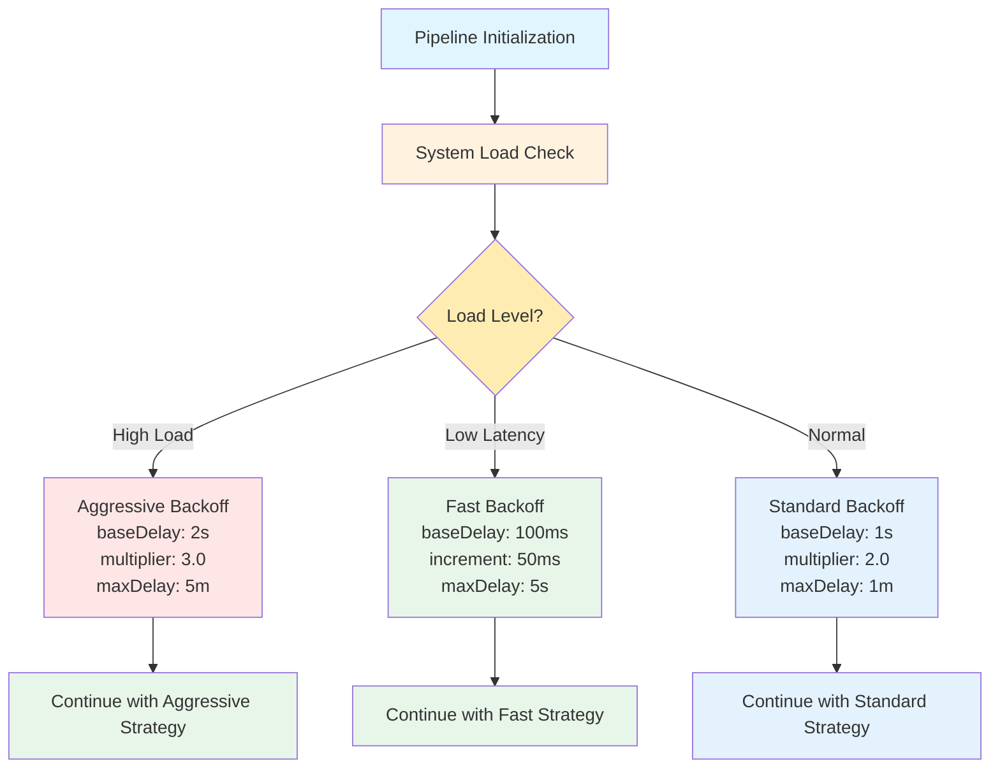
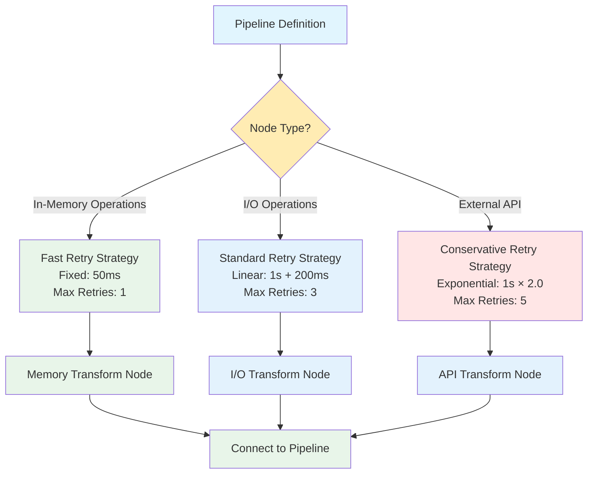

# Advanced Retry Delay Strategies

This guide covers advanced patterns and scenarios for using retry delay strategies in NPipeline.

## Table of Contents

- [Dynamic Configuration](#dynamic-configuration)
- [Adaptive Retry Strategies](#adaptive-retry-strategies)
- [Testing Retry Behavior](#testing-retry-behavior)
- [Performance Optimization](#performance-optimization)
- [Monitoring and Observability](#monitoring-and-observability)
- [Complex Scenarios](#complex-scenarios)

## Dynamic Configuration

### Runtime Strategy Adjustment

> :information_source: **Dynamic Configuration** allows you to modify retry strategies at runtime based on system conditions, providing adaptive behavior for changing environments.

NPipeline allows you to modify retry strategies at runtime based on conditions:



### Per-Node Configuration

> :bulb: **Pro Tip**: Different nodes can have different retry strategies based on their specific requirements and failure patterns.

Different nodes can have different retry strategies:



## Adaptive Retry Strategies

### Decorrelated Jitter for Adapting Load

> :information_source: **Decorrelated Jitter** is particularly useful when you want the system to adapt to changing conditions, as it considers previous delays when calculating the next delay.

Decorrelated jitter is particularly useful when you want the system to adapt to changing conditions:

```csharp
// Configuration that adapts based on previous retry timing
var context = CreatePipelineContext();
context.UseExponentialBackoffDelay(
    baseDelay: TimeSpan.FromMilliseconds(100),
    multiplier: 2.0,
    maxDelay: TimeSpan.FromSeconds(30));

// Add decorrelated jitter to adapt to load
var decorrelatedConfig = new DecorrelatedJitterConfiguration
{
    MaxDelay = TimeSpan.FromSeconds(30),
    Multiplier = 3.0
};
```

**Benefits:**
- Automatically adapts to system load
- Reduces retry thundering in variable conditions
- Better utilization of system resources

### Fallback Strategy Pattern

> :warning: **Important**: Implement a fallback strategy when primary strategy exhausts retries to prevent infinite retry loops and ensure graceful degradation.

Implement a fallback strategy when primary strategy exhausts retries:

```csharp
public class FallbackRetryStrategy
{
    private readonly IRetryDelayStrategy _primaryStrategy;
    private readonly IRetryDelayStrategy _fallbackStrategy;
    private readonly int _maxPrimaryAttempts;

    public FallbackRetryStrategy(
        IRetryDelayStrategy primary,
        IRetryDelayStrategy fallback,
        int maxPrimaryAttempts = 3)
    {
        _primaryStrategy = primary;
        _fallbackStrategy = fallback;
        _maxPrimaryAttempts = maxPrimaryAttempts;
    }

    public async ValueTask<TimeSpan> GetDelayAsync(
        int attemptNumber,
        CancellationToken cancellationToken = default)
    {
        var strategy = attemptNumber < _maxPrimaryAttempts
            ? _primaryStrategy
            : _fallbackStrategy;

        return await strategy.GetDelayAsync(attemptNumber, cancellationToken);
    }
}
```

## Testing Retry Behavior

> :bulb: **Pro Tip**: When testing retry behavior, use fixed delays with no jitter for predictable results, and use seeded random numbers for testing jitter behavior.

When testing, use fixed delays with no jitter for predictable behavior:

```csharp
[Fact]
public async Task TestRetryBehavior()
{
    // Use fixed delay for deterministic testing
    var context = CreateTestContext();
    context.UseFixedDelay(TimeSpan.FromMilliseconds(10));

    var stopwatch = Stopwatch.StartNew();

    // Perform operation that will retry
    var result = await ExecuteWithRetries(context, 3);

    stopwatch.Stop();

    // Verify expected delays: 10ms + 10ms = 20ms minimum
    Assert.True(stopwatch.ElapsedMilliseconds >= 20);
}
```

### Testing with Controlled Randomness

For testing jitter behavior, use a seeded Random:

```csharp
[Fact]
public async Task TestJitterDistribution()
{
    var config = new ExponentialBackoffConfiguration(
        baseDelay: TimeSpan.FromSeconds(1),
        multiplier: 2.0,
        maxDelay: TimeSpan.FromMinutes(1));

    var jitter = JitterStrategies.FullJitter();
    var random = new Random(42); // Fixed seed for reproducibility

    var factory = new DefaultRetryDelayStrategyFactory();
    var strategy = factory.CreateExponentialBackoff(config, jitter);

    // Test multiple attempts with same seed
    var delays = new List<TimeSpan>();
    for (int i = 0; i < 5; i++)
    {
        delays.Add(await strategy.GetDelayAsync(i));
    }

    // Verify delays are within expected range
    foreach (var delay in delays)
    {
        Assert.True(delay >= TimeSpan.Zero);
        Assert.True(delay <= TimeSpan.FromMinutes(1));
    }
}
```

### Chaos Testing

Simulate various failure scenarios:

```csharp
public class ChaosRetryTest
{
    [Theory]
    [InlineData(1)] // Single retry
    [InlineData(3)] // Multiple retries
    [InlineData(5)] // Many retries
    public async Task TestExhaustiveRetries(int maxRetries)
    {
        var context = CreatePipelineContext();
        context.UseExponentialBackoffDelay(
            TimeSpan.FromMilliseconds(5),
            2.0,
            TimeSpan.FromSeconds(1));

        var failingNode = new AlwaysFailingNode();
        var strategy = new ResilientExecutionStrategy(
            new SequentialExecutionStrategy());

        var ex = await Assert.ThrowsAsync<Exception>(
            async () =>
            {
                var result = await strategy.ExecuteAsync(
                    CreateInput(), failingNode, context,
                    CancellationToken.None);
                
                await foreach (var item in result)
                {
                    // Consume results
                }
            });

        Assert.NotNull(ex);
    }
}
```

## Performance Optimization

> :heavy_check_mark: **Recommended**: The PipelineContext automatically caches retry strategies to avoid recreation overhead. Always retrieve the strategy from context rather than creating new instances.

The PipelineContext automatically caches retry strategies:

```csharp
// First call creates the strategy
var strategy1 = context.GetRetryDelayStrategy();

// Subsequent calls return the same instance
var strategy2 = context.GetRetryDelayStrategy();

Assert.Same(strategy1, strategy2); // True - same instance
```

> :warning: **Performance Consideration**: Minimize allocations in hot paths by using ValueTask for synchronous operations and avoiding unnecessary async overhead.

Use async patterns efficiently:

```csharp
// ValueTask avoids allocation when result is synchronous
public async ValueTask<TimeSpan> GetDelayAsync(int attempt)
{
    // For synchronous paths, ValueTask doesn't allocate
    if (attempt < 0)
        return TimeSpan.Zero; // No allocation for successful path

    // Only allocates for async paths
    return await CalculateDelayAsync(attempt);
}
```

### Batch Processing with Retry

When processing large batches, consider retry strategy efficiency:

```csharp
public class BatchRetryProcessor
{
    public async Task ProcessBatchAsync(
        IEnumerable<Item> items,
        PipelineContext context)
    {
        var strategy = context.GetRetryDelayStrategy(); // Cached
        var maxRetries = 3;

        foreach (var item in items)
        {
            for (int attempt = 0; attempt <= maxRetries; attempt++)
            {
                try
                {
                    await ProcessItemAsync(item);
                    break;
                }
                catch when (attempt < maxRetries)
                {
                    // Get delay and wait - strategy is cached
                    var delay = await strategy.GetDelayAsync(attempt);
                    await Task.Delay(delay);
                }
            }
        }
    }
}
```

## Monitoring and Observability

### Measuring Retry Metrics

Track retry behavior for insights:

```csharp
public class RetryMetricsCollector
{
    private readonly List<RetryMetric> _metrics = new();

    public async Task TrackRetryAsync(
        string nodeId,
        int attemptNumber,
        PipelineContext context)
    {
        var strategy = context.GetRetryDelayStrategy();
        var delay = await strategy.GetDelayAsync(attemptNumber);

        _metrics.Add(new RetryMetric
        {
            NodeId = nodeId,
            Attempt = attemptNumber,
            Delay = delay,
            Timestamp = DateTime.UtcNow
        });
    }

    public void LogMetrics()
    {
        var grouped = _metrics.GroupBy(m => m.NodeId);

        foreach (var group in grouped)
        {
            var avgDelay = group.Average(m => m.Delay.TotalMilliseconds);
            var maxDelay = group.Max(m => m.Delay.TotalMilliseconds);
            var retryCount = group.Count();

            Console.WriteLine(
                $"Node {group.Key}: {retryCount} retries, " +
                $"avg delay {avgDelay:F2}ms, max {maxDelay:F2}ms");
        }
    }
}

public class RetryMetric
{
    public string NodeId { get; set; }
    public int Attempt { get; set; }
    public TimeSpan Delay { get; set; }
    public DateTime Timestamp { get; set; }
}
```

### Custom Logging

Log retry patterns for debugging:

```csharp
public class RetryLogger
{
    private readonly ILogger _logger;

    public async Task LogRetryAsync(
        string nodeId,
        int attempt,
        Exception error,
        PipelineContext context)
    {
        var strategy = context.GetRetryDelayStrategy();
        var delay = await strategy.GetDelayAsync(attempt);

        _logger.LogWarning(
            "Node {NodeId} retry {Attempt}: " +
            "Error={ErrorType}, Delay={DelayMs}ms, " +
            "StrategyType={StrategyType}",
            nodeId,
            attempt,
            error.GetType().Name,
            delay.TotalMilliseconds,
            strategy.GetType().Name);
    }
}
```

## Complex Scenarios

> :information_source: **Circuit Breaker Pattern**: Combining retry delays with circuit breaker patterns provides enhanced resilience for distributed systems, allowing fast failure when services are consistently unavailable.

Combine retry delays with circuit breaker:

```csharp
public class CircuitBreakerRetryStrategy : IRetryDelayStrategy
{
    private readonly IRetryDelayStrategy _innerStrategy;
    private readonly CircuitBreaker _circuitBreaker;

    public async ValueTask<TimeSpan> GetDelayAsync(
        int attemptNumber,
        CancellationToken cancellationToken = default)
    {
        if (_circuitBreaker.IsOpen)
        {
            // Increase delay when circuit is open
            return TimeSpan.FromSeconds(30);
        }

        return await _innerStrategy.GetDelayAsync(
            attemptNumber, cancellationToken);
    }
}
```

### Exponential Backoff with Deadletter

Implement deadletter handling after max retries:

```csharp
public class DeadletterRetryStrategy
{
    private readonly IRetryDelayStrategy _strategy;
    private readonly int _maxRetries;
    private readonly IDeadletterQueue _deadletter;

    public async Task RetryWithDeadletterAsync<T>(
        T item,
        Func<T, Task> operation,
        int attempt = 0)
    {
        try
        {
            await operation(item);
        }
        catch (Exception ex) when (attempt < _maxRetries)
        {
            var delay = await _strategy.GetDelayAsync(attempt);
            await Task.Delay(delay);
            await RetryWithDeadletterAsync(item, operation, attempt + 1);
        }
        catch (Exception ex)
        {
            // Send to deadletter after exhausting retries
            await _deadletter.SendAsync(item, ex);
        }
    }
}
```

### Multi-Strategy Composition

Combine multiple strategies with custom logic:

```csharp
public class ComposedRetryStrategy : IRetryDelayStrategy
{
    private readonly IRetryDelayStrategy[] _strategies;
    private readonly Func<int, int> _strategySelector;

    public async ValueTask<TimeSpan> GetDelayAsync(
        int attemptNumber,
        CancellationToken cancellationToken = default)
    {
        var strategyIndex = _strategySelector(attemptNumber);
        var strategy = _strategies[
            Math.Min(strategyIndex, _strategies.Length - 1)];

        return await strategy.GetDelayAsync(
            attemptNumber, cancellationToken);
    }
}

// Usage: Switch between strategies based on attempt count
var composed = new ComposedRetryStrategy(
    new[]
    {
        exponentialBackoff,    // Attempts 0-2
        linearBackoff,         // Attempts 3-5
        fixedDelay             // Attempts 6+
    },
    attempt => attempt / 3);   // Switch strategy every 3 attempts
```

### Custom Jitter Strategy

Create custom jitter strategies using the delegate pattern:

```csharp
// Custom jitter implementation
JitterStrategy customJitter = (baseDelay, random) =>
{
    // Your custom jitter calculation logic
    var jitterMs = random.NextDouble() * baseDelay.TotalMilliseconds * 0.1;
    return TimeSpan.FromMilliseconds(jitterMs);
};

// Use with existing backoff strategy delegate
var backoff = BackoffStrategies.ExponentialBackoff(
    TimeSpan.FromSeconds(1), 
    2.0, 
    TimeSpan.FromMinutes(1));
var composite = new CompositeRetryDelayStrategy(backoff, customJitter);
```

### Custom Backoff Strategy

Create custom backoff strategies using the delegate pattern:

```csharp
// Custom backoff implementation
BackoffStrategy customBackoff = (attemptNumber) =>
{
    // Your custom backoff calculation logic
    if (attemptNumber < 0)
        return TimeSpan.Zero;
    
    // Example: Fibonacci backoff
    if (attemptNumber == 0) return TimeSpan.FromSeconds(1);
    if (attemptNumber == 1) return TimeSpan.FromSeconds(1);
    
    var fib = CalculateFibonacci(attemptNumber + 2);
    return TimeSpan.FromSeconds(Math.Min(fib, 60)); // Cap at 60 seconds
};

// Use with existing jitter strategy
var jitter = JitterStrategies.FullJitter();
var composite = new CompositeRetryDelayStrategy(customBackoff, jitter);
```

### Advanced Configuration Patterns

#### Conditional Strategy Selection

Select strategies based on runtime conditions:

```csharp
public class AdaptiveRetryStrategySelector
{
    private readonly Dictionary<string, BackoffStrategy> _strategies;
    
    public AdaptiveRetryStrategySelector()
    {
        _strategies = new Dictionary<string, BackoffStrategy>
        {
            ["fast"] = BackoffStrategies.LinearBackoff(
                TimeSpan.FromMilliseconds(50), 
                TimeSpan.FromMilliseconds(25), 
                TimeSpan.FromSeconds(1)),
            ["normal"] = BackoffStrategies.ExponentialBackoff(
                TimeSpan.FromSeconds(1), 
                2.0, 
                TimeSpan.FromMinutes(1)),
            ["slow"] = BackoffStrategies.ExponentialBackoff(
                TimeSpan.FromSeconds(5), 
                3.0, 
                TimeSpan.FromMinutes(5))
        };
    }
    
    public BackoffStrategy SelectStrategy(string mode)
    {
        return _strategies.TryGetValue(mode, out var strategy) 
            ? strategy 
            : _strategies["normal"];
    }
}
```

#### Composite Strategy with Multiple Delegates

Combine multiple backoff strategies with custom logic:

```csharp
public class HybridBackoffStrategy
{
    private readonly BackoffStrategy _primary;
    private readonly BackoffStrategy _secondary;
    private readonly int _switchThreshold;
    
    public HybridBackoffStrategy(
        BackoffStrategy primary,
        BackoffStrategy secondary,
        int switchThreshold = 3)
    {
        _primary = primary;
        _secondary = secondary;
        _switchThreshold = switchThreshold;
    }
    
    public TimeSpan CalculateDelay(int attemptNumber)
    {
        return attemptNumber < _switchThreshold
            ? _primary(attemptNumber)
            : _secondary(attemptNumber);
    }
}

// Usage: Start with exponential, switch to linear after 3 attempts
var hybrid = new HybridBackoffStrategy(
    BackoffStrategies.ExponentialBackoff(TimeSpan.FromSeconds(1), 2.0, TimeSpan.FromMinutes(1)),
    BackoffStrategies.LinearBackoff(TimeSpan.FromSeconds(5), TimeSpan.FromSeconds(5), TimeSpan.FromMinutes(2)),
    3);
```

### Testing with Delegate Strategies

#### Unit Testing Custom Delegates

```csharp
[Fact]
public void CustomBackoffStrategy_ReturnsExpectedDelays()
{
    // Arrange
    var customBackoff = BackoffStrategies.ExponentialBackoff(
        TimeSpan.FromSeconds(1), 
        2.0, 
        TimeSpan.FromSeconds(10));
    
    // Act & Assert
    Assert.Equal(TimeSpan.FromSeconds(1), customBackoff(0));
    Assert.Equal(TimeSpan.FromSeconds(2), customBackoff(1));
    Assert.Equal(TimeSpan.FromSeconds(4), customBackoff(2));
    Assert.Equal(TimeSpan.FromSeconds(8), customBackoff(3));
    Assert.Equal(TimeSpan.FromSeconds(10), customBackoff(4)); // Capped
}
```

#### Testing Jitter Combinations

```csharp
[Fact]
public async Task BackoffWithJitter_WithinExpectedRange()
{
    // Arrange
    var backoff = BackoffStrategies.ExponentialBackoff(
        TimeSpan.FromSeconds(1), 
        2.0, 
        TimeSpan.FromMinutes(1));
    var jitter = JitterStrategies.FullJitter();
    var composite = new CompositeRetryDelayStrategy(backoff, jitter);
    
    // Act
    var delays = new List<TimeSpan>();
    for (int i = 0; i < 5; i++)
    {
        delays.Add(await composite.GetDelayAsync(i));
    }
    
    // Assert
    foreach (var delay in delays)
    {
        Assert.True(delay >= TimeSpan.Zero);
        Assert.True(delay <= TimeSpan.FromMinutes(1));
    }
}
```

### Performance Optimization with Delegates

#### Caching Delegates

```csharp
public class OptimizedRetryManager
{
    private readonly ConcurrentDictionary<string, BackoffStrategy> _backoffCache = new();
    private readonly ConcurrentDictionary<string, JitterStrategy> _jitterCache = new();
    
    public BackoffStrategy GetBackoffStrategy(string type, TimeSpan baseDelay)
    {
        var key = $"{type}_{baseDelay.TotalMilliseconds}";
        return _backoffCache.GetOrAdd(key, _ => type switch
        {
            "exponential" => BackoffStrategies.ExponentialBackoff(baseDelay),
            "linear" => BackoffStrategies.LinearBackoff(baseDelay),
            "fixed" => BackoffStrategies.FixedDelay(baseDelay),
            _ => BackoffStrategies.ExponentialBackoff(baseDelay)
        });
    }
    
    public JitterStrategy GetJitterStrategy(string type)
    {
        return _jitterCache.GetOrAdd(type, _ => type switch
        {
            "full" => JitterStrategies.FullJitter(),
            "equal" => JitterStrategies.EqualJitter(),
            "decorrelated" => JitterStrategies.DecorrelatedJitter(),
            _ => JitterStrategies.NoJitter()
        });
    }
}
```

#### Memory-Efficient Strategy Composition

```csharp
public class LightweightRetryStrategy : IRetryDelayStrategy
{
    private readonly BackoffStrategy _backoff;
    private readonly JitterStrategy _jitter;
    private readonly Random _random = new();
    
    public LightweightRetryStrategy(BackoffStrategy backoff, JitterStrategy jitter = null)
    {
        _backoff = backoff;
        _jitter = jitter;
    }
    
    public ValueTask<TimeSpan> GetDelayAsync(int attemptNumber, CancellationToken cancellationToken = default)
    {
        var baseDelay = _backoff(attemptNumber);
        
        if (_jitter != null)
            return new ValueTask<TimeSpan>(_jitter(baseDelay, _random));
        
        return new ValueTask<TimeSpan>(baseDelay);
    }
}
```

### Advanced Monitoring with Delegates

#### Strategy Performance Metrics

```csharp
public class BackoffMetricsCollector
{
    private readonly Dictionary<string, List<TimeSpan>> _metrics = new();
    
    public BackoffStrategy WithMetrics(string name, BackoffStrategy strategy)
    {
        return attemptNumber =>
        {
            var delay = strategy(attemptNumber);
            
            if (!_metrics.ContainsKey(name))
                _metrics[name] = new List<TimeSpan>();
            
            _metrics[name].Add(delay);
            return delay;
        };
    }
    
    public void ReportMetrics()
    {
        foreach (var (name, delays) in _metrics)
        {
            var avg = delays.Average(d => d.TotalMilliseconds);
            var max = delays.Max(d => d.TotalMilliseconds);
            var min = delays.Min(d => d.TotalMilliseconds);
            
            Console.WriteLine($"{name}: Avg={avg:F2}ms, Min={min:F2}ms, Max={max:F2}ms, Count={delays.Count}");
        }
    }
}

// Usage
var metrics = new BackoffMetricsCollector();
var backoffWithMetrics = metrics.WithMetrics("exponential", 
    BackoffStrategies.ExponentialBackoff(TimeSpan.FromSeconds(1), 2.0, TimeSpan.FromMinutes(1)));
```

#### Strategy Comparison Framework

```csharp
public class StrategyComparer
{
    public async Task CompareStrategiesAsync(
        IEnumerable<BackoffStrategy> strategies,
        int maxAttempts = 10)
    {
        var results = new List<StrategyResult>();
        
        foreach (var strategy in strategies)
        {
            var delays = new List<TimeSpan>();
            var stopwatch = Stopwatch.StartNew();
            
            for (int attempt = 0; attempt < maxAttempts; attempt++)
            {
                delays.Add(strategy(attempt));
            }
            
            stopwatch.Stop();
            
            results.Add(new StrategyResult
            {
                StrategyName = strategy.GetType().Name,
                TotalTime = stopwatch.Elapsed,
                Delays = delays,
                AverageDelay = delays.Average(d => d.TotalMilliseconds),
                MaxDelay = delays.Max(d => d.TotalMilliseconds),
                MinDelay = delays.Min(d => d.TotalMilliseconds)
            });
        }
        
        // Print comparison
        foreach (var result in results.OrderBy(r => r.AverageDelay))
        {
            Console.WriteLine($"{result.StrategyName}: Avg={result.AverageDelay:F2}ms, " +
                             $"Min={result.MinDelay:F2}ms, Max={result.MaxDelay:F2}ms");
        }
    }
    
    private class StrategyResult
    {
        public string StrategyName { get; set; }
        public TimeSpan TotalTime { get; set; }
        public List<TimeSpan> Delays { get; set; }
        public double AverageDelay { get; set; }
        public double MaxDelay { get; set; }
        public double MinDelay { get; set; }
    }
}
```

## Best Practices Summary

1. **Start Conservative** - Begin with shorter delays, increase if needed
2. **Monitor Metrics** - Track retry patterns and adjust based on data
3. **Use Jitter** - Essential for distributed systems to prevent thundering herd
4. **Test Thoroughly** - Use fixed delays in tests for predictability
5. **Document Decisions** - Comment why you chose specific strategies
6. **Measure Performance** - Profile retry behavior in production
7. **Handle Cancellation** - Always respect CancellationToken during delays
8. **Plan for Failover** - Have circuit breaker and deadletter mechanisms

## See Also

- **[Retry Delay Architecture](../architecture/retry-delay-architecture.md)**: Deep dive into the architectural components and design patterns of NPipeline's retry delay system
- **[Retry Configuration](../core-concepts/resilience/retry-configuration.md)**: Basic retry configuration options and built-in strategies
- **[Resilience Overview](../core-concepts/resilience/index.md)**: Comprehensive guide to building fault-tolerant pipelines
- **[Execution with Resilience](../core-concepts/resilience/execution-with-resilience.md)**: How to integrate retry strategies with resilient execution
- **[Testing Pipelines](testing-pipelines.md)**: Comprehensive testing strategies for pipeline components including retry behavior

## Related Topics

- **[Error Handling Guide](../core-concepts/resilience/error-handling-guide.md)**: Comprehensive error handling strategies that work with retry delays
- **[Circuit Breaker Configuration](../core-concepts/resilience/circuit-breaker-configuration.md)**: Combining circuit breakers with retry delays for enhanced resilience
- **[Performance Hygiene](performance-hygiene.md)**: Best practices for building high-performance, low-allocation data pipelines
- **[Troubleshooting](../core-concepts/resilience/troubleshooting.md)**: Common issues and solutions for retry behavior problems
