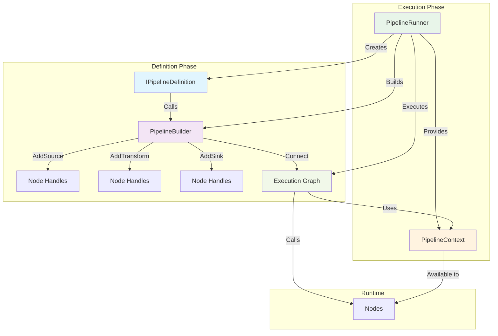

# Component Architecture

**This page explains WHAT the components are and WHY they exist.** For HOW TO use them to build pipelines, see [Core Concepts](../core-concepts/index.md) and [Defining Pipelines](../core-concepts/defining-pipelines.md).

NPipeline consists of several key components that work together to define, build, and execute pipelines. Understanding their roles and interactions is essential to working effectively with the framework.

## Major Components Overview

### 1. Pipeline Definition (`IPipelineDefinition`)

**Purpose:** Declarative blueprint of your pipeline structure

```csharp
public interface IPipelineDefinition
{
    void Define(PipelineBuilder builder, PipelineContext context);
}
```

**Responsibilities:**
- Connect nodes via the builder
- Configure the execution topology
- Define error handling strategy

**Example:**

```csharp
public class OrderProcessingPipeline : IPipelineDefinition
{
    public void Define(PipelineBuilder builder, PipelineContext context)
    {
        var source = builder.AddSource<OrderSource, Order>();
        var validator = builder.AddTransform<OrderValidator, Order, ValidatedOrder>();
        var enricher = builder.AddTransform<OrderEnricher, ValidatedOrder, EnrichedOrder>();
        var sink = builder.AddSink<OrderSink, EnrichedOrder>();

        builder.Connect(source, validator);
        builder.Connect(validator, enricher);
        builder.Connect(enricher, sink);
    }
}
```

### 2. Pipeline Builder

**Purpose:** Orchestrates node creation and graph construction

```csharp
public class PipelineBuilder
{
    public SourceNodeHandle<TOut> AddSource<TNode, TOut>() 
        where TNode : ISourceNode<TOut>;
    public TransformNodeHandle<TIn, TOut> AddTransform<TNode, TIn, TOut>() 
        where TNode : ITransformNode<TIn, TOut>;
    public SinkNodeHandle<TIn> AddSink<TNode, TIn>() 
        where TNode : ISinkNode<TIn>;
    
    public PipelineBuilder Connect<TData>(
        SourceNodeHandle<TData> source, 
        TransformNodeHandle<TData, TOut> target);
    // ... other Connect overloads
}
```

**Builder Process:**

1. Resolves nodes from dependency injection
2. Builds execution graph
3. Validates connectivity
4. Compiles to executable pipeline

### 3. Pipeline Context

**Purpose:** Shared runtime context for all nodes in the pipeline

```csharp
public class PipelineContext
{
    public Dictionary<string, object> Items { get; }
    public Dictionary<string, object> Parameters { get; }
    public Dictionary<string, object> Properties { get; }
    public CancellationToken CancellationToken { get; }
    public string CurrentNodeId { get; }
    public IPipelineLoggerFactory LoggerFactory { get; }
    public IPipelineTracer Tracer { get; }
    public IErrorHandlerFactory ErrorHandlerFactory { get; }
    public ILineageFactory LineageFactory { get; }
    public IObservabilityFactory ObservabilityFactory { get; }
    public IDeadLetterSink? DeadLetterSink { get; }
    public IPipelineErrorHandler? PipelineErrorHandler { get; }
    public PipelineRetryOptions RetryOptions { get; }
}
```

**Contains:**

- **Items** - Shared state between nodes
- **Parameters** - Input parameters for the pipeline
- **Properties** - Dictionary for extensions and plugins to store custom data
- **CancellationToken** - For cancellation propagation
- **CurrentNodeId** - ID of the node currently being executed
- **LoggerFactory** - Factory to create loggers for nodes
- **Tracer** - For distributed tracing
- **ErrorHandlerFactory** - Factory for creating error handlers and dead-letter sinks
- **LineageFactory** - Factory for creating lineage sinks and resolving lineage collectors
- **ObservabilityFactory** - Factory for resolving observability collectors
- **DeadLetterSink** - Sink for handling failed items
- **PipelineErrorHandler** - Error handler for pipeline-level errors
- **RetryOptions** - Configuration for retry behavior

**Usage Example:**

```csharp
public override Task<TOut> ExecuteAsync(
    TIn item,
    PipelineContext context,
    CancellationToken cancellationToken)
{
    var logger = context.LoggerFactory.CreateLogger("MyTransform");
    logger.Log(LogLevel.Information, "Processing item");

    // Access shared state
    if (context.Items.TryGetValue("state", out var stateObj))
    {
        var sharedState = stateObj as MyState;
    }

    return Task.FromResult(transformedItem);
}
```

### 4. Cached Node Execution Context

**Purpose:** Performance optimization - reduces per-item context access overhead

```csharp
public readonly struct CachedNodeExecutionContext
{
    public string NodeId { get; }
    public PipelineRetryOptions RetryOptions { get; }
    public bool TracingEnabled { get; }
    public bool LoggingEnabled { get; }
    public CancellationToken CancellationToken { get; }
    
    public static CachedNodeExecutionContext Create(
        PipelineContext context, 
        string nodeId);
    
    public static CachedNodeExecutionContext CreateWithRetryOptions(
        PipelineContext context,
        string nodeId,
        PipelineRetryOptions preResolvedRetryOptions);
}
```

**Why This Exists:**

During high-throughput node execution, accessing the same context properties repeatedly for each item creates dictionary lookup overhead. `CachedNodeExecutionContext` captures frequently-accessed values once at node scope, then reuses them for all items.

**How It Works:**

1. **At node execution start:** Creation methods capture current context state
2. **During item processing:** Nodes use cached values instead of context lookups
3. **Immutability validation:** `PipelineContextImmutabilityGuard` (DEBUG-only) validates that context hasn't changed

**Transparent to Users:**

Execution strategies automatically use `CachedNodeExecutionContext`. Pipeline authors don't need to interact with it directly.

**Performance Benefit:**

~150-250μs overhead reduction per 1K items in typical pipelines.

For complete details, see [Optimization Principles: Cached Context Access](./optimization-principles.md#3-cached-context-access-per-item-optimization).

---

### 5. Pipeline Runner

**Purpose:** Executes compiled pipelines

```csharp
public class PipelineRunner
{
    // Overload 1: With PipelineContext only
    public Task RunAsync<TDefinition>(
        PipelineContext context)
        where TDefinition : IPipelineDefinition, new();

    // Overload 2: With CancellationToken only
    public Task RunAsync<TDefinition>(
        CancellationToken cancellationToken = default)
        where TDefinition : IPipelineDefinition, new();

    // Overload 3: With both PipelineContext and CancellationToken
    public Task RunAsync<TDefinition>(
        PipelineContext context, 
        CancellationToken cancellationToken)
        where TDefinition : IPipelineDefinition, new();
}
```

**Execution Workflow:**

1. Instantiates pipeline definition
2. Creates pipeline builder
3. Calls `Define()` to build graph
4. Traverses graph and connects nodes
5. Starts execution from source nodes
6. Waits for completion

**Usage Examples:**

```csharp
// Using only PipelineContext
var context = PipelineContext.Default;
var runner = PipelineRunner.Create();
await runner.RunAsync<MyPipeline>(context);

// Using only CancellationToken
var cts = new CancellationTokenSource();
await runner.RunAsync<MyPipeline>(cts.Token);

// Using both PipelineContext and CancellationToken
var context = PipelineContext.Default;
var cts = new CancellationTokenSource();
await runner.RunAsync<MyPipeline>(context, cts.Token);
```

### 5. Node Execution Model

NPipeline uses a **plan-based execution model** for optimal performance. During pipeline initialization, the system generates pre-compiled execution plans for each node containing strongly-typed delegates that eliminate reflection overhead during steady-state execution.

**Benefits:**
- Zero reflection overhead during execution
- Improved performance through direct delegate calls
- Type safety enforced at plan creation time
- Reduced allocation and GC pressure

**Node Execution Patterns:**

**SourceNode Execution:**

```csharp
public abstract IDataPipe<T> Initialize(
    PipelineContext context,
    CancellationToken cancellationToken);
```

Produces initial `IDataPipe<T>` containing all source data synchronously.

**TransformNode Execution:**

```csharp
public abstract Task<T> ExecuteAsync(
    T item,
    PipelineContext context,
    CancellationToken cancellationToken);
```

Called for each item; returns transformed item or throws to fail.

**SinkNode Execution:**

```csharp
public abstract Task ExecuteAsync(
    IDataPipe<T> input,
    PipelineContext context,
    CancellationToken cancellationToken);
```

Consumes entire data pipe for final processing (save, send, etc).

## Component Interaction Flow



## Next Steps

- **[Node Definition Structure](../core-concepts/node-definition.md)** - Understanding the nested configuration structure of NodeDefinition
- **[Node Instantiation](node-instantiation.md)** - Understand node creation patterns and performance
- **[Execution Flow](execution-flow.md)** - Understand sequential and parallel execution
- **[Dependency Injection Integration](dependency-injection.md)** - Learn about DI integration

