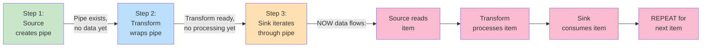

# Data Flow Details

NPipeline uses lazy evaluation for memory efficiency, ensuring only active items are in memory at any given time. This design choice allows the pipeline to handle arbitrarily large datasets without running out of memory, as items are processed and discarded immediately rather than being buffered in memory.

Data flows through the pipeline as follows:

## How Data Pipes Work

Data pipes are the channels through which data flows from nodes to the next stage in the pipeline.

**Data Pipe Interface:**

```csharp
public interface IDataPipe<T> : IAsyncEnumerable<T>
{
    // IDataPipe<T> implements IAsyncEnumerable<T> directly
    // Iterate using: await foreach (var item in dataPipe)
}
```

**Basic Data Flow:**

```csharp
// 1. Source produces a pipe (synchronous - no await needed)
var sourcePipe = sourceNode.Initialize(context, cancellationToken);

// 2. Transform consumes and wraps it
var transformedPipe = new TransformPipe(sourcePipe, transformNode);

// 3. Sink consumes the pipe
await foreach (var item in transformedPipe.WithCancellation(cancellationToken))
{
    // Each item flows through here
}
```

## Lazy Evaluation

The key to NPipeline's efficiency is **lazy evaluation**: data is only processed when explicitly consumed. This means memory usage stays constant regardless of dataset size—each item is processed and discarded before the next arrives, rather than being buffered in memory.

**Why this matters for you:**

- **Streaming large files** (CSV, JSON) without loading them into memory
- **Handling datasets larger than available RAM**
- **Immediate responsiveness** (results flow to output as soon as they're ready, no waiting for entire batch)
- **Cancellation efficiency** (if you stop processing early, the source stops reading)

### How Lazy Evaluation Works



**Code Example:**

```csharp
// Step 1: Source creates pipe (synchronous - no await needed)
var pipe = source.Initialize(context, cancellationToken);

// Step 2: Transform wraps pipe (but doesn't process yet)
var wrappedPipe = new TransformPipe(pipe, transform);

// Step 3: Sink actually triggers execution
await foreach (var item in wrappedPipe.WithCancellation(cancellationToken))
{
    // NOW data is read, transformed, consumed
    await sink.ProcessAsync(item);
}
```

### Benefits of Lazy Evaluation

**Early Termination:**

```csharp
// If pipeline is cancelled before consuming all items,
// source never reads remaining data
await foreach (var item in pipe.WithCancellation(cancellationToken))
{
    if (shouldStop)
    {
        cancellationToken.Cancel();
        break; // Source stops reading
    }
}
```

**Memory Efficiency (Process Terabytes on Gigabyte Hardware):**

```csharp
// Reading 1 million items from a file:
// - Lazy: Only ~1 item in memory at a time → constant memory regardless of dataset size
// - Eager (.ToList()): ~100 MB or more in memory → proportional to dataset size

// Real scenario: Processing 100GB CSV file
// Lazy approach: ~50MB memory overhead
// Eager approach: 100GB+ RAM required (won't fit on most servers)
```

**Streaming Responsiveness (Real-Time Feedback):**

```csharp
// Results are available immediately
// Don't wait for entire dataset to load
await foreach (var result in pipeline.WithCancellation(cancellationToken))
{
    // Process each result as it's available
    await WriteToUIAsync(result);
}
```

## Composability of Data Pipes

Each transform creates a new data pipe, allowing for clean composition:

```csharp
var source = sourceNode.Initialize(context, ct);      // IDataPipe<Order>
var validated = new TransformPipe(source, validator);          // IDataPipe<ValidatedOrder>
var enriched = new TransformPipe(validated, enricher);         // IDataPipe<EnrichedOrder>
var processed = new TransformPipe(enriched, processor);        // IDataPipe<ProcessedOrder>

// Only when iterated does the entire chain execute
await foreach (var result in processed.WithCancellation(ct))
{
    // All transforms happen here for each item
}
```

## Memory Patterns

**Good: Streaming Processing**

```csharp
// Only one item in memory at a time
await foreach (var item in pipe.WithCancellation(ct))
{
    var result = await ProcessAsync(item);
    await WriteAsync(result);
    // Item is eligible for GC after this iteration
}
```

> **✅ Best Practice**
>
> Always use streaming patterns with large datasets. Lazy evaluation ensures constant memory usage regardless of data size.

**Bad: Materializing Entire Stream**

```csharp
// Loads everything into memory!
var allItems = await pipe.ToListAsync(ct); // Bad for large datasets
foreach (var item in allItems)
{
    // Process...
}
```

> **⚠️ Avoid**
>
> Materializing entire streams into memory defeats the purpose of lazy evaluation and will consume excessive memory for large datasets.

## Next Steps

- **[Dependency Injection Integration](dependency-injection.md)** - Learn how DI works with NPipeline
- **[Performance Characteristics](performance-characteristics.md)** - Understand memory and throughput implications
