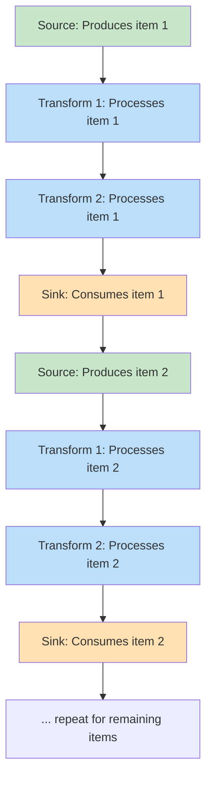
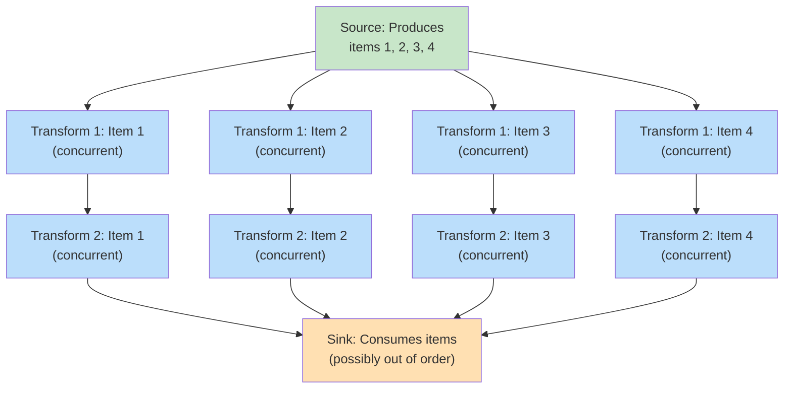

# Execution Flow

This page provides a deep dive into how NPipeline executes pipelines at the internal level. Understanding execution flow helps you reason about performance, concurrency, and error handling behavior.

For practical configuration guidance, see [Execution Strategies](../core-concepts/pipeline-execution/execution-strategies.md).

NPipeline supports multiple execution models to handle different requirements: sequential (the default) and parallel execution through extensions.

## Core Design: Source Initialization + Asynchronous Execution

NPipeline follows a clear separation of concerns:

**Synchronous Phase:** Source Node Initialization

- Source nodes' `Initialize()` method returns `IDataPipe<T>` synchronously
- The source immediately creates and returns the data pipe without waiting
- No Task allocation for source execution

**Asynchronous Phase:** Transform & Sink Execution

- Transform nodes' `ExecuteAsync()` method returns `Task<TOut>` asynchronously
- Sink nodes' `ExecuteAsync()` method returns `Task` asynchronously
- Data flows through pipes when nodes consume it
- Sinks iterate through pipes with `await foreach`
- Transforms process items as they arrive

> **💡 Key Insight**
>
> This design provides:
>
> - **Clear execution boundaries:** Source setup is fast; transforms and sinks handle async work
> - **Predictable performance:** No hidden delays during source initialization
> - **Type safety:** Synchronous source returns enable better variance and lazy evaluation
> - **Memory efficiency:** No unnecessary Task allocations for data production

## Sequential Execution (Default)

**Data Flow Pattern:**



**Characteristics:**

- Items flow one-at-a-time through the pipeline
- Order is preserved
- Minimal concurrency overhead
- Predictable memory usage
- Deterministic behavior

**Optimizations:**

The sequential strategy automatically detects and uses `ExecuteValueTaskAsync` when available on transform nodes. This avoids Task allocation overhead for synchronous operations, improving throughput for pipelines dominated by fast, synchronous transforms. See [Synchronous Fast Paths](../advanced-topics/synchronous-fast-paths.md) for details.

> **🚀 Performance Tip**
>
> Use `ExecuteValueTaskAsync` in your transform nodes for CPU-bound operations to eliminate Task allocation overhead in sequential pipelines.

**When to Use:**

- Default for most pipelines
- When order preservation is critical
- When external systems require sequential processing
- When debugging is important (deterministic behavior)

**Example:**

```csharp
public class SequentialPipeline : IPipelineDefinition
{
    public void Define(PipelineBuilder builder, PipelineContext context)
    {
        var source = builder.AddSource<OrderSource, Order>();
        var validator = builder.AddTransform<OrderValidator, Order, ValidatedOrder>();
        var enricher = builder.AddTransform<OrderEnricher, ValidatedOrder, EnrichedOrder>();
        var sink = builder.AddSink<OrderSink, EnrichedOrder>();

        builder.Connect(source, validator);
        builder.Connect(validator, enricher);
        builder.Connect(enricher, sink);
        
        // Sequential execution - default behavior
        // Each item flows one at a time through the pipeline
    }
}
```

## Parallel Execution

**Data Flow Pattern:**



**Characteristics:**

- Multiple items processed simultaneously
- Order may not be preserved
- Better CPU utilization on multi-core systems
- Increased memory usage
- Better throughput for CPU-bound work

**When to Use:**

- CPU-bound transforms (calculations, complex logic)
- Multi-core systems available
- Order doesn't matter or can be sorted later
- High throughput is a priority

**Configuration:**

Requires `NPipeline.Extensions.Parallelism`:

```csharp
using NPipeline.Extensions.Parallelism;

public class ParallelPipeline : IPipelineDefinition
{
    public void Define(PipelineBuilder builder, PipelineContext context)
    {
        var source = builder.AddSource<DataSource, DataItem>();
        var transform = builder.AddTransform<ComplexTransform, DataItem, ProcessedItem>();
        var sink = builder.AddSink<ResultSink, ProcessedItem>();

        builder.Connect(source, transform);
        builder.Connect(transform, sink);

        // Configure parallel execution
        builder.WithParallelOptions(
            transform,
            new ParallelOptions { MaxDegreeOfParallelism = 4 }
        );
    }
}
```

**Degree of Parallelism:**

- Use `Environment.ProcessorCount` for CPU-bound work
- Use smaller values (2-4) for I/O-bound work
- Start conservative and measure performance

## Hybrid Approaches

**Sequential Source → Parallel Transform → Sequential Sink:**

```csharp
public class HybridPipeline : IPipelineDefinition
{
    public void Define(PipelineBuilder builder, PipelineContext context)
    {
        var source = builder.AddSource<MySource, Data>();
        var transform = builder.AddTransform<MyTransform, Data, Result>();
        var sink = builder.AddSink<MySink, Result>();

        builder.Connect(source, transform);
        builder.Connect(transform, sink);

        // Only the transform runs in parallel
        builder.WithParallelism(transform, degree: 4);
    }
}
```

This approach:

- Produces data sequentially
- Processes items in parallel
- Consumes results (possibly buffering to maintain order)

## Performance Considerations

| **Execution Model** | **Throughput** | **Memory** | **Complexity** | **Best For** |
|---|---|---|---|---|
| Sequential | Low-Medium | ✅ Low | ✅ Low | Default, debugging, order-critical |
| Parallel | ⭐ High | Medium-High | Medium | CPU-bound, high throughput |
| Hybrid | Medium-High | Medium | Medium | Mixed workloads |

**Table: Execution Model Comparison**

## Context Immutability During Execution

> **⚠️ Important for Performance-Critical Applications**

When using `CachedNodeExecutionContext` (which all execution strategies do automatically), the framework assumes that certain context state remains immutable during node execution.

### What Must Remain Immutable

During the execution of a single node (from start to completion of all items), these context properties must not change:

- **Retry Options** - Changes to `context.Items[PipelineContextKeys.NodeRetryOptions(...)]` or global retry options
- **Tracer Instance** - Replacing `context.Tracer`
- **Logger Factory Instance** - Replacing `context.LoggerFactory`
- **Cancellation Token** - Replacing `context.CancellationToken`

### Why This Matters

The framework caches these values at the start of node execution to avoid dictionary lookups for every item. Mutations during execution break this assumption and can cause:

- Inconsistent behavior (some items use old values, others use new values)
- Unpredictable retry behavior (items may be retried differently)
- Tracing/logging inconsistencies

### When You Can Safely Modify Context

Context state can be modified **between node executions**, such as:

```csharp
// ✅ Safe: Modify context before node execution starts
context.Items[PipelineContextKeys.NodeRetryOptions(nodeId)] = newRetryOptions;
var result = await nodeExecutor.ExecuteAsync(node, item, context);

// ❌ Don't: Modify context during node execution
public async Task<TOut> ExecuteAsync(TIn item, PipelineContext context, CancellationToken ct)
{
    // Don't do this - it may be cached and ignored!
    context.Items[PipelineContextKeys.NodeRetryOptions(this.NodeId)] = newRetryOptions;
    // ... rest of node execution
}
```

### DEBUG Validation

In DEBUG builds, NPipeline automatically detects context mutations and throws a clear exception:

```
InvalidOperationException: Context immutability violation detected for node 'myNode': 
Retry options were modified during node execution. When using CachedNodeExecutionContext, 
context state must remain immutable during node execution.
```

This validation is **compiled out in RELEASE builds** (zero overhead).

### Best Practices

1. **Configure context before execution** - Set all retry options, tracers, and loggers before starting pipeline execution
2. **Don't modify tracer/logger during execution** - These should be configured upfront
3. **Trust the caching** - The framework optimizes context access automatically; don't bypass it

For more guidance, see [Performance Hygiene: Avoid Context Mutations](../advanced-topics/performance-hygiene.md#avoid-context-mutations-during-node-execution).

## Next Steps

- **[Data Flow Details](data-flow.md)** - Understand how data pipes and lazy evaluation work
- **[Performance Characteristics](performance-characteristics.md)** - Learn about throughput and scalability
