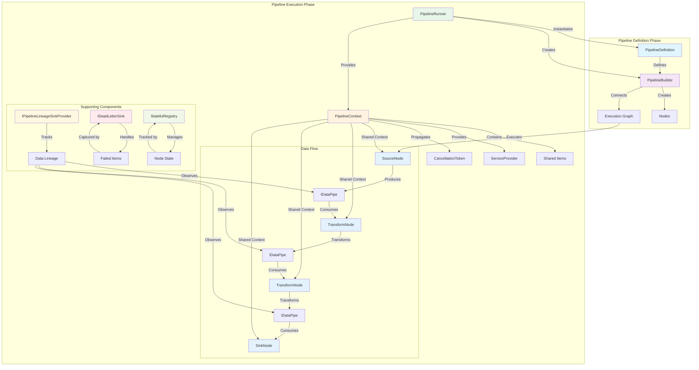

# Architecture Overview

**This section explains WHY NPipeline is designed the way it is and WHAT happens under the hood.** It covers design decisions, performance optimizations, and engineering principles that make NPipeline fast and reliable.

> **Ready to build pipelines?** Start with [Core Concepts](../core-concepts/index.md) for practical HOW TO guides.

## Understanding NPipeline Architecture

NPipeline's architecture is designed around several core principles: graph-based data flow, lazy evaluation, streaming-first design, and composability. This section breaks down each major architectural component to help you understand how system works internally.

---

## WHY: Design Philosophy & Principles

These sections explain the design decisions behind NPipeline:

### [Design Principles](design-principles.md)

Learn the core design philosophy:

- Separation of Concerns - How NPipeline divides responsibilities
- Lazy Evaluation - Why data is only processed when consumed
- Streaming First - Why NPipeline treats all data as streams
- Composability - How components work together
- Testability - How design enables effective testing
- Observability - How to understand what's happening internally

### [Optimization Principles](optimization-principles.md)

Understand how NPipeline achieves exceptional performance:

- Plan-based execution eliminating per-item decisions
- Zero reflection during steady state
- ICountable for right-sized allocations
- ValueTask optimization (up to 90% GC reduction)
- Streaming-first design with lazy evaluation
- Memory layout and cache efficiency

---

## WHAT: Internal Architecture & Mechanisms

These sections explain how NPipeline works internally:

### [Architectural Foundations](architectural-foundations.md)

Learn the fundamental architectural building blocks:

- Graph-Based Architecture (DAGs)
- Node Types (Source, Transform, Sink)
- Streaming Data Model with `IAsyncEnumerable<T>`

### [Component Architecture](component-architecture.md)

Explore the major system components and their roles:

- Pipeline Definition (`IPipelineDefinition`)
- Pipeline Builder
- Pipeline Context
- Pipeline Runner
- Node Execution Model

### [Execution Flow](execution-flow.md)

Understand how pipelines execute data:

- Sequential Execution (default)
- Parallel Execution patterns
- Data flow through pipeline graph

### [Data Flow Details](data-flow.md)

Deep dive into how data moves through the system:

- How Data Pipes Work
- Lazy Evaluation principles
- Memory efficiency patterns

### [Execution Plan Caching](execution-plan-caching.md)

Learn how NPipeline caches compiled execution plans:

- Why Plan Caching Matters (300-500μs per run overhead)
- How the Caching System Works
- When Caching is Applied & When It's Disabled
- Performance Impact (75% reduction for subsequent runs)
- Custom Cache Implementations (Redis, Distributed, etc.)

### [Error Handling Architecture](error-handling-architecture.md)

Understand error propagation and handling:

- Error Propagation mechanisms
- Error Containment strategies
- Dead-Letter Handling for failed items
- Supporting Components (Lineage, Dead Letter Sinks, State Registry)

### [Cancellation Model](cancellation-model.md)

Learn about graceful shutdown and cancellation:

- Token Propagation through pipeline
- Node cancellation responsibilities
- Graceful termination patterns

### [Dependency Injection Integration](dependency-injection.md)

Learn how DI is integrated into NPipeline:

- Automatic Node Resolution
- Injecting Dependencies into Nodes
- Service Provider Integration

### [Node Instantiation](node-instantiation.md)

Understand how nodes are created and optimized:

- Compiled Factory Pattern for 3-5x faster instantiation
- Node Constructor Patterns (Parameterless, Mixed, DI-only)
- Factory Selection and Trade-offs
- Analyzer Support (NP9403) with automatic code fixes
- Performance Characteristics

### [Performance Characteristics](performance-characteristics.md)

Understand performance implications:

- Memory Usage patterns
- Throughput characteristics
- Scalability strategies (vertical and horizontal)

### [Extension Points](extension-points.md)

Discover how to extend NPipeline:

- Custom Nodes
- Custom Execution Strategies
- Custom Context Data

---

## High-Level Architecture Diagram

*Figure: NPipeline architecture showing relationship between core components, data flow through graph-based pipeline, and supporting components*

## See Also

- [Core Concepts Overview](../core-concepts/index.md) - For implementation guides and practical usage
- [Optimization Principles](optimization-principles.md) - Deep dive into performance optimizations
- [Component Architecture](component-architecture.md) - Detailed component interactions
- [Execution Flow](execution-flow.md) - How data flows through the pipeline
- [Design Principles](design-principles.md) - Core philosophy behind NPipeline's design
- [Performance Characteristics](performance-characteristics.md) - Understanding performance implications
- [Extension Points](extension-points.md) - How to extend NPipeline functionality

## Next Steps

- Start with **[Architectural Foundations](architectural-foundations.md)** to understand fundamental building blocks
- Explore **[Component Architecture](component-architecture.md)** to see how components interact
- Dive into **[Optimization Principles](optimization-principles.md)** to understand why NPipeline is fast
- Review **[Common Patterns](../core-concepts/common-patterns.md)** for real-world examples
- Review **[Best Practices](../core-concepts/best-practices.md)** for design guidelines
