# Aggregation Nodes

Aggregation nodes enable powerful summary calculations over streams of data. They are specialized for a specific requirement: handling data that arrives out of order while maintaining correctness.

For pipelines where events may arrive late or out of sequence—especially with parallel streams—aggregation provides the tools to group data by time windows while ensuring temporal correctness. When you configure aggregation, you define explicit rules about how much lateness the system will tolerate and when it should commit to results.

> **Related Pattern:** [Batching nodes](batching.md) also group items together, but for different reasons—they focus on operational efficiency (reducing external system load). Aggregation is specialized for ensuring data correctness when events arrive out of order. Choose batching for throughput needs, aggregation for temporal accuracy needs.

## Choosing an Aggregation Base Class

NPipeline provides two aggregate base classes optimized for different scenarios:

### 1. **`AggregateNode<TIn, TKey, TResult>` (Simplified)**

Use this when your **accumulator and result types are the same**. This is the most common case for simple aggregations like counting, summing, or collecting items into a collection.

**Type Parameters:**
* `TIn`: The type of input items to be aggregated.
* `TKey`: The type of the key used for grouping items (e.g., a customer ID, a timestamp for time-based windows).
* `TResult`: The type of the aggregation result (also used as the accumulator).

**Methods to Override:**
* `GetKey(TIn item)`: Extract the grouping key from an input item.
* `CreateAccumulator()`: Initialize a new accumulator.
* `Accumulate(TResult accumulator, TIn item)`: Add an input item to the accumulator, returning the updated result.
* (Automatically handles: `GetResult()` returns the accumulator as-is)

**Best For:**
- Sums, counts, averages
- Collecting items into lists or sets
- Any scenario where intermediate state and final result are the same type

### 2. **`AdvancedAggregateNode<TIn, TKey, TAccumulate, TResult>` (Advanced)**

Use this when your **accumulator and result types differ**. This provides maximum flexibility for complex aggregation logic.

**Type Parameters:**
* `TIn`: The type of input items to be aggregated.
* `TKey`: The type of the key used for grouping items.
* `TAccumulate`: The type of the intermediate accumulation state.
* `TResult`: The type of the final aggregated result.

**Methods to Override:**
* `GetKey(TIn item)`: Extract the grouping key from an input item.
* `CreateAccumulator()`: Initialize a new accumulator.
* `Accumulate(TAccumulate accumulator, TIn item)`: Add an input item to the accumulator.
* `GetResult(TAccumulate accumulator)`: Transform the final accumulator state into the desired result.

**Best For:**
- Complex transformations where accumulator must have a different structure than result (e.g., accumulating as a list, returning as average)
- Statistical computations (sum and count accumulated separately, then average computed on finalization)
- Scenarios requiring conversion or projection in the final result

## Examples

### Simple Aggregation: Counting Items by Category

The simplified `AggregateNode` is perfect for this—accumulate counts directly:

```csharp
using NPipeline;
using NPipeline.Nodes;
using NPipeline.Pipeline;

/// <summary>
/// Product record for aggregation examples.
/// Represents a product with category, name, and price information.
/// </summary>
public sealed record Product(string Category, string Name, decimal Price);

/// <summary>
/// Simple aggregation node that counts products by category.
/// Demonstrates simplified AggregateNode pattern where accumulator and result types are the same.
/// Uses tumbling window to group products into 1-minute time buckets.
/// </summary>
public sealed class CategoryCounterNode : AggregateNode<Product, string, int>
{
    public CategoryCounterNode() : base(WindowAssigner.Tumbling(TimeSpan.FromMinutes(1)))
    {
    }

    /// <summary>
    /// Extracts category as grouping key for products.
    /// Determines which bucket each product belongs to.
    /// </summary>
    public override string GetKey(Product item) => item.Category;

    /// <summary>
    /// Creates initial accumulator for counting products.
    /// Called once per unique key (category) when first encountered.
    /// </summary>
    public override int CreateAccumulator() => 0;

    /// <summary>
    /// Increments count for each product in the category.
    /// Called for each product that belongs to the same category.
    /// </summary>
    public override int Accumulate(int count, Product item) => count + 1;
}

/// <summary>
/// Sensor reading record for aggregation examples.
/// Represents a sensor measurement with ID and value.
/// </summary>
public sealed record SensorReading(string SensorId, double Value);

/// <summary>
/// Advanced aggregation node that computes average sensor values.
/// Demonstrates AdvancedAggregateNode pattern where accumulator and result types differ.
/// Accumulates sum and count separately, then computes average on finalization.
/// </summary>
public sealed class AverageBySensorNode : AdvancedAggregateNode<SensorReading, string, (double Sum, int Count), double>
{
    public AverageBySensorNode() : base(WindowAssigner.Tumbling(TimeSpan.FromMinutes(5)))
    {
    }

    /// <summary>
    /// Extracts sensor ID as grouping key for readings.
    /// Groups readings by which sensor generated them.
    /// </summary>
    public override string GetKey(SensorReading item) => item.SensorId;

    /// <summary>
    /// Creates initial accumulator with zero sum and count.
    /// Called once per unique sensor when first encountered.
    /// </summary>
    public override (double Sum, int Count) CreateAccumulator() => (0, 0);

    /// <summary>
    /// Adds new reading to accumulator by updating sum and incrementing count.
    /// Maintains both running sum and count for average calculation.
    /// </summary>
    public override (double Sum, int Count) Accumulate((double Sum, int Count) acc, SensorReading item)
        => (acc.Sum + item.Value, acc.Count + 1);

    /// <summary>
    /// Computes final average from accumulated sum and count.
    /// Called when window closes to produce final result.
    /// </summary>
    public override double GetResult((double Sum, int Count) acc)
        => acc.Count > 0 ? acc.Sum / acc.Count : 0;
}

/// <summary>
/// Pipeline definition demonstrating simple aggregation.
/// Shows how to use simplified AggregateNode for counting operations.
/// </summary>
public static class SimpleAggregationProgram
{
    public static async Task Main(string[] args)
    {
        // Create pipeline with in-memory source for demonstration
        var pipeline = new PipelineBuilder()
            .AddSource(new InMemorySourceNode<Product>(
                new Product("Electronics", "Laptop", 999m),
                new Product("Books", "C# Guide", 49.99m),
                new Product("Electronics", "Phone", 699m),
                new Product("Books", "Design Patterns", 54.99m)
            ))
            .AddAggregate<CategoryCounterNode, Product, string, int>("category_counter")
            .AddSink(new ConsoleSink<int>())
            .Build();

        // Execute pipeline and wait for completion
        await pipeline.RunAsync();
    }
}

/// <summary>
/// Pipeline definition demonstrating advanced aggregation.
/// Shows how to use AdvancedAggregateNode for complex calculations.
/// </summary>
public static class AdvancedAggregationProgram
{
    public static async Task Main(string[] args)
    {
        // Create pipeline with sensor readings as input
        var pipeline = new PipelineBuilder()
            .AddSource(new InMemorySourceNode<SensorReading>(
                new SensorReading("temp_1", 20.5),
                new SensorReading("temp_1", 21.0),
                new SensorReading("temp_2", 18.5),
                new SensorReading("temp_1", 20.8)
            ))
            .AddAggregate<AverageBySensorNode, SensorReading, string, (double, int), double>("sensor_average")
            .AddSink(new ConsoleSink<double>())
            .Build();

        // Execute pipeline and wait for completion
        await pipeline.RunAsync();
    }
}

/// <summary>
/// Order event record for temporal aggregation examples.
/// Represents an order with embedded event time for temporal correctness.
/// </summary>
public sealed record OrderEvent(string OrderId, string EventType, decimal Amount, DateTime EventTime);

/// <summary>
/// Aggregation state for order processing.
/// Maintains both count and total for computing average order value.
/// </summary>
public sealed record AggState(int Count, decimal Total);

/// <summary>
/// Order summary result for aggregation output.
/// Contains aggregated information about orders in a time window.
/// </summary>
public sealed record OrderSummary(string OrderId, int Count);

/// <summary>
/// Advanced aggregation node for processing orders with event-time semantics.
/// Demonstrates proper handling of out-of-order events with watermarks.
/// Uses event time (when order occurred) rather than arrival time.
/// </summary>
public class OrderAggregationNode : AdvancedAggregateNode<OrderEvent, string, AggState, OrderSummary>
{
    public OrderAggregationNode() : base(
        windowAssigner: new TumblingWindowAssigner(TimeSpan.FromMinutes(1)),
        timestampExtractor: order => order.EventTime,  // Use event time, not arrival time
        maxOutOfOrderness: TimeSpan.FromSeconds(30),   // Accept events up to 30 seconds late
        watermarkInterval: TimeSpan.FromSeconds(5))   // Confirm correctness every 5 seconds
    {
    }

    /// <summary>
    /// Extracts order type as grouping key.
    /// Groups orders by their event type (purchase, cancel, return, etc.).
    /// </summary>
    public override string GetKey(OrderEvent item) => item.EventType;

    /// <summary>
    /// Creates initial accumulator with zero count and total.
    /// Called once per unique order type when first encountered.
    /// </summary>
    public override AggState CreateAccumulator() => new AggState(0, 0);

    /// <summary>
    /// Adds order to accumulator by updating count and total.
    /// Maintains running statistics for each order type.
    /// </summary>
    public override AggState Accumulate(AggState acc, OrderEvent item)
        => new AggState(acc.Count + 1, acc.Total + item.Amount);

    /// <summary>
    /// Transforms accumulator state into final summary result.
    /// Called when window closes to produce output.
    /// </summary>
    public override OrderSummary GetResult(AggState acc)
        => new OrderSummary(acc.Count > 0 ? (acc.Total / acc.Count).ToString("C") : "0", acc.Count);
}

/// <summary>
/// Order shipment event for multi-stream aggregation examples.
/// Represents shipment events from a separate system that may arrive out of order.
/// </summary>
public sealed record ShipmentEvent(string OrderId, DateTime EventTime);

/// <summary>
/// Advanced aggregation for combining orders and shipments from multiple streams.
/// Demonstrates temporal correctness requirements in multi-stream ETL scenarios.
/// Handles events that arrive from different systems at different times.
/// </summary>
public class OrderShipmentAggregationNode : AdvancedAggregateNode<OrderEvent, string, AggState, (string OrderId, int Count)>
{
    public OrderShipmentAggregationNode() : base(
        windowAssigner: new TumblingWindowAssigner(TimeSpan.FromMinutes(1)),
        timestampExtractor: evt => evt.EventTime,           // Use embedded event time
        maxOutOfOrderness: TimeSpan.FromSeconds(60),        // Tolerate up to 1 minute lateness
        watermarkInterval: TimeSpan.FromSeconds(5))         // Promise correctness every 5 seconds
    {
    }

    /// <summary>
    /// Extracts order ID as grouping key.
    /// Groups events by which order they relate to.
    /// </summary>
    public override string GetKey(OrderEvent item) => item.OrderId;

    /// <summary>
    /// Creates initial accumulator state.
    /// Initializes counters for tracking order events.
    /// </summary>
    public override AggState CreateAccumulator() => new AggState(0, 0);

    /// <summary>
    /// Adds order event to accumulator.
    /// Tracks both count and total amount for each order.
    /// </summary>
    public override AggState Accumulate(AggState acc, OrderEvent item)
        => new AggState(acc.Count + 1, acc.Total + item.Amount);

    /// <summary>
    /// Creates final summary result from accumulator.
    /// Transforms internal state to output format.
    /// </summary>
    public override (string OrderId, int Count) GetResult(AggState acc)
        => (acc.Count > 0 ? $"avg_{acc.Total / acc.Count:C}" : "empty", acc.Count);
}
```

**Output:**
```
Result for Electronics: 2
Result for Books: 2
```

### Complex Aggregation: Computing Averages

The advanced `AdvancedAggregateNode` is necessary here—accumulate sum and count, compute average on finalization:

```csharp
using NPipeline;
using NPipeline.Nodes;

public sealed record SensorReading(string SensorId, double Value);

// Complex aggregation: compute average while accumulating sum and count
public sealed class AverageBySensorNode : AdvancedAggregateNode<SensorReading, string, (double Sum, int Count), double>
{
    public AverageBySensorNode() : base(WindowAssigner.Tumbling(TimeSpan.FromMinutes(5)))
    {
    }

    public override string GetKey(SensorReading item) => item.SensorId;

    public override (double Sum, int Count) CreateAccumulator() => (0, 0);

    public override (double Sum, int Count) Accumulate((double Sum, int Count) acc, SensorReading item)
        => (acc.Sum + item.Value, acc.Count + 1);

    public override double GetResult((double Sum, int Count) acc)
        => acc.Count > 0 ? acc.Sum / acc.Count : 0;
}

public static class Program
{
    public static async Task Main(string[] args)
    {
        var pipeline = new PipelineBuilder()
            .AddSource(new InMemorySourceNode<SensorReading>(
                new SensorReading("temp_1", 20.5),
                new SensorReading("temp_1", 21.0),
                new SensorReading("temp_2", 18.5),
                new SensorReading("temp_1", 20.8)
            ))
            .AddAggregate<AverageBySensorNode, SensorReading, string, (double, int), double>("sensor_average")
            .AddSink(new ConsoleSink<double>())
            .Build();

        await pipeline.RunAsync();
    }
}
```

**Output:**
```
Average for temp_1: 20.7666667
Average for temp_2: 18.5
```

## Windowing for Aggregation

`AggregateNode` can be configured to operate over windows, allowing you to perform aggregations over specific time periods or a fixed number of items. This is typically configured during pipeline construction.

```mermaid
gantt
    title Windowing Patterns in Aggregation Nodes
    dateFormat HH:mm:ss
    axisFormat %H:%M:%S

    section Data Stream
    Item 1    :a1, 00:00:00, 1s
    Item 2    :a2, 00:00:01, 1s
    Item 3    :a3, 00:00:02, 1s
    Item 4    :a4, 00:00:03, 1s
    Item 5    :a5, 00:00:04, 1s
    Item 6    :a6, 00:00:05, 1s
    Item 7    :a7, 00:00:06, 1s
    Item 8    :a8, 00:00:07, 1s
    Item 9    :a9, 00:00:08, 1s
    Item 10   :a10, 00:00:09, 1s

    section Tumbling Window (5s)
    Window 1  :t1, 00:00:00, 5s
    Window 2  :t2, 00:00:05, 5s

    section Sliding Window (5s size, 2s slide)
    Window 1  :s1, 00:00:00, 5s
    Window 2  :s2, 00:00:02, 5s
    Window 3  :s3, 00:00:04, 5s
    Window 4  :s4, 00:00:06, 5s
    Window 5  :s5, 00:00:08, 5s
```



*Figure: Comparison of tumbling and sliding window patterns. Tumbling windows are fixed-size, non-overlapping intervals that emit results at the end of each window. Sliding windows have a fixed size but "slide" forward by a smaller interval, creating overlapping windows and more frequent emissions.*

### Tumbling Windows (Fixed, Non-Overlapping)

Tumbling windows produce a result for each fixed-size interval.

```csharp
// Example (conceptual, implementation details may vary based on extensions)
// Assuming a TimeWindowedAggregateNode for demonstration
// This would aggregate items every 5 seconds.
var pipeline = new PipelineBuilder()
    .AddSource(new EventSource()) // Source that produces events with timestamps
    .AddTransform(new TimeWindowedAggregateNode<Event, int, int>(
        windowSize: TimeSpan.FromSeconds(5),
        keySelector: e => e.EventType,
        accumulatorFactory: () => 0,
        addInput: (acc, input) => acc + 1,
        getResult: (key, acc) => (key, acc)
    ))
    .AddSink(new ConsoleSink<(int EventType, int Count)>())
    .Build();
```

### Sliding Windows (Fixed, Overlapping)

Sliding windows also have a fixed size, but they "slide" by a smaller interval, leading to overlapping windows and more frequent results.

```csharp
// Example (conceptual, implementation details may vary based on extensions)
// This would aggregate events in a 10-second window, sliding every 1 second.
var pipeline = new PipelineBuilder()
    .AddSource(new EventSource())
    .AddTransform(new SlidingWindowAggregateNode<Event, int, int>(
        windowSize: TimeSpan.FromSeconds(10),
        slideInterval: TimeSpan.FromSeconds(1),
        keySelector: e => e.EventType,
        accumulatorFactory: () => 0,
        addInput: (acc, input) => acc + 1,
        getResult: (key, acc) => (key, acc)
    ))
    .AddSink(new ConsoleSink<(int EventType, int Count)>())
    .Build();
```

The core library provides the windowing building blocks used by time-windowed aggregations. Future releases may include additional, higher-level extension packages that package common windowing operators; those would be additive to the primitive support already available in core.

## Constructor Parameters: Defining Your Correctness Guarantees

The `AggregateNode` constructor parameters define **how your pipeline handles data that arrives out of order**. These settings control when the system considers results final and which late-arriving events to accept.

* **windowAssigner** (`WindowAssigner`): The window assigner strategy defines how time windows are bounded (required). This determines the temporal scope of each aggregation result.
* **timestampExtractor** (`TimestampExtractor<TIn>?`, optional): A function to extract timestamps from input items. If not provided, system time of arrival will be used. **Why this matters:** This separates event time (when the event actually occurred in the external system) from arrival time (when the event reached your pipeline). For data correctness, this distinction is essential when processing multiple streams.
* **maxOutOfOrderness** (`TimeSpan?`, optional, defaults to 5 minutes): The maximum allowed lateness for out-of-order events. This setting tells the system: "Accept events arriving up to this long after I expect them, but discard anything later." If you have parallel streams arriving slightly out of sync, this parameter defines how much temporal variation the system will tolerate. The default of 5 minutes represents a practical choice for most ETL scenarios.
* **watermarkInterval** (`TimeSpan?`, optional, defaults to 30 seconds): How frequently the system emits a watermark to advance its view of event time. Think of watermarks as the system's way of saying: "I am confident about results up to this point. Anything arriving later is outside my guarantee." Setting it to 30 seconds means the system commits to tracking correctness with 30-second granularity.

### Example: Understanding the Contract

```csharp
// Example constructor usage showing practical configuration
// This example uses AdvancedAggregateNode because it transforms the accumulator to a different result type
public class OrderAggregationNode : AdvancedAggregateNode<Order, string, (int Count, decimal Total), OrderSummary>
{
    public OrderAggregationNode() : base(
        windowAssigner: new TumblingWindowAssigner(TimeSpan.FromMinutes(1)),
        timestampExtractor: order => order.EventTime,  // Use event time, not arrival time
        maxOutOfOrderness: TimeSpan.FromSeconds(30),   // Accept events up to 30 seconds late
        watermarkInterval: TimeSpan.FromSeconds(10))   // Confirm correctness every 10 seconds
    {
    }

    // With these settings, you're saying:
    // - Group events into 1-minute windows based on when they occurred
    // - Include events that arrive up to 30 seconds after their event time
    // - Every 10 seconds, finalize and emit results for events up to that point
}
```

This contract is essential in complex ETL scenarios. Without explicit event-time semantics and watermarks, you lose the ability to reason about temporal correctness when data arrives out of order.

## Event-Time Semantics and Watermarks: The Architectural Foundation

Aggregation in NPipeline is fundamentally about managing **event-time semantics** in the face of out-of-order and late-arriving data. This is where aggregation moves beyond a simple data transformation to become an architectural decision about stream correctness.

### Event Time vs. Arrival Time

* **Event Time:** The timestamp embedded in the data itself, representing when the event actually occurred in the external system.
* **Arrival Time:** The time when the event physically reached your pipeline.

In ETL pipelines with multiple parallel streams, these times diverge. Events from stream A might arrive before events from stream B, even if stream B's events occurred earlier. Without explicit event-time tracking, you lose the ability to reason about the true temporal ordering of your data.

When you configure a `timestampExtractor`, you are choosing event-time semantics. This choice has consequences: the pipeline now must manage state across windows defined by event time, not by arrival order. This is both powerful and costly.

### Watermarks: Promises About Correctness

A **watermark** is a temporal marker that represents a commitment from the pipeline: "All events with timestamps up to this point have been processed. Later-arriving events with earlier timestamps are outside my guarantee."

When you set `watermarkInterval: TimeSpan.FromSeconds(10)`, you are saying:

* Every 10 seconds, emit a watermark advancing the event-time frontier.
* Events arriving after this watermark with timestamps before the watermark are "late."
* The system makes no guarantee about the correctness of aggregations for events arriving later than `maxOutOfOrderness` beyond this watermark.

This is not performance tuning. This is defining the contract. If you set a 10-second watermark and 30-second max-out-of-orderness, you are saying: "I will tolerate data arriving up to 30 seconds late, but I will only promise temporal correctness in 10-second increments."

### Practical Example: Multi-Stream ETL

Imagine you are aggregating orders and shipments from two different external systems:

```csharp
// This example uses AdvancedAggregateNode because it maintains complex accumulation state
public class OrderShipmentAggregationNode : AdvancedAggregateNode<OrderEvent, string, AggState, (string OrderId, int Count)>
{
    public OrderShipmentAggregationNode() : base(
        windowAssigner: new TumblingWindowAssigner(TimeSpan.FromMinutes(1)),
        timestampExtractor: evt => evt.EventTime,           // Use embedded event time
        maxOutOfOrderness: TimeSpan.FromSeconds(60),        // Tolerate up to 1 minute of lateness
        watermarkInterval: TimeSpan.FromSeconds(5))         // Promise correctness every 5 seconds
    {
    }
    // ...
}
```

Here, you are deciding:

* Orders and shipments are grouped into 1-minute windows based on when they occurred, not when they arrived.
* If a shipment arrives 55 seconds late, it will still be included in the correct window (because 55 seconds < 60 seconds max lateness).
* If a shipment arrives 70 seconds late, it is discarded as outside the integrity guarantee.
* Every 5 seconds, the system publishes a watermark saying "I guarantee correctness for all events with event-time up to this point."

This architecture is essential for multi-stream ETL where data latency and ordering are real concerns, not theoretical ones.

## Next Steps

* **[Batching Nodes](batching.md)**: Discover how to group items into batches for processing.
* **[Join Nodes](join.md)**: Learn about merging data from multiple streams.
