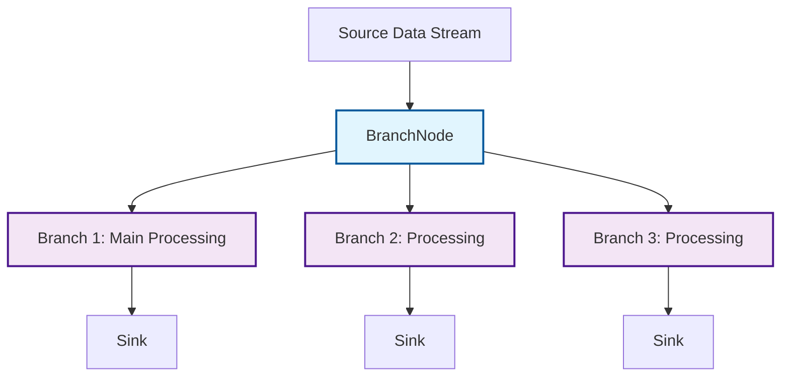

# Branch Nodes

Branch nodes allow you to duplicate (fan-out) an incoming data stream and send identical copies of each item to multiple downstream paths. This is incredibly useful for scenarios where you need to process the same data in different ways concurrently, or for parallel processing of the same data across multiple independent branches.



*Figure: BranchNode fan-out pattern showing how a single input stream is duplicated to multiple independent processing branches.*

NPipeline provides the [`BranchNode<T>`](src/NPipeline/Nodes/BranchNode.cs) for general-purpose stream duplication. For non-intrusive monitoring and side-channel processing, see [Tap Nodes](tap.md).

## [`BranchNode<T>`](src/NPipeline/Nodes/BranchNode.cs): Duplicating Streams

The [`BranchNode<T>`](src/NPipeline/Nodes/BranchNode.cs) takes a single input stream of type `T` and produces multiple output streams of the same type `T`. Each item that enters the `BranchNode` is sent to all connected downstream nodes.

### Example: Processing Data in Multiple Ways

Imagine a scenario where you receive a stream of sensor readings. You might want to:

1. Store the raw readings in a database.
2. Analyze the readings for anomalies in real-time.
3. Aggregate the readings for hourly reports.

A `BranchNode` allows you to achieve this by fanning out the raw readings to three different processing branches.

```csharp
using NPipeline;
using NPipeline.Nodes;

public sealed record SensorReading(DateTime Timestamp, double Value);

public sealed class SensorReadingSource : SourceNode<SensorReading>
{
    public async IAsyncEnumerable<SensorReading> ExecuteAsync(CancellationToken cancellationToken = default)
    {
        for (int i = 0; i < 5; i++)
        {
            if (cancellationToken.IsCancellationRequested) yield break;
            var reading = new SensorReading(DateTime.UtcNow.AddSeconds(i), i * 10.0);
            Console.WriteLine($"Source: Producing {reading}");
            yield return reading;
            await Task.Delay(100, cancellationToken);
        }
    }
}

public sealed class RawDataSink : SinkNode<SensorReading>
{
    public async Task ExecuteAsync(IAsyncEnumerable<SensorReading> input, CancellationToken cancellationToken = default)
    {
        await foreach (var item in input.WithCancellation(cancellationToken))
        {
            Console.WriteLine($"RawDataSink: Stored {item}");
        }
    }
}

public sealed class AnomalyDetector : ITransformNode<SensorReading, string>
{
    public async IAsyncEnumerable<string> ExecuteAsync(IAsyncEnumerable<SensorReading> input, CancellationToken cancellationToken = default)
    {
        await foreach (var item in input.WithCancellation(cancellationToken))
        {
            if (cancellationToken.IsCancellationRequested) yield break;
            if (item.Value > 30.0 && item.Value < 60.0) // Simple anomaly detection
            {
                yield return $"Anomaly Detected: Reading {item.Value} at {item.Timestamp}";
            }
        }
    }
}

public static class Program
{
    public static async Task Main(string[] args)
    {
        var context = PipelineContext.Default;
        var runner = new PipelineRunner();
        
        Console.WriteLine("Starting branching pipeline...");
        await runner.RunAsync<BranchingPipelineDefinition>(context);
        Console.WriteLine("Branching pipeline finished.");
    }
}

public sealed class BranchingPipelineDefinition : IPipelineDefinition
{
    public void Define(PipelineBuilder builder, PipelineContext context)
    {
        var sourceHandle = builder.AddSource<SensorReadingSource, SensorReading>("source");
        var branchHandle = builder.AddBranch<BranchNode<SensorReading>>("branch");
        var rawDataSinkHandle = builder.AddSink<RawDataSink, SensorReading>("rawSink");
        var anomalyDetectorHandle = builder.AddTransform<AnomalyDetector, SensorReading, string>("anomaly");
        var consoleSinkHandle = builder.AddSink<ConsoleSink<string>, string>("consoleSink");

        // First branch: direct to raw data sink
        builder.Connect(sourceHandle, branchHandle);
        builder.Connect(branchHandle, rawDataSinkHandle);
        
        // Second branch: through anomaly detector
        builder.Connect(branchHandle, anomalyDetectorHandle);
        builder.Connect(anomalyDetectorHandle, consoleSinkHandle);
    }
}
```

In this example, the `BranchNode` duplicates the input stream, sending copies to multiple downstream paths. One copy goes to `RawDataSink` for storage, and another copy goes through `AnomalyDetector` for real-time anomaly alerts.

## Performance Considerations

* **Memory Usage**: For large-scale fan-out scenarios, be mindful of memory consumption. Each branch maintains its own processing queue and buffers, which can multiply memory usage with multiple branches.
* **Backpressure**: If one branch of a `BranchNode` becomes slow, it can create backpressure that affects other branches. Consider using appropriate buffering strategies or async processing in sink implementations.
* **Throughput Impact**: Duplicating streams incurs overhead. For high-throughput scenarios, profile your pipeline to ensure the fan-out doesn't become a bottleneck.
* **Resource Management**: Ensure all branches properly dispose of resources, especially when using sinks that maintain connections or file handles.

## Considerations for Branch Nodes

* **Order of Processing:** While `BranchNode` duplicates items, the order in which items are processed in parallel branches is not guaranteed unless explicitly managed (e.g., by subsequent synchronization points).
* **Performance Impact:** Duplicating streams and processing them in parallel can increase resource consumption (CPU, memory) if not managed carefully.
* **Error Handling:** Errors in one branch of a `BranchNode` will typically not affect other branches, allowing for isolated fault tolerance.

## Next Steps

* **[Tap Nodes](tap.md)**: Learn about non-intrusive monitoring and side-channel processing.
* **[Type Conversion Nodes](type-conversion.md)**: Discover how to transform data between different types.
* **[Advanced Error Handling Patterns](../resilience/error-handling-guide.md#advanced-patterns)**: Learn more about handling errors in complex pipeline structures.

