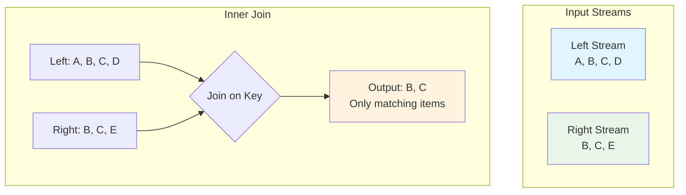
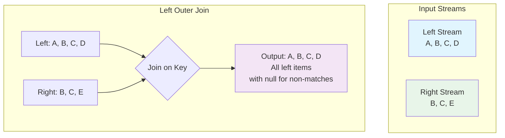
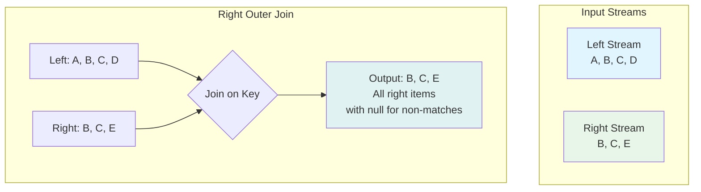
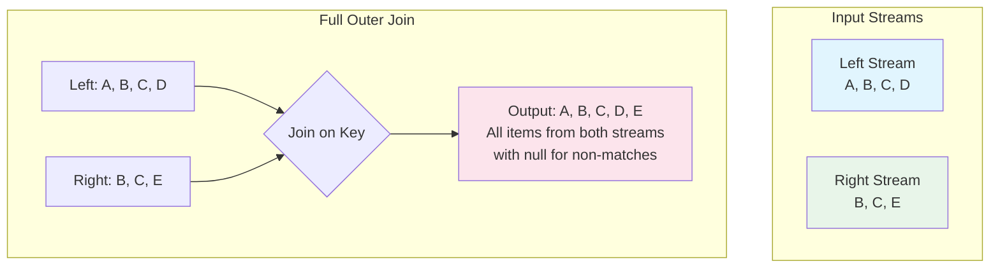

# Join Nodes

Join nodes in NPipeline allow you to combine data from two or more independent input streams into a single output stream. This is a common operation in data processing, enabling the enrichment of data or the correlation of related events.

NPipeline offers different types of join nodes to cater to various joining strategies, including keyed joins and time-windowed joins.

## `IJoinNode`

The [`IJoinNode`](src/NPipeline/Interfaces/IJoinNode.cs) interface represents the contract for any node that performs a join operation. Implementations will typically take multiple input streams and produce a single output stream containing the combined data.

## Keyed Join Nodes

Keyed join nodes merge items from different streams based on a common key. When an item arrives on any input stream, it is matched with existing items from other streams that share the same key.

### `KeyedJoinNode<TKey, TIn1, TIn2, TOut>`

This node performs a join based on a key selector and extends the [`BaseJoinNode<TKey, TIn1, TIn2, TOut>`](src/NPipeline/Nodes/Join/BaseJoinNode.cs) abstract base class, which provides common functionality for processing two input streams. You need to define how to extract the key from the left and right input items.

* `TKey`: The type of the join key.
* `TIn1`: The type of items from the first input stream.
* `TIn2`: The type of items from the second input stream.
* `TOut`: The type of the combined output item.

#### Required Method Overrides

To implement a custom keyed join, you must override the following methods:

1. **`CreateOutput(TLeft leftItem, TRight rightItem)`**: Creates the output item when a match is found between left and right items.
   * **Purpose**: Defines how to combine matching items from both streams into a single output item.
   * **Called when**: A matching pair of items (one from each stream with the same key) is found.
   * **Returns**: The combined output item.

2. **`CreateOutputFromLeft(TLeft leftItem)`** (Optional override): Creates an output item when there's no matching right item.
   * **Purpose**: Handles unmatched items from the left stream in left outer and full outer joins.
   * **Called when**: The stream ends and there are still unmatched left items.
   * **Default behavior**: Attempts to automatically project the left item to the output type, but may throw `NotSupportedException` if unable to do so.
   * **Returns**: An output item based solely on the left item.

3. **`CreateOutputFromRight(TRight rightItem)`** (Optional override): Creates an output item when there's no matching left item.
   * **Purpose**: Handles unmatched items from the right stream in right outer and full outer joins.
   * **Called when**: The stream ends and there are still unmatched right items.
   * **Default behavior**: Attempts to automatically project the right item to the output type, but may throw `NotSupportedException` if unable to do so.
   * **Returns**: An output item based solely on the right item.

#### Key Selection

Key extraction for the join can be defined in two ways:

1. **Using KeySelectorAttribute** (Recommended): Apply the [`KeySelectorAttribute`](src/NPipeline/Attributes/Nodes/KeySelectorAttribute.cs) to your join class to specify which properties to use as keys for each input type.

2. **Custom key extraction**: For more complex key extraction logic, you can override the key selection process.

#### Join Types

The [`JoinType`](src/NPipeline/Nodes/Join/JoinType.cs) property controls how unmatched items are handled:

* `Inner`: Only produces output when there's a match in both streams (default).
* `LeftOuter`: Produces all left items, with matching right items when available.
* `RightOuter`: Produces all right items, with matching left items when available.
* `FullOuter`: Produces all items from both streams, matching when possible.

##### Inner Join



*Figure: Inner join produces output only when there's a match in both streams.*

##### Left Outer Join



*Figure: Left outer join produces all left items, with matching right items when available.*

##### Right Outer Join



*Figure: Right outer join produces all right items, with matching left items when available.*

##### Full Outer Join



*Figure: Full outer join produces all items from both streams, matching when possible.*

### Example: Joining Orders with Customer Data

Let's imagine we have a stream of `Order` items and a separate stream of `Customer` items. We want to enrich the `Order` with `Customer` details.

```csharp
using NPipeline;
using NPipeline.Nodes;

// Define input data structures
public sealed record Order(int OrderId, int CustomerId, decimal Amount);
public sealed record Customer(int CustomerId, string Name, string Email);
public sealed record EnrichedOrder(int OrderId, int CustomerId, string CustomerName, decimal Amount);

// Define the join node with KeySelectorAttributes
[KeySelector(typeof(Order), nameof(Order.CustomerId))]
[KeySelector(typeof(Customer), nameof(Customer.CustomerId))]
public sealed class CustomerOrderJoinNode : KeyedJoinNode<int, Order, Customer, EnrichedOrder>
{
    // Required: Combine matching items
    protected override EnrichedOrder CreateOutput(Order leftItem, Customer rightItem)
    {
        return new EnrichedOrder(
            leftItem.OrderId,
            leftItem.CustomerId,
            rightItem.Name,
            leftItem.Amount
        );
    }

    // Optional: Handle unmatched orders (for left outer or full outer joins)
    protected override EnrichedOrder CreateOutputFromLeft(Order leftItem)
    {
        // Create an enriched order with placeholder customer data
        return new EnrichedOrder(
            leftItem.OrderId,
            leftItem.CustomerId,
            "Unknown Customer",
            leftItem.Amount
        );
    }

    // Optional: Handle unmatched customers (for right outer or full outer joins)
    protected override EnrichedOrder CreateOutputFromRight(Customer rightItem)
    {
        // Create a placeholder order with just the customer information
        return new EnrichedOrder(
            0, // No OrderId
            rightItem.CustomerId,
            rightItem.Name,
            0m // No amount
        );
    }
}

public static class Program
{
    public static async Task Main(string[] args)
    {
        var orderSource = new InMemorySourceNode<Order>(
            new Order(101, 1, 100.00m),
            new Order(102, 2, 250.00m),
            new Order(103, 1, 50.00m),
            new Order(104, 3, 75.00m) // This customer doesn't exist in our data
        );

        var customerSource = new InMemorySourceNode<Customer>(
            new Customer(1, "Alice", "alice@example.com"),
            new Customer(2, "Bob", "bob@example.com")
            // Note: Customer 3 is missing
        );

        // Example with inner join (default)
        var innerJoinContext = PipelineContext.Default;
        var innerJoinRunner = new PipelineRunner();
        Console.WriteLine("Running inner join pipeline...");
        await innerJoinRunner.RunAsync<InnerJoinPipelineDefinition>(innerJoinContext);

        // Example with left outer join
        var leftOuterContext = PipelineContext.Default;
        var leftOuterRunner = new PipelineRunner();
        Console.WriteLine("\nRunning left outer join pipeline...");
        await leftOuterRunner.RunAsync<LeftOuterJoinPipelineDefinition>(leftOuterContext);

        // Example with full outer join
        var fullOuterContext = PipelineContext.Default;
        var fullOuterRunner = new PipelineRunner();
        Console.WriteLine("\nRunning full outer join pipeline...");
        await fullOuterRunner.RunAsync<FullOuterJoinPipelineDefinition>(fullOuterContext);
    }
}

public sealed class InnerJoinPipelineDefinition : IPipelineDefinition
{
    public void Define(PipelineBuilder builder, PipelineContext context)
    {
        var orderSourceHandle = builder.AddSource<InMemorySourceNode<Order>, Order>("orderSource");
        var customerSourceHandle = builder.AddSource<InMemorySourceNode<Customer>, Customer>("customerSource");
        var joinHandle = builder.AddJoin<CustomerOrderJoinNode, Order, Customer, EnrichedOrder>("correlator");
        var sinkHandle = builder.AddSink<ConsoleSink<EnrichedOrder>, EnrichedOrder>("sink");

        builder.Connect(orderSourceHandle, joinHandle);
        builder.Connect(customerSourceHandle, joinHandle);
        builder.Connect(joinHandle, sinkHandle);
    }
}

public sealed class LeftOuterJoinPipelineDefinition : IPipelineDefinition
{
    public void Define(PipelineBuilder builder, PipelineContext context)
    {
        var orderSourceHandle = builder.AddSource<InMemorySourceNode<Order>, Order>("orderSource");
        var customerSourceHandle = builder.AddSource<InMemorySourceNode<Customer>, Customer>("customerSource");
        var joinHandle = builder.AddJoin<CustomerOrderJoinNode, Order, Customer, EnrichedOrder>("correlator");
        var sinkHandle = builder.AddSink<ConsoleSink<EnrichedOrder>, EnrichedOrder>("sink");

        builder.Connect(orderSourceHandle, joinHandle);
        builder.Connect(customerSourceHandle, joinHandle);
        builder.Connect(joinHandle, sinkHandle);
    }
}

public sealed class FullOuterJoinPipelineDefinition : IPipelineDefinition
{
    public void Define(PipelineBuilder builder, PipelineContext context)
    {
        var orderSourceHandle = builder.AddSource<InMemorySourceNode<Order>, Order>("orderSource");
        var customerSourceHandle = builder.AddSource<InMemorySourceNode<Customer>, Customer>("customerSource");
        var joinHandle = builder.AddJoin<CustomerOrderJoinNode, Order, Customer, EnrichedOrder>("correlator");
        var sinkHandle = builder.AddSink<ConsoleSink<EnrichedOrder>, EnrichedOrder>("sink");

        builder.Connect(orderSourceHandle, joinHandle);
        builder.Connect(customerSourceHandle, joinHandle);
        builder.Connect(joinHandle, sinkHandle);
    }
}
```

**Expected Output:**

```text
Running inner join pipeline...
Sink received: EnrichedOrder { OrderId = 101, CustomerId = 1, CustomerName = "Alice", Amount = 100.00 }
Sink received: EnrichedOrder { OrderId = 102, CustomerId = 2, CustomerName = "Bob", Amount = 250.00 }
Sink received: EnrichedOrder { OrderId = 103, CustomerId = 1, CustomerName = "Alice", Amount = 50.00 }

Running left outer join pipeline...
Sink received: EnrichedOrder { OrderId = 101, CustomerId = 1, CustomerName = "Alice", Amount = 100.00 }
Sink received: EnrichedOrder { OrderId = 102, CustomerId = 2, CustomerName = "Bob", Amount = 250.00 }
Sink received: EnrichedOrder { OrderId = 103, CustomerId = 1, CustomerName = "Alice", Amount = 50.00 }
Sink received: EnrichedOrder { OrderId = 104, CustomerId = 3, CustomerName = "Unknown Customer", Amount = 75.00 }

Running full outer join pipeline...
Sink received: EnrichedOrder { OrderId = 101, CustomerId = 1, CustomerName = "Alice", Amount = 100.00 }
Sink received: EnrichedOrder { OrderId = 102, CustomerId = 2, CustomerName = "Bob", Amount = 250.00 }
Sink received: EnrichedOrder { OrderId = 103, CustomerId = 1, CustomerName = "Alice", Amount = 50.00 }
Sink received: EnrichedOrder { OrderId = 104, CustomerId = 3, CustomerName = "Unknown Customer", Amount = 75.00 }
```

### Example: Composite Key Join

For more complex scenarios, you can use composite keys:

```csharp
using NPipeline;
using NPipeline.Nodes;

// Define input data structures with composite keys
public sealed record OrderItem(int OrderId, string ProductCode, int Quantity, decimal Price);
public sealed record Product(string ProductCode, string Category, string Name);
public sealed record EnrichedOrderItem(int OrderId, string ProductCode, string ProductName, string Category, int Quantity, decimal Price);

// Define a composite key type
public sealed record OrderProductKey(int OrderId, string ProductCode);

// Define the join node with composite key selectors
[KeySelector(typeof(OrderItem), nameof(OrderItem.OrderId), nameof(OrderItem.ProductCode))]
[KeySelector(typeof(Product), nameof(Product.ProductCode))]
public sealed class OrderItemProductJoinNode : KeyedJoinNode<(int, string), OrderItem, Product, EnrichedOrderItem>
{
    protected override EnrichedOrderItem CreateOutput(OrderItem leftItem, Product rightItem)
    {
        return new EnrichedOrderItem(
            leftItem.OrderId,
            leftItem.ProductCode,
            rightItem.Name,
            rightItem.Category,
            leftItem.Quantity,
            leftItem.Price
        );
    }

    protected override EnrichedOrderItem CreateOutputFromLeft(OrderItem leftItem)
    {
        // Handle order items with unknown products
        return new EnrichedOrderItem(
            leftItem.OrderId,
            leftItem.ProductCode,
            "Unknown Product",
            "Unknown Category",
            leftItem.Quantity,
            leftItem.Price
        );
    }
}

// Alternative using ValueTuple for composite key
[KeySelector(typeof(OrderItem), nameof(OrderItem.OrderId), nameof(OrderItem.ProductCode))]
[KeySelector(typeof(Product), nameof(Product.ProductCode))]
public sealed class OrderItemProductJoinNodeWithTuple : KeyedJoinNode<(int OrderId, string ProductCode), OrderItem, Product, EnrichedOrderItem>
{
    protected override EnrichedOrderItem CreateOutput(OrderItem leftItem, Product rightItem)
    {
        return new EnrichedOrderItem(
            leftItem.OrderId,
            leftItem.ProductCode,
            rightItem.Name,
            rightItem.Category,
            leftItem.Quantity,
            leftItem.Price
        );
    }
}
```

## Time-Windowed Join Nodes

Time-windowed join nodes combine items from different streams that occur within a specified time window. This is common in real-time stream processing where events need to be correlated based on their temporal proximity.

### `TimeWindowedJoinNode<TLeft, TRight, TKey, TOutput>`

This node extends [`KeyedJoinNode`](src/NPipeline/Nodes/Join/KeyedJoinNode.cs) by adding a time window constraint. Items are considered for joining only if their timestamps fall within the defined window and their keys match.

### Example: Correlating Events within a Time Window

The repository includes time-windowed join support (see `TimeWindowedJoinNode` and windowing primitives such as `WindowAssigner`). Higher-level extension packages may provide convenience helpers in the future, but basic time-windowed join patterns are available in core today.

```csharp
// Assuming EventA and EventB have a Timestamp property and a common CorrelationId
public sealed record EventA(Guid CorrelationId, DateTime Timestamp, string DataA);
public sealed record EventB(Guid CorrelationId, DateTime Timestamp, string DataB);
public sealed record CorrelatedEvent(Guid CorrelationId, DateTime Timestamp, string DataA, string DataB);

public sealed class EventCorrelationJoinNode : TimeWindowedJoinNode<EventA, EventB, Guid, CorrelatedEvent>
{
    public EventCorrelationJoinNode(TimeSpan windowSize) : base(windowSize) { }

    protected override Guid GetLeftKey(EventA leftItem) => leftItem.CorrelationId;
    protected override DateTime GetLeftTimestamp(EventA leftItem) => leftItem.Timestamp;

    protected override Guid GetRightKey(EventB rightItem) => rightItem.CorrelationId;
    protected override DateTime GetRightTimestamp(EventB rightItem) => rightItem.Timestamp;

    protected override CorrelatedEvent JoinItems(EventA leftItem, EventB rightItem)
    {
        return new CorrelatedEvent(
            leftItem.CorrelationId,
            leftItem.Timestamp, // or rightItem.Timestamp, depending on logic
            leftItem.DataA,
            rightItem.DataB
        );
    }
}

// Pipeline construction would involve adding sources and a join node
// var pipeline = new PipelineBuilder()
//     .AddSource(new EventASource())
//     .AddSource(new EventBSource())
//     .Join(new EventCorrelationJoinNode(TimeSpan.FromSeconds(5))) // Join events within 5 seconds
//     .AddSink(new ConsoleSink<CorrelatedEvent>())
//     .Build();
```

## Key Configuration with [`KeySelectorAttribute`](src/NPipeline/Attributes/Nodes/KeySelectorAttribute.cs)

Some join nodes may utilize the `KeySelectorAttribute` to automatically infer key extraction logic based on property names or custom functions. This provides a declarative way to specify join keys.

## :arrow_right: Next Steps

* **[Lookup Nodes](lookup.md)**: Discover how to enrich data by querying external sources.
* **[Branch Nodes](branch.md)**: Learn about duplicating data streams to multiple downstream paths.

