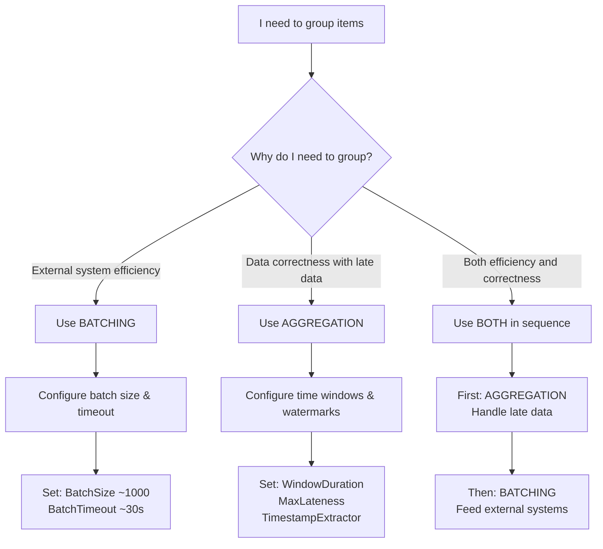

## Grouping Strategies: Batching vs Aggregation

## Prerequisites

Before understanding grouping strategies, you should be familiar with:
- [Core Concepts Overview](../index.md) - Basic NPipeline concepts and terminology
- [Nodes Overview](./nodes/index.md) - Understanding the basic node types that use grouping

When building data pipelines, you often need to group items together. NPipeline provides two fundamentally different approaches—**batching** and **aggregation**—each suited for solving different problems.

**This decision is critical.** Choosing the wrong approach can lead to:

- **Subtle data corruption** (wrong results, not crashes)
- **Performance bottlenecks** (unnecessary complexity)
- **Silent failures** (pipeline runs fine, but data is incorrect)

Understanding this distinction upfront prevents these problems.

---

## The Core Distinction

### Batching: Operational Efficiency

**Purpose:** Group items to meet external system constraints and improve performance.

Batching solves an **operational problem**: external systems (like databases) work more efficiently when you send them multiple items at once rather than one at a time.

**When to use:**

- Bulk database inserts (1000 rows at a time vs row-by-row)
- Batch API calls (100 records per request vs individual requests)
- Writing to files in chunks (filesystem buffers)
- Any scenario where the external system requires or prefers batch operations

**Key insight:** Batching looks at the **wall clock**. It says: "Every N items, or every X seconds, send what we have."

### Aggregation: Data Correctness

**Purpose:** Group items to ensure correct results when data arrives out of order or late.

Aggregation solves a **correctness problem**: in event-driven systems, events often arrive out of sequence or after their logical "window" has passed. Aggregation handles this by maintaining state across events and time windows.

**When to use:**

- Time-windowed summaries (count events per hour)
- Handling late-arriving data (events arriving 5+ minutes late)
- Deduplication based on event timestamps
- Any scenario where the **order and timing of data matters** for correctness

**Key insight:** Aggregation uses a **time machine**. It says: "Group events by their *event time*, not when they arrived, and wait for latecomers."

---

## Side-by-Side Comparison

| Aspect | **Batching** | **Aggregation** |
|--------|-------------|-----------------|
| **Primary Problem Solved** | External system efficiency | Data correctness |
| **Groups By** | Container size or elapsed time | Time windows, keys, event time |
| **Handles Late Data** | No (arrives late = arrives late) | Yes (configured grace period) |
| **State Complexity** | Simple (current batch buffer) | Complex (windowed state, watermarks) |
| **Configuration** | Batch size, timeout | Window size, window type, max lateness |
| **When It Fails** | Entire batch fails (transactional) | Only events in affected window fail |
| **Real-World Example** | "I need to insert 1000 rows at a time for DB performance" | "I need to count events per hour, but events may arrive 5 minutes late" |
| **Architectural Signal** | Simple config = operational efficiency focus | Complex config = correctness focus |

---

## Decision Tree: Batching vs Aggregation



This decision tree helps you quickly determine the right grouping approach:

* **External system efficiency** → Use **Batching** when your primary concern is optimizing interactions with external systems (databases, APIs, files)
* **Data correctness with late data** → Use **Aggregation** when you need accurate results despite out-of-order or late-arriving events
* **Both efficiency and correctness** → Use **Both** when you need to ensure correctness first (aggregation) and then optimize external system interactions (batching)

## Decision Framework: Which Should You Use?

**Start with this question: Why do I need to group items together?**

### Decision Path 1: "To Reduce Load on External Systems"

```text
Question: Do you need to meet external system constraints?
- "I need to batch database inserts for performance"
- "My API requires multiple records per request"
- "The file system works better with chunked writes"

Answer: Use BATCHING ✓

Configuration:
  - Batch size: ~1000 (adjust based on system limits)
  - Batch timeout: 30 seconds (or your SLA requirement)
  - Error handling: Entire batch fails together (transactional)
```

**Example:**

```csharp
var batchNode = builder
    .AddBatch<Order, OrderBatch>("bulkInsert")
    .WithBatchSize(1000)
    .WithBatchTimeout(TimeSpan.FromSeconds(30));
```

### Decision Path 2: "To Ensure Correctness with Late or Out-of-Order Data"

```text
Question: Do events arrive out of order or late?
- "I need to count events per hour (events may be 5 mins late)"
- "I need deduplication based on event timestamp"
- "Different event sources have clock skew"

Answer: Use AGGREGATION ✓

Configuration:
  - Window type: Tumbling, sliding, or session
  - Window duration: 1 hour (or your business window)
  - Max lateness: 5 minutes (your allowed grace period)
  - Timestamp extractor: How to get event time from items
```

**Example:**

```csharp
var aggregateNode = builder
    .AddAggregate<Event, PerHourStats>("hourlyStats")
    .WithTumblingWindow(TimeSpan.FromHours(1))
    .WithMaxLateness(TimeSpan.FromMinutes(5))
    .WithEventTimeExtractor(e => e.Timestamp);
```

---

## Consequences of Choosing Wrong

### ❌ Using Batching When You Need Aggregation

**Scenario:** You use batching to group events into hourly buckets.

```csharp
// WRONG: Treating time windows as batches
var badNode = builder
    .AddBatch<Event, EventBatch>("hourlyStats")
    .WithBatchSize(3600); // Process 3600 items at a time
```

**What goes wrong:**

- Events arriving 5 minutes late are **already in a different batch**
- Results are **silently incomplete**—no error, no crash, just wrong data
- Late events might join the *next* batch, corrupting its results
- A developer's nightmare: pipeline runs fine, but analytics are wrong

### ❌ Using Aggregation When You Need Batching

**Scenario:** You use aggregation for bulk database inserts.

```csharp
// WRONG: Over-engineered batching
var badNode = builder
    .AddAggregate<OrderInsert, InsertedOrders>("dbInserts")
    .WithTumblingWindow(TimeSpan.FromSeconds(30))
    .WithEventTimeExtractor(o => o.CreatedTime);
```

**What goes wrong:**

- **Unnecessary complexity:** You're maintaining windowed state for something that doesn't need it
- **Resource waste:** Memory overhead for aggregation buffers
- **Unpredictable latency:** A batch of 999 items might wait up to 30 seconds for window closure
- Simple problem, over-engineered solution

---

## Quick Reference: Configuration Checklist

### Choosing Batching

- [ ] External system requires/prefers batch operations
- [ ] Order/timing of items doesn't affect correctness
- [ ] Simple timeout + size trigger is sufficient
- [ ] Transactional failure mode is acceptable (all or nothing)

**Configure:**

```csharp
.WithBatchSize(N)
.WithBatchTimeout(TimeSpan.FromSeconds(X))
```

### Choosing Aggregation

- [ ] Events can arrive out of order or late
- [ ] Results are time-windowed or event-time dependent
- [ ] You need to handle **event time** (not arrival time)
- [ ] You can tolerate the memory cost of state buffers

**Configure:**

```csharp
.WithTumblingWindow(TimeSpan.FromHours(1))
.WithMaxLateness(TimeSpan.FromMinutes(5))
.WithEventTimeExtractor(x => x.Timestamp)
```

---

## When You Need Both

Some pipelines use **both strategies in sequence**:

```text
Sources
  ↓
Aggregation (group by event time)  ← Handle late data, correctness
  ↓
Batching (group by container size) ← Feed external systems efficiently
  ↓
Sinks
```

This is perfectly valid. For example:

1. **Aggregation:** Group clickstream events into hourly windows (event time)
2. **Batching:** Batch the aggregated results (1000 at a time) for bulk database insert

The key: each node solves one problem, and you compose them.

---

## See Also

- [Batching Nodes](./advanced-nodes/batching.md) - Deep dive into batching configuration and patterns
- [Aggregation Nodes](./advanced-nodes/aggregation.md) - Master event-time aggregation, windows, and watermarks
- [Common Patterns](./common-patterns.md) - Real-world examples of grouping in production pipelines
- [Error Handling Guide](./resilience/error-handling-guide.md) - Handle errors in grouped operations
- [Execution Strategies](./pipeline-execution/execution-strategies.md) - Control how grouped operations execute

## Next Steps

- [Batching Nodes](./advanced-nodes/batching.md) - Deep dive into batching configuration and patterns
- [Aggregation Nodes](./advanced-nodes/aggregation.md) - Master event-time aggregation, windows, and watermarks
- [Common Patterns](./common-patterns.md) - Real-world examples of grouping in production pipelines
