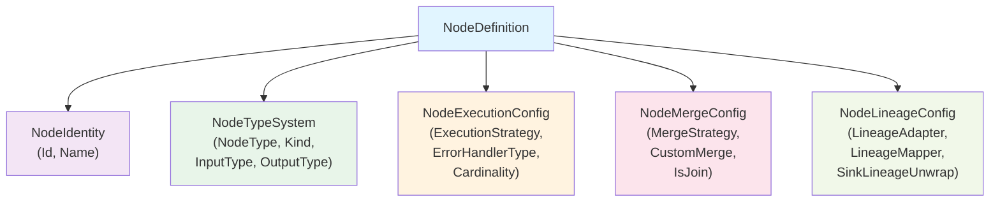

# Node Definition Structure

NPipeline uses a `NodeDefinition` record to represent nodes in the pipeline graph. This record has been refactored to use a nested configuration structure that organizes node properties logically and makes the API more maintainable.

## Overview

The `NodeDefinition` record is composed of several nested configuration records, each responsible for a specific aspect of node configuration:

- **NodeIdentity**: Contains identification information (ID and name)
- **NodeTypeSystem**: Contains type system information (node type, kind, input/output types)
- **NodeExecutionConfig**: Contains execution-related configuration (strategy, error handler, cardinality)
- **NodeMergeConfig**: Contains merge-related configuration (strategy, custom merge logic)
- **NodeLineageConfig**: Contains lineage-related configuration (adapters, mappers, unwrappers)

### Node Configuration Hierarchy



## Nested Configuration Records

### NodeIdentity

```csharp
/// <summary>
/// Represents the identity information of a node.
/// </summary>
/// <param name="Id">The unique identifier for the node.</param>
/// <param name="Name">A descriptive name for the node.</param>
public sealed record NodeIdentity(
    string Id,
    string Name);
```

### NodeTypeSystem

```csharp
/// <summary>
/// Represents the type system information of a node.
/// </summary>
/// <param name="NodeType">The type of the pipeline node, which must implement INode.</param>
/// <param name="Kind">The kind of node (Source, Transform, Sink, Join, or Aggregate).</param>
/// <param name="InputType">The type of input data for the node.</param>
/// <param name="OutputType">The type of output data for the node.</param>
public sealed record NodeTypeSystem(
    Type NodeType,
    NodeKind Kind,
    Type? InputType = null,
    Type? OutputType = null);
```

### NodeExecutionConfig

```csharp
/// <summary>
/// Represents the execution configuration of a node.
/// </summary>
/// <param name="ExecutionStrategy">The execution strategy for the node.</param>
/// <param name="ErrorHandlerType">The type of the error handler for the node.</param>
/// <param name="DeclaredCardinality">The declared cardinality transformation of the node.</param>
public sealed record NodeExecutionConfig(
    IExecutionStrategy? ExecutionStrategy = null,
    Type? ErrorHandlerType = null,
    TransformCardinality? DeclaredCardinality = null);
```

### NodeMergeConfig

```csharp
/// <summary>
/// Represents the merge configuration of a node.
/// </summary>
/// <param name="MergeStrategy">The merge strategy for nodes that combine multiple inputs.</param>
/// <param name="HasCustomMerge">Whether this node has custom merge logic.</param>
/// <param name="IsJoin">Whether this node is a join node.</param>
/// <param name="CustomMerge">Optional custom merge delegate for merging multiple input streams.</param>
public sealed record NodeMergeConfig(
    MergeType? MergeStrategy = null,
    bool HasCustomMerge = false,
    bool IsJoin = false,
    CustomMergeDelegate? CustomMerge = null);
```

### NodeLineageConfig

```csharp
/// <summary>
/// Represents the lineage configuration of a node.
/// </summary>
/// <param name="LineageAdapter">Optional delegate for transforming lineage data.</param>
/// <param name="LineageMapperType">The type of the lineage mapper for non-1:1 transformations.</param>
/// <param name="SinkLineageUnwrap">Optional delegate for unwrapping lineage in sink nodes.</param>
public sealed record NodeLineageConfig(
    LineageAdapterDelegate? LineageAdapter = null,
    Type? LineageMapperType = null,
    SinkLineageUnwrapDelegate? SinkLineageUnwrap = null);
```

## Benefits of Nested Structure

The nested configuration structure provides several benefits:

1. **Logical Organization**: Related properties are grouped together, making the API more intuitive
2. **Type Safety**: Each configuration record has a focused set of related properties
3. **Immutability**: Records provide built-in immutability and value-based equality
4. **Maintainability**: Changes to specific aspects of node configuration are isolated
5. **Extensibility**: New configuration aspects can be added without affecting existing code

## Accessing Properties

The `NodeDefinition` record provides convenience properties that delegate to the nested configuration records:

```csharp
// Accessing execution strategy through the nested structure
var strategy = nodeDefinition.ExecutionConfig.ExecutionStrategy;

// Accessing merge configuration
var mergeStrategy = nodeDefinition.MergeConfig.MergeStrategy;
var hasCustomMerge = nodeDefinition.MergeConfig.HasCustomMerge;

// Accessing lineage configuration
var lineageAdapter = nodeDefinition.LineageConfig.LineageAdapter;
```

## Creating NodeDefinition Instances

When creating NodeDefinition instances, you can use either the constructor with individual parameters or the nested structure approach:

### Using Individual Parameters (Backward Compatible)

```csharp
var nodeDefinition = new NodeDefinition(
    "myNodeId",
    "My Node",
    typeof(MyNode),
    NodeKind.Transform,
    executionStrategy: new MyExecutionStrategy(),
    errorHandlerType: typeof(MyErrorHandler),
    inputType: typeof(string),
    outputType: typeof(int),
    mergeStrategy: MergeType.Concat,
    hasCustomMerge: false,
    declaredCardinality: TransformCardinality.OneToOne,
    lineageAdapter: null,
    lineageMapperType: null,
    isJoin: false,
    customMerge: null,
    sinkLineageUnwrap: null
);
```

### Using Nested Configuration Records (Recommended)

```csharp
var nodeDefinition = new NodeDefinition(
    new NodeIdentity("myNodeId", "My Node"),
    new NodeTypeSystem(typeof(MyNode), NodeKind.Transform, typeof(string), typeof(int)),
    new NodeExecutionConfig(new MyExecutionStrategy(), typeof(MyErrorHandler), TransformCardinality.OneToOne),
    new NodeMergeConfig(MergeType.Concat, false, false, null),
    new NodeLineageConfig(null, null, null)
);
```

## Updating NodeDefinition

The nested structure makes it easier to update specific aspects of node configuration using the `with` expression:

```csharp
// Update execution strategy
var updatedNode = nodeDefinition with { 
    ExecutionConfig = nodeDefinition.ExecutionConfig with { 
        ExecutionStrategy = newExecutionStrategy 
    } 
};

// Update merge configuration
var withCustomMerge = nodeDefinition with { 
    MergeConfig = nodeDefinition.MergeConfig with { 
        CustomMerge = myCustomMergeDelegate,
        HasCustomMerge = true
    } 
};
```

## See Also

- [Defining Pipelines](defining-pipelines.md) - Learn how to define pipelines with both fluent and class-based approaches
- [Node Types](nodes/index.md) - Overview of different node types
- [Execution Strategies](pipeline-execution/execution-strategies.md) - Configure node execution
