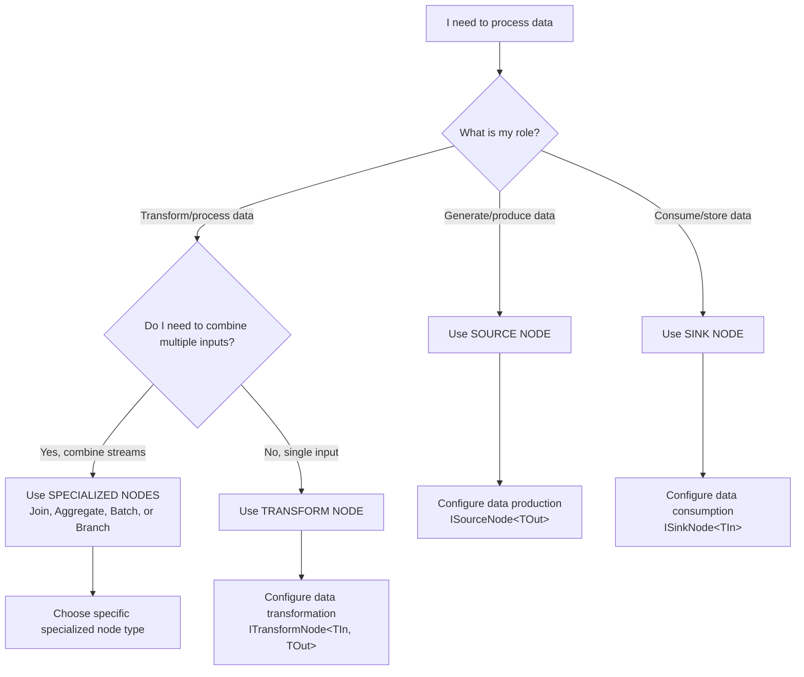

# Nodes: Source, Transform, Sink, and Specialized

## Prerequisites

Before understanding nodes, you should be familiar with:
- [Core Concepts Overview](../index.md) - Basic NPipeline concepts and terminology
- [Pipeline Context](../pipeline-context.md) - How state is shared across nodes

Nodes are the fundamental building blocks of any NPipeline. They encapsulate the logic for producing, transforming, or consuming data items as they flow through your pipeline. NPipeline defines three primary types of nodes, each with a distinct role:

* **Source Nodes (`ISourceNode<TOut>`):** Initiate the data flow by producing items.
* **Transform Nodes (`ITransformNode<TIn, TOut>`):** Process and transform data items.
* **Sink Nodes (`ISinkNode<TIn>`):** Consume data items, typically as the final step in a pipeline.

In addition to these core node types, NPipeline offers specialized nodes for complex data processing patterns like aggregation, batching, joining, and branching.

All nodes implement the `INode` interface, which provides a common base for all processing units within NPipeline.

## The Node Hierarchy

The `INode` interface is the common root for all pipeline nodes. It is a simple marker interface that also implements `IAsyncDisposable` to allow for proper resource cleanup.

```csharp
public interface INode : IAsyncDisposable { }
```

There are several specialized types of nodes, each with a distinct role in the pipeline:

1. **`ISourceNode<TOut>`**: Produces data to start a pipeline.
2. **`ITransformNode<TIn, TOut>`**: Processes data from an upstream node and passes it to a downstream node.
3. **`ISinkNode<TIn>`**: Consumes data, typically at the end of a pipeline.
4. **Specialized Nodes**: Handle complex data processing patterns like aggregation, batching, joining, and branching.

## Core Node Types

The three core node types handle the fundamental data flow in a pipeline:

### ISourceNode&lt;TOut&gt;

A source node is the starting point of a pipeline. It is responsible for generating or fetching the initial data that will be processed. A pipeline must have at least one source node.

#### Definition

```csharp
public interface ISourceNode<out TOut> : INode
{
    IDataPipe<TOut> Execute(PipelineContext context, CancellationToken cancellationToken);
}
```

* **`TOut`**: The type of data that the source node produces (covariant).
* **`Execute()`**: This method is called by the pipeline runner to start data production. It returns an `IDataPipe<TOut>` synchronously—no Task wrapper, no await needed.

#### Key Design Pattern: Synchronous Pipe Creation + Asynchronous Iteration

NPipeline separates concerns into two distinct phases:

**Phase 1 (Synchronous):** Pipe Creation

* `Execute()` creates and returns the pipe immediately (synchronously)
* No `await` needed when calling this method
* The pipeline reference is established without blocking

**Phase 2 (Asynchronous):** Data Consumption

* The returned pipe is an `IAsyncEnumerable<T>`
* Data flows asynchronously when downstream nodes enumerate it
* `await foreach` is used when consuming data items

**Mental Model - File I/O Analogy:**

```csharp
// File I/O pattern:
var stream = File.OpenRead(path);           // Sync - open stream immediately
var bytes = await stream.ReadAsync(...);    // Async - read from stream

// NPipeline pattern:
var pipe = source.Execute(...);        // Sync - create pipe immediately  
var item = await pipe.FirstAsync();         // Async - read item from pipe
```

**Why This Design?**

* :heavy_check_mark: **Clearer Intent:** `Execute()` (no "Async" suffix) signals that pipe creation is synchronous
* :heavy_check_mark: **Type Safety:** Covariant `IDataPipe<T>` (not invariant `Task<IDataPipe<T>>`) enables better type compatibility
* :heavy_check_mark: **Performance:** No unnecessary `Task` allocations for pipe creation
* :heavy_check_mark: **Consistency:** Uniform synchronous pattern across all source nodes

#### Example

Here is an example of a simple source node that produces a sequence of numbers:

```csharp
/// <summary>
/// Simple source node that produces a sequence of numbers.
/// Demonstrates the synchronous pipe creation + asynchronous iteration pattern
/// that is fundamental to NPipeline's design.
/// </summary>
public sealed class NumberSource : SourceNode<int>
{
    public override IDataPipe<int> ExecuteAsync(PipelineContext context, CancellationToken cancellationToken)
    {
        // Create and return the data pipe immediately (synchronous operation)
        // The actual data streaming happens asynchronously when downstream nodes enumerate
        return new StreamingDataPipe<int>(StreamNumbers());

        static async IAsyncEnumerable<int> StreamNumbers()
        {
            for (int i = 1; i <= 10; i++)
            {
                yield return i;
                // Simulate work or external dependency delay
                await Task.Delay(100, cancellationToken);
            }
        }
    }
}
```

### ITransformNode&lt;TIn, TOut&gt;

A transform node sits between a source and a sink (or between other transforms). It receives data, performs an operation on it, and then outputs the modified data.

#### Definition

```csharp
public interface ITransformNode : INode
{
    IExecutionStrategy ExecutionStrategy { get; set; }
    INodeErrorHandler? ErrorHandler { get; set; }
}

public interface ITransformNode<in TIn, TOut> : ITransformNode
{
    Task<TOut> ExecuteAsync(TIn item, PipelineContext context, CancellationToken cancellationToken);
}
```

* **`TIn`**: The type of data the node receives.
* **`TOut`**: The type of data the node outputs.
* **`ExecuteAsync`**: This method is called for each individual item that flows into the node.
* **`ExecutionStrategy`**: Gets or sets the execution strategy for this node.
* **`ErrorHandler`**: Gets or sets the error handler for this node.

#### Example

This transform takes an integer, squares it, and returns the result as a string.

```csharp
/// <summary>
/// Transform that squares integers and converts to string representation.
/// Demonstrates the basic transform pattern with synchronous execution.
/// </summary>
public sealed class SquareAndStringifyTransform : ITransformNode<int, string>
{
    public IExecutionStrategy ExecutionStrategy { get; set; } = new SequentialExecutionStrategy();
    public INodeErrorHandler? ErrorHandler { get; set; }

    /// <summary>
    /// Processes each integer by squaring it and returning a formatted string.
    /// Uses Task.FromResult for synchronous operations to avoid unnecessary async overhead.
    /// </summary>
    public Task<string> ExecuteAsync(int item, PipelineContext context, CancellationToken cancellationToken)
    {
        // Synchronous calculation - no async work needed
        int squared = item * item;
        
        // Wrap result in Task to satisfy interface, but avoid async state machine
        return Task.FromResult($"The square is {squared}");
    }
}
```

### ISinkNode&lt;TIn&gt;

A sink node is a terminal point in a pipeline. It receives data but does not produce any output for other nodes. Its purpose is to perform a final action, such as writing to a database, logging to the console, or sending data to an external API.

#### Definition

```csharp
public interface ISinkNode<in TIn> : INode
{
    Task ExecuteAsync(IDataPipe<TIn> input, PipelineContext context, CancellationToken cancellationToken);
}
```

* **`TIn`**: The type of data the node receives (contravariant).
* **`ExecuteAsync`**: This method receives the `IDataPipe<TIn>` containing all the data from the upstream node and is responsible for consuming it.

#### Example

This sink node simply prints the incoming strings to the console.

```csharp
/// <summary>
/// Sink node that outputs strings to the console.
/// Demonstrates the consumption pattern for terminal nodes in a pipeline.
/// </summary>
public sealed class ConsoleSink : ISinkNode<string>
{
    /// <summary>
    /// Consumes all items from the input pipe and writes them to console.
    /// Uses await foreach to efficiently iterate through the async stream.
    /// </summary>
    public async Task ExecuteAsync(IDataPipe<string> input, PipelineContext context, CancellationToken cancellationToken)
    {
        // Process each item as it arrives from the upstream node
        await foreach (var item in input.WithCancellation(cancellationToken))
        {
            Console.WriteLine(item);
        }
    }
}
```

## Specialized Node Types

Beyond the basic source, transform, and sink nodes, NPipeline offers a suite of specialized node types designed to handle more complex data processing patterns. These nodes enable sophisticated operations like aggregating data, joining streams, batching items for efficiency, and duplicating data paths for branching logic or monitoring.

### Topics in this Section

#### Core Node Types
* **[Source Nodes](source-nodes.md)**: Learn about nodes that initiate data flow in your pipeline.
* **[Transform Nodes](transform-nodes.md)**: Explore nodes that process and transform data items.
* **[Sink Nodes](sink-nodes.md)**: Understand nodes that consume data as the final step in a pipeline.

#### Specialized Node Types
* **[Aggregation Nodes](aggregation.md)**: Learn how to perform various aggregation operations on data streams.
* **[Batching Nodes](batching.md)**: Understand how to batch data for improved processing efficiency.
* **[Join Nodes](join.md)**: Explore different types of join operations for combining data streams.
* **[Lookup Nodes](lookup.md)**: Learn how to enrich data by looking up values from external sources.
* **[Time-Windowed Join Nodes](time-windowed-join.md)**: Discover how to join data streams based on defined time windows.
* **[Branch Nodes](branch.md)**: Understand how to duplicate data streams for parallel processing.
* **[Tap Nodes](tap.md)**: Learn about non-intrusive monitoring and side-channel processing.

## Choosing the Right Node Type



This decision tree helps you select the appropriate node type based on your specific data processing needs:

* **Source Nodes** are your starting point when you need to generate or fetch data from external systems
* **Transform Nodes** handle the processing of data from a single input stream to produce output
* **Sink Nodes** are endpoints that consume data, typically for storage or external system integration
* **Specialized Nodes** provide specific patterns for combining, grouping, or managing complex data flows

## Node Connectivity

Nodes are connected using `PipelineBuilder`. The output type of an upstream node must match the input type of a downstream node. NPipeline ensures type compatibility during pipeline construction.

```csharp
using NPipeline;
using NPipeline.DataFlow;
using NPipeline.Execution;
using NPipeline.Nodes;
using NPipeline.Pipeline;

/// <summary>
/// Complete pipeline definition that connects source, transform, and sink nodes.
/// Demonstrates the fluent API pattern for building executable pipelines.
/// </summary>
public sealed class NumberPipelineDefinition : IPipelineDefinition
{
    public void Define(PipelineBuilder builder, PipelineContext context)
    {
        // Add nodes to the pipeline and get handles for connection
        var sourceHandle = builder.AddSource<NumberSource, int>("number_source");
        var transformHandle = builder.AddTransform<SquareTransform, int, int>("square_transform");
        var sinkHandle = builder.AddSink<ConsoleSink<int>, int>("console_sink");

        // Define data flow by connecting the nodes
        builder.Connect(sourceHandle, transformHandle);
        builder.Connect(transformHandle, sinkHandle);
    }
}

public static class Program
{
    public static async Task Main(string[] args)
    {
        // Create a pipeline runner to execute the defined pipeline
        var runner = PipelineRunner.Create();
        
        // Run the pipeline using the definition
        await runner.RunAsync<NumberPipelineDefinition>();
    }
}
```

## See Also

- [PipelineBuilder](../pipelinebuilder.md) - Learn how to connect nodes together
- [Pipeline Execution](../pipeline-execution/index.md) - Understand how nodes are executed
- [Error Handling](../resilience/error-handling.md) - Handle errors within nodes
- [Architecture: Core Concepts](../../architecture/core-concepts.md) - Deep dive into node architecture

## Next Steps

- [PipelineBuilder](../pipelinebuilder.md) - Learn how to connect these nodes together
- [Execution Strategies](../pipeline-execution/execution-strategies.md) - Control how nodes process data
- [Specialized Node Types](aggregation.md) - Explore more sophisticated node patterns
