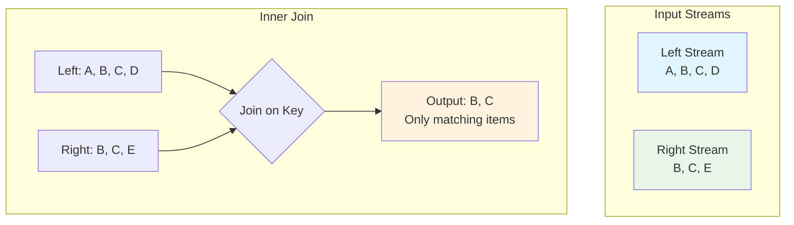
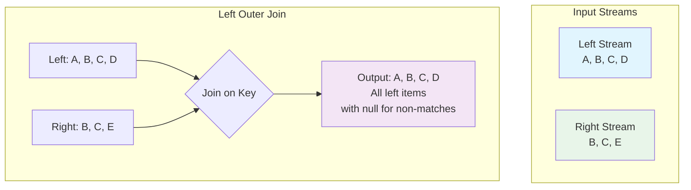
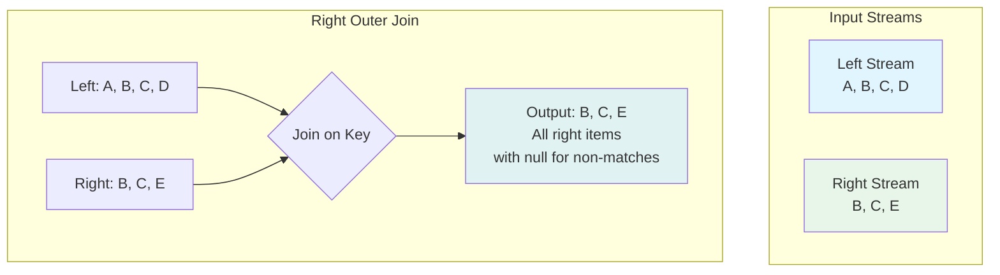
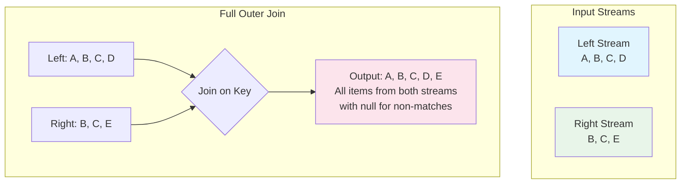
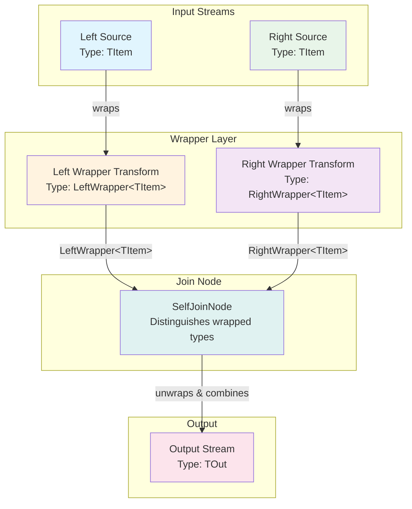

# Join Nodes

Join nodes in NPipeline allow you to combine data from two or more independent input streams into a single output stream. This is a common operation in data processing, enabling the enrichment of data or the correlation of related events.

NPipeline offers different types of join nodes to cater to various joining strategies, including keyed joins and time-windowed joins.

## `IJoinNode`

The [`IJoinNode`](src/NPipeline/Interfaces/IJoinNode.cs) interface represents the contract for any node that performs a join operation. Implementations will typically take multiple input streams and produce a single output stream containing the combined data.

## Keyed Join Nodes

Keyed join nodes merge items from different streams based on a common key. When an item arrives on any input stream, it is matched with existing items from other streams that share the same key.

### `KeyedJoinNode<TKey, TIn1, TIn2, TOut>`

This node performs a join based on a key selector and extends the [`BaseJoinNode<TKey, TIn1, TIn2, TOut>`](src/NPipeline/Nodes/Join/BaseJoinNode.cs) abstract base class, which provides common functionality for processing two input streams. You need to define how to extract the key from the left and right input items.

* `TKey`: The type of the join key.
* `TIn1`: The type of items from the first input stream.
* `TIn2`: The type of items from the second input stream.
* `TOut`: The type of the combined output item.

#### Required Method Overrides

To implement a custom keyed join, you must override the following methods:

1. **`CreateOutput(TLeft leftItem, TRight rightItem)`**: Creates the output item when a match is found between left and right items.
   * **Purpose**: Defines how to combine matching items from both streams into a single output item.
   * **Called when**: A matching pair of items (one from each stream with the same key) is found.
   * **Returns**: The combined output item.

2. **`CreateOutputFromLeft(TLeft leftItem)`** (Optional override): Creates an output item when there's no matching right item.
   * **Purpose**: Handles unmatched items from the left stream in left outer and full outer joins.
   * **Called when**: The stream ends and there are still unmatched left items.
   * **Default behavior**: Attempts to automatically project the left item to the output type, but may throw `NotSupportedException` if unable to do so.
   * **Returns**: An output item based solely on the left item.

3. **`CreateOutputFromRight(TRight rightItem)`** (Optional override): Creates an output item when there's no matching left item.
   * **Purpose**: Handles unmatched items from the right stream in right outer and full outer joins.
   * **Called when**: The stream ends and there are still unmatched right items.
   * **Default behavior**: Attempts to automatically project the right item to the output type, but may throw `NotSupportedException` if unable to do so.
   * **Returns**: An output item based solely on the right item.

#### Key Selection

Key extraction for the join can be defined in two ways:

1. **Using KeySelectorAttribute** (Recommended): Apply the [`KeySelectorAttribute`](src/NPipeline/Attributes/Nodes/KeySelectorAttribute.cs) to your join class to specify which properties to use as keys for each input type.

2. **Custom key extraction**: For more complex key extraction logic, you can override the key selection process.

#### Join Types

The [`JoinType`](src/NPipeline/Nodes/Join/JoinType.cs) property controls how unmatched items are handled:

* `Inner`: Only produces output when there's a match in both streams (default).
* `LeftOuter`: Produces all left items, with matching right items when available.
* `RightOuter`: Produces all right items, with matching left items when available.
* `FullOuter`: Produces all items from both streams, matching when possible.

##### Inner Join



*Figure: Inner join produces output only when there's a match in both streams.*

##### Left Outer Join



*Figure: Left outer join produces all left items, with matching right items when available.*

##### Right Outer Join



*Figure: Right outer join produces all right items, with matching left items when available.*

##### Full Outer Join



*Figure: Full outer join produces all items from both streams, matching when possible.*

### Example: Joining Orders with Customer Data

Let's imagine we have a stream of `Order` items and a separate stream of `Customer` items. We want to enrich the `Order` with `Customer` details.

```csharp
using NPipeline;
using NPipeline.Nodes;

// Define input data structures
public sealed record Order(int OrderId, int CustomerId, decimal Amount);
public sealed record Customer(int CustomerId, string Name, string Email);
public sealed record EnrichedOrder(int OrderId, int CustomerId, string CustomerName, decimal Amount);

// Define the join node with KeySelectorAttributes
[KeySelector(typeof(Order), nameof(Order.CustomerId))]
[KeySelector(typeof(Customer), nameof(Customer.CustomerId))]
public sealed class CustomerOrderJoinNode : KeyedJoinNode<int, Order, Customer, EnrichedOrder>
{
    // Required: Combine matching items
    protected override EnrichedOrder CreateOutput(Order leftItem, Customer rightItem)
    {
        return new EnrichedOrder(
            leftItem.OrderId,
            leftItem.CustomerId,
            rightItem.Name,
            leftItem.Amount
        );
    }

    // Optional: Handle unmatched orders (for left outer or full outer joins)
    protected override EnrichedOrder CreateOutputFromLeft(Order leftItem)
    {
        // Create an enriched order with placeholder customer data
        return new EnrichedOrder(
            leftItem.OrderId,
            leftItem.CustomerId,
            "Unknown Customer",
            leftItem.Amount
        );
    }

    // Optional: Handle unmatched customers (for right outer or full outer joins)
    protected override EnrichedOrder CreateOutputFromRight(Customer rightItem)
    {
        // Create a placeholder order with just the customer information
        return new EnrichedOrder(
            0, // No OrderId
            rightItem.CustomerId,
            rightItem.Name,
            0m // No amount
        );
    }
}

public static class Program
{
    public static async Task Main(string[] args)
    {
        var orderSource = new InMemorySourceNode<Order>(
            new Order(101, 1, 100.00m),
            new Order(102, 2, 250.00m),
            new Order(103, 1, 50.00m),
            new Order(104, 3, 75.00m) // This customer doesn't exist in our data
        );

        var customerSource = new InMemorySourceNode<Customer>(
            new Customer(1, "Alice", "alice@example.com"),
            new Customer(2, "Bob", "bob@example.com")
            // Note: Customer 3 is missing
        );

        // Example with inner join (default)
        var innerJoinContext = PipelineContext.Default;
        var innerJoinRunner = PipelineRunner.Create();
        Console.WriteLine("Running inner join pipeline...");
        await innerJoinRunner.RunAsync<InnerJoinPipelineDefinition>(innerJoinContext);

        // Example with left outer join
        var leftOuterContext = PipelineContext.Default;
        var leftOuterRunner = PipelineRunner.Create();
        Console.WriteLine("\nRunning left outer join pipeline...");
        await leftOuterRunner.RunAsync<LeftOuterJoinPipelineDefinition>(leftOuterContext);

        // Example with full outer join
        var fullOuterContext = PipelineContext.Default;
        var fullOuterRunner = PipelineRunner.Create();
        Console.WriteLine("\nRunning full outer join pipeline...");
        await fullOuterRunner.RunAsync<FullOuterJoinPipelineDefinition>(fullOuterContext);
    }
}

public sealed class InnerJoinPipelineDefinition : IPipelineDefinition
{
    public void Define(PipelineBuilder builder, PipelineContext context)
    {
        var orderSourceHandle = builder.AddSource<InMemorySourceNode<Order>, Order>("orderSource");
        var customerSourceHandle = builder.AddSource<InMemorySourceNode<Customer>, Customer>("customerSource");
        var joinHandle = builder.AddJoin<CustomerOrderJoinNode, Order, Customer, EnrichedOrder>("correlator");
        var sinkHandle = builder.AddSink<ConsoleSink<EnrichedOrder>, EnrichedOrder>("sink");

        builder.Connect(orderSourceHandle, joinHandle);
        builder.Connect(customerSourceHandle, joinHandle);
        builder.Connect(joinHandle, sinkHandle);
    }
}

public sealed class LeftOuterJoinPipelineDefinition : IPipelineDefinition
{
    public void Define(PipelineBuilder builder, PipelineContext context)
    {
        var orderSourceHandle = builder.AddSource<InMemorySourceNode<Order>, Order>("orderSource");
        var customerSourceHandle = builder.AddSource<InMemorySourceNode<Customer>, Customer>("customerSource");
        var joinHandle = builder.AddJoin<CustomerOrderJoinNode, Order, Customer, EnrichedOrder>("correlator");
        var sinkHandle = builder.AddSink<ConsoleSink<EnrichedOrder>, EnrichedOrder>("sink");

        builder.Connect(orderSourceHandle, joinHandle);
        builder.Connect(customerSourceHandle, joinHandle);
        builder.Connect(joinHandle, sinkHandle);
    }
}

public sealed class FullOuterJoinPipelineDefinition : IPipelineDefinition
{
    public void Define(PipelineBuilder builder, PipelineContext context)
    {
        var orderSourceHandle = builder.AddSource<InMemorySourceNode<Order>, Order>("orderSource");
        var customerSourceHandle = builder.AddSource<InMemorySourceNode<Customer>, Customer>("customerSource");
        var joinHandle = builder.AddJoin<CustomerOrderJoinNode, Order, Customer, EnrichedOrder>("correlator");
        var sinkHandle = builder.AddSink<ConsoleSink<EnrichedOrder>, EnrichedOrder>("sink");

        builder.Connect(orderSourceHandle, joinHandle);
        builder.Connect(customerSourceHandle, joinHandle);
        builder.Connect(joinHandle, sinkHandle);
    }
}
```

**Expected Output:**

```text
Running inner join pipeline...
Sink received: EnrichedOrder { OrderId = 101, CustomerId = 1, CustomerName = "Alice", Amount = 100.00 }
Sink received: EnrichedOrder { OrderId = 102, CustomerId = 2, CustomerName = "Bob", Amount = 250.00 }
Sink received: EnrichedOrder { OrderId = 103, CustomerId = 1, CustomerName = "Alice", Amount = 50.00 }

Running left outer join pipeline...
Sink received: EnrichedOrder { OrderId = 101, CustomerId = 1, CustomerName = "Alice", Amount = 100.00 }
Sink received: EnrichedOrder { OrderId = 102, CustomerId = 2, CustomerName = "Bob", Amount = 250.00 }
Sink received: EnrichedOrder { OrderId = 103, CustomerId = 1, CustomerName = "Alice", Amount = 50.00 }
Sink received: EnrichedOrder { OrderId = 104, CustomerId = 3, CustomerName = "Unknown Customer", Amount = 75.00 }

Running full outer join pipeline...
Sink received: EnrichedOrder { OrderId = 101, CustomerId = 1, CustomerName = "Alice", Amount = 100.00 }
Sink received: EnrichedOrder { OrderId = 102, CustomerId = 2, CustomerName = "Bob", Amount = 250.00 }
Sink received: EnrichedOrder { OrderId = 103, CustomerId = 1, CustomerName = "Alice", Amount = 50.00 }
Sink received: EnrichedOrder { OrderId = 104, CustomerId = 3, CustomerName = "Unknown Customer", Amount = 75.00 }
```

### Example: Composite Key Join

For more complex scenarios, you can use composite keys:

```csharp
using NPipeline;
using NPipeline.Nodes;

// Define input data structures with composite keys
public sealed record OrderItem(int OrderId, string ProductCode, int Quantity, decimal Price);
public sealed record Product(string ProductCode, string Category, string Name);
public sealed record EnrichedOrderItem(int OrderId, string ProductCode, string ProductName, string Category, int Quantity, decimal Price);

// Define a composite key type
public sealed record OrderProductKey(int OrderId, string ProductCode);

// Define the join node with composite key selectors
[KeySelector(typeof(OrderItem), nameof(OrderItem.OrderId), nameof(OrderItem.ProductCode))]
[KeySelector(typeof(Product), nameof(Product.ProductCode))]
public sealed class OrderItemProductJoinNode : KeyedJoinNode<(int, string), OrderItem, Product, EnrichedOrderItem>
{
    protected override EnrichedOrderItem CreateOutput(OrderItem leftItem, Product rightItem)
    {
        return new EnrichedOrderItem(
            leftItem.OrderId,
            leftItem.ProductCode,
            rightItem.Name,
            rightItem.Category,
            leftItem.Quantity,
            leftItem.Price
        );
    }

    protected override EnrichedOrderItem CreateOutputFromLeft(OrderItem leftItem)
    {
        // Handle order items with unknown products
        return new EnrichedOrderItem(
            leftItem.OrderId,
            leftItem.ProductCode,
            "Unknown Product",
            "Unknown Category",
            leftItem.Quantity,
            leftItem.Price
        );
    }
}

// Alternative using ValueTuple for composite key
[KeySelector(typeof(OrderItem), nameof(OrderItem.OrderId), nameof(OrderItem.ProductCode))]
[KeySelector(typeof(Product), nameof(Product.ProductCode))]
public sealed class OrderItemProductJoinNodeWithTuple : KeyedJoinNode<(int OrderId, string ProductCode), OrderItem, Product, EnrichedOrderItem>
{
    protected override EnrichedOrderItem CreateOutput(OrderItem leftItem, Product rightItem)
    {
        return new EnrichedOrderItem(
            leftItem.OrderId,
            leftItem.ProductCode,
            rightItem.Name,
            rightItem.Category,
            leftItem.Quantity,
            leftItem.Price
        );
    }
}
```

## Time-Windowed Join Nodes

Time-windowed join nodes combine items from different streams that occur within a specified time window. This is common in real-time stream processing where events need to be correlated based on their temporal proximity.

### `TimeWindowedJoinNode<TLeft, TRight, TKey, TOutput>`

This node extends [`KeyedJoinNode`](src/NPipeline/Nodes/Join/KeyedJoinNode.cs) by adding a time window constraint. Items are considered for joining only if their timestamps fall within the defined window and their keys match.

### Example: Correlating Events within a Time Window

The repository includes time-windowed join support (see `TimeWindowedJoinNode` and windowing primitives such as `WindowAssigner`). Higher-level extension packages may provide convenience helpers in the future, but basic time-windowed join patterns are available in core today.

```csharp
// Assuming EventA and EventB have a Timestamp property and a common CorrelationId
public sealed record EventA(Guid CorrelationId, DateTime Timestamp, string DataA);
public sealed record EventB(Guid CorrelationId, DateTime Timestamp, string DataB);
public sealed record CorrelatedEvent(Guid CorrelationId, DateTime Timestamp, string DataA, string DataB);

public sealed class EventCorrelationJoinNode : TimeWindowedJoinNode<EventA, EventB, Guid, CorrelatedEvent>
{
    public EventCorrelationJoinNode(TimeSpan windowSize) : base(windowSize) { }

    protected override Guid GetLeftKey(EventA leftItem) => leftItem.CorrelationId;
    protected override DateTime GetLeftTimestamp(EventA leftItem) => leftItem.Timestamp;

    protected override Guid GetRightKey(EventB rightItem) => rightItem.CorrelationId;
    protected override DateTime GetRightTimestamp(EventB rightItem) => rightItem.Timestamp;

    protected override CorrelatedEvent JoinItems(EventA leftItem, EventB rightItem)
    {
        return new CorrelatedEvent(
            leftItem.CorrelationId,
            leftItem.Timestamp, // or rightItem.Timestamp, depending on logic
            leftItem.DataA,
            rightItem.DataB
        );
    }
}

// Pipeline construction would involve adding sources and a join node
// var pipeline = new PipelineBuilder()
//     .AddSource(new EventASource())
//     .AddSource(new EventBSource())
//     .Join(new EventCorrelationJoinNode(TimeSpan.FromSeconds(5))) // Join events within 5 seconds
//     .AddSink(new ConsoleSink<CorrelatedEvent>())
//     .Build();
```

## Self-Join

Self-join enables joining two streams containing items of the same type from different sources. This is particularly useful when you need to correlate items of identical types but from distinct data sources, such as comparing orders from different regions, events from different time periods, or matching records from multiple databases.

### Why Self-Join is Needed

The standard [`KeyedJoinNode<TKey, TIn1, TIn2, TOut>`](src/NPipeline/Nodes/Join/KeyedJoinNode.cs) uses runtime type checking (`item is TIn1`, `item is TIn2`) to distinguish between items from the left and right input streams. When `TIn1` and `TIn2` are the same type, this type checking fails because items from both streams are indistinguishable at runtime. This is known as the "BaseJoinNode Secondary Input Type Erasure" issue.

The [`AddSelfJoin`](src/NPipeline/SelfJoinExtensions.cs) extension method solves this by internally wrapping items from each stream with distinct wrapper types ([`LeftWrapper<T>`](src/NPipeline/Nodes/Internal/SelfJoinTransform.cs) and [`RightWrapper<T>`](src/NPipeline/Nodes/Internal/SelfJoinTransform.cs)), allowing the join node to differentiate between items from the left and right streams even though they have the same underlying type. The join node unwraps items before applying your output factory, so you work with the original unwrapped items.

### When to Use Self-Join

Common use cases for self-joins include:

* **Time-based comparisons**: Comparing data from different time periods (e.g., year-over-year sales analysis)
* **Multi-source aggregation**: Combining data from different regions, systems, or databases
* **Change detection**: Identifying differences between current and historical data
* **Cross-reference validation**: Validating data integrity across multiple sources
* **Pattern matching**: Finding correlations in similar data streams

### `AddSelfJoin` Extension Method

The [`AddSelfJoin`](src/NPipeline/SelfJoinExtensions.cs) extension method provides a convenient way to add self-join nodes to your pipeline without manually creating wrapper types.

#### Method Signature

```csharp
public static IOutputNodeHandle<TOut> AddSelfJoin<TItem, TKey, TOut>(
    this PipelineBuilder builder,
    IOutputNodeHandle<TItem> leftSource,
    IOutputNodeHandle<TItem> rightSource,
    string nodeName,
    Func<TItem, TItem, TOut> outputFactory,
    Func<TItem, TKey> leftKeySelector,
    Func<TItem, TKey>? rightKeySelector = null,
    JoinType joinType = JoinType.Inner,
    Func<TItem, TOut>? leftFallback = null,
    Func<TItem, TOut>? rightFallback = null)
    where TKey : notnull
```

#### Parameters

* **`builder`**: The pipeline builder instance.
* **`leftSource`**: Handle to the left source node.
* **`rightSource`**: Handle to the right source node.
* **`nodeName`**: Name for the join node.
* **`outputFactory`**: Function that creates an output item from matched left and right items. Receives the original unwrapped items.
* **`leftKeySelector`**: Function to extract the join key from left stream items.
* **`rightKeySelector`**: Optional function to extract the join key from right stream items. If null, uses the same selector as the left stream.
* **`joinType`**: Type of join to perform. Defaults to `JoinType.Inner`. Supports all join types: `Inner`, `LeftOuter`, `RightOuter`, `FullOuter`.
* **`leftFallback`**: Optional function to create output from unmatched left items. Used for left outer and full outer joins.
* **`rightFallback`**: Optional function to create output from unmatched right items. Used for right outer and full outer joins.

#### Return Type

Returns an [`IOutputNodeHandle<TOut>`](src/NPipeline/Graph/IOutputNodeHandle.cs) to the newly added join node, which can be connected to downstream nodes.

#### How Self-Join Works



*Figure: Self-join uses wrapper types to distinguish items from the left and right streams before joining.*

### Example 1: Simple Inner Join with Same Key Selector

Join orders from two different years by customer ID to analyze year-over-year growth:

```csharp
using NPipeline;
using NPipeline.Nodes;

// Define the order type
public sealed record Order(int OrderId, int CustomerId, decimal Amount, int Year);

// Define the output type for year-over-year comparison
public sealed record OrderComparison(int CustomerId, decimal Amount2024, decimal Amount2023, decimal Growth);

public sealed class YearOverYearComparisonPipeline : IPipelineDefinition
{
    public void Define(PipelineBuilder builder, PipelineContext context)
    {
        // Orders from 2024
        var orders2024 = builder.AddInMemorySource(
            new[]
            {
                new Order(1, 101, 1000.00m, 2024),
                new Order(2, 102, 1500.00m, 2024),
                new Order(3, 103, 2000.00m, 2024)
            },
            "orders_2024"
        );

        // Orders from 2023
        var orders2023 = builder.AddInMemorySource(
            new[]
            {
                new Order(4, 101, 800.00m, 2023),
                new Order(5, 102, 1200.00m, 2023),
                new Order(6, 104, 900.00m, 2023) // Customer 104 not in 2024
            },
            "orders_2023"
        );

        // Join orders from both years by customer ID
        var comparison = builder.AddSelfJoin(
            leftSource: orders2024,
            rightSource: orders2023,
            nodeName: "yoy_comparison",
            outputFactory: (order2024, order2023) => new OrderComparison(
                order2024.CustomerId,
                order2024.Amount,
                order2023.Amount,
                order2024.Amount - order2023.Amount
            ),
            leftKeySelector: order => order.CustomerId,
            rightKeySelector: order => order.CustomerId,
            joinType: JoinType.Inner
        );

        var sink = builder.AddSink<ConsoleSink<OrderComparison>, OrderComparison>("output");
        builder.Connect(comparison, sink);
    }
}
```

**Expected Output:**
```text
OrderComparison { CustomerId = 101, Amount2024 = 1000.00, Amount2023 = 800.00, Growth = 200.00 }
OrderComparison { CustomerId = 102, Amount2024 = 1500.00, Amount2023 = 1200.00, Growth = 300.00 }
```

### Example 2: Left Outer Join with Fallback

Compare product prices between two catalogs, including products that only exist in the primary catalog:

```csharp
using NPipeline;
using NPipeline.Nodes;

// Define the product type
public sealed record Product(string ProductCode, string Name, decimal Price);

// Define the output type for price comparison
public sealed record PriceComparison(string ProductCode, string Name, decimal PrimaryPrice, decimal? SecondaryPrice, decimal? Difference);

public sealed class PriceComparisonPipeline : IPipelineDefinition
{
    public void Define(PipelineBuilder builder, PipelineContext context)
    {
        // Primary catalog products
        var primaryCatalog = builder.AddInMemorySource(
            new[]
            {
                new Product("P001", "Widget A", 10.00m),
                new Product("P002", "Widget B", 20.00m),
                new Product("P003", "Widget C", 30.00m)
            },
            "primary_catalog"
        );

        // Secondary catalog products
        var secondaryCatalog = builder.AddInMemorySource(
            new[]
            {
                new Product("P001", "Widget A", 12.00m),
                new Product("P002", "Widget B", 18.00m),
                new Product("P004", "Widget D", 25.00m) // Not in primary catalog
            },
            "secondary_catalog"
        );

        // Compare prices with left outer join to include all primary products
        var priceComparison = builder.AddSelfJoin(
            leftSource: primaryCatalog,
            rightSource: secondaryCatalog,
            nodeName: "price_comparison",
            outputFactory: (primary, secondary) => new PriceComparison(
                primary.ProductCode,
                primary.Name,
                primary.Price,
                secondary.Price,
                secondary.Price - primary.Price
            ),
            leftKeySelector: product => product.ProductCode,
            rightKeySelector: product => product.ProductCode,
            joinType: JoinType.LeftOuter,
            leftFallback: primary => new PriceComparison(
                primary.ProductCode,
                primary.Name,
                primary.Price,
                null,
                null
            )
        );

        var sink = builder.AddSink<ConsoleSink<PriceComparison>, PriceComparison>("output");
        builder.Connect(priceComparison, sink);
    }
}
```

**Expected Output:**
```text
PriceComparison { ProductCode = "P001", Name = "Widget A", PrimaryPrice = 10.00, SecondaryPrice = 12.00, Difference = 2.00 }
PriceComparison { ProductCode = "P002", Name = "Widget B", PrimaryPrice = 20.00, SecondaryPrice = 18.00, Difference = -2.00 }
PriceComparison { ProductCode = "P003", Name = "Widget C", PrimaryPrice = 30.00, SecondaryPrice = null, Difference = null }
```

### Example 3: Different Key Selectors

Match events from different systems using different key properties:

```csharp
using NPipeline;
using NPipeline.Nodes;

// Define the event type
public sealed record SystemEvent(string EventId, string CorrelationId, DateTime Timestamp, string System, string Data);

// Define the output type for event correlation
public sealed record CorrelatedEvents(string CorrelationId, DateTime Timestamp, string SystemAData, string SystemBData, TimeSpan TimeDifference);

public sealed class EventCorrelationPipeline : IPipelineDefinition
{
    public void Define(PipelineBuilder builder, PipelineContext context)
    {
        // Events from System A (using EventId as key)
        var systemAEvents = builder.AddInMemorySource(
            new[]
            {
                new SystemEvent("E001", "CORR-001", DateTime.Parse("2024-01-01T10:00:00Z"), "SystemA", "Data from A"),
                new SystemEvent("E002", "CORR-002", DateTime.Parse("2024-01-01T10:05:00Z"), "SystemA", "More data from A")
            },
            "system_a_events"
        );

        // Events from System B (using CorrelationId as key)
        var systemBEvents = builder.AddInMemorySource(
            new[]
            {
                new SystemEvent("E101", "CORR-001", DateTime.Parse("2024-01-01T10:00:05Z"), "SystemB", "Data from B"),
                new SystemEvent("E102", "CORR-003", DateTime.Parse("2024-01-01T10:10:00Z"), "SystemB", "Unmatched data")
            },
            "system_b_events"
        );

        // Correlate events using different key selectors
        var correlatedEvents = builder.AddSelfJoin(
            leftSource: systemAEvents,
            rightSource: systemBEvents,
            nodeName: "event_correlation",
            outputFactory: (eventA, eventB) => new CorrelatedEvents(
                eventA.CorrelationId,
                eventA.Timestamp,
                eventA.Data,
                eventB.Data,
                eventB.Timestamp - eventA.Timestamp
            ),
            leftKeySelector: evt => evt.EventId,
            rightKeySelector: evt => evt.CorrelationId,
            joinType: JoinType.Inner
        );

        var sink = builder.AddSink<ConsoleSink<CorrelatedEvents>, CorrelatedEvents>("output");
        builder.Connect(correlatedEvents, sink);
    }
}
```

**Expected Output:**
```text
CorrelatedEvents { CorrelationId = "CORR-001", Timestamp = 2024-01-01T10:00:00Z, SystemAData = "Data from A", SystemBData = "Data from B", TimeDifference = 00:00:05 }
```

### Best Practices

#### When to Use Self-Join vs Regular Join

* **Use Self-Join** when both input streams contain items of the same type but from different sources. This is the only way to correctly join same-type items due to the type erasure issue.
* **Use Regular Join** ([`KeyedJoinNode`](src/NPipeline/Nodes/Join/KeyedJoinNode.cs)) when joining items of different types, such as joining `Order` with `Customer` or `Product` with `Category`.

#### Performance Considerations

* **Memory Usage**: Like all keyed joins, self-joins maintain waiting lists for unmatched items. For unbalanced streams, consider using time-windowed joins or implementing capacity limits to prevent unbounded memory growth.
* **Key Selector Complexity**: Keep key selectors simple and efficient, as they are called for every item. Avoid complex computations or I/O operations in key selectors.
* **Multiple Matches**: If multiple items in both streams share the same key, the join produces all possible combinations (Cartesian product for that key). Be aware of this behavior when designing your data model.

#### Common Pitfalls

* **Forgetting Fallback Functions**: When using outer joins (`LeftOuter`, `RightOuter`, `FullOuter`), always provide appropriate fallback functions to handle unmatched items. Without fallbacks, the join may throw exceptions or produce unexpected results.
* **Key Selector Mismatch**: Ensure that key selectors return compatible types. If using different key selectors, verify that the keys can be correctly compared and matched.
* **Null Key Handling**: The key type `TKey` is constrained to be non-null (`where TKey : notnull`). Ensure your key selectors never return null values, as this will cause runtime exceptions.
* **Stream Ordering**: Self-joins process items as they arrive. If ordering matters for your use case, ensure streams are properly ordered before the join or implement additional logic to handle ordering requirements.

## Key Configuration with [`KeySelectorAttribute`](src/NPipeline/Attributes/Nodes/KeySelectorAttribute.cs)

Some join nodes may utilize the `KeySelectorAttribute` to automatically infer key extraction logic based on property names or custom functions. This provides a declarative way to specify join keys.

## Delegate Types

Join operations use the following delegate types located in the `NPipeline.Graph.PipelineDelegates` namespace:

- `CustomMergeDelegate`: For custom merge logic in join nodes
- `JoinKeySelectorDelegate`: For extracting join keys

When using these delegates, ensure you import the correct namespace:

```csharp
using NPipeline.Graph.PipelineDelegates;

// Use the delegates in your join implementation
CustomMergeDelegate? myCustomMerge = (node, dataPipes, cancellationToken) => {
    // Custom merge implementation
    return mergedDataPipe;
};
```

## Next Steps

* **[Lookup Nodes](lookup.md)**: Discover how to enrich data by querying external sources.
* **[Branch Nodes](branch.md)**: Learn about duplicating data streams to multiple downstream paths.

