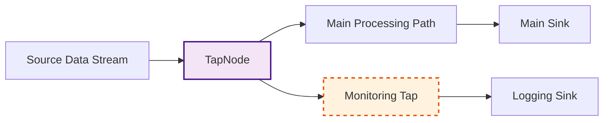

# Tap Nodes

Tap nodes allow you to "tap into" a data stream for non-intrusive monitoring, logging, or side-channel processing without affecting the primary flow of data. Data passing through a Tap node continues uninterrupted to the next node in the main pipeline path, while a copy is sent to a separate processing branch.



*Figure: TapNode pattern showing non-intrusive monitoring where the main data flow continues uninterrupted while a copy is sent to monitoring.*

NPipeline provides the specialized [`TapNode<T>`](src/NPipeline/Nodes/TapNode.cs) for this purpose.

## [`TapNode<T>`](src/NPipeline/Nodes/TapNode.cs): Non-Intrusive Monitoring

The [`TapNode<T>`](src/NPipeline/Nodes/TapNode.cs) is a specialized form of a fan-out node designed for non-intrusive monitoring or logging. It allows you to "tap into" a data stream without affecting the primary flow of data. Data passing through a `TapNode` also continues to the next node in the main pipeline path.

### Constructor

The `TapNode<T>` constructor requires:

* **sink** (`ISinkNode<T>`): The sink node to which tapped data copies will be sent for processing.

```csharp
// Example of creating a TapNode with a custom sink
var loggingSink = new LoggingSink<MyData>();
var tapNode = new TapNode<MyData>(loggingSink);
```

### Example: Logging Intermediate Data

A `TapNode` can be inserted at any point in your pipeline to log or inspect data without altering the data itself or its flow to subsequent processing steps.

```csharp
using NPipeline;
using NPipeline.Nodes;

public sealed class LoggingTapSink<T> : SinkNode<T>
{
    private readonly string _label;
    public LoggingTapSink(string label) => _label = label;

    public async Task ExecuteAsync(IAsyncEnumerable<T> input, CancellationToken cancellationToken = default)
    {
        await foreach (var item in input.WithCancellation(cancellationToken))
        {
            Console.WriteLine($"Tap ({_label}): Logged {item}");
        }
    }
}

public static class Program
{
    public static async Task Main(string[] args)
    {
        var context = PipelineContext.Default;
        var runner = PipelineRunner.Create();
        
        Console.WriteLine("Starting Tap pipeline...");
        await runner.RunAsync<TapPipelineDefinition>(context);
        Console.WriteLine("Tap pipeline finished.");
    }
}

public sealed class TapPipelineDefinition : IPipelineDefinition
{
    public void Define(PipelineBuilder builder, PipelineContext context)
    {
        var sourceHandle = builder.AddSource<InMemorySourceNode<int>, int>("source");
        var tap1Handle = builder.AddTap<LoggingTapSink<int>>("tap1Before");
        var transformHandle = builder.AddTransform<SquareTransform, int, int>("transform");
        var tap2Handle = builder.AddTap<LoggingTapSink<int>>("tap2After");
        var sinkHandle = builder.AddSink<ConsoleSink<int>, int>("sink");

        builder.Connect(sourceHandle, tap1Handle);
        builder.Connect(tap1Handle, transformHandle);
        builder.Connect(transformHandle, tap2Handle);
        builder.Connect(tap2Handle, sinkHandle);
    }
}
```

## Performance Considerations

* **Memory Usage**: Tap nodes maintain separate processing queues for tapped data. Be mindful of memory consumption when tapping high-throughput streams.
* **Backpressure**: If the tapped branch becomes slow, it can create backpressure that affects the main pipeline. Consider using appropriate buffering strategies or async processing in sink implementations.
* **Throughput Impact**: Duplicating and processing a copy of the stream incurs overhead. For high-throughput scenarios, profile your pipeline to ensure the tap doesn't become a bottleneck.
* **Resource Management**: Ensure the tapped sink properly disposes of resources, especially when maintaining connections or file handles.

## Considerations for Tap Nodes

* **Isolation**: Tap nodes provide isolation between the main pipeline and the monitoring/logging branch, allowing them to proceed independently.
* **Error Handling**: Errors in the tapped branch will typically not affect the main pipeline path, allowing for isolated fault tolerance. However, an unhandled error in a [`TapNode`](src/NPipeline/Nodes/TapNode.cs) can still propagate and potentially halt the pipeline if not caught.
* **Observability**: Tap nodes are ideal for observability scenarios where you need to extract metrics, traces, or logs without modifying the core business logic.

Tap nodes are powerful tools for adding non-intrusive monitoring and side-channel processing to your NPipelines without disrupting the main data flow.

## Next Steps

* **[Branch Nodes](branch.md)**: Learn about fan-out patterns for duplicating streams to multiple processing paths.
* **[Advanced Error Handling Patterns](../resilience/error-handling.md#advanced-patterns)**: Learn more about handling errors in complex pipeline structures.
