# Error Handling

Robust error handling is critical for building reliable data pipelines. NPipeline provides several mechanisms to manage errors that occur during data processing, allowing you to gracefully recover, retry operations, or isolate problematic data.

## Default Error Behavior

By default, if an unhandled exception occurs within a node during pipeline execution, the exception will propagate up the call stack, potentially halting the entire pipeline. While this behavior is suitable for critical errors that should stop processing immediately, it's often desirable to handle errors more selectively without bringing down the entire system.

## Types of Errors

Errors in NPipeline can generally be categorized by their source and impact:

* **Node-Specific Errors**: Exceptions originating from logic within a specific `ISourceNode`, `ITransformNode`, or `ISinkNode`.
* **Data-Related Errors**: Issues caused by the data itself (e.g., invalid format, missing values) that a node attempts to process.
* **Infrastructure Errors**: Problems related to external dependencies like databases, APIs, or network connectivity.
* **Cancellation**: While not strictly an "error," a [`CancellationToken`](https://learn.microsoft.com/en-us/dotnet/api/system.threading.cancellationtoken) can signal an intentional halt to processing, which nodes should handle gracefully.

## Core Concepts

NPipeline distinguishes between two levels of error handling:

1. **Node-level Error Handling**: Deals with errors that occur while processing an individual item within a specific node. You define what happens to that item (e.g., skip, retry, redirect to dead-letter).
2. **Pipeline-level Error Handling**: Deals with more severe errors that might affect an entire node's stream or the pipeline's execution flow (e.g., restarting a failing node, failing the entire pipeline).

### Error Handling Flow

```mermaid
flowchart TD
    A[Item Processing Starts] --> B{Error Occurs?}
    B -->|No| C[Continue Processing]
    B -->|Yes| D[Error Handler Invoked]

    D --> E{Error Type}
    E -->|Node-level<br>&#40;Item Error&#41;| F[INodeErrorHandler]
    E -->|Pipeline-level<br>&#40;Stream Error&#41;| G[IPipelineErrorHandler]

    %% Node-level Error Handling
    F --> H{NodeErrorDecision}
    H -->|Retry| I[Retry Item]
    H -->|Skip| J[Discard Item]
    H -->|Redirect| K[Send to Dead Letter]
    H -->|Fail| L[Pipeline Failure]

    I --> M{Max Retries Reached?}
    M -->|No| B
    M -->|Yes| N{Circuit Breaker Active?}
    N -->|No| O[Increment Failure Count]
    N -->|Yes| P[Pipeline Abort]
    O --> Q{Failure Threshold Reached?}
    Q -->|No| H
    Q -->|Yes| P

    %% Pipeline-level Error Handling
    G --> R{PipelineErrorDecision}
    R -->|Restart Node| S[Restart Node Stream]
    R -->|Continue Without Node| T[Bypass Node]
    R -->|Fail Pipeline| L

    S --> U{Max Node Restarts Reached?}
    U -->|No| V[Materialize Stream<br>if Needed]
    U -->|Yes| W{Circuit Breaker Active?}
    W -->|No| X[Increment Failure Count]
    W -->|Yes| P
    X --> Y{Failure Threshold Reached?}
    Y -->|No| R
    Y -->|Yes| P

    V --> Z[Restart Processing]
    Z --> B

    %% Dead Letter Processing
    K --> AA[Dead Letter Sink]
    AA --> AB[Log Error Details]
    AB --> AC[Store Failed Item]
    AC --> C

    %% Outcomes
    C --> AD[Next Item]
    J --> AD
    T --> AE[Continue Pipeline<br>Without Node]
    L --> AF[Pipeline Terminates]
    P --> AF

    %% Styling
    classDef nodeError fill:#ffe6e6,stroke:#ff6666,stroke-width:2px
    classDef pipelineError fill:#e6f3ff,stroke:#66aaff,stroke-width:2px
    classDef decision fill:#fff2cc,stroke:#ffcc00,stroke-width:2px
    classDef outcome fill:#e6ffe6,stroke:#66cc66,stroke-width:2px
    classDef circuitBreaker fill:#ffcccc,stroke:#ff0000,stroke-width:2px

    class F,H,I,J,K,L nodeError
    class G,R,S,T,W pipelineError
    class B,E,M,N,Q,U,W,Y decision
    class C,AD,AE,AF outcome
    class N,P,W circuitBreaker
```



*Figure: Error handling flow in NPipeline showing the decision tree for both node-level and pipeline-level error handling, including retry logic, circuit breaker behavior, and dead letter queue routing.*

## Error Handling Components

### Node-level Error Handling

Node-level error handling allows you to manage errors that occur while processing individual items within a specific node. This granular approach enables you to define what happens to each problematic item without affecting the entire pipeline.

**Learn more:** [Node-level Error Handling](node-error-handling.md)

### Pipeline-level Error Handling

Pipeline-level error handling is designed to manage errors that affect an entire node's stream rather than individual items. These are typically more severe errors that might impact the entire pipeline execution flow, such as infrastructure failures or external service outages.

**Learn more:** [Pipeline-level Error Handling](pipeline-error-handling.md)

### Retry Configuration

Retry configuration allows you to define how the pipeline should respond to transient failures by retrying operations. This is essential for building resilient pipelines that can recover from temporary issues without manual intervention.

**Learn more:** [Retry Configuration](retry-configuration.md)

### Circuit Breaker Configuration

Circuit breaker configuration allows you to implement circuit breaker pattern to prevent constantly failing nodes from continuously consuming resources or causing cascading failures throughout your pipeline. The CircuitBreaker implementation provides:

- **Complete State Machine**: Three states (Closed, Open, Half-Open) with automatic transitions
- **Rolling Window Tracking**: Time-based operation tracking for sophisticated failure analysis
- **Multiple Threshold Types**: ConsecutiveFailures, RollingWindowCount, RollingWindowRate, and Hybrid
- **Automatic Recovery**: Timer-based transition from Open to Half-Open state
- **Thread Safety**: Safe for concurrent pipeline execution

**Learn more:** [Circuit Breaker Configuration](circuit-breaker-configuration.md)

### Dead-Letter Queues

Dead-letter queues provide a mechanism to capture and store items that repeatedly fail processing, allowing you to analyze and potentially reprocess problematic data outside the main pipeline flow.

**Learn more:** [Dead-Letter Queues](dead-letter-queues.md)

## Basic Error Handling Configuration

To get started with error handling, you can configure basic error handling directly in your pipeline definition:

```csharp
using NPipeline;
using NPipeline.ErrorHandling;
using NPipeline.Pipeline;

// Example 1: Basic error handling with default retry options
public sealed class ErrorHandlingPipelineDefinition : IPipelineDefinition
{
    public void Define(PipelineBuilder builder, PipelineContext context)
    {
        var sourceHandle = builder.AddSource<DataSource, string>();
        var transformHandle = builder.AddTransform<DataTransform, string, string>();
        var sinkHandle = builder.AddSink<DataSink, string>();

        builder.Connect(sourceHandle, transformHandle);
        builder.Connect(transformHandle, sinkHandle);

        // Configure retry options using PipelineRetryOptions
        builder.WithRetryOptions(new PipelineRetryOptions(
            MaxItemRetries: 3,
            MaxNodeRestartAttempts: 2,
            MaxSequentialNodeAttempts: 5
        ));
    }
}

public static class Program
{
    public static async Task Main(string[] args)
    {
        var runner = new PipelineRunner();
        var context = PipelineContext.Default;

        var pipeline = PipelineBuilder.Create<ErrorHandlingPipelineDefinition>();
        await runner.RunAsync<ErrorHandlingPipelineDefinition>(context);
    }
}
```

## Complete Example: Production-Ready Error Handling

Here's a complete example that combines all error handling concepts:

```csharp
using NPipeline;
using NPipeline.ErrorHandling;
using NPipeline.Pipeline;

// 1. Define custom error handlers
public class ProductionNodeErrorHandler : INodeErrorHandler<ITransformNode<string, string>, string>
{
    private readonly ILogger _logger;
    private readonly IMetrics _metrics;

    public ProductionNodeErrorHandler(ILogger logger, IMetrics metrics)
    {
        _logger = logger;
        _metrics = metrics;
    }

    public Task<NodeErrorDecision> HandleAsync(
        ITransformNode<string, string> node,
        string failedItem,
        Exception error,
        PipelineContext context,
        CancellationToken cancellationToken)
    {
        _metrics.Increment("node_errors", new[] { new KeyValuePair<string, object>("node_type", node.GetType().Name) });
        _logger.LogError(error, "Error processing item in node {NodeName}", node.Name);

        return error switch
        {
            ValidationException => Task.FromResult(NodeErrorDecision.DeadLetter),
            TimeoutException => Task.FromResult(NodeErrorDecision.Retry),
            HttpRequestException => Task.FromResult(NodeErrorDecision.Retry),
            _ => Task.FromResult(NodeErrorDecision.Skip)
        };
    }
}

public class ProductionPipelineErrorHandler : IPipelineErrorHandler
{
    private readonly ILogger _logger;
    private readonly Dictionary<string, int> _failureCounts = new();

    public ProductionPipelineErrorHandler(ILogger logger)
    {
        _logger = logger;
    }

    public Task<PipelineErrorDecision> HandleNodeFailureAsync(
        string nodeId,
        Exception error,
        PipelineContext context,
        CancellationToken cancellationToken)
    {
        _failureCounts.TryGetValue(nodeId, out var count);
        _failureCounts[nodeId] = count + 1;

        _logger.LogError(error, "Node {NodeId} failed (attempt {Attempt})", nodeId, _failureCounts[nodeId]);

        return error switch
        {
            OutOfMemoryException => Task.FromResult(PipelineErrorDecision.FailPipeline),
            _ when _failureCounts[nodeId] < 3 => Task.FromResult(PipelineErrorDecision.RestartNode),
            _ => Task.FromResult(PipelineErrorDecision.ContinueWithoutNode)
        };
    }
}

// 2. Configure the pipeline with comprehensive error handling
public sealed class ProductionPipelineDefinition : IPipelineDefinition
{
    public void Define(PipelineBuilder builder, PipelineContext context)
    {
        var sourceHandle = builder.AddSource<DataSource, string>();
        var transformHandle = builder.AddTransform<DataTransform, string, string>();
        var sinkHandle = builder.AddSink<DataSink, string>();

        builder.Connect(sourceHandle, transformHandle);
        builder.Connect(transformHandle, sinkHandle);

        // Configure retry options
        builder.WithRetryOptions(new PipelineRetryOptions(
            MaxItemRetries: 3,
            MaxNodeRestartAttempts: 2,
            MaxSequentialNodeAttempts: 5
        ));
    }
}

public static class Program
{
    public static async Task Main(string[] args)
    {
        var runner = new PipelineRunner();

        // Configure retry options at context level
        var retryOptions = new PipelineRetryOptions(
            MaxItemRetries: 3,
            MaxNodeRestartAttempts: 2,
            MaxSequentialNodeAttempts: 5
        );

        var context = PipelineContext.WithRetry(retryOptions);

        var pipeline = PipelineBuilder.Create<ProductionPipelineDefinition>();
        
        // Configure error handlers through the pipeline runner or register via dependency injection
        // The PipelineErrorHandler can be registered in the service container:
        var serviceProvider = new ServiceCollection()
            .AddSingleton<IPipelineErrorHandler, ProductionPipelineErrorHandler>()
            .AddSingleton<INodeErrorHandler<ITransformNode<string, string>, string>, ProductionNodeErrorHandler>()
            .AddSingleton<IDeadLetterSink, FileDeadLetterSink>()
            .BuildServiceProvider();

        var runner = new PipelineRunner();
        await runner.RunAsync<ProductionPipelineDefinition>(context);
    }
}

## Retry Options Precedence

NPipeline follows a clear precedence order when determining which retry options to use:

1. **Node-specific options**: Options set directly on a specific node using `WithRetryOptions(nodeHandle, options)`
2. **Graph-level options**: Options set at the pipeline level using `builder.WithRetryOptions(options)`
3. **Context-level options**: Options provided through `PipelineContext(retryOptions: options)`

This hierarchy allows for fine-grained control where you can:
* Override retry behavior for specific nodes that need special handling
* Set default behavior for the entire pipeline
* Provide runtime options through the context

## Propagating Contextual Information

The [`PipelineContext`](../../../src/NPipeline/PipelineContext.cs) can be invaluable for error handling. You can store error-specific information, such as correlation IDs, loggers, or even error reporting services, within the context, making them accessible to any node that needs to handle or report an error.

## :warning:  Dependency Chain Requirements

For resilience features like `PipelineErrorDecision.RestartNode` to work properly, you must understand the dependency chain between components. See [Dependency Chains](../resilience/dependency-chains.md) in the resilience section for detailed prerequisites.

## :information_source: See Also

* **[Resilience Overview](../resilience/index.md)**: Comprehensive guide to building fault-tolerant pipelines
* **[Dependency Chains](../resilience/dependency-chains.md)**: Understanding critical prerequisite relationships for resilience features
* **[Configuration Guide](../resilience/configuration-guide.md)**: Practical implementation guidance with code examples
* **[Troubleshooting](../resilience/troubleshooting.md)**: Diagnose and resolve common resilience issues
* **[Error Codes Reference](../../reference/error-codes.md)**: Complete reference for NPipeline error codes and their solutions

## :link: Related Topics

* **[Pipeline Execution Index](index.md)**: Return to the pipeline execution overview.

