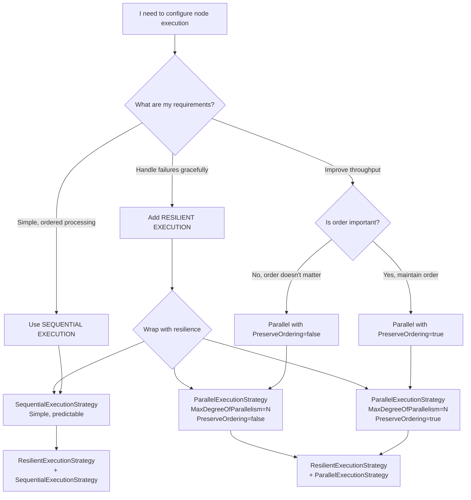
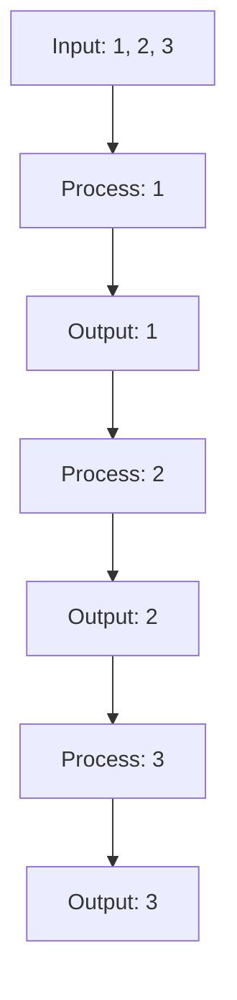
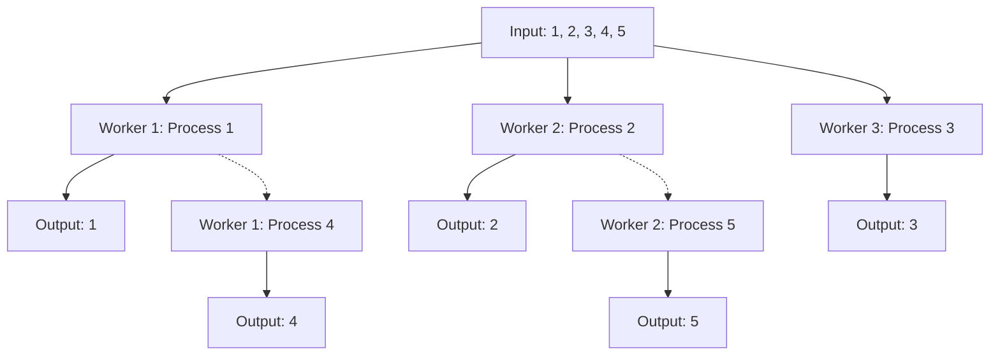
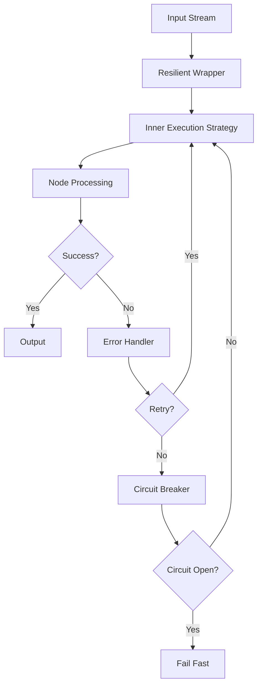

# Execution Strategies

## Prerequisites

Before understanding execution strategies, you should be familiar with:
- [Core Concepts Overview](../index.md) - Basic NPipeline concepts and terminology
- [Nodes Overview](../nodes/index.md) - Understanding how nodes process data
- [PipelineBuilder](../pipelinebuilder.md) - How to apply execution strategies to nodes

> :information_source: **Documentation Scope**
> This guide covers **all execution strategies** - sequential, parallel, and resilient. If you need to add **resilience capabilities** (error handling, retries, node restart) to a strategy, see [Resilient Execution Strategy](../resilience/execution-with-resilience.md).

Execution strategies define how a node processes its input stream and produces its output. They are crucial for controlling parallelism, managing backpressure, and implementing resilience patterns within your NPipeline. By default, nodes execute sequentially, but you can configure them to run in parallel or with built-in fault tolerance.

Execution strategies primarily apply to [Transform Nodes](../nodes/index.md#transform-nodes) and custom nodes that implement `ITransformNode`.

## `IExecutionStrategy`

The core interface for all execution strategies is [`IExecutionStrategy`](../../../src/NPipeline/Abstractions/Execution/IExecutionStrategy.cs). It defines a single method:

```csharp
public interface IExecutionStrategy
{
    Task<IDataPipe<TOut>> ExecuteAsync<TIn, TOut>(
        IDataPipe<TIn> input,
        ITransformNode<TIn, TOut> node,
        PipelineContext context,
        IPipelineActivity parentActivity,
        CancellationToken cancellationToken);
}
```

This method takes an input data pipe, the transform node itself, the pipeline context, a parent tracing activity, and a cancellation token, returning an output data pipe.

## Applying an Execution Strategy

You apply an execution strategy to a node using fluent extension methods on the node handle. This provides a chainable, expressive API:

```csharp
var transform = builder
    .AddTransform<MyTransform, int, string>()
    .WithExecutionStrategy(builder, new ParallelExecutionStrategy(maxDegreeOfParallelism: 4));
```

For parallel strategies in the Extensions.Parallelism package, use specialized convenience methods:

```csharp
var transform = builder
    .AddTransform<MyTransform, int, string>()
    .WithBlockingParallelism(builder, maxDegreeOfParallelism: 4);  // Blocks/applies backpressure
```

## Choosing the Right Execution Strategy



This decision tree helps you select the appropriate execution strategy based on your specific requirements:

* **Sequential Execution** for simple, ordered processing when parallelism isn't needed
* **Parallel Execution** when you need to improve throughput:
  * With `PreserveOrdering=true` when output order must match input order
  * With `PreserveOrdering=false` for maximum throughput when order doesn't matter
* **Resilient Execution** can be wrapped around any strategy to add error handling, retries, and circuit breaker capabilities

## Built-in Execution Strategies

NPipeline provides several out-of-the-box execution strategies:

### 1. `SequentialExecutionStrategy`



*Figure: Sequential execution processes items one by one in order.*

This is the default execution strategy. Items are processed one by one, in the order they arrive. It's simple, predictable, and suitable for scenarios where order is critical and parallelism is not required or would introduce unnecessary complexity.

```csharp
// Explicitly applying the default strategy (usually the default, so not necessary)
var transform = builder
    .AddTransform<MyTransform, int, string>()
    .WithExecutionStrategy(builder, new SequentialExecutionStrategy());
```

### 2. `ParallelExecutionStrategy`



*Figure: Parallel execution distributes items across multiple workers.*

The `ParallelExecutionStrategy` processes items concurrently using TPL Dataflow. This is ideal for CPU-bound or I/O-bound operations where items can be processed independently to improve throughput.

This strategy is part of the `NPipeline.Extensions.Parallelism` NuGet package.

#### Configuration Options (`ParallelOptions`)

When using `ParallelExecutionStrategy`, you can configure its behavior using `ParallelOptions`:

* **`MaxDegreeOfParallelism`**: The maximum number of items to process concurrently. Defaults to `Environment.ProcessorCount`.
* **`MaxQueueLength`**: The maximum number of input items to buffer. This controls backpressure.
* **`QueuePolicy`**: Defines how to handle new items when `MaxQueueLength` is reached:
  * `BoundedQueuePolicy.Block` (default): The pipeline will pause upstream to wait for space in the queue.
  * `BoundedQueuePolicy.DropNewest`: New incoming items are dropped when the queue is full.
  * `BoundedQueuePolicy.DropOldest`: The oldest items in the queue are dropped to make space for new ones.
* **`PreserveOrdering`**: If `true`, output items are emitted in the same order as their corresponding input items. If `false`, items are emitted as soon as they are processed, potentially out of order, which can increase throughput. Defaults to `true`.
* **`OutputBufferCapacity`**: The maximum number of processed items to buffer before sending them downstream. This can help smooth out bursts in processing.

#### Example: Parallel Processing with Bounded Queue

```csharp
using NPipeline;
using NPipeline.Pipeline;
using NPipeline.Extensions.Parallelism;
using NPipeline.Extensions.Testing;

// A simple transform that simulates some work and potentially reorders items
public class AsyncTransform : TransformNode<int, string>
{
    private readonly int _delayMs;

    public AsyncTransform(int delayMs) => _delayMs = delayMs;

    public override async Task<string> ExecuteAsync(int item, PipelineContext context, CancellationToken cancellationToken)
    {
        await Task.Delay(_delayMs, cancellationToken);
        return $"Processed:{item}";
    }
}

// Pipeline definition with parameterless constructor
public sealed class ParallelPipelineDefinition : IPipelineDefinition
{
    public void Define(PipelineBuilder builder, PipelineContext context)
    {
        var sourceHandle = builder.AddSource<InMemorySourceNode<int>, int>("source");
        var transformHandle = builder
            .AddTransform<AsyncTransform, int, string>("asyncProcessor")
            .WithExecutionStrategy(builder, new ParallelExecutionStrategy());
        var sinkHandle = builder.AddSink<ConsoleSink<string>, string>("sink");

        builder.Connect(sourceHandle, transformHandle);
        builder.Connect(transformHandle, sinkHandle);

        builder.SetNodeExecutionOption(transformHandle.Id, new ParallelOptions
        {
            MaxDegreeOfParallelism = 4,      // Process up to 4 items concurrently
            MaxQueueLength = 2,              // Allow up to 2 items in the input buffer
            QueuePolicy = BoundedQueuePolicy.Block, // Block if the queue is full
            PreserveOrdering = true          // Ensure output order matches input order
        });
    }
}

public static class Program
{
    public static async Task Main(string[] args)
    {
        var runner = new PipelineRunner();
        var context = PipelineContext.Default;

        // Configure parallel execution for the 'asyncProcessor' node
        await runner.RunAsync<ParallelPipelineDefinition>(context);
    }
}

public sealed class ParallelPipelineDefinition : IPipelineDefinition
{
    public void Define(PipelineBuilder builder, PipelineContext context)
    {
        var sourceHandle = builder.AddSource<InMemorySourceNode<int>, int>("source");
        var transformHandle = builder
            .AddTransform<AsyncTransform, int, string>("asyncProcessor")
            .WithExecutionStrategy(builder, new ParallelExecutionStrategy());
        var sinkHandle = builder.AddSink<ConsoleSink<string>, string>("sink");

        builder.Connect(sourceHandle, transformHandle);
        builder.Connect(transformHandle, sinkHandle);

        builder.SetNodeExecutionOption(transformHandle.Id, new ParallelOptions
        {
            MaxDegreeOfParallelism = 4,      // Process up to 4 items concurrently
            MaxQueueLength = 2,              // Allow up to 2 items in the input buffer
            QueuePolicy = BoundedQueuePolicy.Block, // Block if the queue is full
            PreserveOrdering = true          // Ensure output order matches input order
        });
    }
}
```

#### Example: Non-Ordered Parallel Execution for Maximum Throughput

When order preservation is not required, setting `PreserveOrdering` to `false` can significantly increase throughput, especially when processing times vary:

```csharp
using NPipeline;
using NPipeline.Pipeline;
using NPipeline.Extensions.Parallelism;
using NPipeline.Extensions.Testing;

// A transform with variable processing time
public class VariableTimeTransform : TransformNode<int, string>
{
    private readonly Random _random = new();

    public override async Task<string> ExecuteAsync(int item, PipelineContext context, CancellationToken cancellationToken)
    {
        // Simulate variable processing time (50ms to 200ms)
        var delay = _random.Next(50, 200);
        await Task.Delay(delay, cancellationToken);

        return $"Item:{item} (Processed in {delay}ms)";
    }
}

// Pipeline definition with fluent configuration
public sealed class NonOrderedParallelPipelineDefinition : IPipelineDefinition
{
    public void Define(PipelineBuilder builder, PipelineContext context)
    {
        var sourceHandle = builder.AddSource<InMemorySourceNode<int>, int>("source");
        var transformHandle = builder
            .AddTransform<VariableTimeTransform, int, string>("variableProcessor")
            .WithExecutionStrategy(builder, new ParallelExecutionStrategy());
        var sinkHandle = builder.AddSink<ConsoleSink<string>, string>("sink");

        builder.Connect(sourceHandle, transformHandle);
        builder.Connect(transformHandle, sinkHandle);

        builder.SetNodeExecutionOption(transformHandle.Id, new ParallelOptions
        {
            MaxDegreeOfParallelism = 8,      // Higher degree of parallelism
            MaxQueueLength = 50,             // Larger input buffer
            QueuePolicy = BoundedQueuePolicy.Block,
            PreserveOrdering = false         // Disable ordering for maximum throughput
        });
    }
}
```

In this example, items are processed as soon as they complete, without waiting for slower items. This approach:

* **Increases throughput**: Items are emitted immediately upon completion
* **Reduces memory usage**: No need to buffer items to maintain order
* **Improves latency**: Faster items don't wait for slower ones
* **Results in unordered output**: The output sequence may not match the input sequence

#### When to Use Non-Ordered Execution

Consider `PreserveOrdering = false` when:

* **Downstream processing is order-agnostic**: Your operations don't depend on input sequence
* **Performance is critical**: Maximizing throughput is more important than order
* **Processing times are unpredictable**: When some items take significantly longer than others
* **You're aggregating data**: When collecting statistics or metrics where order doesn't matter

### 3. `ResilientExecutionStrategy`



*Figure: Resilient execution provides error handling, retries, and circuit breaker functionality.*

The `ResilientExecutionStrategy` wraps another execution strategy (e.g., `SequentialExecutionStrategy` or `ParallelExecutionStrategy`) to provide robust error handling capabilities. It integrates with NPipeline's [error handling mechanisms](error-handling) to implement:

* **Node Restart**: Automatically re-executes a node if its underlying stream fails.
* **Circuit Breaker**: Prevents repeated failures by temporarily stopping execution if a failure threshold is met.
* **Retry Logic**: Retries individual item processing within a node.
* **Materialization**: Buffers input items to allow for efficient restarts without re-reading from the original source.

This strategy is part of core `NPipeline` library.

#### Materialization Behavior

When using `ResilientExecutionStrategy`, input items are materialized (buffered) to enable node restarts. This behavior is controlled by the `MaxMaterializedItems` parameter in `PipelineRetryOptions`:

* **When `MaxMaterializedItems` is null** (default): Unbounded materialization - all items are buffered
* **When `MaxMaterializedItems` has a value**: Limited materialization - only the specified number of items are buffered, after which new items replace oldest ones

Materialization ensures that if a node fails and needs to restart, the pipeline can replay items from the buffer instead of re-reading from the original source, which might not support replay.

#### Example: Resilient Parallel Execution

```csharp
using NPipeline;
using NPipeline.ErrorHandling;
using NPipeline.Execution.Strategies;
using NPipeline.Extensions.Parallelism;
using NPipeline.Extensions.Testing;
using NPipeline.Pipeline;

// A transform that sometimes fails
public class FlakyTransform : TransformNode<int, string>
{
    private int _failCount = 0;

    public override Task<string> ExecuteAsync(int item, PipelineContext context, CancellationToken cancellationToken)
    {
        if (item % 3 == 0 && _failCount < 2) // Fail for multiples of 3, up to 2 times
        {
            _failCount++;
            throw new InvalidOperationException($"Simulated failure for item {item}");
        }
        return Task.FromResult($"Processed:{item} (Attempt: {_failCount + 1})");
    }
}

// Pipeline definition with parameterless constructor
public sealed class ResilientPipelineDefinition : IPipelineDefinition
{
    public void Define(PipelineBuilder builder, PipelineContext context)
    {
        var sourceHandle = builder.AddSource<InMemorySourceNode<int>, int>("source");
        var transformHandle = builder.AddTransform<FlakyTransform, int, string>("flakyProcessor");
        var sinkHandle = builder.AddSink<ConsoleSink<string>, string>("sink");

        builder.Connect(sourceHandle, transformHandle);
        builder.Connect(transformHandle, sinkHandle);
    }
}

public static class Program
{
    public static async Task Main(string[] args)
    {
        var runner = new PipelineRunner();

        // Configure retry options with materialization limit
        var retryOptions = new PipelineRetryOptions(
            MaxItemRetries: 3,
            MaxNodeRestartAttempts: 2,
            MaxSequentialNodeAttempts: 5,
            MaxMaterializedItems: 1000 // Limit materialization to 1000 items
        );

        var context = PipelineContext.WithRetry(retryOptions);
        context.AddPipelineErrorHandler<DefaultPipelineErrorHandler>();

        await runner.RunAsync<ResilientPipelineDefinition>(context);
    }
}

public sealed class ResilientPipelineDefinitionWithConfiguration : IPipelineDefinition
{
    public void Define(PipelineBuilder builder, PipelineContext context)
    {
        var sourceHandle = builder.AddSource<InMemorySourceNode<int>, int>("source");
        var transformHandle = builder
            .AddTransform<FlakyTransform, int, string>("flakyProcessor")
            .WithExecutionStrategy(builder,
                new ResilientExecutionStrategy(new ParallelExecutionStrategy(maxDegreeOfParallelism: 2)));
        var sinkHandle = builder.AddSink<ConsoleSink<string>, string>("sink");

        builder.Connect(sourceHandle, transformHandle);
        builder.Connect(transformHandle, sinkHandle);
    }
}

        await runner.RunAsync<ResilientPipelineDefinition>(context);
    }
}
```

In this example, the `flakyProcessor` node will attempt to process items in parallel. If an item fails, the `ResilientExecutionStrategy` will consult the pipeline's error handler to decide if it should retry processing that item or even restart the entire node's stream. The circuit breaker (if configured in `PipelineRetryOptions`) would prevent excessive retries after too many consecutive failures.

### 3. Adding Resilience to Strategies
For any of the above strategies, you can wrap them with resilient execution 
to add error handling, retries, and circuit breaker capabilities.

**See:** [Execution with Resilience](../resilience/execution-with-resilience.md) 
for comprehensive guide on wrapping strategies with resilient execution.

## Comprehensive Documentation

For detailed information about resilience patterns, materialization requirements, and dependency chains, see the [Resilience section](../resilience/index.md) which covers fault-tolerant execution strategies, buffering for replay functionality, critical prerequisite relationships, and configuration guidance for building robust pipelines.

## See Also

* **[Resilience Overview](../resilience/index.md)**: Comprehensive guide to building fault-tolerant pipelines
* **[Resilient Execution Strategy](../resilience/execution-with-resilience.md)**: In-depth coverage of ResilientExecutionStrategy
* **[Materialization and Buffering](../resilience/materialization-and-buffering.md)**: Understanding buffer requirements for resilience
* **[Dependency Chains](../resilience/dependency-chains.md)**: Critical prerequisite relationships for resilience features
* **[Parallelism Extension](../../extensions/parallelism.md)**: Advanced parallel execution strategies
* **[Error Handling Guide](../resilience/error-handling-guide.md)**: Comprehensive error handling patterns
* **[Architecture: Execution Flow](../../architecture/execution-flow.md)**: Deep dive into how execution strategies work internally
* **[Performance Characteristics](../../architecture/performance-characteristics.md)**: Understanding performance implications of different strategies

## Next Steps

* **[Resilient Execution Strategy](../resilience/execution-with-resilience.md)**: Learn how to add error handling, retries, and circuit breaker capabilities to any strategy
* **[Error Handling Guide](../resilience/error-handling-guide.md)**: Dive deeper into how NPipeline handles errors, retries, and dead-letter queues
* **[Parallelism Extension](../../extensions/parallelism.md)**: Explore advanced parallel execution patterns
* **[Architecture: Execution Flow](../../architecture/execution-flow.md)**: Understand how pipelines execute data at a deeper level

