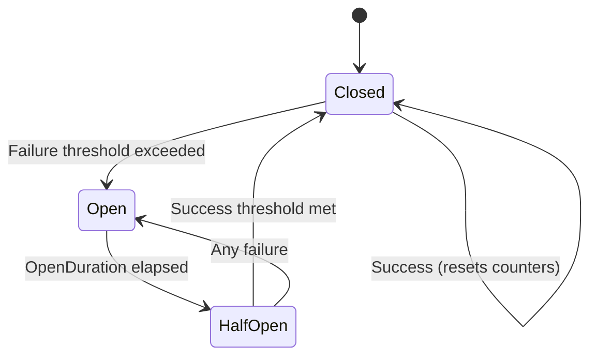

# Circuit Breaker Configuration

Circuit breaker configuration in NPipeline allows you to implement the circuit breaker pattern to prevent constantly failing nodes from continuously consuming resources or causing cascading failures throughout your pipeline.

The enhanced CircuitBreaker implementation provides:

- **State Machine**: Complete implementation with Closed, Open, and Half-Open states
- **Rolling Window**: Time-based operation tracking for sophisticated failure analysis
- **Multiple Threshold Types**: ConsecutiveFailures, RollingWindowCount, RollingWindowRate, and Hybrid
- **Automatic Recovery**: Timer-based transition from Open to Half-Open state
- **Thread Safety**: Safe for concurrent pipeline execution
- **Backward Compatibility**: Existing configurations continue to work

## Overview

The circuit breaker pattern is a design pattern used in software development to detect failures and encapsulate the logic of preventing a failure from constantly recurring. In NPipeline, this helps maintain system stability by temporarily stopping attempts to execute nodes that are experiencing persistent failures.

## PipelineCircuitBreakerOptions

The [`PipelineCircuitBreakerOptions`](../../../src/NPipeline/Configuration/PipelineCircuitBreakerOptions.cs) record allows you to configure a circuit breaker pattern with enhanced functionality.

```csharp
public sealed record PipelineCircuitBreakerOptions(
    int FailureThreshold,
    TimeSpan OpenDuration,
    TimeSpan SamplingWindow,
    bool Enabled = true,
    CircuitBreakerThresholdType ThresholdType = CircuitBreakerThresholdType.ConsecutiveFailures,
    double FailureRateThreshold = 0.5,
    int HalfOpenSuccessThreshold = 1,
    int HalfOpenMaxAttempts = 5,
    bool TrackOperationsInWindow = true)
{
    public static PipelineCircuitBreakerOptions Disabled { get; } = new(int.MaxValue, TimeSpan.Zero, TimeSpan.Zero, false);
    public static PipelineCircuitBreakerOptions Default { get; } = new(5, TimeSpan.FromMinutes(1), TimeSpan.FromMinutes(5));
    
    // Backward-compatible constructor
    public PipelineCircuitBreakerOptions(int failureThreshold, TimeSpan openDuration, TimeSpan samplingWindow, bool enabled)
        : this(failureThreshold, openDuration, samplingWindow, enabled, CircuitBreakerThresholdType.ConsecutiveFailures, 0.5, 1, 5, true)
    {
    }
}

/// <summary>
///     Defines the type of failure threshold used for circuit breaking.
/// </summary>
public enum CircuitBreakerThresholdType
{
    /// <summary>
    ///     Uses consecutive failure count (default behavior).
    /// </summary>
    ConsecutiveFailures,

    /// <summary>
    ///     Uses failure count within the sampling window.
    /// </summary>
    RollingWindowCount,

    /// <summary>
    ///     Uses failure rate within the sampling window.
    /// </summary>
    RollingWindowRate,

    /// <summary>
    ///     Uses both count and rate thresholds.
    /// </summary>
    Hybrid
}

/// <summary>
///     Exception thrown when the circuit breaker is open and blocks execution.
/// </summary>
public sealed class CircuitBreakerOpenException : PipelineException
{
    public CircuitBreakerOpenException() : base("Circuit breaker is open and blocking execution.")
    {
        ErrorCode = "CIRCUIT_BREAKER_OPEN";
    }

    public CircuitBreakerOpenException(string message) : base(message)
    {
        ErrorCode = "CIRCUIT_BREAKER_OPEN";
    }

    public CircuitBreakerOpenException(string message, Exception innerException) : base(message, innerException)
    {
        ErrorCode = "CIRCUIT_BREAKER_OPEN";
    }

    /// <summary>
    ///     Gets the error code associated with this exception.
    /// </summary>
    public string ErrorCode { get; }
}
```

### Configuration Parameters

* **`FailureThreshold`**: The threshold value used for circuit breaking (interpretation depends on ThresholdType).
* **`OpenDuration`**: How long the breaker remains open before transitioning to Half-Open state.
* **`SamplingWindow`**: Time window for rolling window failure tracking.
* **`Enabled`**: Whether the circuit breaker is active.
* **`ThresholdType`**: Type of failure threshold to use (ConsecutiveFailures, RollingWindowCount, RollingWindowRate, Hybrid).
* **`FailureRateThreshold`**: Failure rate threshold (0.0-1.0) when using RollingWindowRate or Hybrid threshold types.
* **`HalfOpenSuccessThreshold`**: Number of consecutive successes required in Half-Open state to transition to Closed.
* **`HalfOpenMaxAttempts`**: Maximum number of operation attempts allowed in Half-Open state.
* **`TrackOperationsInWindow`**: Whether to track operations in the rolling window for statistics.

## Threshold Types

### ConsecutiveFailures (Default)

Tracks consecutive failures without considering time. This is the original behavior and maintains backward compatibility.

```csharp
var options = new PipelineCircuitBreakerOptions(
    failureThreshold: 5,
    openDuration: TimeSpan.FromMinutes(1),
    samplingWindow: TimeSpan.FromMinutes(5),
    thresholdType: CircuitBreakerThresholdType.ConsecutiveFailures
);
```

### RollingWindowCount

Tracks the total number of failures within a time window, regardless of whether they're consecutive.

```csharp
var options = new PipelineCircuitBreakerOptions(
    failureThreshold: 10,
    openDuration: TimeSpan.FromMinutes(2),
    samplingWindow: TimeSpan.FromMinutes(5),
    thresholdType: CircuitBreakerThresholdType.RollingWindowCount
);
```

### RollingWindowRate

Tracks the failure rate (failures/total operations) within a time window.

```csharp
var options = new PipelineCircuitBreakerOptions(
    failureThreshold: 5, // Minimum operations before rate is considered
    openDuration: TimeSpan.FromMinutes(2),
    samplingWindow: TimeSpan.FromMinutes(5),
    thresholdType: CircuitBreakerThresholdType.RollingWindowRate,
    failureRateThreshold: 0.3 // 30% failure rate
);
```

### Hybrid

Uses both count and rate thresholds - trips if either threshold is exceeded.

```csharp
var options = new PipelineCircuitBreakerOptions(
    failureThreshold: 5,
    openDuration: TimeSpan.FromMinutes(2),
    samplingWindow: TimeSpan.FromMinutes(5),
    thresholdType: CircuitBreakerThresholdType.Hybrid,
    failureRateThreshold: 0.3 // 30% failure rate
);
```

## Circuit Breaker State Machine

The circuit breaker has three main states with automatic transitions:



### State Descriptions

1. **Closed**: The circuit breaker allows operations to proceed normally. It tracks failures based on the configured threshold type and trips when the threshold is reached.

2. **Open**: The circuit breaker has tripped and prevents operations from proceeding. After the OpenDuration expires, it automatically transitions to Half-Open state.

3. **Half-Open**: The circuit breaker allows a limited number of operations to test if the underlying issue has been resolved. If enough operations succeed, it transitions to Closed. If any operation fails, it immediately returns to Open.

## Basic Circuit Breaker Configuration

You configure the circuit breaker via the `PipelineCircuitBreakerOptions` in `PipelineRetryOptions`:

```csharp
public class BasicCircuitBreakerPipelineDefinition : IPipelineDefinition
{
    public void Define(PipelineBuilder builder, PipelineContext context)
    {
        var sourceHandle = builder.AddSource<DataSource, string>("source");
        var transformHandle = builder.AddTransform<DataTransform, string, string>("transform");
        var sinkHandle = builder.AddSink<DataSink, string>("sink");

        builder.Connect(sourceHandle, transformHandle);
        builder.Connect(transformHandle, sinkHandle);
    }
}

// Configure the circuit breaker via PipelineRetryOptions:
var retryOptions = new PipelineRetryOptions(
    MaxItemRetries: 3,
    MaxNodeRestartAttempts: 2,
    MaxSequentialNodeAttempts: 5,
    MaxMaterializedItems: 1000,
    CircuitBreakerOptions: new PipelineCircuitBreakerOptions(
        failureThreshold: 5, // Trip after 5 consecutive failures
        openDuration: TimeSpan.FromMinutes(1),
        samplingWindow: TimeSpan.FromMinutes(5),
        thresholdType: CircuitBreakerThresholdType.ConsecutiveFailures
    )
);

var context = PipelineContext.WithRetry(retryOptions);
var runner = PipelineRunner.Create();
await runner.RunAsync<BasicCircuitBreakerPipelineDefinition>(context);
```

## Advanced Configuration Examples

### High-Tolerance Circuit Breaker

For non-critical nodes where you want more resilience:

```csharp
var tolerantOptions = new PipelineCircuitBreakerOptions(
    failureThreshold: 20,
    openDuration: TimeSpan.FromMinutes(5),
    samplingWindow: TimeSpan.FromMinutes(10),
    thresholdType: CircuitBreakerThresholdType.Hybrid,
    failureRateThreshold: 0.4, // 40% failure rate
    halfOpenSuccessThreshold: 3, // Require 3 consecutive successes
    halfOpenMaxAttempts: 10 // Allow up to 10 attempts in Half-Open
);
```

### Sensitive Circuit Breaker

For critical nodes where you want quick failure detection:

```csharp
var sensitiveOptions = new PipelineCircuitBreakerOptions(
    failureThreshold: 3,
    openDuration: TimeSpan.FromSeconds(30),
    samplingWindow: TimeSpan.FromMinutes(1),
    thresholdType: CircuitBreakerThresholdType.ConsecutiveFailures,
    halfOpenSuccessThreshold: 1,
    halfOpenMaxAttempts: 2
);
```

### Rate-Based Circuit Breaker

For nodes with high throughput where rate is more important than count:

```csharp
var rateBasedOptions = new PipelineCircuitBreakerOptions(
    failureThreshold: 100, // Minimum operations before rate is considered
    openDuration: TimeSpan.FromMinutes(2),
    samplingWindow: TimeSpan.FromMinutes(5),
    thresholdType: CircuitBreakerThresholdType.RollingWindowRate,
    failureRateThreshold: 0.1 // 10% failure rate
);
```

## Integration with ResilientExecutionStrategy

The CircuitBreaker is automatically integrated with the ResilientExecutionStrategy:

```csharp
// The circuit breaker is automatically used when ResilientExecutionStrategy is enabled
// and CircuitBreakerOptions are configured in the retry options

var resilientOptions = new PipelineRetryOptions(
    MaxItemRetries: 3,
    MaxNodeRestartAttempts: 5,
    CircuitBreakerOptions: new PipelineCircuitBreakerOptions(
        failureThreshold: 3,
        openDuration: TimeSpan.FromMinutes(1),
        samplingWindow: TimeSpan.FromMinutes(5),
        thresholdType: CircuitBreakerThresholdType.RollingWindowRate,
        failureRateThreshold: 0.2
    )
);

// The ResilientExecutionStrategy will automatically:
// 1. Track operations in the rolling window
// 2. Check circuit breaker state before each operation
// 3. Record successes and failures
// 4. Handle state transitions automatically
// 5. Throw CircuitBreakerOpenException when the circuit is open
```

## Monitoring Circuit Breaker Statistics

The CircuitBreaker provides detailed statistics that can be accessed for monitoring:

```csharp
// The CircuitBreakerManager tracks circuit breakers for each node
// You can access statistics through the circuit breaker instance

WindowStatistics stats = circuitBreaker.GetStatistics();
// stats.TotalOperations - Total operations in the window
// stats.FailureCount - Number of failed operations
// stats.SuccessCount - Number of successful operations
// stats.FailureRate - Failure rate (0.0 to 1.0)
```

## Best Practices

1. **Choose the right threshold type**: 
   - Use `ConsecutiveFailures` for simple scenarios
   - Use `RollingWindowCount` for high-volume operations
   - Use `RollingWindowRate` for rate-sensitive scenarios
   - Use `Hybrid` for comprehensive protection

2. **Set appropriate sampling windows**: 
   - Shorter windows (1-5 minutes) for quick detection
   - Longer windows (10-30 minutes) for stability in volatile environments

3. **Configure Half-Open parameters carefully**:
   - Higher `HalfOpenSuccessThreshold` for more conservative recovery
   - Lower `HalfOpenMaxAttempts` to prevent flooding recovering services

4. **Monitor circuit breaker state transitions**: Track when circuit breakers open and close to identify systemic issues.

5. **Use different thresholds for different nodes**: Critical nodes might have lower thresholds than non-critical ones.

6. **Implement alerting**: Set up alerts when circuit breakers open to notify operations teams.

7. **Consider graceful degradation**: Design your pipeline to continue functioning even when some nodes are isolated by circuit breakers.

8. **Test circuit breaker behavior**: Include circuit breaker scenarios in your testing to ensure they work as expected.

## :warning: Troubleshooting Circuit Breakers

If you're experiencing issues with circuit breaker behavior, such as unexpected trips or failure to open, see the [Troubleshooting guide](../resilience/troubleshooting.md) in the resilience section for common issues and solutions.

## See Also

* **[Resilience Overview](../resilience/index.md)**: Comprehensive guide to building fault-tolerant pipelines
* **[Troubleshooting](../resilience/troubleshooting.md)**: Diagnose and resolve common resilience issues
* **[Configuration Guide](../resilience/configuration-guide.md)**: Practical implementation guidance with code examples
* **[Dependency Chains](../resilience/dependency-chains.md)**: Understanding critical prerequisite relationships for resilience features

## Related Topics

* **[Node-level Error Handling](error-handling-guide.md)**: Learn about handling errors for individual items.
* **[Pipeline-level Error Handling](error-handling-guide.md)**: Learn about handling errors that affect entire node streams.
* **[Retry Configuration](retry-configuration.md)**: Configure retry behavior for items and node restarts.
* **[Dead-Letter Queues](dead-letter-queues.md)**: Implement dead-letter queues for problematic items.
* **[Error Handling Overview](error-handling-guide.md)**: Return to error handling overview.

