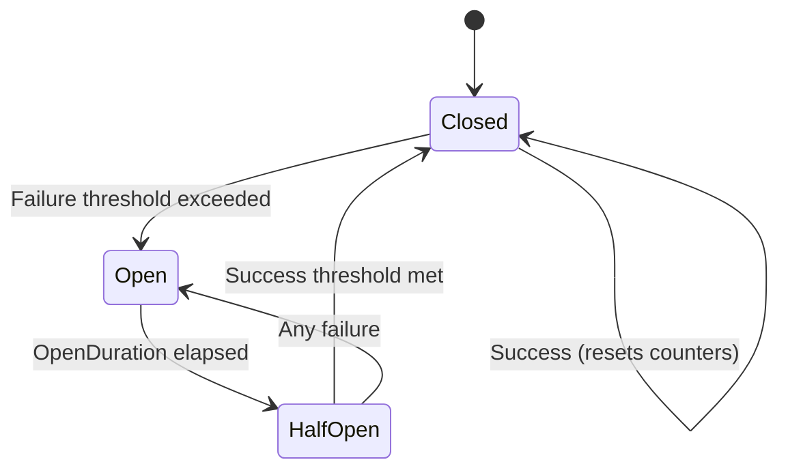

# Circuit Breakers

Circuit breaker configuration in NPipeline allows you to implement the circuit breaker pattern to prevent constantly failing nodes from continuously consuming resources or causing cascading failures throughout your pipeline.

The CircuitBreaker implementation provides:

- **State Machine**: Complete implementation with Closed, Open, and Half-Open states
- **Rolling Window**: Time-based operation tracking for sophisticated failure analysis
- **Multiple Threshold Types**: ConsecutiveFailures, RollingWindowCount, RollingWindowRate, and Hybrid
- **Automatic Recovery**: Timer-based transition from Open to Half-Open state
- **Thread Safety**: Safe for concurrent pipeline execution
- **Memory Management**: Automatic cleanup of inactive circuit breakers
- **Backward Compatibility**: Existing configurations continue to work

## Overview

The circuit breaker pattern is a design pattern used in software development to detect failures and encapsulate the logic of preventing a failure from constantly recurring. In NPipeline, this helps maintain system stability by temporarily stopping attempts to execute nodes that are experiencing persistent failures.

## PipelineCircuitBreakerOptions

The [`PipelineCircuitBreakerOptions`](../../../src/NPipeline/Configuration/PipelineCircuitBreakerOptions.cs) record allows you to configure a circuit breaker pattern with enhanced functionality.

```csharp
public sealed record PipelineCircuitBreakerOptions(
    int FailureThreshold,
    TimeSpan OpenDuration,
    TimeSpan SamplingWindow,
    bool Enabled = true,
    CircuitBreakerThresholdType ThresholdType = CircuitBreakerThresholdType.ConsecutiveFailures,
    double FailureRateThreshold = 0.5,
    int HalfOpenSuccessThreshold = 1,
    int HalfOpenMaxAttempts = 5,
    bool TrackOperationsInWindow = true)
{
    public static PipelineCircuitBreakerOptions Disabled { get; } = new(int.MaxValue, TimeSpan.Zero, TimeSpan.Zero, false);
    public static PipelineCircuitBreakerOptions Default { get; } = new(5, TimeSpan.FromMinutes(1), TimeSpan.FromMinutes(5));
    
    // Backward-compatible constructor
    public PipelineCircuitBreakerOptions(int failureThreshold, TimeSpan openDuration, TimeSpan samplingWindow, bool enabled)
        : this(failureThreshold, openDuration, samplingWindow, enabled, CircuitBreakerThresholdType.ConsecutiveFailures, 0.5, 1, 5, true)
    {
    }
}

/// <summary>
///     Defines the type of failure threshold used for circuit breaking.
/// </summary>
public enum CircuitBreakerThresholdType
{
    /// <summary>
    ///     Uses consecutive failure count (default behavior).
    /// </summary>
    ConsecutiveFailures,

    /// <summary>
    ///     Uses failure count within the sampling window.
    /// </summary>
    RollingWindowCount,

    /// <summary>
    ///     Uses failure rate within the sampling window.
    /// </summary>
    RollingWindowRate,

    /// <summary>
    ///     Uses both count and rate thresholds.
    /// </summary>
    Hybrid
}

/// <summary>
///     Exception thrown when the circuit breaker is open and blocks execution.
/// </summary>
public sealed class CircuitBreakerOpenException : PipelineException
{
    public CircuitBreakerOpenException() : base("Circuit breaker is open and blocking execution.")
    {
        ErrorCode = "CIRCUIT_BREAKER_OPEN";
    }

    public CircuitBreakerOpenException(string message) : base(message)
    {
        ErrorCode = "CIRCUIT_BREAKER_OPEN";
    }

    public CircuitBreakerOpenException(string message, Exception innerException) : base(message, innerException)
    {
        ErrorCode = "CIRCUIT_BREAKER_OPEN";
    }

    /// <summary>
    ///     Gets the error code associated with this exception.
    /// </summary>
    public string ErrorCode { get; }
}
```

### Configuration Parameters

* **`FailureThreshold`**: The threshold value used for circuit breaking (interpretation depends on ThresholdType).
* **`OpenDuration`**: How long the breaker remains open before transitioning to Half-Open state.
* **`SamplingWindow`**: Time window for rolling window failure tracking.
* **`Enabled`**: Whether the circuit breaker is active.
* **`ThresholdType`**: Type of failure threshold to use (ConsecutiveFailures, RollingWindowCount, RollingWindowRate, Hybrid).
* **`FailureRateThreshold`**: Failure rate threshold (0.0-1.0) when using RollingWindowRate or Hybrid threshold types.
* **`HalfOpenSuccessThreshold`**: Number of consecutive successes required in Half-Open state to transition to Closed.
* **`HalfOpenMaxAttempts`**: Maximum number of operation attempts allowed in Half-Open state.
* **`TrackOperationsInWindow`**: Whether to track operations in the rolling window for statistics.

## Circuit Breaker State Machine

The circuit breaker has three main states with automatic transitions:



### State Descriptions

1. **Closed**: The circuit breaker allows operations to proceed normally. It tracks failures based on the configured threshold type and trips when the threshold is reached.

2. **Open**: The circuit breaker has tripped and prevents operations from proceeding. After the OpenDuration expires, it automatically transitions to Half-Open state.

3. **Half-Open**: The circuit breaker allows a limited number of operations to test if the underlying issue has been resolved. If enough operations succeed, it transitions to Closed. If any operation fails, it immediately returns to Open.

## Basic Configuration

The simplest way to add circuit breaker protection is with the fluent API or via `PipelineRetryOptions`:

```csharp
public class BasicCircuitBreakerPipelineDefinition : IPipelineDefinition
{
    public void Define(PipelineBuilder builder, PipelineContext context)
    {
        var sourceHandle = builder.AddSource<DataSource, string>("source");
        var transformHandle = builder.AddTransform<DataTransform, string, string>("transform");
        var sinkHandle = builder.AddSink<DataSink, string>("sink");

        builder.Connect(sourceHandle, transformHandle);
        builder.Connect(transformHandle, sinkHandle);
    }
}

// Configure the circuit breaker via PipelineRetryOptions:
var retryOptions = new PipelineRetryOptions(
    MaxItemRetries: 3,
    MaxNodeRestartAttempts: 2,
    MaxSequentialNodeAttempts: 5,
    MaxMaterializedItems: 1000,
    CircuitBreakerOptions: new PipelineCircuitBreakerOptions(
        failureThreshold: 5, // Trip after 5 consecutive failures
        openDuration: TimeSpan.FromMinutes(1),
        samplingWindow: TimeSpan.FromMinutes(5),
        thresholdType: CircuitBreakerThresholdType.ConsecutiveFailures
    )
);

var context = PipelineContext.WithRetry(retryOptions);
var runner = PipelineRunner.Create();
await runner.RunAsync<BasicCircuitBreakerPipelineDefinition>(context);
```

Or use the fluent API:

```csharp
var builder = new PipelineBuilder();

// Simple configuration: trip after 3 consecutive failures
builder.WithCircuitBreaker(
    failureThreshold: 3,
    openDuration: TimeSpan.FromMinutes(1),
    samplingWindow: TimeSpan.FromMinutes(5)
);
```

## Threshold Types

### ConsecutiveFailures (Default)

Tracks consecutive failures without considering time. This is the original behavior and maintains backward compatibility.

```csharp
var options = new PipelineCircuitBreakerOptions(
    failureThreshold: 5,
    openDuration: TimeSpan.FromMinutes(1),
    samplingWindow: TimeSpan.FromMinutes(5),
    thresholdType: CircuitBreakerThresholdType.ConsecutiveFailures
);

// Trip after any 3 consecutive failures
builder.WithCircuitBreaker(
    failureThreshold: 3,
    openDuration: TimeSpan.FromMinutes(1),
    samplingWindow: TimeSpan.FromMinutes(5)
);
```

**Use when:** You want simple, immediate failure detection. Best for services where even a few failures indicate a problem.

### RollingWindowCount

Tracks the total number of failures within a time window, regardless of whether they're consecutive.

```csharp
// Trip after 10 failures within a 5-minute window
var options = new PipelineCircuitBreakerOptions(
    FailureThreshold: 10,
    OpenDuration: TimeSpan.FromMinutes(2),
    SamplingWindow: TimeSpan.FromMinutes(5),
    Enabled: true,
    ThresholdType: CircuitBreakerThresholdType.RollingWindowCount
);
```

**Use when:** You care about the absolute number of failures in a time period, regardless of how they're distributed.

### RollingWindowRate

Tracks the failure rate (failures/total operations) within a time window.

```csharp
// Trip if more than 10% of operations fail in a 5-minute window
var options = new PipelineCircuitBreakerOptions(
    FailureThreshold: 100,  // Minimum operations before rate is evaluated
    OpenDuration: TimeSpan.FromMinutes(2),
    SamplingWindow: TimeSpan.FromMinutes(5),
    Enabled: true,
    ThresholdType: CircuitBreakerThresholdType.RollingWindowRate,
    FailureRateThreshold: 0.1  // 10% failure rate
);
```

**Use when:** You want to tolerate occasional failures but trip on consistent degradation.

### Hybrid

Combines count and rate thresholds - trips if either is exceeded.

```csharp
// Trip if EITHER 5 failures in window OR 30% failure rate
var options = new PipelineCircuitBreakerOptions(
    FailureThreshold: 5,
    OpenDuration: TimeSpan.FromMinutes(1),
    SamplingWindow: TimeSpan.FromMinutes(5),
    Enabled: true,
    ThresholdType: CircuitBreakerThresholdType.Hybrid,
    FailureRateThreshold: 0.3  // 30% failure rate
);
```

**Use when:** You want comprehensive protection against both sudden failures and gradual degradation.

## Recovery Configuration

Control how your circuit breaker recovers after tripping:

```csharp
var options = new PipelineCircuitBreakerOptions(
    FailureThreshold: 3,
    OpenDuration: TimeSpan.FromMinutes(1),
    SamplingWindow: TimeSpan.FromMinutes(5),
    Enabled: true,
    HalfOpenSuccessThreshold: 2,     // Require 2 consecutive successes
    HalfOpenMaxAttempts: 5            // Allow up to 5 attempts in Half-Open
);
```

**State transitions:**
- **Closed → Open**: Failure threshold exceeded
- **Open → Half-Open**: After `OpenDuration` expires
- **Half-Open → Closed**: After `HalfOpenSuccessThreshold` consecutive successes
- **Half-Open → Open**: On any failure, or exceeding `HalfOpenMaxAttempts`

## Real-World Configuration Scenarios

### Scenario 1: High-Throughput API Integration

For operations calling external APIs with occasional glitches:

```csharp
var options = new PipelineCircuitBreakerOptions(
    failureThreshold: 50,  // Allow some failures before tripping
    openDuration: TimeSpan.FromSeconds(30),  // Quick recovery window
    samplingWindow: TimeSpan.FromMinutes(5),
    thresholdType: CircuitBreakerThresholdType.RollingWindowCount
);

// Or with fluent API:
builder.WithCircuitBreaker(
    failureThreshold: 50,
    openDuration: TimeSpan.FromSeconds(30),
    samplingWindow: TimeSpan.FromMinutes(5)
);
```

### Scenario 2: Critical Database Operations

For operations where any failure indicates a serious problem:

```csharp
var options = new PipelineCircuitBreakerOptions(
    FailureThreshold: 2,
    OpenDuration: TimeSpan.FromSeconds(10),
    SamplingWindow: TimeSpan.FromMinutes(1),
    Enabled: true,
    ThresholdType: CircuitBreakerThresholdType.ConsecutiveFailures,
    HalfOpenSuccessThreshold: 1,
    HalfOpenMaxAttempts: 2
);
```

### Scenario 3: Bursty Service with Degradation Tolerance

For services that can tolerate occasional failures but need protection from persistent issues:

```csharp
var options = new PipelineCircuitBreakerOptions(
    FailureThreshold: 100,
    OpenDuration: TimeSpan.FromMinutes(2),
    SamplingWindow: TimeSpan.FromMinutes(5),
    Enabled: true,
    ThresholdType: CircuitBreakerThresholdType.RollingWindowRate,
    FailureRateThreshold: 0.2  // 20% failure rate threshold
);
```

### Scenario 4: Multi-Level Protection

Combine multiple strategies across pipeline:

```csharp
var builder = new PipelineBuilder();

// Strict protection on critical transform
var criticalOptions = new PipelineCircuitBreakerOptions(
    FailureThreshold: 2,
    OpenDuration: TimeSpan.FromSeconds(30),
    SamplingWindow: TimeSpan.FromMinutes(1),
    Enabled: true
);

// Lenient protection on resilient transform
var resilientOptions = new PipelineCircuitBreakerOptions(
    FailureThreshold: 100,
    OpenDuration: TimeSpan.FromMinutes(5),
    SamplingWindow: TimeSpan.FromMinutes(10),
    Enabled: true,
    ThresholdType: CircuitBreakerThresholdType.RollingWindowRate,
    FailureRateThreshold: 0.25
);
```

### Scenario 5: High-Tolerance Circuit Breaker

For non-critical nodes where you want more resilience:

```csharp
var tolerantOptions = new PipelineCircuitBreakerOptions(
    failureThreshold: 20,
    openDuration: TimeSpan.FromMinutes(5),
    samplingWindow: TimeSpan.FromMinutes(10),
    thresholdType: CircuitBreakerThresholdType.Hybrid,
    failureRateThreshold: 0.4, // 40% failure rate
    halfOpenSuccessThreshold: 3, // Require 3 consecutive successes
    halfOpenMaxAttempts: 10 // Allow up to 10 attempts in Half-Open
);
```

### Scenario 6: Sensitive Circuit Breaker

For critical nodes where you want quick failure detection:

```csharp
var sensitiveOptions = new PipelineCircuitBreakerOptions(
    failureThreshold: 3,
    openDuration: TimeSpan.FromSeconds(30),
    samplingWindow: TimeSpan.FromMinutes(1),
    thresholdType: CircuitBreakerThresholdType.ConsecutiveFailures,
    halfOpenSuccessThreshold: 1,
    halfOpenMaxAttempts: 2
);
```

### Scenario 7: Rate-Based Circuit Breaker

For nodes with high throughput where rate is more important than count:

```csharp
var rateBasedOptions = new PipelineCircuitBreakerOptions(
    failureThreshold: 100, // Minimum operations before rate is considered
    openDuration: TimeSpan.FromMinutes(2),
    samplingWindow: TimeSpan.FromMinutes(5),
    thresholdType: CircuitBreakerThresholdType.RollingWindowRate,
    failureRateThreshold: 0.1 // 10% failure rate
);
```

## Circuit Breaker Memory Management

The [`CircuitBreakerMemoryManagementOptions`](../../../src/NPipeline/Configuration/CircuitBreakerMemoryManagementOptions.cs:12) class provides configuration for managing circuit breaker memory usage and automatic cleanup:

Circuit breaker instances are cached per node ID to maintain state across calls. In long-running applications or pipelines with many dynamic nodes, inactive breakers should be cleaned up to prevent memory leaks.

### Default Behavior

By default, NPipeline automatically manages circuit breaker memory:

- **Cleanup interval**: 5 minutes
- **Inactivity threshold**: 30 minutes  
- **Max tracked breakers**: 1,000
- **Automatic cleanup**: Enabled

A circuit breaker is considered inactive if it hasn't been accessed (checked or updated) within the inactivity threshold. Inactive breakers are removed automatically.

### Configuration Example

```csharp
var memoryOptions = new CircuitBreakerMemoryManagementOptions(
    cleanupInterval: TimeSpan.FromMinutes(5),    // How often cleanup runs
    inactivityThreshold: TimeSpan.FromMinutes(30),  // When circuit breakers become eligible for removal
    enableAutomaticCleanup: true,                  // Whether cleanup is enabled
    maxTrackedCircuitBreakers: 1000,            // Maximum circuit breakers to track
    cleanupTimeout: TimeSpan.FromSeconds(30)         // Timeout for cleanup operations
);
```

### Cleanup Timeout Configuration

The `CleanupTimeout` property controls the timeout for circuit breaker cleanup operations:

- **Default value**: 30 seconds
- **Purpose**: Prevents deadlocks during cleanup operations by setting a maximum time limit
- **Behavior**: If cleanup operations exceed this timeout, they are aborted to prevent system hangs

When to adjust CleanupTimeout:
- **Increase** (e.g., 60 seconds) for:
  - Systems with very large numbers of circuit breakers (>1000)
  - Environments with slow I/O or high contention
  - Complex circuit breaker hierarchies with deep dependency chains
- **Decrease** (e.g., 10-15 seconds) for:
  - Real-time systems where quick recovery is critical
  - Environments with limited circuit breaker counts
  - Systems where cleanup failures should be detected quickly

```csharp
// Example: Extended timeout for systems with many circuit breakers
var highVolumeOptions = new CircuitBreakerMemoryManagementOptions(
    cleanupInterval: TimeSpan.FromMinutes(5),
    inactivityThreshold: TimeSpan.FromMinutes(30),
    enableAutomaticCleanup: true,
    maxTrackedCircuitBreakers: 5000,  // High volume
    cleanupTimeout: TimeSpan.FromMinutes(1) // Extended timeout for large cleanup operations
);

// Example: Quick timeout for real-time systems
var realtimeOptions = new CircuitBreakerMemoryManagementOptions(
    cleanupInterval: TimeSpan.FromMinutes(1),
    inactivityThreshold: TimeSpan.FromMinutes(10),
    enableAutomaticCleanup: true,
    maxTrackedCircuitBreakers: 100,
    cleanupTimeout: TimeSpan.FromSeconds(10) // Quick timeout for fast recovery
);
```

### When to Customize Memory Management

**Customize cleanup for these scenarios:**

| Scenario | Issue | Solution |
|----------|-------|----------|
| Many short-lived nodes | Memory grows unbounded | Lower `InactivityThreshold` and `MaxTrackedCircuitBreakers` |
| High-frequency cleanup overhead | Cleanup CPU cost too high | Increase `CleanupInterval` |
| Rapid node creation/destruction | Eviction happens too often | Increase `MaxTrackedCircuitBreakers` |
| Long-running pipelines | Need stricter memory control | Enable aggressive cleanup with lower thresholds |

### Memory Management Scenarios

#### Scenario 1: Short-Lived Nodes (e.g., Request-Based Pipelines)

For pipelines where nodes are created per request and disposed after:

```csharp
builder.ConfigureCircuitBreakerMemoryManagement(opts =>
    opts with
    {
        InactivityThreshold = TimeSpan.FromMinutes(5),    // Clean up faster
        MaxTrackedCircuitBreakers = 100,                  // Limit tracked breakers
        CleanupInterval = TimeSpan.FromSeconds(30)        // Check frequently
    }
);
```

When the limit is reached, the least-recently-used breaker is evicted.

#### Scenario 2: Large Pipelines with Many Nodes

For pipelines with hundreds of nodes that may or may not be accessed:

```csharp
builder.ConfigureCircuitBreakerMemoryManagement(opts =>
    opts with
    {
        MaxTrackedCircuitBreakers = 5000,                 // Allow more breakers
        InactivityThreshold = TimeSpan.FromHours(1),      // Longer inactivity window
        CleanupInterval = TimeSpan.FromMinutes(10)        // Less frequent cleanup
    }
);
```

#### Scenario 3: Disable Automatic Cleanup

For controlled scenarios where you manage cleanup manually:

```csharp
builder.ConfigureCircuitBreakerMemoryManagement(opts =>
    opts with
    {
        EnableAutomaticCleanup = false
    }
);

// Later, manually trigger cleanup when appropriate
// (Requires access to CircuitBreakerManager from pipeline context)
if (context.Items.TryGetValue(PipelineContextKeys.CircuitBreakerManager, out var manager) &&
    manager is ICircuitBreakerManager cbManager)
{
    int removedCount = cbManager.TriggerCleanup();
    logger.LogInformation("Cleaned up {Count} inactive circuit breakers", removedCount);
}
```

#### Scenario 4: Aggressive Memory Management

For memory-constrained environments:

```csharp
builder.ConfigureCircuitBreakerMemoryManagement(opts =>
    opts with
    {
        MaxTrackedCircuitBreakers = 50,                   // Very strict limit
        InactivityThreshold = TimeSpan.FromMinutes(2),    // Aggressive cleanup
        CleanupInterval = TimeSpan.FromSeconds(10),       // Frequent checks
        EnableAutomaticCleanup = true
    }
);
```

### Cleanup Behavior

When cleanup runs, NPipeline:

1. **Identifies inactive breakers**: Breakers not accessed within `InactivityThreshold`
2. **Removes inactive breakers**: Disposes stale circuit breaker instances
3. **Evicts if necessary**: If `MaxTrackedCircuitBreakers` is exceeded, removes least-recently-used (LRU) breaker
4. **Logs activity**: Records cleanup events at DEBUG/WARNING levels

### Monitoring Cleanup

Track circuit breaker lifecycle in your observability infrastructure:

```csharp
// Get current tracking count
if (context.Items.TryGetValue(PipelineContextKeys.CircuitBreakerManager, out var manager) &&
    manager is ICircuitBreakerManager cbManager)
{
    int trackedCount = cbManager.GetTrackedCircuitBreakerCount();
    metrics.Gauge("circuitbreaker.tracked_count", trackedCount);
}
```

### Performance Impact

Memory management is designed to be lightweight:

- **Cleanup operation**: O(n) where n = tracked breakers; typically < 10ms
- **Tracking overhead**: ~100 bytes per circuit breaker (timestamp + node ID)
- **LRU eviction**: O(n) scan to find least-recently-used

For most applications, defaults provide good balance. Customize only if:

- Monitoring shows excessive memory growth
- Cleanup CPU cost is significant (> 5% of pipeline execution time)
- You have specific memory constraints

### Memory Management Notes

- **Access updates**: Any access (check or state change) updates the breaker's last-accessed timestamp
- **Persistent state**: Circuit breaker state is **not** restored after removal and recreation—it starts as Closed
- **Thread-safe**: All cleanup operations are thread-safe; no synchronization needed

## Integration with ResilientExecutionStrategy

The CircuitBreaker is automatically integrated with the ResilientExecutionStrategy:

```csharp
// The circuit breaker is automatically used when ResilientExecutionStrategy is enabled
// and CircuitBreakerOptions are configured in the retry options

var resilientOptions = new PipelineRetryOptions(
    MaxItemRetries: 3,
    MaxNodeRestartAttempts: 5,
    CircuitBreakerOptions: new PipelineCircuitBreakerOptions(
        failureThreshold: 3,
        openDuration: TimeSpan.FromMinutes(1),
        samplingWindow: TimeSpan.FromMinutes(5),
        thresholdType: CircuitBreakerThresholdType.RollingWindowRate,
        failureRateThreshold: 0.2
    )
);

// The ResilientExecutionStrategy will automatically:
// 1. Track operations in the rolling window
// 2. Check circuit breaker state before each operation
// 3. Record successes and failures
// 4. Handle state transitions automatically
// 5. Throw CircuitBreakerOpenException when the circuit is open
```

## Monitoring Circuit Breaker Statistics

The CircuitBreaker provides detailed statistics that can be accessed for monitoring:

```csharp
// The CircuitBreakerManager tracks circuit breakers for each node
// You can access statistics through the circuit breaker instance

WindowStatistics stats = circuitBreaker.GetStatistics();
// stats.TotalOperations - Total operations in the window
// stats.FailureCount - Number of failed operations
// stats.SuccessCount - Number of successful operations
// stats.FailureRate - Failure rate (0.0 to 1.0)
```

## Disabling Circuit Breaker

If needed, you can disable circuit breaking:

```csharp
var options = new PipelineCircuitBreakerOptions(
    FailureThreshold: 5,
    OpenDuration: TimeSpan.FromMinutes(1),
    SamplingWindow: TimeSpan.FromMinutes(5),
    Enabled: false  // Disabled - no circuit breaker checks
);
```

Or use the predefined disabled option:

```csharp
var disabledOptions = PipelineCircuitBreakerOptions.Disabled;
```

## Important Notes

### Distinction from Retry Options

Circuit breaker configuration is **separate** from retry configuration:

- **`WithCircuitBreaker()`**: Prevents repeated attempts when failure threshold is reached
- **`WithRetryOptions()`**: Controls how many retries are allowed per item or per node

Both can be used together for comprehensive resilience:

```csharp
var builder = new PipelineBuilder();

// Control retries at the item/node level
builder.WithRetryOptions(o => o.With(maxNodeRestartAttempts: 3));

// Prevent cascade failures across the pipeline
builder.WithCircuitBreaker(failureThreshold: 5);
```

### Thread Safety

Circuit breakers are fully thread-safe and designed for concurrent pipeline execution. Multiple threads can safely check and update breaker state simultaneously.

### Performance Considerations

- Circuit breakers add minimal overhead (~50-100ns per check in Closed state)
- Operation tracking uses efficient rolling windows with automatic cleanup
- No significant memory overhead for typical usage patterns

## Troubleshooting

**Circuit breaker trips too frequently:**

- Increase `FailureThreshold` to tolerate more failures
- Use `RollingWindowRate` to tolerate occasional failures
- Extend `SamplingWindow` to smooth out bursty failures

**Circuit breaker never trips:**

- Reduce `FailureThreshold`
- Use `ConsecutiveFailures` for immediate detection
- Reduce `SamplingWindow` for faster detection

**Slow recovery:**

- Reduce `OpenDuration`
- Lower `HalfOpenSuccessThreshold` to recover faster

For more troubleshooting help, see the [Troubleshooting guide](../resilience/troubleshooting.md).

## Best Practices

1. **Choose the right threshold type**: 
   - Use `ConsecutiveFailures` for simple scenarios
   - Use `RollingWindowCount` for high-volume operations
   - Use `RollingWindowRate` for rate-sensitive scenarios
   - Use `Hybrid` for comprehensive protection

2. **Set appropriate sampling windows**: 
   - Shorter windows (1-5 minutes) for quick detection
   - Longer windows (10-30 minutes) for stability in volatile environments

3. **Configure Half-Open parameters carefully**:
   - Higher `HalfOpenSuccessThreshold` for more conservative recovery
   - Lower `HalfOpenMaxAttempts` to prevent flooding recovering services

4. **Monitor circuit breaker state transitions**: Track when circuit breakers open and close to identify systemic issues.

5. **Use different thresholds for different nodes**: Critical nodes might have lower thresholds than non-critical ones.

6. **Implement alerting**: Set up alerts when circuit breakers open to notify operations teams.

7. **Consider graceful degradation**: Design your pipeline to continue functioning even when some nodes are isolated by circuit breakers.

8. **Test circuit breaker behavior**: Include circuit breaker scenarios in your testing to ensure they work as expected.

## See Also

* **[Resilience Overview](./index.md)**: Comprehensive guide to building fault-tolerant pipelines
* **[Error Handling](./error-handling.md)**: Learn about handling errors at node and pipeline levels
* **[Retries](./retries.md)**: Configure retry behavior for items and node restarts
* **[Dead-Letter Queues](./dead-letter-queues.md)**: Implement dead-letter queues for problematic items
* **[Troubleshooting](./troubleshooting.md)**: Diagnose and resolve common resilience issues
