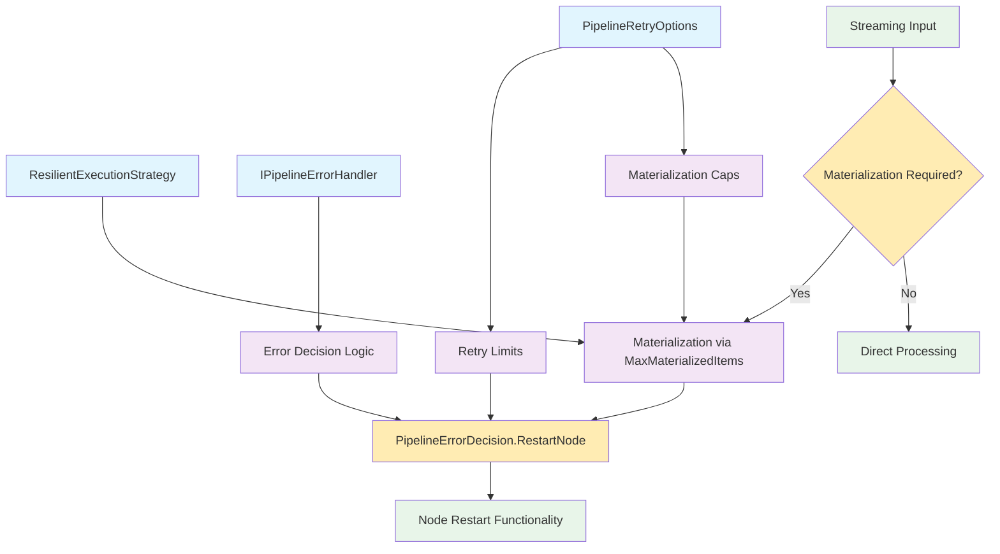
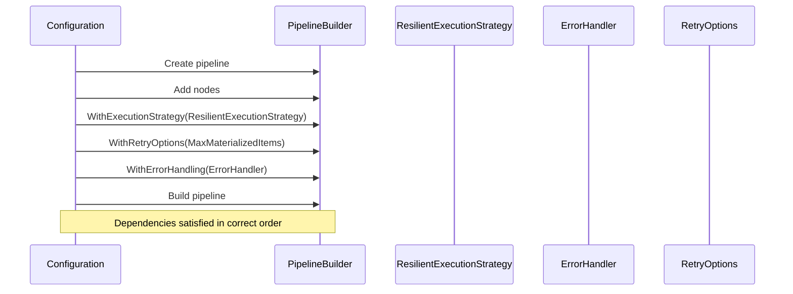
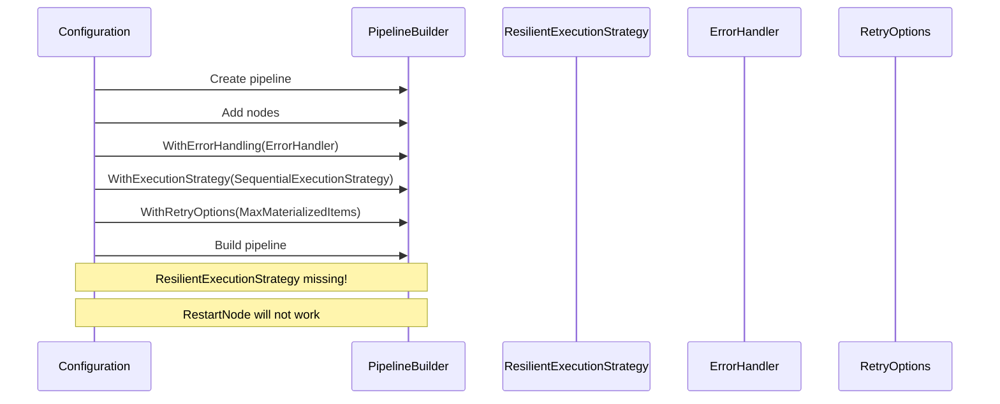
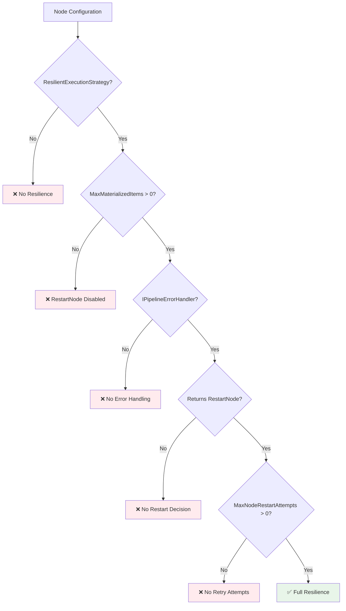

# Dependency Chains

Resilience in NPipeline relies on a strict chain of dependencies between components. Understanding these relationships is crucial because missing or misconfigured dependencies will cause resilience features to fail silently or fall back to undesirable default behaviors.

## The Critical Dependency Chain



*Figure: The complete dependency chain showing how resilience components must be configured in the correct sequence.*

## Critical Dependency Rules

### 1. ResilientExecutionStrategy is Mandatory

#### :warning: Critical Prerequisite

All resilience features require `ResilientExecutionStrategy` to be applied to a node. Without this strategy:

- `PipelineErrorDecision.RestartNode` will not work
- Materialization will not be automatically applied
- Circuit breaker functionality will not be available
- Node restart capabilities will be disabled

**What breaks without it:**

- Error handlers return `RestartNode` decision, but node cannot restart
- Materialization is not applied to streaming inputs
- Circuit breaker logic is bypassed
- Retry limits are not enforced

**Fix:**

```csharp
// WRONG: Missing resilience wrapper
var nodeHandle = builder
    .AddTransform<MyTransform, Input, Output>("node")
    .WithExecutionStrategy(builder, new SequentialExecutionStrategy());

// CORRECT: With resilience wrapper
var nodeHandle = builder
    .AddTransform<MyTransform, Input, Output>("node")
    .WithExecutionStrategy(builder, new ResilientExecutionStrategy(
        new SequentialExecutionStrategy()
    ));
```

### 2. Materialization is Required for RestartNode

#### :warning: Critical Prerequisite

`PipelineErrorDecision.RestartNode` only works if the input stream is materialized via `MaxMaterializedItems` (for streaming inputs).

**What breaks without it:**

- `RestartNode` decision falls back to `FailPipeline` behavior
- Streaming inputs cannot be replayed after failure
- Node restart fails with "Cannot restart streaming node without materialization"

**Fix:**

```csharp
// WRONG: No materialization for streaming input
var options = new PipelineRetryOptions(
    MaxItemRetries: 3,
    MaxNodeRestartAttempts: 2,
    MaxSequentialNodeAttempts: 5,
    MaxMaterializedItems: null // No materialization
);

// CORRECT: With materialization
var options = new PipelineRetryOptions(
    MaxItemRetries: 3,
    MaxNodeRestartAttempts: 2,
    MaxSequentialNodeAttempts: 5,
    MaxMaterializedItems: 1000 // Enable materialization
);
```

### 3. Error Handler Must Return Correct Decision

#### :warning: Critical Prerequisite

The `IPipelineErrorHandler` must return `PipelineErrorDecision.RestartNode` to trigger restart functionality.

**What breaks without it:**

- Error handler returns `FailPipeline` or `ContinueWithoutNode`
- Node restart is never attempted
- Resilience configuration is ineffective

**Fix:**

```csharp
// WRONG: Always fails pipeline
public class WrongErrorHandler : IPipelineErrorHandler
{
    public Task<PipelineErrorDecision> HandleNodeFailureAsync(
        string nodeId, Exception error, PipelineContext context, CancellationToken ct)
    {
        return Task.FromResult(PipelineErrorDecision.FailPipeline);
    }
}

// CORRECT: Returns RestartNode when appropriate
public class CorrectErrorHandler : IPipelineErrorHandler
{
    public Task<PipelineErrorDecision> HandleNodeFailureAsync(
        string nodeId, Exception error, PipelineContext context, CancellationToken ct)
    {
        return error switch
        {
            TimeoutException => Task.FromResult(PipelineErrorDecision.RestartNode),
            InvalidOperationException => Task.FromResult(PipelineErrorDecision.RestartNode),
            _ => Task.FromResult(PipelineErrorDecision.FailPipeline)
        };
    }
}
```

## Configuration Sequence Dependencies

The order in which you configure resilience components matters:

### Correct Configuration Sequence



### Incorrect Configuration Sequence



## Common Dependency Breakages

### Breakage 1: Missing ResilientExecutionStrategy

**Symptoms:**

- Error handler returns `RestartNode` but node doesn't restart
- Pipeline fails despite restart decision
- No materialization occurs for streaming inputs

**Diagnosis:**

```csharp
// Check if ResilientExecutionStrategy is applied
var nodeDefinition = pipeline.GetNodeDefinition("myNode");
var hasResilientStrategy = nodeDefinition.ExecutionStrategy is ResilientExecutionStrategy;

if (!hasResilientStrategy)
{
    Console.WriteLine("ERROR: ResilientExecutionStrategy not applied to node");
}
```

**Fix:**

```csharp
// Apply ResilientExecutionStrategy to all nodes that need resilience
var nodeHandle = builder
    .AddTransform<MyTransform, Input, Output>("myNode")
    .WithExecutionStrategy(builder, new ResilientExecutionStrategy(
        new SequentialExecutionStrategy()
    ));
```

### Breakage 2: Missing Materialization for Streaming Inputs

**Symptoms:**

- `InvalidOperationException: Cannot restart streaming node without materialization`
- `RestartNode` decision falls back to `FailPipeline`
- Buffer overflow exceptions when processing large streams

**Diagnosis:**

```csharp
// Check if materialization is configured
var retryOptions = context.RetryOptions;
if (retryOptions.MaxMaterializedItems == null)
{
    Console.WriteLine("WARNING: No materialization limit set - streaming inputs cannot be restarted");
}
```

**Fix:**

```csharp
// Configure materialization for streaming inputs
var options = new PipelineRetryOptions(
    MaxItemRetries: 3,
    MaxNodeRestartAttempts: 2,
    MaxSequentialNodeAttempts: 5,
    MaxMaterializedItems: 1000 // Enable materialization
);
```

### Breakage 3: Error Handler Not Returning RestartNode

**Symptoms:**

- Node never restarts despite failures
- Pipeline always fails on first error
- Resilience configuration appears ineffective

**Diagnosis:**

```csharp
// Add logging to error handler
public class DebuggingErrorHandler : IPipelineErrorHandler
{
    public async Task<PipelineErrorDecision> HandleNodeFailureAsync(
        string nodeId, Exception error, PipelineContext context, CancellationToken ct)
    {
        Console.WriteLine($"Error handler called for node {nodeId}");
        Console.WriteLine($"Exception type: {error.GetType().Name}");

        var decision = await HandleError(nodeId, error, context, ct);
        Console.WriteLine($"Decision: {decision}");

        return decision;
    }
}
```

**Fix:**

```csharp
// Ensure error handler returns RestartNode for appropriate errors
public class FixedErrorHandler : IPipelineErrorHandler
{
    public Task<PipelineErrorDecision> HandleNodeFailureAsync(
        string nodeId, Exception error, PipelineContext context, CancellationToken ct)
    {
        return error switch
        {
            TimeoutException => Task.FromResult(PipelineErrorDecision.RestartNode),
            HttpRequestException => Task.FromResult(PipelineErrorDecision.RestartNode),
            InvalidOperationException => Task.FromResult(PipelineErrorDecision.RestartNode),
            _ => Task.FromResult(PipelineErrorDecision.FailPipeline)
        };
    }
}
```

## Dependency Validation Checklist

Use this checklist to validate your resilience configuration:

### ✅ ResilientExecutionStrategy Applied

- [ ] All nodes requiring resilience have `ResilientExecutionStrategy` applied
- [ ] Inner strategy is correctly configured (Sequential, Parallel, etc.)
- [ ] Strategy is applied before error handling configuration

### ✅ Materialization Configured

- [ ] `MaxMaterializedItems` is set to a non-null value for streaming inputs
- [ ] Buffer size is appropriate for expected data volume
- [ ] Memory constraints are considered

### ✅ Error Handler Configured

- [ ] `IPipelineErrorHandler` is registered
- [ ] Handler returns `RestartNode` for appropriate error types
- [ ] Handler is configured with the pipeline

### ✅ Retry Options Configured

- [ ] `MaxNodeRestartAttempts` is set to enable restarts
- [ ] `MaxItemRetries` is configured for item-level retries
- [ ] `MaxSequentialNodeAttempts` is set appropriately

## Visual Dependency Flow



## Testing Dependency Chains

### Unit Test for Dependency Validation

```csharp
[Test]
public void ResilienceDependencies_ShouldBeCorrectlyConfigured()
{
    // Arrange
    var pipeline = CreateTestPipeline();
    var nodeDefinition = pipeline.GetNodeDefinition("testNode");

    // Assert ResilientExecutionStrategy is applied
    Assert.IsInstanceOf<ResilientExecutionStrategy>(nodeDefinition.ExecutionStrategy);

    // Assert materialization is configured
    var retryOptions = pipeline.RetryOptions;
    Assert.IsNotNull(retryOptions.MaxMaterializedItems);
    Assert.Greater(retryOptions.MaxMaterializedItems.Value, 0);

    // Assert error handler is configured
    Assert.IsNotNull(pipeline.ErrorHandler);
}

[Test]
public async Task RestartNode_ShouldWork_WhenDependenciesMet()
{
    // Arrange
    var pipeline = CreateResilientPipeline();
    var context = PipelineContext.WithRetry(new PipelineRetryOptions(
        MaxItemRetries: 3,
        MaxNodeRestartAttempts: 2,
        MaxSequentialNodeAttempts: 5,
        MaxMaterializedItems: 1000
    ));

    // Act - Simulate failure that should trigger restart
    var result = await pipeline.RunWithFailure(context);

    // Assert - Node should have restarted
    Assert.Greater(context.GetRestartCount("testNode"), 0);
}
```

### Integration Test for End-to-End Validation

```csharp
[Test]
public async Task FullResilienceChain_ShouldWork_IntegrationTest()
{
    // Arrange
    var flakySource = new FlakyDataSource(failureRate: 0.3);
    
    var retryOptions = new PipelineRetryOptions(
        MaxItemRetries: 3,
        MaxNodeRestartAttempts: 2,
        MaxSequentialNodeAttempts: 5,
        MaxMaterializedItems: 1000
    );
    
    var context = PipelineContext.WithRetry(retryOptions);
    context.AddPipelineErrorHandler<TestErrorHandler>();

    // Act
    var runner = new PipelineRunner();
    var result = await runner.RunAsync<FullResiliencePipeline>(context);

    // Assert - should complete successfully with resilience applied
    Assert.NotNull(result);
}

public class FullResiliencePipeline : IPipelineDefinition
{
    private readonly FlakyDataSource _flakySource;

    public FullResiliencePipeline(FlakyDataSource flakySource)
    {
        _flakySource = flakySource;
    }

    public void Define(PipelineBuilder builder, PipelineContext context)
    {
        var sourceHandle = builder.AddSource<FlakyDataSource, Data>("source");
        var transformHandle = builder
            .AddTransform<DataTransform, Data, TransformedData>("transform")
            .WithExecutionStrategy(builder, new ResilientExecutionStrategy(
                new SequentialExecutionStrategy()
            ));
        var sinkHandle = builder.AddSink<DataSink, TransformedData>("sink");

        builder.Connect(sourceHandle, transformHandle);
        builder.Connect(transformHandle, sinkHandle);
    }
}
```

    // Assert
    Assert.IsTrue(result.IsSuccess);
    Assert.Greater(flakySource.ProcessedItems, 0);
}
```

## Next Steps

- **[Configuration Guide](configuration-guide.md)**: Get practical implementation guidance with complete examples
- **[Troubleshooting](troubleshooting.md)**: Learn to diagnose and resolve dependency issues

