# Error Handling in NPipeline

## Overview

Robust error handling is critical for building reliable data pipelines. NPipeline provides several mechanisms to manage errors that occur during data processing, allowing you to gracefully recover, retry operations, or isolate problematic data.

By default, if an unhandled exception occurs within a node during pipeline execution, the exception will propagate up the call stack, potentially halting the entire pipeline. While this behavior is suitable for critical errors that should stop processing immediately, it's often desirable to handle errors more selectively without bringing down the entire system.

Errors in NPipeline can generally be categorized by their source and impact:

* **Node-Specific Errors**: Exceptions originating from logic within a specific `ISourceNode`, `ITransformNode`, or `ISinkNode`.
* **Data-Related Errors**: Issues caused by the data itself (e.g., invalid format, missing values) that a node attempts to process.
* **Infrastructure Errors**: Problems related to external dependencies like databases, APIs, or network connectivity.
* **Cancellation**: While not strictly an "error," a [`CancellationToken`](https://learn.microsoft.com/en-us/dotnet/api/system.threading.cancellationtoken) can signal an intentional halt to processing, which nodes should handle gracefully.

NPipeline distinguishes between two levels of error handling:

1. **Node-level Error Handling**: Deals with errors that occur while processing an individual item within a specific node. You define what happens to that item (e.g., skip, retry, redirect to dead-letter).
2. **Pipeline-level Error Handling**: Deals with more severe errors that might affect an entire node's stream or the pipeline's execution flow (e.g., restarting a failing node, failing the entire pipeline).

## Error Handling Levels

### Node-Level Error Handling

Node-level error handling in NPipeline allows you to manage errors that occur while processing individual items within a specific node. This granular approach enables you to define what happens to each problematic item without affecting the entire pipeline.

When an error occurs during the processing of an individual item in a node, NPipeline's error handling mechanism invokes the appropriate `INodeErrorHandler` to determine how to proceed. This allows you to implement strategies like retrying the item, skipping it, or redirecting it to a dead-letter queue.

#### INodeErrorHandler Interface

To handle errors within a specific node, you implement [`INodeErrorHandler<in TNode, in TData>`](../../../src/NPipeline/Abstractions/ErrorHandling/INodeErrorHandler.cs) interface.

```csharp
public interface INodeErrorHandler
{
}

/// <summary>
///     Defines the contract for handling errors that occur within a specific node.
/// </summary>
/// <typeparam name="TNode">The type of node where the error occurred.</typeparam>
/// <typeparam name="TData">The type of the data item that failed.</typeparam>
public interface INodeErrorHandler<in TNode, in TData> : INodeErrorHandler where TNode : INode
{
    /// <summary>
    ///     Handles an error that occurred during node execution.
    /// </summary>
    /// <param name="node">The instance of node that failed.</param>
    /// <param name="failedItem">The data item that caused the error.</param>
    /// <param name="error">The exception that was thrown.</param>
    /// <param name="context">The current pipeline context.</param>
    /// <param name="cancellationToken">A token to observe for cancellation requests.</param>
    /// <returns>A <see cref="NodeErrorDecision" /> indicating how to proceed.</returns>
    Task<NodeErrorDecision> HandleAsync(
        TNode node,
        TData failedItem,
        Exception error,
        PipelineContext context,
        CancellationToken cancellationToken);
}
```

* **`INodeErrorHandler`**: Marker interface for dependency injection registration of node error handlers.
* **`INodeErrorHandler<in TNode, in TData>`**: Generic interface that inherits from the marker interface and defines the actual error handling logic.
* **`TNode`**: The type of node where the error occurred.
* **`TData`**: The type of the data item that caused the error.
* **`HandleAsync`**: This method is called when an error occurs. It receives the failing node, item, exception, and pipeline context. It must return a `NodeErrorDecision`.

#### NodeErrorDecision

This enum dictates how the pipeline should proceed after a node-level error:

* **`Skip`**: The failed item is discarded, and the pipeline continues processing subsequent items.
* **`Retry`**: The pipeline attempts to re-process the failed item. The number of retries is configured via `PipelineRetryOptions`.
* **`DeadLetter`**: The failed item is sent to a configured dead-letter sink, and the pipeline continues.
* **`Fail`**: The pipeline immediately terminates with an exception.

#### Implementing a Custom Node Error Handler

```csharp
using NPipeline;
using NPipeline.ErrorHandling;
using NPipeline.Nodes;
using NPipeline.Pipeline;

public sealed class MyNodeErrorHandler : INodeErrorHandler<ITransformNode<string, string>, string>
{
    private readonly ILogger _logger;

    public MyNodeErrorHandler(ILogger logger)
    {
        _logger = logger;
    }

    public Task<NodeErrorDecision> HandleAsync(
        ITransformNode<string, string> node,
        string failedItem,
        Exception error,
        PipelineContext context,
        CancellationToken cancellationToken)
    {
        _logger.LogError(error, "Error in node '{NodeName}' processing '{FailedItem}': {ErrorMessage}",
            node.Name, failedItem, error.Message);

        // Example logic:
        // - If it's a specific transient error, maybe retry.
        // - If it's a data validation error, skip or redirect.
        if (error is FormatException)
        {
            _logger.LogWarning("Data format error, redirecting to dead-letter.");
            return Task.FromResult(NodeErrorDecision.DeadLetter);
        }
        else if (failedItem.Contains("retry"))
        {
            _logger.LogInformation("Item marked for retry.");
            return Task.FromResult(NodeErrorDecision.Retry);
        }
        else
        {
            _logger.LogWarning("Skipping item due to unexpected error.");
            return Task.FromResult(NodeErrorDecision.Skip);
        }
    }
}
```

#### Registering a Node Error Handler

You register a node error handler for a specific node using the `WithErrorHandler` method on `PipelineBuilder`:

```csharp
using NPipeline;
using NPipeline.ErrorHandling;
using NPipeline.Pipeline;

public sealed class ErrorHandlingPipelineDefinition : IPipelineDefinition
{
    public void Define(PipelineBuilder builder, PipelineContext context)
    {
        var sourceHandle = builder.AddSource<DataSource, string>();
        var transformHandle = builder.AddTransform<DataTransform, string, string>();
        var sinkHandle = builder.AddSink<DataSink, string>();

        builder.Connect(sourceHandle, transformHandle);
        builder.Connect(transformHandle, sinkHandle);

        // Configure retry options
        builder.WithRetryOptions(new PipelineRetryOptions(
            MaxItemRetries: 3,
            MaxNodeRestartAttempts: 2,
            MaxSequentialNodeAttempts: 5
        ));
    }
}
```

You also need to register your custom error handler with your DI container:

```csharp
services.AddSingleton<INodeErrorHandler<ITransformNode<string, string>, string>, MyNodeErrorHandler>();
```

The marker interface `INodeErrorHandler` (non-generic version) is used for dependency injection registration purposes, allowing the DI container to discover all node error handler implementations.

#### Common Node Error Handling Scenarios

**Scenario 1: Handling Transient Network Errors**

```csharp
public class NetworkErrorHandler : INodeErrorHandler<IApiTransformNode, string>
{
    private readonly ILogger _logger;
    private int _retryCount = 0;

    public NetworkErrorHandler(ILogger logger)
    {
        _logger = logger;
    }

    public Task<NodeErrorDecision> HandleAsync(
        IApiTransformNode node,
        string failedItem,
        Exception error,
        PipelineContext context,
        CancellationToken cancellationToken)
    {
        if (error is HttpRequestException httpEx)
        {
            _retryCount++;
            _logger.LogWarning("Network error (attempt {RetryCount}): {ErrorMessage}", _retryCount, httpEx.Message);

            // Retry up to 3 times for network errors
            if (_retryCount <= 3)
            {
                return Task.FromResult(NodeErrorDecision.Retry);
            }
            else
            {
                _retryCount = 0; // Reset for next item
                return Task.FromResult(NodeErrorDecision.DeadLetter);
            }
        }

        return Task.FromResult(NodeErrorDecision.Skip);
    }
}
```

**Scenario 2: Data Validation Errors**

```csharp
public class ValidationErrorHandler : INodeErrorHandler<IValidatorNode, string>
{
    private readonly ILogger _logger;

    public ValidationErrorHandler(ILogger logger)
    {
        _logger = logger;
    }

    public Task<NodeErrorDecision> HandleAsync(
        IValidatorNode node,
        string failedItem,
        Exception error,
        PipelineContext context,
        CancellationToken cancellationToken)
    {
        if (error is ValidationException validationEx)
        {
            _logger.LogWarning("Validation failed for item: {Item}. Error: {Error}", failedItem, validationEx.Message);

            // For validation errors, redirect to dead-letter queue for manual review
            return Task.FromResult(NodeErrorDecision.DeadLetter);
        }

        // For other types of errors, skip the item
        return Task.FromResult(NodeErrorDecision.Skip);
    }
}
```

### Pipeline-Level Error Handling

Pipeline-level error handling in NPipeline is designed to manage errors that affect an entire node's stream rather than individual items. These are typically more severe errors that might impact the entire pipeline execution flow, such as infrastructure failures or external service outages.

When an error occurs that affects an entire node's stream (e.g., an external service going down), NPipeline's `ResilientExecutionStrategy` consults the configured `IPipelineErrorHandler` to determine how to react to such failures. This allows you to implement strategies like restarting a failing node, continuing without it, or failing the entire pipeline.

#### IPipelineErrorHandler Interface

For errors that affect an entire node's stream, you implement [`IPipelineErrorHandler`](../../../src/NPipeline/Abstractions/ErrorHandling/IPipelineErrorHandler.cs) interface.

```csharp
public interface IPipelineErrorHandler
{
    Task<PipelineErrorDecision> HandleNodeFailureAsync(
        string nodeId,
        Exception error,
        PipelineContext context,
        CancellationToken cancellationToken);
}
```

#### PipelineErrorDecision

This enum defines the decision when a node stream fails:

* **`RestartNode`**: The node's entire input stream will be re-processed from the beginning (requires the input stream to be replayable, e.g., if materialized by `ResilientExecutionStrategy`).
* **`ContinueWithoutNode`**: The failing node is effectively removed from the pipeline, and its output stream will be empty. The pipeline continues without it.
* **`FailPipeline`**: The entire pipeline execution terminates.

#### Implementing a Custom Pipeline Error Handler

```csharp
using NPipeline;
using NPipeline.ErrorHandling;
using NPipeline.Pipeline;

public sealed class MyPipelineErrorHandler : IPipelineErrorHandler
{
    private readonly ILogger _logger;
    private readonly Dictionary<string, int> _nodeRestartAttempts = new();

    public MyPipelineErrorHandler(ILogger logger)
    {
        _logger = logger;
    }

    public Task<PipelineErrorDecision> HandleNodeFailureAsync(
        string nodeId,
        Exception error,
        PipelineContext context,
        CancellationToken cancellationToken)
    {
        _nodeRestartAttempts.TryGetValue(nodeId, out var attempts);
        attempts++;
        _nodeRestartAttempts[nodeId] = attempts;

        _logger.LogError(error, "Pipeline-level error in node '{NodeId}': {ErrorMessage}",
            nodeId, error.Message);

        // Example logic:
        // - Allow a few restarts for transient node failures.
        // - If persistent, fail the pipeline.
        if (attempts < 3)
        {
            _logger.LogInformation("Attempting to restart node '{NodeId}'. Attempt: {Attempt}",
                nodeId, attempts);
            return Task.FromResult(PipelineErrorDecision.RestartNode);
        }
        else
        {
            _logger.LogError("Node '{NodeId}' failed too many times, failing pipeline.", nodeId);
            return Task.FromResult(PipelineErrorDecision.FailPipeline);
        }
    }
}
```

#### Registering a Pipeline Error Handler

You register a pipeline error handler using the `AddPipelineErrorHandler` method on `PipelineBuilder`:

```csharp
using NPipeline;
using NPipeline.ErrorHandling;
using NPipeline.Pipeline;

public sealed class ErrorHandlingPipelineDefinition : IPipelineDefinition
{
    public void Define(PipelineBuilder builder, PipelineContext context)
    {
        var sourceHandle = builder.AddSource<DataSource, string>();
        var transformHandle = builder.AddTransform<DataTransform, string, string>();
        var sinkHandle = builder.AddSink<DataSink, string>();

        builder.Connect(sourceHandle, transformHandle);
        builder.Connect(transformHandle, sinkHandle);

        // Configure retry options
        builder.WithRetryOptions(new PipelineRetryOptions(
            MaxItemRetries: 3,
            MaxNodeRestartAttempts: 2,
            MaxSequentialNodeAttempts: 5
        ));

        // Register the pipeline error handler
        builder.AddPipelineErrorHandler<MyPipelineErrorHandler>();
    }
}
```

You also need to register your custom error handler with your DI container:

```csharp
services.AddSingleton<IPipelineErrorHandler, MyPipelineErrorHandler>();
```

#### Common Pipeline Error Handling Scenarios

**Scenario 1: Resource Exhaustion Handling**

```csharp
public class ResourceExhaustionHandler : IPipelineErrorHandler
{
    private readonly ILogger _logger;
    private readonly Dictionary<string, int> _nodeFailureCounts = new();

    public ResourceExhaustionHandler(ILogger logger)
    {
        _logger = logger;
    }

    public Task<PipelineErrorDecision> HandleNodeFailureAsync(
        string nodeId,
        Exception error,
        PipelineContext context,
        CancellationToken cancellationToken)
    {
        _nodeFailureCounts.TryGetValue(nodeId, out var count);
        _nodeFailureCounts[nodeId] = count + 1;

        if (error is OutOfMemoryException or InsufficientMemoryException)
        {
            _logger.LogCritical("Resource exhaustion in node '{NodeId}': {Error}", nodeId, error.Message);
            return Task.FromResult(PipelineErrorDecision.FailPipeline);
        }

        // For other errors, allow up to 3 restarts per node
        if (_nodeFailureCounts[nodeId] <= 3)
        {
            _logger.LogWarning("Restarting node '{NodeId}' (attempt {Attempt})", nodeId, _nodeFailureCounts[nodeId]);
            return Task.FromResult(PipelineErrorDecision.RestartNode);
        }

        _logger.LogError("Node '{NodeId}' failed too many times, continuing without it", nodeId);
        return Task.FromResult(PipelineErrorDecision.ContinueWithoutNode);
    }
}
```

**Scenario 2: External Service Dependency Handling**

```csharp
public class ExternalServiceErrorHandler : IPipelineErrorHandler
{
    private readonly ILogger _logger;
    private readonly Dictionary<string, DateTime> _lastFailureTime = new();
    private readonly Dictionary<string, int> _failureCounts = new();

    public ExternalServiceErrorHandler(ILogger logger)
    {
        _logger = logger;
    }

    public Task<PipelineErrorDecision> HandleNodeFailureAsync(
        string nodeId,
        Exception error,
        PipelineContext context,
        CancellationToken cancellationToken)
    {
        _failureCounts.TryGetValue(nodeId, out var count);
        _failureCounts[nodeId] = count + 1;

        var now = DateTime.UtcNow;
        _lastFailureTime.TryGetValue(nodeId, out var lastFailure);

        // If the same node failed recently, it might be a persistent issue
        if (lastFailure != null && (now - lastFailure).TotalMinutes < 5)
        {
            _logger.LogWarning("Node '{NodeId}' failed again recently ({Minutes} minutes ago). Total failures: {Count}",
                nodeId, (now - lastFailure).TotalMinutes, _failureCounts[nodeId]);

            // After multiple recent failures, continue without the node
            if (_failureCounts[nodeId] >= 3)
            {
                _logger.LogError("Node '{NodeId}' has failed multiple times recently, continuing without it", nodeId);
                return Task.FromResult(PipelineErrorDecision.ContinueWithoutNode);
            }
        }

        _lastFailureTime[nodeId] = now;

        // For external service errors, try restarting the node
        if (error is HttpRequestException or TimeoutException)
        {
            _logger.LogWarning("External service error in node '{NodeId}': {Error}. Restarting node.", nodeId, error.Message);
            return Task.FromResult(PipelineErrorDecision.RestartNode);
        }

        // For other types of errors, fail the pipeline
        _logger.LogError("Unexpected error in node '{NodeId}': {Error}. Failing pipeline.", nodeId, error.Message);
        return Task.FromResult(PipelineErrorDecision.FailPipeline);
    }
}
```

### Error Flow Diagram

```mermaid
flowchart TD
    A[Item Processing Starts] --> B{Error Occurs?}
    B -->|No| C[Continue Processing]
    B -->|Yes| D[Error Handler Invoked]

    D --> E{Error Type}
    E -->|Node-level<br>&#40;Item Error&#41;| F[INodeErrorHandler]
    E -->|Pipeline-level<br>&#40;Stream Error&#41;| G[IPipelineErrorHandler]

    %% Node-level Error Handling
    F --> H{NodeErrorDecision}
    H -->|Retry| I[Retry Item]
    H -->|Skip| J[Discard Item]
    H -->|Redirect| K[Send to Dead Letter]
    H -->|Fail| L[Pipeline Failure]

    I --> M{Max Retries Reached?}
    M -->|No| B
    M -->|Yes| N{Circuit Breaker Active?}
    N -->|No| O[Increment Failure Count]
    N -->|Yes| P[Pipeline Abort]
    O --> Q{Failure Threshold Reached?}
    Q -->|No| H
    Q -->|Yes| P

    %% Pipeline-level Error Handling
    G --> R{PipelineErrorDecision}
    R -->|Restart Node| S[Restart Node Stream]
    R -->|Continue Without Node| T[Bypass Node]
    R -->|Fail Pipeline| L

    S --> U{Max Node Restarts Reached?}
    U -->|No| V[Materialize Stream<br>if Needed]
    U -->|Yes| W{Circuit Breaker Active?}
    W -->|No| X[Increment Failure Count]
    W -->|Yes| P
    X --> Y{Failure Threshold Reached?}
    Y -->|No| R
    Y -->|Yes| P

    V --> Z[Restart Processing]
    Z --> B

    %% Dead Letter Processing
    K --> AA[Dead Letter Sink]
    AA --> AB[Log Error Details]
    AB --> AC[Store Failed Item]
    AC --> C

    %% Outcomes
    C --> AD[Next Item]
    J --> AD
    T --> AE[Continue Pipeline<br>Without Node]
    L --> AF[Pipeline Terminates]
    P --> AF

    %% Styling
    classDef nodeError fill:#ffe6e6,stroke:#ff6666,stroke-width:2px
    classDef pipelineError fill:#e6f3ff,stroke:#66aaff,stroke-width:2px
    classDef decision fill:#fff2cc,stroke:#ffcc00,stroke-width:2px
    classDef outcome fill:#e6ffe6,stroke:#66cc66,stroke-width:2px
    classDef circuitBreaker fill:#ffcccc,stroke:#ff0000,stroke-width:2px

    class F,H,I,J,K,L nodeError
    class G,R,S,T,W pipelineError
    class B,E,M,N,Q,U,W,Y decision
    class C,AD,AE,AF outcome
    class N,P,W circuitBreaker
```



*Figure: Error handling flow in NPipeline showing the decision tree for both node-level and pipeline-level error handling, including retry logic, circuit breaker behavior, and dead letter queue routing.*

## Configuration Examples

### Basic Error Handling Configuration

To get started with error handling, you can configure basic error handling directly in your pipeline definition:

```csharp
using NPipeline;
using NPipeline.ErrorHandling;
using NPipeline.Pipeline;

// Example 1: Basic error handling with default retry options
public sealed class ErrorHandlingPipelineDefinition : IPipelineDefinition
{
    public void Define(PipelineBuilder builder, PipelineContext context)
    {
        var sourceHandle = builder.AddSource<DataSource, string>();
        var transformHandle = builder.AddTransform<DataTransform, string, string>();
        var sinkHandle = builder.AddSink<DataSink, string>();

        builder.Connect(sourceHandle, transformHandle);
        builder.Connect(transformHandle, sinkHandle);

        // Configure retry options using PipelineRetryOptions
        builder.WithRetryOptions(new PipelineRetryOptions(
            MaxItemRetries: 3,
            MaxNodeRestartAttempts: 2,
            MaxSequentialNodeAttempts: 5
        ));
    }
}

public static class Program
{
    public static async Task Main(string[] args)
    {
        var runner = new PipelineRunner();
        var context = PipelineContext.Default;

        var pipeline = PipelineBuilder.Create<ErrorHandlingPipelineDefinition>();
        await runner.RunAsync<ErrorHandlingPipelineDefinition>(context);
    }
}
```

### Production-Ready Error Handling Example

Here's a complete example that combines all error handling concepts:

```csharp
using NPipeline;
using NPipeline.ErrorHandling;
using NPipeline.Pipeline;

// 1. Define custom error handlers
public class ProductionNodeErrorHandler : INodeErrorHandler<ITransformNode<string, string>, string>
{
    private readonly ILogger _logger;
    private readonly IMetrics _metrics;

    public ProductionNodeErrorHandler(ILogger logger, IMetrics metrics)
    {
        _logger = logger;
        _metrics = metrics;
    }

    public Task<NodeErrorDecision> HandleAsync(
        ITransformNode<string, string> node,
        string failedItem,
        Exception error,
        PipelineContext context,
        CancellationToken cancellationToken)
    {
        _metrics.Increment("node_errors", new[] { new KeyValuePair<string, object>("node_type", node.GetType().Name) });
        _logger.LogError(error, "Error processing item in node {NodeName}", node.Name);

        return error switch
        {
            ValidationException => Task.FromResult(NodeErrorDecision.DeadLetter),
            TimeoutException => Task.FromResult(NodeErrorDecision.Retry),
            HttpRequestException => Task.FromResult(NodeErrorDecision.Retry),
            _ => Task.FromResult(NodeErrorDecision.Skip)
        };
    }
}

public class ProductionPipelineErrorHandler : IPipelineErrorHandler
{
    private readonly ILogger _logger;
    private readonly Dictionary<string, int> _failureCounts = new();

    public ProductionPipelineErrorHandler(ILogger logger)
    {
        _logger = logger;
    }

    public Task<PipelineErrorDecision> HandleNodeFailureAsync(
        string nodeId,
        Exception error,
        PipelineContext context,
        CancellationToken cancellationToken)
    {
        _failureCounts.TryGetValue(nodeId, out var count);
        _failureCounts[nodeId] = count + 1;

        _logger.LogError(error, "Node {NodeId} failed (attempt {Attempt})", nodeId, _failureCounts[nodeId]);

        return error switch
        {
            OutOfMemoryException => Task.FromResult(PipelineErrorDecision.FailPipeline),
            _ when _failureCounts[nodeId] < 3 => Task.FromResult(PipelineErrorDecision.RestartNode),
            _ => Task.FromResult(PipelineErrorDecision.ContinueWithoutNode)
        };
    }
}

// 2. Configure the pipeline with comprehensive error handling
public sealed class ProductionPipelineDefinition : IPipelineDefinition
{
    public void Define(PipelineBuilder builder, PipelineContext context)
    {
        var sourceHandle = builder.AddSource<DataSource, string>();
        var transformHandle = builder.AddTransform<DataTransform, string, string>();
        var sinkHandle = builder.AddSink<DataSink, string>();

        builder.Connect(sourceHandle, transformHandle);
        builder.Connect(transformHandle, sinkHandle);

        // Configure retry options
        builder.WithRetryOptions(new PipelineRetryOptions(
            MaxItemRetries: 3,
            MaxNodeRestartAttempts: 2,
            MaxSequentialNodeAttempts: 5
        ));
    }
}

public static class Program
{
    public static async Task Main(string[] args)
    {
        var runner = new PipelineRunner();

        // Configure retry options at context level
        var retryOptions = new PipelineRetryOptions(
            MaxItemRetries: 3,
            MaxNodeRestartAttempts: 2,
            MaxSequentialNodeAttempts: 5
        );

        var context = PipelineContext.WithRetry(retryOptions);

        var pipeline = PipelineBuilder.Create<ProductionPipelineDefinition>();
        
        // Configure error handlers through the pipeline runner or register via dependency injection
        // The PipelineErrorHandler can be registered in the service container:
        var serviceProvider = new ServiceCollection()
            .AddSingleton<IPipelineErrorHandler, ProductionPipelineErrorHandler>()
            .AddSingleton<INodeErrorHandler<ITransformNode<string, string>, string>, ProductionNodeErrorHandler>()
            .AddSingleton<IDeadLetterSink, FileDeadLetterSink>()
            .BuildServiceProvider();

        var runner = new PipelineRunner();
        await runner.RunAsync<ProductionPipelineDefinition>(context);
    }
}
```

### Retry Options Precedence

NPipeline follows a clear precedence order when determining which retry options to use:

1. **Node-specific options**: Options set directly on a specific node using `WithRetryOptions(nodeHandle, options)`
2. **Graph-level options**: Options set at the pipeline level using `builder.WithRetryOptions(options)`
3. **Context-level options**: Options provided through `PipelineContext(retryOptions: options)`

This hierarchy allows for fine-grained control where you can:
* Override retry behavior for specific nodes that need special handling
* Set default behavior for the entire pipeline
* Provide runtime options through the context

### Propagating Contextual Information

The [`PipelineContext`](../../../src/NPipeline/PipelineContext.cs) can be invaluable for error handling. You can store error-specific information, such as correlation IDs, loggers, or even error reporting services, within the context, making them accessible to any node that needs to handle or report an error.

## Best Practices

### Node-level Error Handling Best Practices

1. **Be specific about error types**: Different error types should be handled differently. Transient errors (like network issues) might be worth retrying, while data validation errors should probably be redirected.

2. **Implement retry limits**: Always limit the number of retries to prevent infinite loops and resource exhaustion.

3. **Log detailed error information**: Include sufficient context in your error logs to help with troubleshooting.

4. **Use dead-letter queues for problematic items**: Items that consistently fail should be redirected to a dead-letter queue for later analysis.

5. **Consider performance implications**: Error handling logic adds overhead to normal processing, so keep it efficient.

### Pipeline-level Error Handling Best Practices

1. **Track failure patterns**: Keep track of when and how often nodes fail to detect persistent issues.

2. **Implement circuit breaker patterns**: Prevent cascading failures by temporarily stopping attempts to failing nodes.

3. **Differentiate between error types**: Critical errors should fail the pipeline immediately, while transient errors might be worth retrying.

4. **Set reasonable limits**: Prevent infinite restarts by setting limits on the number of restart attempts.

5. **Monitor and alert**: Implement proper monitoring and alerting for pipeline failures.

6. **Consider graceful degradation**: Design your pipeline to continue functioning even when some nodes fail.

## :warning: Dependency Chain Requirements

For resilience features like `PipelineErrorDecision.RestartNode` to work properly, you must understand the dependency chain between components. See [Dependency Chains](dependency-chains.md) in the resilience section for detailed prerequisites.

## See Also

- [Retry Configuration](retry-configuration.md)
- [Circuit Breaker Configuration](circuit-breaker-configuration.md)
- [Node Restart Quickstart](node-restart-quickstart.md)
- [Dependency Chains](dependency-chains.md)
- [Configuration Guide](configuration-guide.md)
- [Troubleshooting](troubleshooting.md)
- [Error Codes Reference](../../reference/error-codes.md)