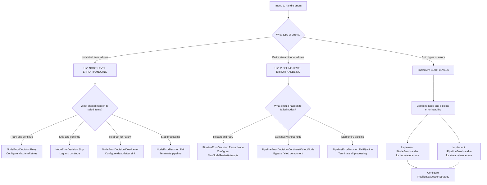

# Error Handling Overview

Robust error handling is critical for building reliable data pipelines. NPipeline provides several mechanisms to manage errors that occur during data processing, allowing you to gracefully recover, retry operations, or isolate problematic data.

## Why Error Handling Matters

By default, if an unhandled exception occurs within a node during pipeline execution, the exception will propagate up the call stack, potentially halting the entire pipeline. While this behavior is suitable for critical errors that should stop processing immediately, it's often desirable to handle errors more selectively without bringing down the entire system.

## Types of Errors in NPipeline

Errors can generally be categorized by their source and impact:

- **Node-Specific Errors**: Exceptions originating from logic within a specific `ISourceNode`, `ITransformNode`, or `ISinkNode`.
- **Data-Related Errors**: Issues caused by the data itself (e.g., invalid format, missing values) that a node attempts to process.
- **Infrastructure Errors**: Problems related to external dependencies like databases, APIs, or network connectivity.
- **Cancellation**: While not strictly an "error," a [`CancellationToken`](https://learn.microsoft.com/en-us/dotnet/api/system.threading.cancellationtoken) can signal an intentional halt to processing, which nodes should handle gracefully.

## Two Levels of Error Handling

NPipeline distinguishes between two complementary levels of error handling:

### 1. Node-Level Error Handling

Deals with errors that occur while processing an individual item within a specific node. You define what happens to that item:

- Skip it and continue
- Retry the operation
- Redirect it to a dead-letter queue
- Fail the entire pipeline

**Use this when:** Individual items fail during processing and you want to handle them without affecting other items.

### 2. Pipeline-Level Error Handling

Deals with more severe errors that might affect an entire node's stream or the pipeline's execution flow:

- Restart the failing node
- Continue without the failing node
- Fail the entire pipeline

**Use this when:** An entire node's stream fails (e.g., external service goes down) and you need to decide how the pipeline should recover.

## Decision Tree: Choosing Your Approach

## Error Handling Strategies

### For Individual Item Failures (Node-Level)

- **Retry**: Transient errors (network issues, temporary resource constraints)
- **Skip**: Non-critical errors or malformed data
- **Dead Letter**: Problematic items for later analysis
- **Fail**: When errors indicate critical system issues

### For Entire Stream Failures (Pipeline-Level)

- **Restart Node**: When failures are transient and recoverable
- **Continue Without Node**: When the node is non-critical to overall operation
- **Fail Pipeline**: When errors indicate system-wide problems

## Error Flow Visualization

```mermaid
flowchart TD
    A[Item Processing Starts] --> B{Error Occurs?}
    B -->|No| C[Continue Processing]
    B -->|Yes| D[Error Handler Invoked]

    D --> E{Error Type}
    E -->|Node-level<br>&#40;Item Error&#41;| F[INodeErrorHandler]
    E -->|Pipeline-level<br>&#40;Stream Error&#41;| G[IPipelineErrorHandler]

    %% Node-level Error Handling
    F --> H{NodeErrorDecision}
    H -->|Retry| I[Retry Item]
    H -->|Skip| J[Discard Item]
    H -->|Redirect| K[Send to Dead Letter]
    H -->|Fail| L[Pipeline Failure]

    I --> M{Max Retries Reached?}
    M -->|No| B
    M -->|Yes| O[Proceed with Decision]

    %% Pipeline-level Error Handling
    G --> R{PipelineErrorDecision}
    R -->|Restart Node| S[Restart Node Stream]
    R -->|Continue Without Node| T[Bypass Node]
    R -->|Fail Pipeline| L

    S --> Z[Restart Processing]
    Z --> B

    %% Outcomes
    C --> AD[Next Item]
    J --> AD
    T --> AE[Continue Pipeline<br>Without Node]
    L --> AF[Pipeline Terminates]
    K --> AC[Log and Store<br>Failed Item]
    AC --> C

    classDef nodeError fill:#ffe6e6,stroke:#ff6666,stroke-width:2px
    classDef pipelineError fill:#e6f3ff,stroke:#66aaff,stroke-width:2px
    classDef decision fill:#fff2cc,stroke:#ffcc00,stroke-width:2px
    classDef outcome fill:#e6ffe6,stroke:#66cc66,stroke-width:2px

    class F,H,I,J,K,L nodeError
    class G,R,S,T pipelineError
    class B,E,M decision
    class C,AD,AE,AF outcome
```

## Related Documentation

- [Node-Level Error Handling](node-error-handling.md) - Implement custom error handlers for individual items
- [Pipeline-Level Error Handling](pipeline-error-handling.md) - Manage errors affecting entire node streams
- [Getting Started with Resilience](getting-started.md) - Quick guide to common error handling patterns
- [Retries](retries.md) - Configure retry policies and strategies
- [Circuit Breakers](circuit-breakers.md) - Prevent cascading failures with circuit breaker patterns
