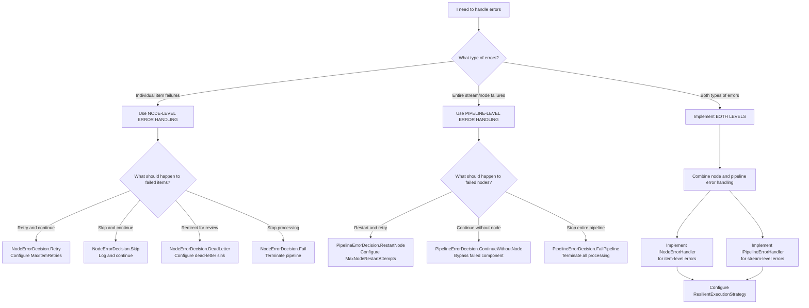

# Error Handling in NPipeline

## Prerequisites

Before understanding error handling, you should be familiar with:
- [Core Concepts Overview](../index.md) - Basic NPipeline concepts and terminology
- [Nodes Overview](../nodes/index.md) - Understanding the node types where errors occur
- [PipelineBuilder](../pipelinebuilder.md) - How to configure error handling in pipeline construction
- [Execution Strategies](../pipeline-execution/execution-strategies.md) - How error handling integrates with execution

## Overview

Robust error handling is critical for building reliable data pipelines. NPipeline provides several mechanisms to manage errors that occur during data processing, allowing you to gracefully recover, retry operations, or isolate problematic data.

By default, if an unhandled exception occurs within a node during pipeline execution, the exception will propagate up the call stack, potentially halting the entire pipeline. While this behavior is suitable for critical errors that should stop processing immediately, it's often desirable to handle errors more selectively without bringing down the entire system.

Errors in NPipeline can generally be categorized by their source and impact:

* **Node-Specific Errors**: Exceptions originating from logic within a specific `ISourceNode`, `ITransformNode`, or `ISinkNode`.
* **Data-Related Errors**: Issues caused by the data itself (e.g., invalid format, missing values) that a node attempts to process.
* **Infrastructure Errors**: Problems related to external dependencies like databases, APIs, or network connectivity.
* **Cancellation**: While not strictly an "error," a [`CancellationToken`](https://learn.microsoft.com/en-us/dotnet/api/system.threading.cancellationtoken) can signal an intentional halt to processing, which nodes should handle gracefully.

NPipeline distinguishes between two levels of error handling:

1. **Node-level Error Handling**: Deals with errors that occur while processing an individual item within a specific node. You define what happens to that item (e.g., skip, retry, redirect to dead-letter).
2. **Pipeline-level Error Handling**: Deals with more severe errors that might affect an entire node's stream or the pipeline's execution flow (e.g., restarting a failing node, failing the entire pipeline).

## Choosing Your Error Handling Approach



This decision tree helps you determine the appropriate error handling approach based on your specific needs:

* **Node-level Error Handling** for individual item failures:
  * **Retry** transient errors (network issues, temporary resource constraints)
  * **Skip** non-critical errors or malformed data
  * **Dead Letter** problematic items for later analysis
  * **Fail** when errors indicate critical system issues

* **Pipeline-level Error Handling** for entire stream/node failures:
  * **Restart Node** when failures are transient and recoverable
  * **Continue Without Node** when the node is non-critical to overall operation
  * **Fail Pipeline** when errors indicate system-wide problems

* **Combined Approach** when you need to handle both individual item and stream-level errors

## Error Handling Levels

### Node-Level Error Handling

Node-level error handling in NPipeline allows you to manage errors that occur while processing individual items within a specific node. This granular approach enables you to define what happens to each problematic item without affecting the entire pipeline.

When an error occurs during the processing of an individual item in a node, NPipeline's error handling mechanism invokes the appropriate `INodeErrorHandler` to determine how to proceed. This allows you to implement strategies like retrying the item, skipping it, or redirecting it to a dead-letter queue.

#### INodeErrorHandler Interface

To handle errors within a specific node, you implement [`INodeErrorHandler<in TNode, in TData>`](../../../src/NPipeline/Abstractions/ErrorHandling/INodeErrorHandler.cs) interface.

```csharp
public interface INodeErrorHandler
{
}

/// <summary>
///     Defines the contract for handling errors that occur within a specific node.
/// </summary>
/// <typeparam name="TNode">The type of node where the error occurred.</typeparam>
/// <typeparam name="TData">The type of the data item that failed.</typeparam>
public interface INodeErrorHandler<in TNode, in TData> : INodeErrorHandler where TNode : INode
{
    /// <summary>
    ///     Handles an error that occurred during node execution.
    /// </summary>
    /// <param name="node">The instance of node that failed.</param>
    /// <param name="failedItem">The data item that caused the error.</param>
    /// <param name="error">The exception that was thrown.</param>
    /// <param name="context">The current pipeline context.</param>
    /// <param name="cancellationToken">A token to observe for cancellation requests.</param>
    /// <returns>A <see cref="NodeErrorDecision" /> indicating how to proceed.</returns>
    Task<NodeErrorDecision> HandleAsync(
        TNode node,
        TData failedItem,
        Exception error,
        PipelineContext context,
        CancellationToken cancellationToken);
}
```

* **`INodeErrorHandler`**: Marker interface for dependency injection registration of node error handlers.
* **`INodeErrorHandler<in TNode, in TData>`**: Generic interface that inherits from the marker interface and defines the actual error handling logic.
* **`TNode`**: The type of node where the error occurred.
* **`TData`**: The type of the data item that caused the error.
* **`HandleAsync`**: This method is called when an error occurs. It receives the failing node, item, exception, and pipeline context. It must return a `NodeErrorDecision`.

#### NodeErrorDecision

This enum dictates how the pipeline should proceed after a node-level error:

* **`Skip`**: The failed item is discarded, and the pipeline continues processing subsequent items.
* **`Retry`**: The pipeline attempts to re-process the failed item. The number of retries is configured via `PipelineRetryOptions`.
* **`DeadLetter`**: The failed item is sent to a configured dead-letter sink, and the pipeline continues.
* **`Fail`**: The pipeline immediately terminates with an exception.

#### Implementing a Custom Node Error Handler

```csharp
using NPipeline;
using NPipeline.ErrorHandling;
using NPipeline.Nodes;
using NPipeline.Pipeline;

/// <summary>
/// Custom node error handler for transform nodes processing string data.
/// Demonstrates error classification and appropriate response strategies.
/// </summary>
public sealed class MyNodeErrorHandler : INodeErrorHandler<ITransformNode<string, string>, string>
{
    private readonly ILogger _logger;

    public MyNodeErrorHandler(ILogger logger)
    {
        _logger = logger;
    }

    /// <summary>
    /// Handles errors that occur during string transformation.
    /// Implements different strategies based on error type for optimal recovery.
    /// </summary>
    public Task<NodeErrorDecision> HandleAsync(
        ITransformNode<string, string> node,
        string failedItem,
        Exception error,
        PipelineContext context,
        CancellationToken cancellationToken)
    {
        // Log error with full context for troubleshooting
        _logger.LogError(error, "Error in node '{NodeName}' processing '{FailedItem}': {ErrorMessage}",
            node.Name, failedItem, error.Message);

        // Choose error handling strategy based on exception type
        return error switch
        {
            // Data format errors are permanent - send to dead letter queue
            FormatException => Task.FromResult(NodeErrorDecision.DeadLetter),
            
            // Items marked for retry get another chance
            _ when failedItem.Contains("retry") => Task.FromResult(NodeErrorDecision.Retry),
            
            // All other errors are skipped to continue processing
            _ => Task.FromResult(NodeErrorDecision.Skip)
        };
    }
}
```

#### Registering a Node Error Handler

You register a node error handler for a specific node using the `WithErrorHandler` method on `PipelineBuilder`:

```csharp
using NPipeline;
using NPipeline.ErrorHandling;
using NPipeline.Pipeline;

public sealed class ErrorHandlingPipelineDefinition : IPipelineDefinition
{
    public void Define(PipelineBuilder builder, PipelineContext context)
    {
        var sourceHandle = builder.AddSource<DataSource, string>();
        var transformHandle = builder.AddTransform<DataTransform, string, string>();
        var sinkHandle = builder.AddSink<DataSink, string>();

        builder.Connect(sourceHandle, transformHandle);
        builder.Connect(transformHandle, sinkHandle);

        // Configure retry options
        builder.WithRetryOptions(new PipelineRetryOptions(
            MaxItemRetries: 3,
            MaxNodeRestartAttempts: 2,
            MaxSequentialNodeAttempts: 5
        ));
    }
}
```

You also need to register your custom error handler with your DI container:

```csharp
services.AddSingleton<INodeErrorHandler<ITransformNode<string, string>, string>, MyNodeErrorHandler>();
```

The marker interface `INodeErrorHandler` (non-generic version) is used for dependency injection registration purposes, allowing the DI container to discover all node error handler implementations.

#### Common Node Error Handling Scenarios

**Scenario 1: Handling Transient Network Errors**

```csharp
public class NetworkErrorHandler : INodeErrorHandler<IApiTransformNode, string>
{
    private readonly ILogger _logger;
    private int _retryCount = 0;

    public NetworkErrorHandler(ILogger logger)
    {
        _logger = logger;
    }

    /// <summary>
    /// Handles network errors with exponential backoff retry strategy.
    /// Transient errors are retried, persistent failures are redirected.
    /// </summary>
    public Task<NodeErrorDecision> HandleAsync(
        IApiTransformNode node,
        string failedItem,
        Exception error,
        PipelineContext context,
        CancellationToken cancellationToken)
    {
        // Handle network-related errors specifically
        if (error is HttpRequestException httpEx)
        {
            _retryCount++;
            _logger.LogWarning("Network error (attempt {RetryCount}): {ErrorMessage}", 
                _retryCount, httpEx.Message);

            // Retry up to 3 times for transient network errors
            if (_retryCount <= 3)
            {
                return Task.FromResult(NodeErrorDecision.Retry);
            }
            else
            {
                // After max retries, reset counter and redirect to dead letter
                _retryCount = 0;
                return Task.FromResult(NodeErrorDecision.DeadLetter);
            }
        }

        // Non-network errors are skipped to continue processing
        return Task.FromResult(NodeErrorDecision.Skip);
    }
}
```

**Scenario 2: Data Validation Errors**

```csharp
public class ValidationErrorHandler : INodeErrorHandler<IValidatorNode, string>
{
    private readonly ILogger _logger;

    public ValidationErrorHandler(ILogger logger)
    {
        _logger = logger;
    }

    /// <summary>
    /// Handles validation errors by redirecting to dead letter queue.
    /// Data quality issues are logged separately from system errors.
    /// </summary>
    public Task<NodeErrorDecision> HandleAsync(
        IValidatorNode node,
        string failedItem,
        Exception error,
        PipelineContext context,
        CancellationToken cancellationToken)
    {
        // Handle validation errors specifically
        if (error is ValidationException validationEx)
        {
            _logger.LogWarning("Validation failed for item: {Item}. Error: {Error}", 
                failedItem, validationEx.Message);

            // Validation failures indicate data quality issues - redirect for manual review
            return Task.FromResult(NodeErrorDecision.DeadLetter);
        }

        // Other types of errors are skipped to continue processing
        return Task.FromResult(NodeErrorDecision.Skip);
    }
}
```

#### Fluent Error Handler Builder

For simpler scenarios where creating a full error handler class would be verbose, NPipeline provides a fluent builder API that allows you to construct error handlers inline using a chainable syntax.

The `ErrorHandler` static class provides factory methods for quickly building error handlers:

```csharp
using NPipeline.ErrorHandling;

// Create a handler that retries on timeout, skips on validation errors
var handler = ErrorHandler.ForNode<MyTransform, string>()
    .On<TimeoutException>().Retry(3)
    .On<ValidationException>().Skip()
    .OnAny().DeadLetter()
    .Build();
```

**Pre-built Handler Factories:**

NPipeline includes several pre-built handlers for common scenarios:

```csharp
// Retry all errors up to N times, then dead-letter
var retryHandler = ErrorHandler.RetryAlways<MyTransform, string>(maxRetries: 3);

// Skip all errors and continue processing
var skipHandler = ErrorHandler.SkipAlways<MyTransform, string>();

// Send all errors to dead-letter sink
var deadLetterHandler = ErrorHandler.DeadLetterAlways<MyTransform, string>();
```

**Exception Type Matching:**

The fluent builder supports matching on specific exception types, including derived types. Rules are evaluated in order, so place more specific rules before more general ones:

```csharp
var handler = ErrorHandler.ForNode<MyTransform, string>()
    .On<TimeoutException>().Retry(3)
    .On<IOException>().Retry(5)
    .On<ArgumentException>().Skip()
    .On<InvalidOperationException>().Fail()
    .OnAny().DeadLetter()  // Catch-all for any unmatched exceptions (must be last)
    .Build();
```

**Important**: `OnAny()` must be the last rule because it matches all exceptions. Placing other rules after it will have no effect.

**Custom Predicate Matching:**

For more complex scenarios, use custom predicates to match exceptions:

```csharp
var handler = ErrorHandler.ForNode<MyTransform, string>()
    .When(ex => ex.Message.Contains("timeout", StringComparison.OrdinalIgnoreCase))
        .Retry(3)
    .When(ex => ex.Message.Contains("invalid", StringComparison.OrdinalIgnoreCase))
        .Skip()
    .OnAny().Fail()
    .Build();
```

**Default Behavior:**

Use `Otherwise()` to set a default behavior when no rules match:

```csharp
var handler = ErrorHandler.ForNode<MyTransform, string>()
    .On<TimeoutException>().Retry(2)
    .Otherwise(NodeErrorDecision.Skip)  // Skip other exceptions
    .Build();
```

**How the Fluent Builder Works:**

1. **Rule Evaluation Order**: Rules are evaluated in the order they are added. The first matching rule determines the action. This means `OnAny()` must be the last rule as a catch-all for unmatched exceptions.
2. **Retry Counting**: The builder automatically tracks retry attempts and transitions to dead-letter after max retries are exhausted.
3. **Type Hierarchy**: Exception matching respects inheritance - `On<ArgumentException>()` will also match `ArgumentNullException`.
4. **Catch-All Pattern**: Use `OnAny()` only at the end as a catch-all for exceptions not matched by earlier rules.

**Using with PipelineBuilder:**

Once built, the handler can be registered like any other error handler:

```csharp
public void Define(PipelineBuilder builder, PipelineContext context)
{
    var handler = ErrorHandler.ForNode<MyTransform, string>()
        .On<TimeoutException>().Retry(3)
        .On<ValidationException>().Skip()
        .OnAny().DeadLetter()
        .Build();
    
    var transform = builder.AddTransform<MyTransform, string, string>("my-transform");
    
    // Register the handler with the specific node
    builder.WithErrorHandler(transform, handler.GetType());
    
    // Continue with pipeline definition...
}
```

**When to Use the Fluent Builder:**

- ✅ Simple error handling logic with clear exception-to-action mapping
- ✅ Prototyping or quick implementations
- ✅ Straightforward retry/skip/dead-letter strategies
- ❌ Complex state management across multiple items
- ❌ Advanced logging, metrics, or custom recovery logic
- ❌ Error handling that requires dependency injection

For complex scenarios requiring custom logic, state management, or dependency injection, implement `INodeErrorHandler<TNode, TData>` directly.

### Pipeline-Level Error Handling

Pipeline-level error handling in NPipeline is designed to manage errors that affect an entire node's stream rather than individual items. These are typically more severe errors that might impact the entire pipeline execution flow, such as infrastructure failures or external service outages.

When an error occurs that affects an entire node's stream (e.g., an external service going down), NPipeline's `ResilientExecutionStrategy` consults the configured `IPipelineErrorHandler` to determine how to react to such failures. This allows you to implement strategies like restarting a failing node, continuing without it, or failing the entire pipeline.

#### IPipelineErrorHandler Interface

For errors that affect an entire node's stream, you implement [`IPipelineErrorHandler`](../../../src/NPipeline/Abstractions/ErrorHandling/IPipelineErrorHandler.cs) interface.

```csharp
public interface IPipelineErrorHandler
{
    Task<PipelineErrorDecision> HandleNodeFailureAsync(
        string nodeId,
        Exception error,
        PipelineContext context,
        CancellationToken cancellationToken);
}
```

#### PipelineErrorDecision

This enum defines the decision when a node stream fails:

* **`RestartNode`**: The node's entire input stream will be re-processed from the beginning (requires the input stream to be replayable, e.g., if materialized by `ResilientExecutionStrategy`).
* **`ContinueWithoutNode`**: The failing node is effectively removed from the pipeline, and its output stream will be empty. The pipeline continues without it.
* **`FailPipeline`**: The entire pipeline execution terminates.

#### Implementing a Custom Pipeline Error Handler

```csharp
using NPipeline;
using NPipeline.ErrorHandling;
using NPipeline.Pipeline;

/// <summary>
/// Pipeline-level error handler for managing node failures.
/// Demonstrates circuit breaker pattern and restart logic.
/// </summary>
public sealed class MyPipelineErrorHandler : IPipelineErrorHandler
{
    private readonly ILogger _logger;
    private readonly Dictionary<string, int> _nodeRestartAttempts = new();

    public MyPipelineErrorHandler(ILogger logger)
    {
        _logger = logger;
    }

    /// <summary>
    /// Handles node-level failures that affect entire stream processing.
    /// Implements circuit breaker pattern to prevent infinite restart loops.
    /// </summary>
    public Task<PipelineErrorDecision> HandleNodeFailureAsync(
        string nodeId,
        Exception error,
        PipelineContext context,
        CancellationToken cancellationToken)
    {
        // Track restart attempts for each node
        _nodeRestartAttempts.TryGetValue(nodeId, out var attempts);
        attempts++;
        _nodeRestartAttempts[nodeId] = attempts;

        // Log failure with context for monitoring
        _logger.LogError(error, "Pipeline-level error in node '{NodeId}': {ErrorMessage}",
            nodeId, error.Message);

        // Implement circuit breaker pattern - limit restart attempts
        if (attempts < 3)
        {
            _logger.LogInformation("Attempting to restart node '{NodeId}'. Attempt: {Attempt}",
                nodeId, attempts);
            return Task.FromResult(PipelineErrorDecision.RestartNode);
        }
        else
        {
            _logger.LogError("Node '{NodeId}' failed too many times, failing pipeline.", nodeId);
            return Task.FromResult(PipelineErrorDecision.FailPipeline);
        }
    }
}
```

#### Registering a Pipeline Error Handler

You register a pipeline error handler using the `AddPipelineErrorHandler` method on `PipelineBuilder`:

```csharp
using NPipeline;
using NPipeline.ErrorHandling;
using NPipeline.Pipeline;

public sealed class ErrorHandlingPipelineDefinition : IPipelineDefinition
{
    public void Define(PipelineBuilder builder, PipelineContext context)
    {
        var sourceHandle = builder.AddSource<DataSource, string>();
        var transformHandle = builder.AddTransform<DataTransform, string, string>();
        var sinkHandle = builder.AddSink<DataSink, string>();

        builder.Connect(sourceHandle, transformHandle);
        builder.Connect(transformHandle, sinkHandle);

        // Configure retry options
        builder.WithRetryOptions(new PipelineRetryOptions(
            MaxItemRetries: 3,
            MaxNodeRestartAttempts: 2,
            MaxSequentialNodeAttempts: 5
        ));

        // Register the pipeline error handler
        builder.AddPipelineErrorHandler<MyPipelineErrorHandler>();
    }
}
```

You also need to register your custom error handler with your DI container:

```csharp
services.AddSingleton<IPipelineErrorHandler, MyPipelineErrorHandler>();
```

#### Common Pipeline Error Handling Scenarios

**Scenario 1: Resource Exhaustion Handling**

```csharp
using NPipeline;
using NPipeline.ErrorHandling;
using NPipeline.Pipeline;

/// <summary>
/// Pipeline definition with basic error handling configuration.
/// Demonstrates how to configure retry options at pipeline level.
/// </summary>
public sealed class ErrorHandlingPipelineDefinition : IPipelineDefinition
{
    public void Define(PipelineBuilder builder, PipelineContext context)
    {
        // Add nodes to pipeline
        var sourceHandle = builder.AddSource<DataSource, string>("data_source");
        var transformHandle = builder.AddTransform<DataTransform, string, string>("data_transform");
        var sinkHandle = builder.AddSink<DataSink, string>("data_sink");

        // Connect nodes to define data flow
        builder.Connect(sourceHandle, transformHandle);
        builder.Connect(transformHandle, sinkHandle);

        // Configure retry options for resilience
        // These settings control how many times items/nodes can be retried
        builder.WithRetryOptions(new PipelineRetryOptions(
            MaxItemRetries: 3,           // Retry individual items up to 3 times
            MaxNodeRestartAttempts: 2,     // Allow node to restart up to 2 times
            MaxSequentialNodeAttempts: 5     // Limit sequential attempts to prevent infinite loops
        ));
    }
}
```

**Scenario 2: External Service Dependency Handling**

```csharp
using NPipeline;
using NPipeline.ErrorHandling;
using NPipeline.Pipeline;

/// <summary>
/// Node error handler for network-related operations.
/// Demonstrates transient error handling with retry logic.
/// </summary>
public class NetworkErrorHandler : INodeErrorHandler<IApiTransformNode, string>
{
    private readonly ILogger _logger;
    private int _retryCount = 0;

    public NetworkErrorHandler(ILogger logger)
    {
        _logger = logger;
    }

    /// <summary>
    /// Handles network errors with exponential backoff retry strategy.
    /// Transient errors are retried, persistent failures are redirected.
    /// </summary>
    public Task<NodeErrorDecision> HandleAsync(
        IApiTransformNode node,
        string failedItem,
        Exception error,
        PipelineContext context,
        CancellationToken cancellationToken)
    {
        // Handle network-related errors specifically
        if (error is HttpRequestException httpEx)
        {
            _retryCount++;
            _logger.LogWarning("Network error (attempt {RetryCount}): {ErrorMessage}", 
                _retryCount, httpEx.Message);

            // Retry up to 3 times for transient network errors
            if (_retryCount <= 3)
            {
                return Task.FromResult(NodeErrorDecision.Retry);
            }
            else
            {
                // After max retries, reset counter and redirect to dead letter
                _retryCount = 0;
                return Task.FromResult(NodeErrorDecision.DeadLetter);
            }
        }

        // Non-network errors are skipped to continue processing
        return Task.FromResult(NodeErrorDecision.Skip);
    }
}
```

**Scenario 3: Data Validation Errors**

```csharp
using NPipeline;
using NPipeline.ErrorHandling;
using NPipeline.Pipeline;

/// <summary>
/// Node error handler for data validation scenarios.
/// Demonstrates how to handle data quality issues separately from system errors.
/// </summary>
public class ValidationErrorHandler : INodeErrorHandler<IValidatorNode, string>
{
    private readonly ILogger _logger;

    public ValidationErrorHandler(ILogger logger)
    {
        _logger = logger;
    }

    /// <summary>
    /// Handles validation errors by redirecting to dead letter queue.
    /// Data quality issues are logged separately from system errors.
    /// </summary>
    public Task<NodeErrorDecision> HandleAsync(
        IValidatorNode node,
        string failedItem,
        Exception error,
        PipelineContext context,
        CancellationToken cancellationToken)
    {
        // Handle validation errors specifically
        if (error is ValidationException validationEx)
        {
            _logger.LogWarning("Validation failed for item: {Item}. Error: {Error}", 
                failedItem, validationEx.Message);

            // Validation failures indicate data quality issues - redirect for manual review
            return Task.FromResult(NodeErrorDecision.DeadLetter);
        }

        // Other types of errors are skipped to continue processing
        return Task.FromResult(NodeErrorDecision.Skip);
    }
}
```

**Scenario 4: Resource Exhaustion Handling**

```csharp
using NPipeline;
using NPipeline.ErrorHandling;
using NPipeline.Pipeline;

/// <summary>
/// Pipeline error handler for resource exhaustion scenarios.
/// Demonstrates critical error handling for system resource issues.
/// </summary>
public class ResourceExhaustionHandler : IPipelineErrorHandler
{
    private readonly ILogger _logger;
    private readonly Dictionary<string, int> _nodeFailureCounts = new();

    public ResourceExhaustionHandler(ILogger logger)
    {
        _logger = logger;
    }

    /// <summary>
    /// Handles resource exhaustion by failing fast to prevent system damage.
    /// Critical resource errors should immediately terminate processing.
    /// </summary>
    public Task<PipelineErrorDecision> HandleNodeFailureAsync(
        string nodeId,
        Exception error,
        PipelineContext context,
        CancellationToken cancellationToken)
    {
        // Track failure count for each node
        _nodeFailureCounts.TryGetValue(nodeId, out var count);
        _nodeFailureCounts[nodeId] = count + 1;

        // Handle critical resource errors immediately
        if (error is OutOfMemoryException or InsufficientMemoryException)
        {
            _logger.LogCritical("Resource exhaustion in node '{NodeId}': {Error}", nodeId, error.Message);
            return Task.FromResult(PipelineErrorDecision.FailPipeline);
        }

        // For other errors, allow limited restarts
        if (_nodeFailureCounts[nodeId] <= 3)
        {
            _logger.LogWarning("Restarting node '{NodeId}' (attempt {Attempt})", 
                nodeId, _nodeFailureCounts[nodeId]);
            return Task.FromResult(PipelineErrorDecision.RestartNode);
        }

        // Too many failures - continue without the problematic node
        _logger.LogError("Node '{NodeId}' failed too many times, continuing without it", nodeId);
        return Task.FromResult(PipelineErrorDecision.ContinueWithoutNode);
    }
}
```

**Scenario 5: Production-ready Node Error Handler with Metrics Integration**

```csharp
using NPipeline;
using NPipeline.ErrorHandling;
using NPipeline.Pipeline;

/// <summary>
/// Production-ready node error handler with metrics integration.
/// Demonstrates comprehensive error handling with observability.
/// </summary>
public class ProductionNodeErrorHandler : INodeErrorHandler<ITransformNode<string, string>, string>
{
    private readonly ILogger _logger;
    private readonly IMetrics _metrics;

    public ProductionNodeErrorHandler(ILogger logger, IMetrics metrics)
    {
        _logger = logger;
        _metrics = metrics;
    }

    /// <summary>
    /// Handles errors with comprehensive logging and metrics collection.
    /// Enables monitoring and alerting for production environments.
    /// </summary>
    public Task<NodeErrorDecision> HandleAsync(
        ITransformNode<string, string> node,
        string failedItem,
        Exception error,
        PipelineContext context,
        CancellationToken cancellationToken)
    {
        // Record error metrics for monitoring
        _metrics.Increment("node_errors", new[] { 
            new KeyValuePair<string, object>("node_type", node.GetType().Name),
            new KeyValuePair<string, object>("error_type", error.GetType().Name)
        });

        // Log error with full context
        _logger.LogError(error, "Error processing item in node {NodeName}", node.Name);

        // Implement error handling strategy based on exception type
        return error switch
        {
            // Data validation errors - redirect to dead letter
            ValidationException => Task.FromResult(NodeErrorDecision.DeadLetter),
            
            // Transient errors - retry
            TimeoutException => Task.FromResult(NodeErrorDecision.Retry),
            HttpRequestException => Task.FromResult(NodeErrorDecision.Retry),
            
            // All other errors - skip
            _ => Task.FromResult(NodeErrorDecision.Skip)
        };
    }
}

/// <summary>
/// Production-ready pipeline error handler with circuit breaker pattern.
/// Demonstrates sophisticated error handling for production environments.
/// </summary>
public class ProductionPipelineErrorHandler : IPipelineErrorHandler
{
    private readonly ILogger _logger;
    private readonly Dictionary<string, int> _failureCounts = new();

    public ProductionPipelineErrorHandler(ILogger logger)
    {
        _logger = logger;
    }

    /// <summary>
    /// Handles node failures with circuit breaker pattern.
    /// Prevents cascading failures by limiting restart attempts.
    /// </summary>
    public Task<PipelineErrorDecision> HandleNodeFailureAsync(
        string nodeId,
        Exception error,
        PipelineContext context,
        CancellationToken cancellationToken)
    {
        // Track failure count for circuit breaker logic
        _failureCounts.TryGetValue(nodeId, out var count);
        _failureCounts[nodeId] = count + 1;

        // Log failure for monitoring
        _logger.LogError(error, "Node {NodeId} failed (attempt {Attempt})", 
            nodeId, _failureCounts[nodeId]);

        // Implement circuit breaker based on error type and count
        return error switch
        {
            // Critical resource errors - fail immediately
            OutOfMemoryException => Task.FromResult(PipelineErrorDecision.FailPipeline),
            
            // Transient errors - allow limited restarts
            _ when _failureCounts[nodeId] < 3 => Task.FromResult(PipelineErrorDecision.RestartNode),
            
            // Persistent failures - continue without node
            _ => Task.FromResult(PipelineErrorDecision.ContinueWithoutNode)
        };
    }
}
```

### Error Flow Diagram

```mermaid
flowchart TD
    A[Item Processing Starts] --> B{Error Occurs?}
    B -->|No| C[Continue Processing]
    B -->|Yes| D[Error Handler Invoked]

    D --> E{Error Type}
    E -->|Node-level<br>&#40;Item Error&#41;| F[INodeErrorHandler]
    E -->|Pipeline-level<br>&#40;Stream Error&#41;| G[IPipelineErrorHandler]

    %% Node-level Error Handling
    F --> H{NodeErrorDecision}
    H -->|Retry| I[Retry Item]
    H -->|Skip| J[Discard Item]
    H -->|Redirect| K[Send to Dead Letter]
    H -->|Fail| L[Pipeline Failure]

    I --> M{Max Retries Reached?}
    M -->|No| B
    M -->|Yes| N{Circuit Breaker Active?}
    N -->|No| O[Increment Failure Count]
    N -->|Yes| P[Pipeline Abort]
    O --> Q{Failure Threshold Reached?}
    Q -->|No| H
    Q -->|Yes| P

    %% Pipeline-level Error Handling
    G --> R{PipelineErrorDecision}
    R -->|Restart Node| S[Restart Node Stream]
    R -->|Continue Without Node| T[Bypass Node]
    R -->|Fail Pipeline| L

    S --> U{Max Node Restarts Reached?}
    U -->|No| V[Materialize Stream<br>if Needed]
    U -->|Yes| W{Circuit Breaker Active?}
    W -->|No| X[Increment Failure Count]
    W -->|Yes| P
    X --> Y{Failure Threshold Reached?}
    Y -->|No| R
    Y -->|Yes| P

    V --> Z[Restart Processing]
    Z --> B

    %% Dead Letter Processing
    K --> AA[Dead Letter Sink]
    AA --> AB[Log Error Details]
    AB --> AC[Store Failed Item]
    AC --> C

    %% Outcomes
    C --> AD[Next Item]
    J --> AD
    T --> AE[Continue Pipeline<br>Without Node]
    L --> AF[Pipeline Terminates]
    P --> AF

    %% Styling
    classDef nodeError fill:#ffe6e6,stroke:#ff6666,stroke-width:2px
    classDef pipelineError fill:#e6f3ff,stroke:#66aaff,stroke-width:2px
    classDef decision fill:#fff2cc,stroke:#ffcc00,stroke-width:2px
    classDef outcome fill:#e6ffe6,stroke:#66cc66,stroke-width:2px
    classDef circuitBreaker fill:#ffcccc,stroke:#ff0000,stroke-width:2px

    class F,H,I,J,K,L nodeError
    class G,R,S,T,W pipelineError
    class B,E,M,N,Q,U,W,Y decision
    class C,AD,AE,AF outcome
    class N,P,W circuitBreaker
```



*Figure: Error handling flow in NPipeline showing the decision tree for both node-level and pipeline-level error handling, including retry logic, circuit breaker behavior, and dead letter queue routing.*

## Configuration Examples

### Basic Error Handling Configuration

To get started with error handling, you can configure basic error handling directly in your pipeline definition:

```csharp
using NPipeline;
using NPipeline.ErrorHandling;
using NPipeline.Pipeline;

// Example 1: Basic error handling with default retry options
public sealed class ErrorHandlingPipelineDefinition : IPipelineDefinition
{
    public void Define(PipelineBuilder builder, PipelineContext context)
    {
        var sourceHandle = builder.AddSource<DataSource, string>();
        var transformHandle = builder.AddTransform<DataTransform, string, string>();
        var sinkHandle = builder.AddSink<DataSink, string>();

        builder.Connect(sourceHandle, transformHandle);
        builder.Connect(transformHandle, sinkHandle);

        // Configure retry options using PipelineRetryOptions
        builder.WithRetryOptions(new PipelineRetryOptions(
            MaxItemRetries: 3,
            MaxNodeRestartAttempts: 2,
            MaxSequentialNodeAttempts: 5
        ));
    }
}

public static class Program
{
    public static async Task Main(string[] args)
    {
        var runner = PipelineRunner.Create();
        var context = PipelineContext.Default;

        var pipeline = PipelineBuilder.Create<ErrorHandlingPipelineDefinition>();
        await runner.RunAsync<ErrorHandlingPipelineDefinition>(context);
    }
}
```

### Production-Ready Error Handling Example

Here's a complete example that combines all error handling concepts:

```csharp
using NPipeline;
using NPipeline.ErrorHandling;
using NPipeline.Pipeline;

// 1. Define custom error handlers
public class ProductionNodeErrorHandler : INodeErrorHandler<ITransformNode<string, string>, string>
{
    private readonly ILogger _logger;
    private readonly IMetrics _metrics;

    public ProductionNodeErrorHandler(ILogger logger, IMetrics metrics)
    {
        _logger = logger;
        _metrics = metrics;
    }

    /// <summary>
    /// Handles errors with comprehensive logging and metrics collection.
    /// Enables monitoring and alerting for production environments.
    /// </summary>
    public Task<NodeErrorDecision> HandleAsync(
        ITransformNode<string, string> node,
        string failedItem,
        Exception error,
        PipelineContext context,
        CancellationToken cancellationToken)
    {
        // Record error metrics for monitoring
        _metrics.Increment("node_errors", new[] { 
            new KeyValuePair<string, object>("node_type", node.GetType().Name),
            new KeyValuePair<string, object>("error_type", error.GetType().Name)
        });

        // Log error with full context
        _logger.LogError(error, "Error processing item in node {NodeName}", node.Name);

        // Implement error handling strategy based on exception type
        return error switch
        {
            // Data validation errors - redirect to dead letter
            ValidationException => Task.FromResult(NodeErrorDecision.DeadLetter),
            
            // Transient errors - retry
            TimeoutException => Task.FromResult(NodeErrorDecision.Retry),
            HttpRequestException => Task.FromResult(NodeErrorDecision.Retry),
            
            // All other errors - skip
            _ => Task.FromResult(NodeErrorDecision.Skip)
        };
    }
}

public class ProductionPipelineErrorHandler : IPipelineErrorHandler
{
    private readonly ILogger _logger;
    private readonly Dictionary<string, int> _failureCounts = new();

    public ProductionPipelineErrorHandler(ILogger logger)
    {
        _logger = logger;
    }

    /// <summary>
    /// Handles node failures with circuit breaker pattern.
    /// Prevents cascading failures by limiting restart attempts.
    /// </summary>
    public Task<PipelineErrorDecision> HandleNodeFailureAsync(
        string nodeId,
        Exception error,
        PipelineContext context,
        CancellationToken cancellationToken)
    {
        // Track failure count for circuit breaker logic
        _failureCounts.TryGetValue(nodeId, out var count);
        _failureCounts[nodeId] = count + 1;

        // Log failure for monitoring
        _logger.LogError(error, "Node {NodeId} failed (attempt {Attempt})", 
            nodeId, _failureCounts[nodeId]);

        // Implement circuit breaker based on error type and count
        return error switch
        {
            // Critical resource errors - fail immediately
            OutOfMemoryException => Task.FromResult(PipelineErrorDecision.FailPipeline),
            
            // Transient errors - allow limited restarts
            _ when _failureCounts[nodeId] < 3 => Task.FromResult(PipelineErrorDecision.RestartNode),
            
            // Persistent failures - continue without node
            _ => Task.FromResult(PipelineErrorDecision.ContinueWithoutNode)
        };
    }
}

// 2. Configure the pipeline with comprehensive error handling
public sealed class ProductionPipelineDefinition : IPipelineDefinition
{
    public void Define(PipelineBuilder builder, PipelineContext context)
    {
        var sourceHandle = builder.AddSource<DataSource, string>();
        var transformHandle = builder.AddTransform<DataTransform, string, string>();
        var sinkHandle = builder.AddSink<DataSink, string>();

        builder.Connect(sourceHandle, transformHandle);
        builder.Connect(transformHandle, sinkHandle);

        // Configure retry options
        builder.WithRetryOptions(new PipelineRetryOptions(
            MaxItemRetries: 3,
            MaxNodeRestartAttempts: 2,
            MaxSequentialNodeAttempts: 5
        ));
    }
}

public static class Program
{
    public static async Task Main(string[] args)
    {
        var runner = PipelineRunner.Create();

        // Configure retry options at context level
        var retryOptions = new PipelineRetryOptions(
            MaxItemRetries: 3,
            MaxNodeRestartAttempts: 2,
            MaxSequentialNodeAttempts: 5
        );

        var context = PipelineContext.WithRetry(retryOptions);

        var pipeline = PipelineBuilder.Create<ProductionPipelineDefinition>();
        
        // Configure error handlers through the pipeline runner or register via dependency injection
        // The PipelineErrorHandler can be registered in the service container:
        var serviceProvider = new ServiceCollection()
            .AddSingleton<IPipelineErrorHandler, ProductionPipelineErrorHandler>()
            .AddSingleton<INodeErrorHandler<ITransformNode<string, string>, string>, ProductionNodeErrorHandler>()
            .AddSingleton<IDeadLetterSink, FileDeadLetterSink>()
            .BuildServiceProvider();

        var runner = PipelineRunner.Create();
        await runner.RunAsync<ProductionPipelineDefinition>(context);
    }
}
```

### Retry Options Precedence

NPipeline follows a clear precedence order when determining which retry options to use:

1. **Node-specific options**: Options set directly on a specific node using `WithRetryOptions(nodeHandle, options)`
2. **Graph-level options**: Options set at the pipeline level using `builder.WithRetryOptions(options)`
3. **Context-level options**: Options provided through `PipelineContext(retryOptions: options)`

This hierarchy allows for fine-grained control where you can:
* Override retry behavior for specific nodes that need special handling
* Set default behavior for the entire pipeline
* Provide runtime options through the context

### Propagating Contextual Information

The [`PipelineContext`](../../../src/NPipeline/PipelineContext.cs) can be invaluable for error handling. You can store error-specific information, such as correlation IDs, loggers, or even error reporting services, within the context, making them accessible to any node that needs to handle or report an error.

## Best Practices

### Node-level Error Handling Best Practices

1. **Be specific about error types**: Different error types should be handled differently. Transient errors (like network issues) might be worth retrying, while data validation errors should probably be redirected.

2. **Implement retry limits**: Always limit the number of retries to prevent infinite loops and resource exhaustion.

3. **Log detailed error information**: Include sufficient context in your error logs to help with troubleshooting.

4. **Use dead-letter queues for problematic items**: Items that consistently fail should be redirected to a dead-letter queue for later analysis.

5. **Consider performance implications**: Error handling logic adds overhead to normal processing, so keep it efficient.

### Pipeline-level Error Handling Best Practices

1. **Track failure patterns**: Keep track of when and how often nodes fail to detect persistent issues.

2. **Implement circuit breaker patterns**: Prevent cascading failures by temporarily stopping attempts to failing nodes.

3. **Differentiate between error types**: Critical errors should fail the pipeline immediately, while transient errors might be worth retrying.

4. **Set reasonable limits**: Prevent infinite restarts by setting limits on the number of restart attempts.

5. **Monitor and alert**: Implement proper monitoring and alerting for pipeline failures.

6. **Consider graceful degradation**: Design your pipeline to continue functioning even when some nodes fail.

## :warning: Dependency Chain Requirements

For resilience features like `PipelineErrorDecision.RestartNode` to work properly, you must understand the dependency chain between components. See [Getting Started with Resilience](getting-started.md) in the resilience section for detailed prerequisites.

## See Also

- [Retries](retries.md) - Detailed retry policy configuration
- [Circuit Breakers](circuit-breakers.md) - Circuit breaker patterns and settings
- [Getting Started with Resilience](getting-started.md) - Quick guide to node restart functionality and common retry patterns
- [Getting Started with Resilience](getting-started.md) - Critical prerequisite relationships and foundational concepts
- [Retries](retries.md) - Retry configuration and strategies
- [Circuit Breakers](circuit-breakers.md) - Circuit breaker configuration options
- [Troubleshooting](troubleshooting.md) - Common error handling issues and solutions
- [Error Codes Reference](../../reference/error-codes.md) - Complete error code reference
- [Execution Strategies](../pipeline-execution/execution-strategies.md) - How error handling integrates with execution
- [PipelineBuilder](../pipelinebuilder.md) - Configuring error handling during pipeline construction

## Next Steps

- [Execution Strategies](../pipeline-execution/execution-strategies.md) - Learn how to use error handling with execution strategies
- [Retries](retries.md) - Configure detailed retry policies
- [Circuit Breakers](circuit-breakers.md) - Implement circuit breaker patterns
- [Testing Resilient Pipelines](../../extensions/testing/advanced-testing.md) - Test your error handling strategies