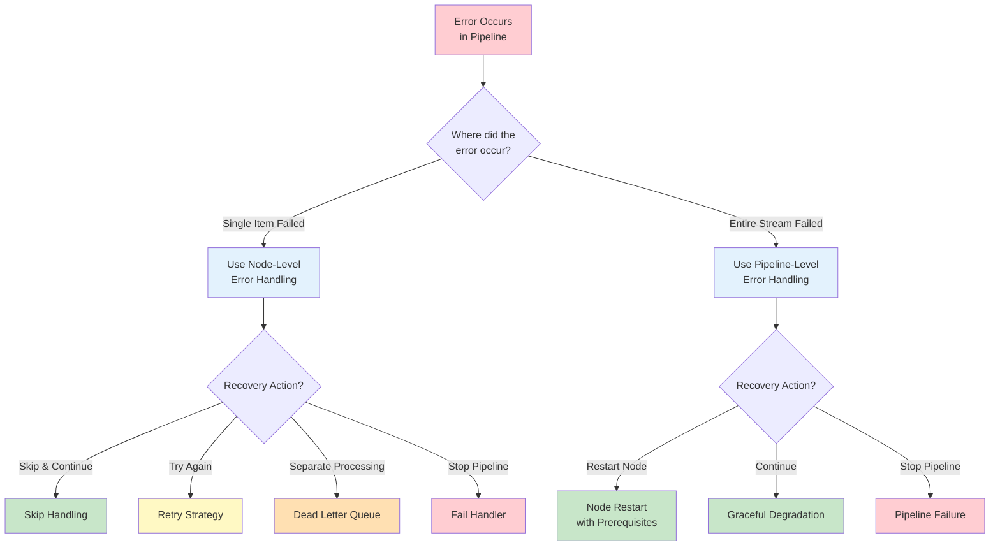

# Error Handling

Robust error handling is critical for building reliable data pipelines. NPipeline provides mechanisms to manage errors at two complementary levels.

## The Two Levels

### Node-Level Error Handling

Handles errors for individual items within a node. When an item fails, decide whether to skip it, retry it, redirect it to dead-letter, or fail the pipeline.

**→ [Node-Level Error Handling](node-error-handling.md)**

### Pipeline-Level Error Handling

Handles errors that affect an entire node's stream. When a node fails, decide whether to restart it, continue without it, or fail the pipeline.

**→ [Pipeline-Level Error Handling](pipeline-error-handling.md)**

## Choosing Your Approach

### Decision Guidance

**Use Node-Level Error Handling when:**

- Individual items fail during processing
- You want to handle them without affecting other items
- You need to skip, retry, or redirect problematic items

**Use Pipeline-Level Error Handling when:**

- An entire node's stream fails (e.g., external service goes down)
- You need to decide how the pipeline should recover
- You want to implement circuit breaker patterns

**Use Both when:**

- You need comprehensive error management at all levels

## Related Topics

- [Retries](retries.md) - Configure retry policies and strategies
- [Circuit Breakers](circuit-breakers.md) - Implement circuit breaker patterns
- [Dead Letter Queues](dead-letter-queues.md) - Route problematic items for analysis
- [Getting Started with Resilience](getting-started.md) - Quick guide and prerequisites
- [Troubleshooting](troubleshooting.md) - Common error handling issues and solutions
