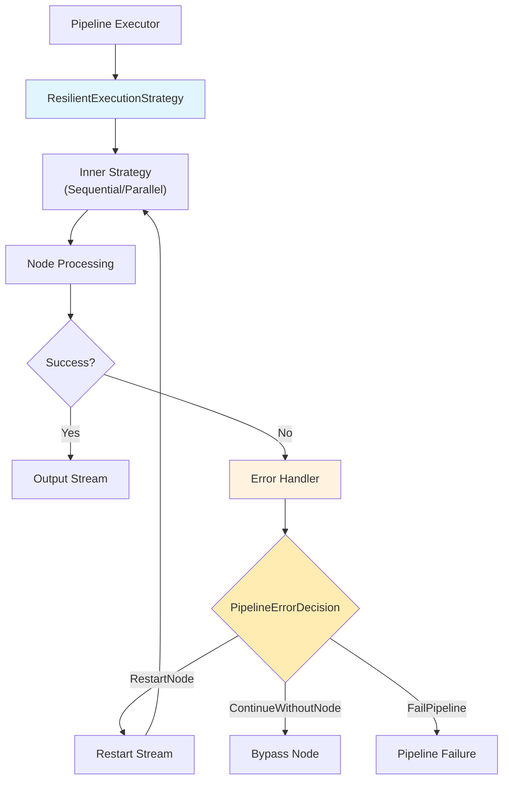
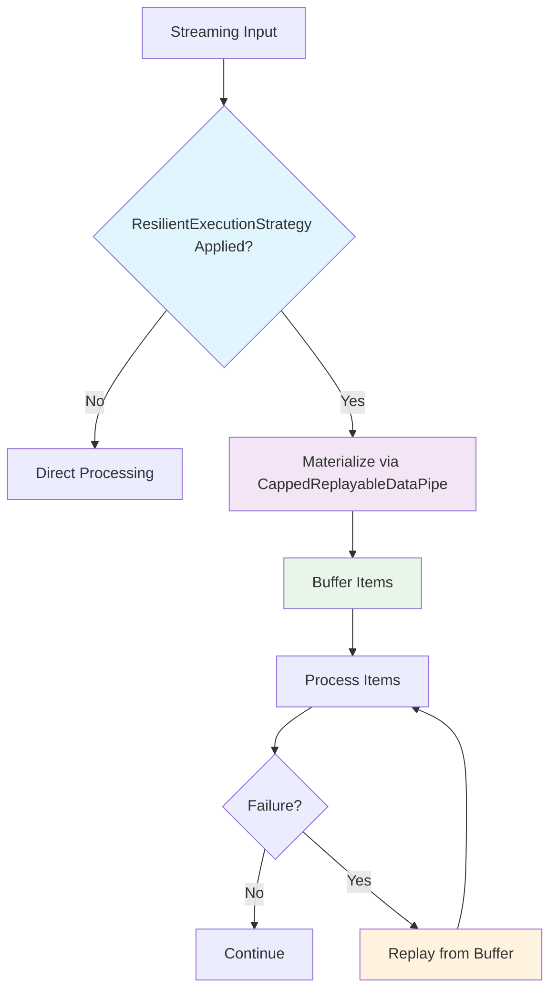
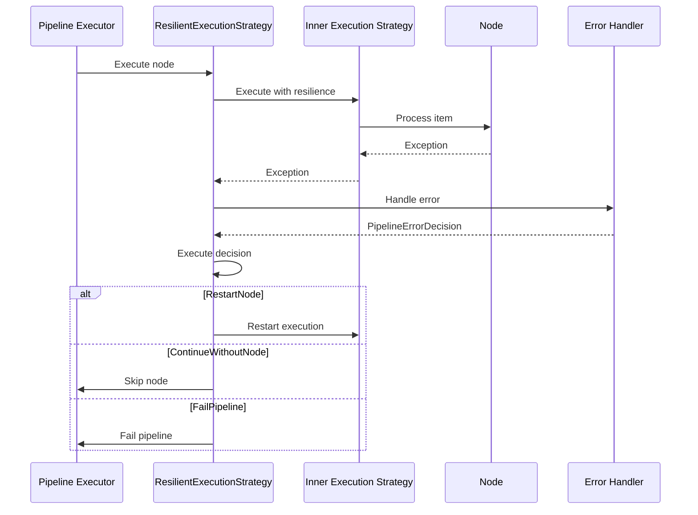

# Execution with Resilience

> :information_source: **Documentation Scope**
>This guide covers **resilience capabilities** - the wrapper strategy that adds error handling, retries, and node restart functionality. For information about **all execution strategies** (sequential, parallel, and how they work), see [Execution Strategies](../pipeline-execution/execution-strategies.md).

The [`ResilientExecutionStrategy`](../../../src/NPipeline/Execution/Strategies/ResilientExecutionStrategy.cs) is a wrapper strategy that enables resilience capabilities for your pipeline nodes. It doesn't execute nodes directly but instead wraps another execution strategy (like `SequentialExecutionStrategy` or `ParallelExecutionStrategy`) to add error handling, retry logic, and recovery mechanisms.

## How It Works

The `ResilientExecutionStrategy` acts as a middleware layer between the pipeline executor and the actual execution strategy:



*Figure: ResilientExecutionStrategy wraps inner strategies to add resilience capabilities.*

## Key Responsibilities

The `ResilientExecutionStrategy` handles several critical responsibilities:

1. **Stream Materialization**: Automatically materializes streaming inputs to enable replay during restarts
2. **Error Interception**: Catches exceptions from node execution and routes them to the error handler
3. **Decision Execution**: Implements the `PipelineErrorDecision` returned by the error handler
4. **Circuit Breaking**: Prevents cascading failures when consecutive failures exceed thresholds
5. **Retry Limit Enforcement**: Respects configured retry limits for both items and node restarts

## Wrapper Pattern

The strategy follows a wrapper pattern where it enhances any inner strategy with resilience capabilities:

```csharp
// Wrap a sequential strategy
var resilientSequential = new ResilientExecutionStrategy(
    new SequentialExecutionStrategy()
);

// Wrap a parallel strategy
var resilientParallel = new ResilientExecutionStrategy(
    new ParallelExecutionStrategy(maxDegreeOfParallelism: 4)
);

// Apply to a node
var nodeHandle = builder
    .AddTransform<MyTransform, Input, Output>("myNode")
    .WithExecutionStrategy(builder, resilientParallel);
```

## Materialization Behavior

When the `ResilientExecutionStrategy` detects a streaming input, it automatically materializes the stream to enable replay functionality:



The materialization process is controlled by the `MaxMaterializedItems` parameter in `PipelineRetryOptions`:

- **When `MaxMaterializedItems` is null** (default): Unbounded materialization - all items are buffered
- **When `MaxMaterializedItems` has a value**: Limited materialization - only the specified number of items are buffered

**⚠️ Critical Warning**: Setting `MaxMaterializedItems` to `null` (unbounded) silently disables node restart functionality. For detailed explanation of why unbounded buffers break resilience guarantees, see the [Getting Started with Resilience](./getting-started.md) guide.

## Configuration Examples

### Basic Resilient Sequential Execution

```csharp
using NPipeline;
using NPipeline.Execution.Strategies;
using NPipeline.ErrorHandling;

// Create a resilient sequential strategy
var resilientStrategy = new ResilientExecutionStrategy(
    new SequentialExecutionStrategy()
);

// Apply to a transform node
var resilientStrategy = new ResilientExecutionStrategy(
    new SequentialExecutionStrategy()
);

var builder = new PipelineBuilder();
var sourceHandle = builder.AddSource<DataSource, object>("source");
var transformHandle = builder
    .AddTransform<DataTransform, object, object>("transform")
    .WithExecutionStrategy(builder, resilientStrategy);
var sinkHandle = builder.AddSink<DataSink, object>("sink");

builder.Connect(sourceHandle, transformHandle);
builder.Connect(transformHandle, sinkHandle);
builder.WithRetryOptions(new PipelineRetryOptions(
    MaxItemRetries: 3,
    MaxNodeRestartAttempts: 2,
    MaxSequentialNodeAttempts: 5
));

var pipeline = builder.Build();
```

### Resilient Parallel Execution

```csharp
using NPipeline.Extensions.Parallelism;

// Wrap a parallel strategy with resilience
var resilientParallel = new ResilientExecutionStrategy(
    new ParallelExecutionStrategy(maxDegreeOfParallelism: 4)
);

// Configure with parallel options and resilience
var builder = new PipelineBuilder();
var sourceHandle = builder.AddSource<DataSource, object>("source");
var transformHandle = builder
    .AddTransform<DataTransform, object, object>("transform")
    .WithExecutionStrategy(builder, resilientParallel);
var sinkHandle = builder.AddSink<DataSink, object>("sink");

builder.Connect(sourceHandle, transformHandle);
builder.Connect(transformHandle, sinkHandle);
builder.SetNodeExecutionOption(transformHandle.Id, new ParallelOptions
{
    MaxDegreeOfParallelism = 4,
    MaxQueueLength = 10,
    QueuePolicy = BoundedQueuePolicy.Block,
    PreserveOrdering = true
});

builder.WithRetryOptions(new PipelineRetryOptions(
    MaxItemRetries: 3,
    MaxNodeRestartAttempts: 2,
    MaxSequentialNodeAttempts: 5
));

var pipeline = builder.Build();
```

### Per-Node Retry Options

```csharp
var builder = new PipelineBuilder();
var sourceHandle = builder.AddSource<DataSource, object>("source");
var criticalHandle = builder
    .AddTransform<CriticalTransform, object, object>("criticalNode")
    .WithExecutionStrategy(builder, new ResilientExecutionStrategy(
        new SequentialExecutionStrategy()
    ));
var regularHandle = builder
    .AddTransform<RegularTransform, object, object>("regularNode")
    .WithExecutionStrategy(builder, new ResilientExecutionStrategy(
        new SequentialExecutionStrategy()
    ));
var sinkHandle = builder.AddSink<DataSink, object>("sink");

builder.Connect(sourceHandle, criticalHandle);
builder.Connect(criticalHandle, regularHandle);
builder.Connect(regularHandle, sinkHandle);

// Configure different retry options for each node
builder.WithRetryOptions(criticalHandle, new PipelineRetryOptions(
    MaxItemRetries: 5,
    MaxNodeRestartAttempts: 5,
    MaxSequentialNodeAttempts: 10
));
builder.WithRetryOptions(regularHandle, new PipelineRetryOptions(
    MaxItemRetries: 2,
    MaxNodeRestartAttempts: 1,
    MaxSequentialNodeAttempts: 3
));

var pipeline = builder.Build();
```

## Prerequisite Relationship

`ResilientExecutionStrategy` is the **mandatory starting point** for all resilience features in NPipeline. Without this strategy:

- `PipelineErrorDecision.RestartNode` will not work
- Materialization will not be automatically applied
- Circuit breaker functionality will not be available
- Node restart capabilities will be disabled

Always apply `ResilientExecutionStrategy` to nodes that require any form of resilience.

**For complete configuration requirements for node restart functionality, see the [Getting Started with Resilience](./getting-started.md) guide.**

## Performance Considerations

### Memory Usage

Materialization for resilience comes with memory trade-offs:

```csharp
// High memory usage - unlimited buffering
var unlimitedBuffering = new PipelineRetryOptions(
    MaxItemRetries: 3,
    MaxNodeRestartAttempts: 2,
    MaxSequentialNodeAttempts: 5,
    MaxMaterializedItems: null // No limit
);

// Controlled memory usage - limited buffering
var limitedBuffering = new PipelineRetryOptions(
    MaxItemRetries: 3,
    MaxNodeRestartAttempts: 2,
    MaxSequentialNodeAttempts: 5,
    MaxMaterializedItems: 1000 // Limit to 1000 items
);
```

### Latency Impact

The resilience wrapper adds minimal latency to successful operations:

- **Error-free execution**: ~1-2% overhead for wrapper logic
- **During failures**: Additional latency for error handling and restarts
- **Memory pressure**: Potential GC impact from buffered items

### Throughput Considerations

When using `ResilientExecutionStrategy` with `ParallelExecutionStrategy`:

```csharp
// Optimal configuration for high throughput
var highThroughputConfig = new ParallelOptions
{
    MaxDegreeOfParallelism = Environment.ProcessorCount,
    MaxQueueLength = 100,
    QueuePolicy = BoundedQueuePolicy.Block,
    PreserveOrdering = false // Disable ordering for maximum throughput
};

var resilientHighThroughput = new ResilientExecutionStrategy(
    new ParallelExecutionStrategy()
);
```

## Integration with Error Handling

The `ResilientExecutionStrategy` works in tandem with NPipeline's error handling system:



## Common Configuration Patterns

Real-world resilience configurations depend on your specific use case. Here are practical patterns for common scenarios:

### E-commerce Order Processing

For critical financial operations where order reliability is paramount:

```csharp
public class EcommercePipelineDefinition : IPipelineDefinition
{
    public void Define(PipelineBuilder builder, PipelineContext context)
    {
        var orderSourceHandle = builder.AddSource<OrderSource, Order>("orderSource");
        var validatorHandle = builder
            .AddTransform<OrderValidator, Order, ValidatedOrder>("validator")
            .WithExecutionStrategy(builder, new ResilientExecutionStrategy(
                new SequentialExecutionStrategy()
            ));
        var paymentHandle = builder
            .AddTransform<PaymentProcessor, ValidatedOrder, PaidOrder>("paymentProcessor")
            .WithExecutionStrategy(builder, new ResilientExecutionStrategy(
                new SequentialExecutionStrategy()
            ));
        var inventoryHandle = builder
            .AddTransform<InventoryUpdater, PaidOrder, UpdatedOrder>("inventoryUpdater")
            .WithExecutionStrategy(builder, new ResilientExecutionStrategy(
                new ParallelExecutionStrategy()
            ));
        var shippingHandle = builder
            .AddTransform<ShippingScheduler, UpdatedOrder, ScheduledOrder>("shippingScheduler")
            .WithExecutionStrategy(builder, new ResilientExecutionStrategy(
                new SequentialExecutionStrategy()
            ));
        var sinkHandle = builder.AddSink<OrderSink, ScheduledOrder>("orderSink");

        builder.Connect(orderSourceHandle, validatorHandle);
        builder.Connect(validatorHandle, paymentHandle);
        builder.Connect(paymentHandle, inventoryHandle);
        builder.Connect(inventoryHandle, shippingHandle);
        builder.Connect(shippingHandle, sinkHandle);
    }
}

public static class EcommercePipeline
{
    public static async Task RunAsync()
    {
        var retryOptions = new PipelineRetryOptions(
            MaxItemRetries: 3,
            MaxNodeRestartAttempts: 2,
            MaxSequentialNodeAttempts: 5
        );

        var config = new PipelineContextConfiguration(
            RetryOptions: retryOptions,
            PipelineErrorHandler: new EcommerceErrorHandler()
        );
        var context = new PipelineContext(config);

        var runner = PipelineRunner.Create();
        await runner.RunAsync<EcommercePipelineDefinition>(context);
    }
}

public class EcommerceErrorHandler : IPipelineErrorHandler
{
    public Task<PipelineErrorDecision> HandleNodeFailureAsync(
        string nodeId,
        Exception error,
        PipelineContext context,
        CancellationToken cancellationToken)
    {
        return nodeId switch
        {
            "paymentProcessor" when error is PaymentException =>
                Task.FromResult(PipelineErrorDecision.RestartNode),
            "inventoryUpdater" when error is DatabaseException =>
                Task.FromResult(PipelineErrorDecision.RestartNode),
            "validator" when error is ValidationException =>
                Task.FromResult(PipelineErrorDecision.ContinueWithoutNode),
            _ => Task.FromResult(PipelineErrorDecision.FailPipeline)
        };
    }
}
```

### High-Volume Data Analytics

For high-throughput scenarios where some data loss is acceptable:

```csharp
public class AnalyticsPipelineDefinition : IPipelineDefinition
{
    public void Define(PipelineBuilder builder, PipelineContext context)
    {
        var sourceHandle = builder.AddSource<EventStreamSource, EventData>("eventSource");
        var parserHandle = builder
            .AddTransform<EventParser, EventData, ParsedEvent>("parser")
            .WithExecutionStrategy(builder, new ResilientExecutionStrategy(
                new ParallelExecutionStrategy()
            ));
        var aggregatorHandle = builder
            .AddTransform<Aggregator, ParsedEvent, AggregatedData>("aggregator")
            .WithExecutionStrategy(builder, new ResilientExecutionStrategy(
                new ParallelExecutionStrategy()
            ));
        var calculatorHandle = builder
            .AddTransform<MetricsCalculator, AggregatedData, Metrics>("calculator")
            .WithExecutionStrategy(builder, new ResilientExecutionStrategy(
                new SequentialExecutionStrategy()
            ));
        var sinkHandle = builder.AddSink<MetricsSink, Metrics>("metricsSink");

        builder.Connect(sourceHandle, parserHandle);
        builder.Connect(parserHandle, aggregatorHandle);
        builder.Connect(aggregatorHandle, calculatorHandle);
        builder.Connect(calculatorHandle, sinkHandle);

        // Configure execution options for parallel nodes
        builder.SetNodeExecutionOption(parserHandle.Id, new ParallelOptions
        {
            MaxDegreeOfParallelism = 8,
            MaxQueueLength = 100,
            QueuePolicy = BoundedQueuePolicy.Block,
            PreserveOrdering = false // Disable ordering for maximum throughput
        });
        builder.SetNodeExecutionOption(aggregatorHandle.Id, new ParallelOptions
        {
            MaxDegreeOfParallelism = 4,
            MaxQueueLength = 50,
            QueuePolicy = BoundedQueuePolicy.Block,
            PreserveOrdering = false
        });
    }
}

public static class AnalyticsPipeline
{
    public static async Task RunAsync()
    {
        var retryOptions = new PipelineRetryOptions(
            MaxItemRetries: 1,
            MaxNodeRestartAttempts: 2,
            MaxSequentialNodeAttempts: 4,
            MaxMaterializedItems: 10000 // Large buffer for high volume
        );

        var context = PipelineContext.WithRetry(retryOptions);
        context.AddPipelineErrorHandler<AnalyticsErrorHandler>();

        var runner = PipelineRunner.Create();
        await runner.RunAsync<AnalyticsPipelineDefinition>(context);
    }
}

public class AnalyticsErrorHandler : IPipelineErrorHandler
{
    public Task<PipelineErrorDecision> HandleNodeFailureAsync(
        string nodeId,
        Exception error,
        PipelineContext context,
        CancellationToken cancellationToken)
    {
        return error switch
        {
            TimeoutException => Task.FromResult(PipelineErrorDecision.RestartNode),
            IOException => Task.FromResult(PipelineErrorDecision.RestartNode),
            _ => Task.FromResult(PipelineErrorDecision.FailPipeline)
        };
    }
}
```

### Microservice Integration

For distributed systems calling external services:

```csharp
public class MicroservicePipelineDefinition : IPipelineDefinition
{
    public void Define(PipelineBuilder builder, PipelineContext context)
    {
        var sourceHandle = builder.AddSource<MessageQueueSource, ServiceRequest>("messageSource");
        var requestBuilderHandle = builder
            .AddTransform<RequestBuilder, ServiceRequest, HttpRequestMessage>("requestBuilder")
            .WithExecutionStrategy(builder, new ResilientExecutionStrategy(
                new SequentialExecutionStrategy()
            ));
        var serviceCallerHandle = builder
            .AddTransform<ExternalServiceCaller, HttpRequestMessage, HttpResponseMessage>("serviceCaller")
            .WithExecutionStrategy(builder, new ResilientExecutionStrategy(
                new ParallelExecutionStrategy()
            ));
        var responseProcessorHandle = builder
            .AddTransform<ResponseProcessor, HttpResponseMessage, ServiceResponse>("responseProcessor")
            .WithExecutionStrategy(builder, new ResilientExecutionStrategy(
                new SequentialExecutionStrategy()
            ));
        var sinkHandle = builder.AddSink<ResultPublisher, ServiceResponse>("resultPublisher");

        builder.Connect(sourceHandle, requestBuilderHandle);
        builder.Connect(requestBuilderHandle, serviceCallerHandle);
        builder.Connect(serviceCallerHandle, responseProcessorHandle);
        builder.Connect(responseProcessorHandle, sinkHandle);

        // Configure high parallelism for external service calls
        builder.SetNodeExecutionOption(serviceCallerHandle.Id, new ParallelOptions
        {
            MaxDegreeOfParallelism = 10, // High parallelism for external calls
            MaxQueueLength = 200,
            QueuePolicy = BoundedQueuePolicy.Block,
            PreserveOrdering = false
        });
    }
}

public static class MicroservicePipeline
{
    public static async Task RunAsync()
    {
        var retryOptions = new PipelineRetryOptions(
            MaxItemRetries: 5, // High retry count for external services
            MaxNodeRestartAttempts: 3,
            MaxSequentialNodeAttempts: 8,
            MaxMaterializedItems: 2000
        );

        var context = PipelineContext.WithRetry(retryOptions);

        context.AddPipelineErrorHandler<MicroserviceErrorHandler>();

        var runner = PipelineRunner.Create();
        await runner.RunAsync<MicroservicePipelineDefinition>(context);
    }
}

public class MicroserviceErrorHandler : IPipelineErrorHandler
{
    public Task<PipelineErrorDecision> HandleNodeFailureAsync(
        string nodeId,
        Exception error,
        PipelineContext context,
        CancellationToken cancellationToken)
    {
        return nodeId switch
        {
            "serviceCaller" when IsTransientHttpError(error) =>
                Task.FromResult(PipelineErrorDecision.RestartNode),
            "serviceCaller" when IsPermanentHttpError(error) =>
                Task.FromResult(PipelineErrorDecision.ContinueWithoutNode),
            _ => Task.FromResult(PipelineErrorDecision.FailPipeline)
        };
    }

    private bool IsTransientHttpError(Exception ex)
    {
        return ex is HttpRequestException httpEx &&
               (httpEx.StatusCode is HttpStatusCode.ServiceUnavailable or
                HttpStatusCode.RequestTimeout or
                HttpStatusCode.TooManyRequests);
    }

    private bool IsPermanentHttpError(Exception ex)
    {
        return ex is HttpRequestException httpEx &&
               (httpEx.StatusCode is HttpStatusCode.NotFound or
                HttpStatusCode.Unauthorized or
                HttpStatusCode.Forbidden);
    }
}
```

### Configuration Decision Matrix

When choosing retry configuration, consider this matrix:

| Scenario | MaxItemRetries | MaxNodeRestartAttempts | MaxSequentialNodeAttempts | MaxMaterializedItems |
|----------|----------------|------------------------|---------------------------|---------------------|
| **Stable internal services** | 1-2 | 1 | 3 | 500-1000 |
| **Unstable external APIs** | 3-5 | 3-5 | 8-10 | 1000-2000 |
| **High-volume streaming** | 1 | 2 | 4 | 5000-10000 |
| **Critical business logic** | 3-5 | 5 | 10 | 2000-5000 |
| **Memory-constrained** | 1-2 | 1 | 3 | 100-500 |

### Common Configuration Mistakes to Avoid

**Mistake 1: Forgetting ResilientExecutionStrategy**

```csharp
var nodeHandle = builder.AddTransform<MyTransform, Input, Output>("node");

// ❌ WRONG: Missing resilience wrapper
var nodeHandle = builder
    .AddTransform<MyTransform, Input, Output>("node")
    .WithExecutionStrategy(builder, new ParallelExecutionStrategy());

// ✓ CORRECT: With resilience wrapper
var nodeHandle = builder
    .AddTransform<MyTransform, Input, Output>("node")
    .WithExecutionStrategy(builder, new ResilientExecutionStrategy(
        new ParallelExecutionStrategy()
    ));
```

**Mistake 2: No Materialization for Streaming Inputs**

```csharp
// ❌ WRONG: No materialization
var options = new PipelineRetryOptions(
    MaxMaterializedItems: null // No buffering
);

// ✓ CORRECT: Enable materialization
var options = new PipelineRetryOptions(
    MaxMaterializedItems: 1000 // Buffer items for replay
);
```

**Mistake 3: Always Restarting on All Errors**

```csharp
// ❌ WRONG: Restarts forever on all errors
public class BadErrorHandler : IPipelineErrorHandler
{
    public Task<PipelineErrorDecision> HandleNodeFailureAsync(...)
    {
        return Task.FromResult(PipelineErrorDecision.RestartNode); // Always!
    }
}

// ✓ CORRECT: Distinguish transient from permanent failures
public class GoodErrorHandler : IPipelineErrorHandler
{
    public Task<PipelineErrorDecision> HandleNodeFailureAsync(
        string nodeId, Exception error, ...)
    {
        return error switch
        {
            TimeoutException => Task.FromResult(PipelineErrorDecision.RestartNode),
            ValidationException => Task.FromResult(PipelineErrorDecision.ContinueWithoutNode),
            _ => Task.FromResult(PipelineErrorDecision.FailPipeline)
        };
    }
}
```

## Next Steps

- **[Getting Started with Resilience](./getting-started.md)**: Complete quick-start and step-by-step configuration guide
- **[Configuration Guide](configuration-guide.md)**: Get step-by-step configuration guidance
- **[Materialization and Buffering](materialization-and-buffering.md)**: Learn how buffering enables replay functionality
- **[Dependency Chains](dependency-chains.md)**: Understand the critical prerequisite relationships