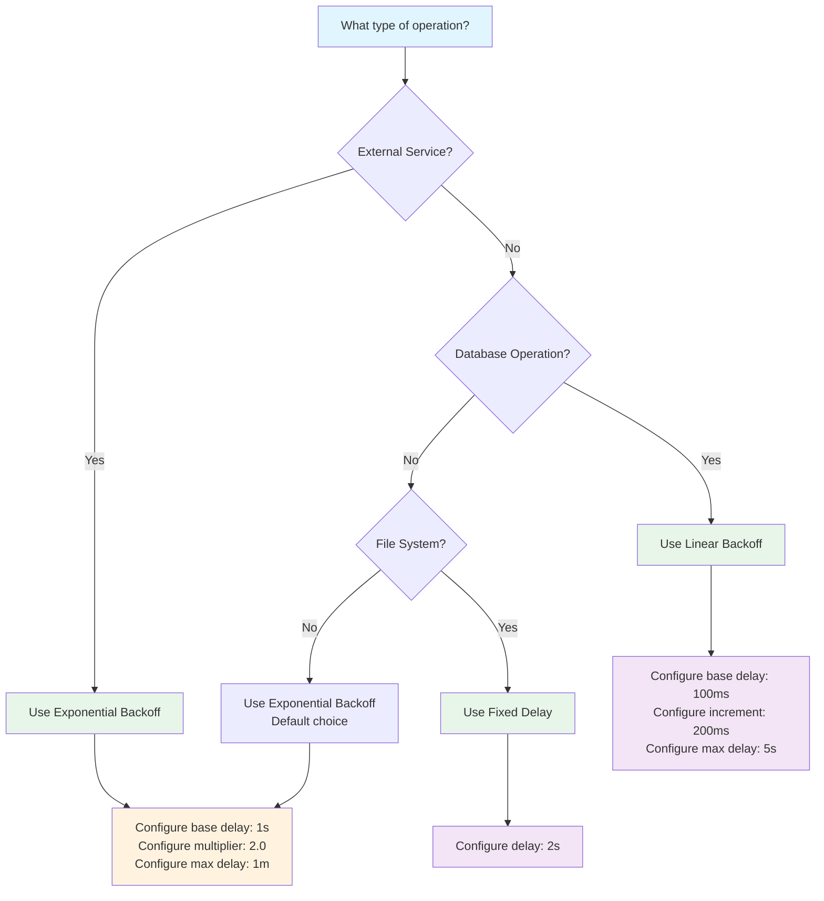

# Resilience Quick Start

This guide provides quick-start checklists and patterns for the two most common resilience scenarios: node restarts and retry delay strategies.

## ⚠️ RESILIENCE READINESS CHECKLIST

**Before deploying any pipeline with resilience features, you MUST satisfy all three of these requirements:**

- [ ] **ResilientExecutionStrategy Configured**: Node is wrapped with `ResilientExecutionStrategy()`
- [ ] **MaxNodeRestartAttempts > 0**: Set to a positive number (typically 2-3) in `PipelineRetryOptions`
- [ ] **MaxMaterializedItems is Set**: Configured to a positive bounded value (recommended: 100-1,000) - **NEVER null**

The system validates these requirements at runtime. If any prerequisite is missing when `RestartNode` is returned, the system throws `InvalidOperationException` with a clear message indicating which requirement failed. This provides immediate feedback and prevents silent configuration errors.

Use the NPipeline analyzers to catch these issues at build time:

- **NP9001**: Detects incomplete restart configuration (error severity recommended)
- **NP9002**: Detects unbounded materialization (error severity required)

Enable these in your `.editorconfig` to make them blocking errors in your build pipeline.

## Node Restart - Quick Start Checklist

> ℹ️ **Note: Node Restart Requirements**
>
> Node restart is a powerful resilience feature that requires **three mandatory prerequisites**. The system validates these at runtime and throws clear exceptions if any are missing.
>
> If you've experienced mysterious pipeline failures where restart seemed enabled but didn't work, one of these requirements was missing. The improved runtime validation now provides immediate, actionable feedback when configuration is incomplete.

---

### The Three-Step Mandatory Checklist

#### STEP 1: Apply ResilientExecutionStrategy

Your node must be wrapped with `ResilientExecutionStrategy`. This enables the restart capability at the node level.

**What it does:** Allows the pipeline to restart the node when an error occurs.

**Without it:** System throws `InvalidOperationException` when `RestartNode` is attempted.

**How to configure:**

```csharp
var nodeHandle = builder
    .AddTransform<MyTransform, Input, Output>("myNode")
    .WithExecutionStrategy(
        builder,
        new ResilientExecutionStrategy(new SequentialExecutionStrategy())
    );
```

**Learn more:** [Execution Strategies](../pipeline-execution/execution-strategies.md)

---

#### STEP 2: Configure Maximum Restart Attempts

Set `MaxNodeRestartAttempts > 0` in `PipelineRetryOptions`. This tells the pipeline how many times to attempt restarting a failed node.

**What it does:** Limits how many restart attempts the pipeline will make before giving up.

**Without it:** System throws `InvalidOperationException` when `RestartNode` is attempted.

**How to configure:**

```csharp
var options = new PipelineRetryOptions(
    MaxItemRetries: 3,
    MaxNodeRestartAttempts: 2,  // ← At least 1
    MaxMaterializedItems: 1000   // (see Step 3!)
);

var context = PipelineContext.WithRetry(options);
```

**Recommended starting values:**

- **Transient failures (network, temporary service issues):** 2-3 attempts
- **Persistent issues (resource exhaustion):** 3-5 attempts
- **Critical nodes:** 5+ attempts

**Learn more:** [Retry Configuration](./retries.md)

---

#### STEP 3: Enable Input Materialization (⚠️ CRITICAL)

Set `MaxMaterializedItems` to a **non-null, positive number** on the input to the node you want to be restartable. This is the replay buffer.

**What it does:** Buffers items from the input source so the node can be replayed from a known state if it fails.

> 🚨 **CRITICAL REQUIREMENT:** If `MaxMaterializedItems` is `null` (unbounded), the system throws `InvalidOperationException` when `RestartNode` is attempted. Bounded materialization is required for safe restart operations.

**How to configure:**

```csharp
var options = new PipelineRetryOptions(
    MaxItemRetries: 3,
    MaxNodeRestartAttempts: 2,
    MaxMaterializedItems: 1000  // ← Must be set! Not null!
);
```

**Choosing a value:**

| Scenario | Recommended Value | Rationale |
|----------|-------------------|-----------|
| Small objects (< 100 bytes) | 5,000-10,000 | Minimal memory overhead |
| Medium objects (100-1KB) | 1,000-5,000 | Balanced buffer size |
| Large objects (1KB+) | 500-1,000 | Respect memory constraints |
| Critical/high-priority node | 2,000-5,000 | More replay buffer = higher restart success rate |

### Conservative Starting Point

Here's a good default configuration:

```csharp
var options = new PipelineRetryOptions(
    MaxItemRetries: 3,
    MaxNodeRestartAttempts: 2,
    MaxMaterializedItems: 1000  // ← Good default: buffers ~1000 items
);
```

**Learn more:** [Materialization and Buffering](./materialization.md)

---

#### :warning: CRITICAL WARNING: Unbounded Materialization

**Never set `MaxMaterializedItems` to `null`:**

```csharp
// WRONG - This throws InvalidOperationException on RestartNode
var options = new PipelineRetryOptions(
    MaxItemRetries: 3,
    MaxNodeRestartAttempts: 2,
    MaxMaterializedItems: null  // ← DANGER!
);
```

**If you do:**

- **System throws `InvalidOperationException`** when `RestartNode` is attempted
- **Clear error message** indicates which requirement is missing
- **No silent failures** - immediate feedback at runtime

### Why Bounded Memory Buffers Are Required

Bounded materialization (`MaxMaterializedItems` set to a positive value) is required for safe restart operations:

1. **Memory Safety**: Bounded buffers have predictable memory footprints, preventing OutOfMemoryException that cannot be recovered from.

2. **Runtime Validation**: When the system detects unbounded materialization with a `RestartNode` decision, it throws `InvalidOperationException` to protect the system from undefined recovery boundaries.

3. **Predictable Behavior**: Bounded buffers lead to predictable memory usage patterns that can be safely executed and monitored.

4. **Resource Management**: Bounded buffers respect system memory constraints, preventing cascading failures.

**The Design Philosophy**: NPipeline prioritizes system stability and clear error messaging. By requiring explicit buffer limits, NPipeline ensures that restart operations have predictable memory footprints and can be safely executed. Runtime validation provides immediate feedback when configuration is incomplete.

**Choosing Not to Set a Memory Cap = Choosing to Disable Restart**

When you set `MaxMaterializedItems: null`, you are making an explicit choice to sacrifice restart capability. The system will throw `InvalidOperationException` if `RestartNode` is attempted, providing clear feedback about the configuration issue.

If you need node restart functionality, you **must** set a memory cap. The system cannot provide resilience guarantees without defined resource boundaries.

---

### Complete Configuration Example

Here's a complete example with all three requirements:

```csharp
// Step 1: Create retry options with ALL three settings
var options = new PipelineRetryOptions(
    MaxItemRetries: 3,
    MaxNodeRestartAttempts: 2,           // ← Step 2: Restart attempts
    MaxMaterializedItems: 1000            // ← Step 3: Replay buffer
);

var context = PipelineContext.WithRetry(options);

// Step 2: Build pipeline with resilient nodes
var definition = new MyPipelineDefinition();
definition.Define(builder, context);

// In MyPipelineDefinition.Define():
// 
//   Step 1: Wrap node with ResilientExecutionStrategy
//   var nodeHandle = builder
//       .AddTransform<MyTransform, Input, Output>("risky")
//       .WithExecutionStrategy(
//           builder,
//           new ResilientExecutionStrategy(
//               new SequentialExecutionStrategy()
//           )
//       );
//
//   Add error handler that returns RestartNode
//   builder.AddPipelineErrorHandler<MyErrorHandler>();
//
// In MyErrorHandler.HandleNodeFailureAsync():
//
//   return error switch
//   {
//       TimeoutException => PipelineErrorDecision.RestartNode,
//       _ => PipelineErrorDecision.FailPipeline
//   };
```

---

## Retry Delay Quick Start

Retry delays are essential for building resilient pipelines that can recover from transient failures without overwhelming downstream services.

### Quick Start: Common Retry Patterns

#### Web API Calls (Most Common)

```csharp
// Recommended for external API calls
context.UseExponentialBackoffDelay(
    baseDelay: TimeSpan.FromSeconds(1),
    multiplier: 2.0,
    maxDelay: TimeSpan.FromMinutes(1));
```

**Why this pattern:**

- Exponential backoff gives services time to recover
- Prevents thundering herd problems
- Balanced for typical API rate limits

#### Database Operations

```csharp
// Recommended for database retry scenarios
context.UseLinearBackoffDelay(
    baseDelay: TimeSpan.FromMilliseconds(100),
    increment: TimeSpan.FromMilliseconds(200),
    maxDelay: TimeSpan.FromSeconds(5));
```

**Why this pattern:**

- Linear growth is predictable for database connection pools
- Shorter delays work well for transient lock contention
- Conservative max delay prevents long-running transactions

#### File Processing

```csharp
// Recommended for file system operations
context.UseFixedDelay(TimeSpan.FromSeconds(2));
```

**Why this pattern:**

- File system recovery is typically immediate
- Fixed delay provides predictable behavior
- Simple and effective for I/O operations

### Decision Flow for Choosing Retry Strategy



### Implementation Examples

#### Basic Pipeline with Retry Delays

```csharp
using NPipeline;
using NPipeline.Pipeline;

public sealed class RetryQuickstartPipeline : IPipelineDefinition
{
    public void Define(PipelineBuilder builder, PipelineContext context)
    {
        // Configure retry delay strategy based on operation type
        context.UseExponentialBackoffDelay(
            baseDelay: TimeSpan.FromSeconds(1),
            multiplier: 2.0,
            maxDelay: TimeSpan.FromMinutes(1));

        var source = builder.AddSource<ApiSource, ApiResponse>("api-source");
        var transform = builder.AddTransform<DataTransform, ApiResponse, ProcessedData>("transform");
        var sink = builder.AddSink<DataSink, ProcessedData>("sink");

        builder.Connect(source, transform);
        builder.Connect(transform, sink);

        // Configure retry options
        builder.WithRetryOptions(new PipelineRetryOptions(
            MaxItemRetries: 3,
            MaxNodeRestartAttempts: 2,
            MaxSequentialNodeAttempts: 5
        ));
    }
}
```

#### Per-Node Retry Configuration

```csharp
public void Define(PipelineBuilder builder, PipelineContext context)
{
    var source = builder.AddSource<DataSource, string>("source");
    
    // Fast retries for in-memory operations
    context.UseFixedDelay(TimeSpan.FromMilliseconds(50));
    var memoryTransform = builder.AddTransform<MemoryTransform, string, string>("memory-ops");
    
    // Slower retries for external API calls
    context.UseExponentialBackoffDelay(
        baseDelay: TimeSpan.FromSeconds(1),
        multiplier: 2.0,
        maxDelay: TimeSpan.FromMinutes(1));
    var apiTransform = builder.AddTransform<ApiTransform, string, string>("api-ops");
    
    // Default retries for other operations
    var sink = builder.AddSink<DataSink, string>("sink");

    builder.Connect(source, memoryTransform);
    builder.Connect(memoryTransform, apiTransform);
    builder.Connect(apiTransform, sink);
}
```

### Common Pitfalls to Avoid

> :warning: **Common Mistake**: Not configuring retry delays at all
>
> Without retry delays, failed operations retry immediately, which can overwhelm recovering services.

> :warning: **Common Mistake**: Using exponential backoff for in-memory operations
>
> In-memory operations typically recover immediately, so exponential backoff adds unnecessary delays.

> :warning: **Common Mistake**: Setting max delay too high
>
> Very high max delays can cause long recovery times. Consider your SLA requirements.

> **Pro Tip**: Always test retry behavior in development
>
> Use fixed delays in tests for predictable behavior, then switch to appropriate backoff in production.

## Next Steps

- **[Error Handling](./error-handling.md)** - Comprehensive error handling strategies
- **[Retry Configuration](./retries.md)** - Detailed configuration options and advanced patterns
- **[Circuit Breakers](./circuit-breakers.md)** - Preventing cascading failures
- **[Troubleshooting](./troubleshooting.md)** - Common issues and solutions
