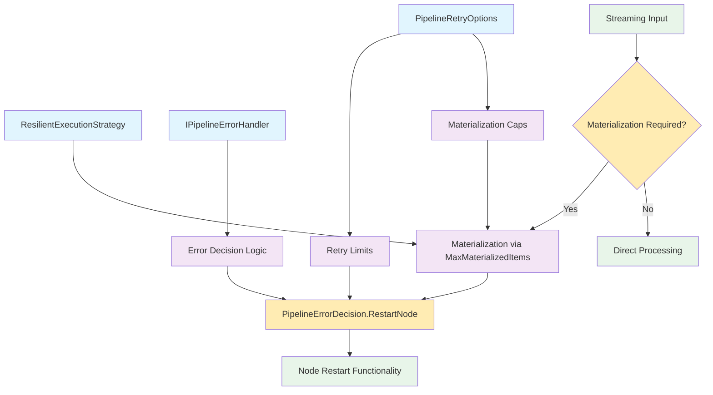
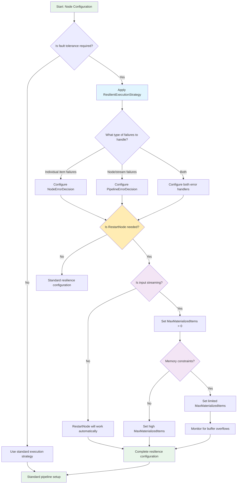

# Resilience Overview

Resilience in NPipeline refers to the ability of your data pipelines to detect, handle, and recover from failures without complete system breakdown.
This section provides a comprehensive guide to building robust, fault-tolerant pipelines.

## ⚡ Quick Start: Node Restart

**If you want to enable node restarts, [start here: Node Restart Quick Start Checklist](./node-restart-quickstart.md)**

Node restart requires three mandatory configuration steps. Missing any one causes silent failures. The quickstart guide ensures you configure all three correctly.

---

## Why Resilience Matters

In production environments, pipelines inevitably encounter failures from various sources:

- **Transient infrastructure issues**: Network timeouts, database connection failures
- **Data quality problems**: Invalid formats, missing values, unexpected data types
- **Resource constraints**: Memory pressure, CPU saturation, I/O bottlenecks
- **External service dependencies**: API rate limits, service outages, authentication failures

Without proper resilience mechanisms, these failures can cascade through your pipeline, causing data loss, system instability, and costly manual intervention.

## Resilience Strategy Comparison

| Strategy | Best For | Memory Requirements | Complexity | Key Benefits |
|----------|----------|-------------------|------------|--------------|
| **Simple Retry** | Transient failures (network timeouts, temporary service issues) | Low | Low | Quick recovery from temporary issues |
| **Node Restart** | Persistent node failures, resource exhaustion | Medium (requires materialization) | Medium | Complete recovery from node-level failures |
| **Circuit Breaker** | Protecting against cascading failures, external service dependencies | Low | Medium | Prevents system overload during outages |
| **Dead-Letter Queues** | Handling problematic items that can't be processed | Low | High | Preserves problematic data for manual review |
| **Combined Approach** | Production systems with multiple failure types | High | High | Comprehensive protection against all failure types |

### Choosing the Right Strategy

- **For simple pipelines with basic needs**: Start with Simple Retry
- **For streaming data processing**: Use Node Restart with materialization
- **For external service dependencies**: Add Circuit Breaker to prevent cascade failures
- **For critical data pipelines**: Implement Dead-Letter Queues to preserve failed items
- **For production systems**: Combine multiple strategies for comprehensive protection

## Core Resilience Components

NPipeline's resilience framework is built around several interconnected components:

| Component | Role | Critical Dependency |
|-----------|------|---------------------|
| **[ResilientExecutionStrategy](resilient-execution-strategy.md)** | Wrapper that enables recovery capabilities for nodes | Prerequisite for all resilience features |
| **[Materialization & Buffering](materialization-and-buffering.md)** | Buffers input items to enable replay during restarts | Required for `PipelineErrorDecision.RestartNode` |
| **[Error Handling](../pipeline-execution/error-handling.md)** | Determines how to respond to different types of failures | Provides decision logic for recovery actions |
| **[Retry Options](../pipeline-execution/retry-configuration.md)** | Configures retry limits and materialization caps | Controls resilience behavior boundaries |

## ⚠️ Critical Prerequisites for Node Restart (RestartNode)

If you intend to use `PipelineErrorDecision.RestartNode` to recover from failures, **[read the Node Restart Quick Start Checklist](./node-restart-quickstart.md)** first.

You **must** configure all three of the following. Missing any one will cause silent failures:

> **💡 Pro Tip:** The NPipeline build-time analyzer (NP9002) detects incomplete resilience configurations at compile-time, preventing these silent failures. See [Build-Time Resilience Analyzer](../../analyzers/resilience.md) for details.

### Mandatory Requirements Checklist

- [ ] **Requirement 1: ResilientExecutionStrategy**
  - The node must be wrapped with `ResilientExecutionStrategy`
  - Without this: Restart decisions are ignored; node cannot recover
  - Reference: [Resilient Execution Strategy](resilient-execution-strategy.md)

- [ ] **Requirement 2: MaxMaterializedItems Configuration**
  - Set `MaxMaterializedItems > 0` in `PipelineRetryOptions` (for streaming inputs)
  - This enables the input stream to be buffered/materialized for replay
  - **Critical:** Without this, even if RestartNode is requested, the pipeline will fall back to `FailPipeline`
  - Example: `MaxMaterializedItems: 1000` buffers up to 1000 items for potential replay
  - Reference: [Materialization and Buffering](materialization-and-buffering.md)

- [ ] **Requirement 3: Error Handler Decision**
  - Your error handler must return `PipelineErrorDecision.RestartNode` (not `FailPipeline` or `ContinueWithoutNode`)
  - Without this: Node restarts are never attempted
  - Reference: [Error Handling](../pipeline-execution/error-handling.md)

### What Happens If You Miss These

| Missing Component | What Goes Wrong | Observable Behavior |
|---|---|---|
| ResilientExecutionStrategy | Restart capability disabled | Error handler decisions are ignored; pipeline always fails |
| MaxMaterializedItems | Input stream not buffered | RestartNode falls back to `FailPipeline`; entire pipeline halts unexpectedly |
| Error Handler RestartNode | Restart never triggered | All errors result in pipeline failure, even recoverable ones |

**Example of Silent Failure:**

```csharp
// ❌ WRONG: Missing materialization
var options = new PipelineRetryOptions(
    MaxItemRetries: 3,
    MaxNodeRestartAttempts: 2,
    MaxMaterializedItems: null  // ← This is the problem!
);

// Developer expects RestartNode to work, but...
// When an error occurs and handler returns RestartNode:
// → Pipeline sees MaxMaterializedItems is not set
// → Falls back to FailPipeline
// → Entire pipeline halts (unexpected failure!)
```

**Example Correct Configuration:**

```csharp
// ✅ CORRECT: All three requirements met
var nodeHandle = builder
    .AddTransform<MyTransform, Input, Output>("myNode")
    .WithExecutionStrategy(builder, new ResilientExecutionStrategy(
        new SequentialExecutionStrategy()
    ));

var options = new PipelineRetryOptions(
    MaxItemRetries: 3,
    MaxNodeRestartAttempts: 2,
    MaxSequentialNodeAttempts: 5,
    MaxMaterializedItems: 1000  // ← Materialization enabled
);

var context = PipelineContext.WithRetry(options);
context.AddPipelineErrorHandler<MyErrorHandler>(); // Returns RestartNode for transient errors
```

## The Dependency Chain

Understanding the dependency relationships between resilience components is crucial for proper configuration:



*Figure: The dependency chain showing how resilience components must be configured in the correct sequence.*

### Critical Dependency Rules

1. **ResilientExecutionStrategy is mandatory**: All resilience features require this strategy to be applied to a node
2. **Materialization enables restarts**: `PipelineErrorDecision.RestartNode` only works if the input stream is materialized via `MaxMaterializedItems`
3. **Buffer size matters**: The `MaxMaterializedItems` value determines how many items can be replayed during a restart
4. **Streaming inputs need materialization**: Only streaming inputs require explicit materialization; already-buffered inputs work automatically

## Decision Flow for Choosing Resilience Strategies

Use this flow diagram to determine the appropriate resilience configuration for your use case:



## Key Scenarios

### Scenario 1: Simple Retry Logic

For handling transient failures without node restarts:

- Apply `ResilientExecutionStrategy`
- Configure `NodeErrorDecision.Retry` or `NodeErrorDecision.Skip`
- No materialization required

### Scenario 2: Node Restart Capability

For recovering from node-level failures:

- Apply `ResilientExecutionStrategy`
- Configure `PipelineErrorDecision.RestartNode`
- Set `MaxMaterializedItems` to enable replay (for streaming inputs)

### Scenario 3: Memory-Constrained Environment

For systems with limited memory:

- Apply `ResilientExecutionStrategy`
- Set `MaxMaterializedItems` to a conservative value
- Monitor for buffer overflow exceptions
- Consider alternative recovery strategies

## :arrow_right: Next Steps

- **[Resilient Execution Strategy](resilient-execution-strategy.md)**: Learn about the core wrapper that enables resilience
- **[Materialization and Buffering](materialization-and-buffering.md)**: Understand how buffering enables replay functionality
- **[Dependency Chains](dependency-chains.md)**: Explore the critical prerequisite relationships in detail
- **[Configuration Guide](configuration-guide.md)**: Get practical implementation guidance with code examples
- **[Circuit Breaker Advanced Configuration](circuit-breaker-advanced-configuration.md)**: Learn when to tune circuit breaker memory cleanup and how defaults behave
- **[Troubleshooting](troubleshooting.md)**: Diagnose and resolve common resilience issues
