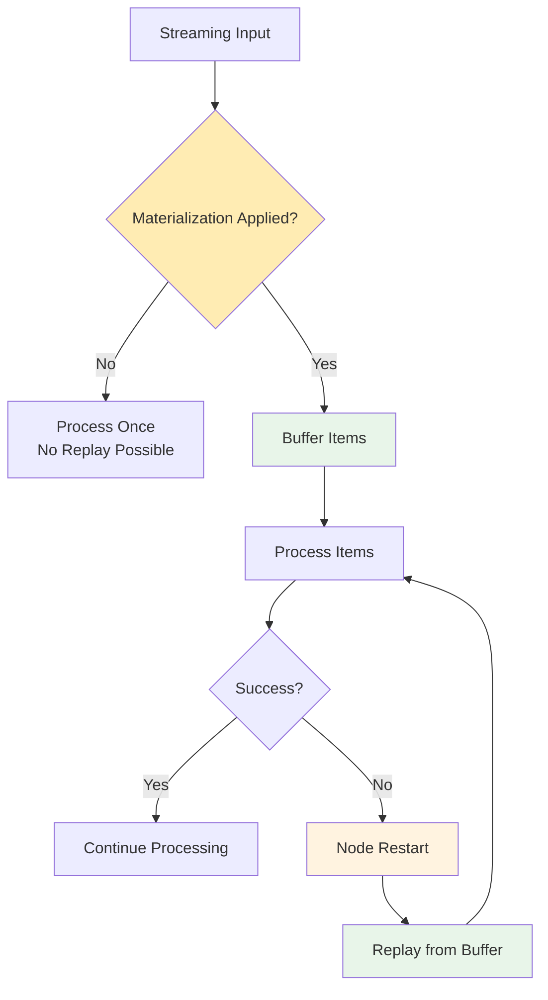
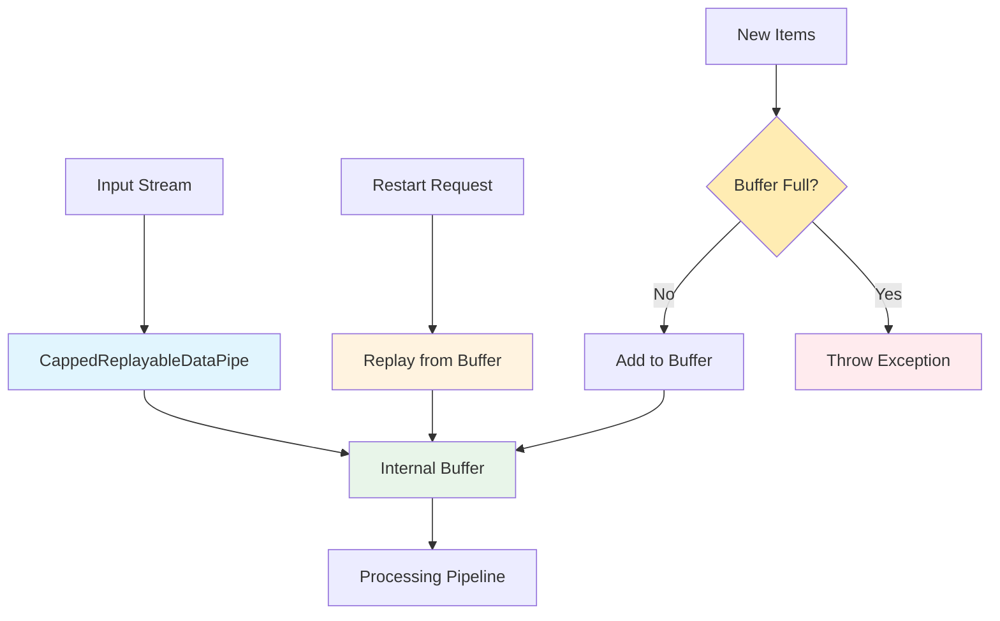

# Materialization and Buffering

Materialization is the process of buffering incoming items before processing them, which enables replay functionality when a node needs to restart. This capability is essential for the `PipelineErrorDecision.RestartNode` feature and is a critical component of NPipeline's resilience framework.

## What is Materialization?

In NPipeline, data flows through nodes as streams. By default, streaming data is processed once and discarded - it cannot be replayed. Materialization changes this by:

1. **Buffering incoming items** in memory before processing
2. **Maintaining a replayable buffer** that can be re-enumerated
3. **Enabling restart functionality** by replaying buffered items after failures



*Figure: Materialization enables replay functionality by buffering items before processing.*

## The Critical Role of MaxMaterializedItems

The `MaxMaterializedItems` parameter in `PipelineRetryOptions` controls the materialization behavior:

- **When `MaxMaterializedItems` is null** (default): Unbounded materialization - all items are buffered
- **When `MaxMaterializedItems` has a value**: Limited materialization - only the specified number of items are buffered

This parameter is critical because it determines:

1. **How many items can be replayed** during a node restart
2. **Memory usage** for the buffer
3. **Whether restart functionality works at all** for streaming inputs

**:warning: Critical Warning**: Setting `MaxMaterializedItems` to `null` (unbounded) silently disables node restart functionality. For detailed explanation of why unbounded buffers break resilience guarantees, see the [Getting Started with Resilience](./getting-started.md) guide.

## CappedReplayableDataPipe Implementation

NPipeline uses the [`CappedReplayableDataPipe`](../../../src/NPipeline/DataFlow/DataPipes/CappedReplayableDataPipe.cs) to implement materialization:



The `CappedReplayableDataPipe` provides:

- **Replay capability**: Can be re-enumerated multiple times
- **Memory limits**: Enforces `MaxMaterializedItems` when specified
- **Overflow protection**: Throws exceptions when buffer limits are exceeded

## Memory vs. Durability Trade-offs

Materialization involves a fundamental trade-off between memory usage and resilience capabilities:

### Unbounded Materialization (Default)

```csharp
var unboundedOptions = new PipelineRetryOptions(
    MaxItemRetries: 3,
    MaxNodeRestartAttempts: 2,
    MaxSequentialNodeAttempts: 5,
    MaxMaterializedItems: null // No limit
);
```

**Pros:**

- Maximum resilience - all items can be replayed
- Simple configuration - no need to estimate buffer size
- Works for any data volume within memory constraints

**Cons:**

- Potential memory exhaustion with large datasets
- OutOfMemoryException risk in production
- Not suitable for long-running pipelines with high throughput
- **Silently disables restart functionality** - see [Getting Started with Resilience](./getting-started.md) for details

### Bounded Materialization

```csharp
var boundedOptions = new PipelineRetryOptions(
    MaxItemRetries: 3,
    MaxNodeRestartAttempts: 2,
    MaxSequentialNodeAttempts: 5,
    MaxMaterializedItems: 1000 // Limit to 1000 items
);
```

**Pros:**

- Predictable memory usage
- Protection against memory exhaustion
- Suitable for production environments
- Enables restart functionality

**Cons:**

- Limited replay capability
- Buffer overflow exceptions if limits exceeded
- Requires careful capacity planning

## Practical Guidance for Setting Buffer Limits

### Factors to Consider

1. **Item Size**: Larger items require more memory per item
2. **Failure Window**: How many items might be processed between failures
3. **Memory Constraints**: Available memory for the buffer
4. **Throughput**: Items processed per second
5. **Recovery Requirements**: How far back you need to replay

### Calculation Examples

#### Example 1: Small Items with High Throughput

```csharp
// Scenario: Processing 1000 small JSON objects per second
// Each object ~1KB, want to buffer 30 seconds of data
var itemsPerSecond = 1000;
var bufferSizeKB = 1;
var secondsToBuffer = 30;
var calculatedLimit = itemsPerSecond * secondsToBuffer; // 30,000 items
var memoryUsageMB = (calculatedLimit * bufferSizeKB) / 1024; // ~29MB

var options = new PipelineRetryOptions(
    MaxItemRetries: 3,
    MaxNodeRestartAttempts: 2,
    MaxSequentialNodeAttempts: 5,
    MaxMaterializedItems: calculatedLimit // 30,000 items
);
```

#### Example 2: Large Items with Low Throughput

```csharp
// Scenario: Processing 10 large documents per second
// Each document ~10MB, want to buffer 60 seconds of data
var itemsPerSecond = 10;
var bufferSizeMB = 10;
var secondsToBuffer = 60;
var calculatedLimit = itemsPerSecond * secondsToBuffer; // 600 items
var memoryUsageMB = calculatedLimit * bufferSizeMB; // 6000MB (6GB)

// Since 6GB is too much, we need to compromise
var realisticLimit = 100; // 100 items = 1GB
var realisticSecondsBuffered = realisticLimit / itemsPerSecond; // 10 seconds

var options = new PipelineRetryOptions(
    MaxItemRetries: 3,
    MaxNodeRestartAttempts: 2,
    MaxSequentialNodeAttempts: 5,
    MaxMaterializedItems: realisticLimit // 100 items
);
```

## Configuration Examples

### Basic Materialization Setup

```csharp
using NPipeline;
using NPipeline.ErrorHandling;
using NPipeline.Execution.Strategies;
using NPipeline.Pipeline;

public class BufferingPipelineDefinition : IPipelineDefinition
{
    public void Define(PipelineBuilder builder, PipelineContext context)
    {
        var sourceHandle = builder.AddSource<StreamingDataSource, Data>("source");
        var transformHandle = builder
            .AddTransform<DataTransform, Data, ProcessedData>("transform")
            .WithExecutionStrategy(builder, new ResilientExecutionStrategy(
                new SequentialExecutionStrategy()
            ));
        var sinkHandle = builder.AddSink<DataSink, ProcessedData>("sink");

        builder.Connect(sourceHandle, transformHandle);
        builder.Connect(transformHandle, sinkHandle);

        builder.AddPipelineErrorHandler<DefaultPipelineErrorHandler>();
        
        builder.WithRetryOptions(new PipelineRetryOptions(
            MaxItemRetries: 3,
            MaxNodeRestartAttempts: 2,
            MaxSequentialNodeAttempts: 5
        ));
    }
}
```

### Per-Node Materialization Configuration

```csharp
public class PerNodeMaterializationPipelineDefinition : IPipelineDefinition
{
    public void Define(PipelineBuilder builder, PipelineContext context)
    {
        var sourceHandle = builder.AddSource<StreamingDataSource, Data>("source");
        var criticalHandle = builder
            .AddTransform<CriticalTransform, Data, ProcessedData>("criticalNode")
            .WithExecutionStrategy(builder, new ResilientExecutionStrategy(
                new SequentialExecutionStrategy()
            ))
            .WithRetryOptions(builder, new PipelineRetryOptions(
                MaxItemRetries: 5,
                MaxNodeRestartAttempts: 5,
                MaxSequentialNodeAttempts: 10
            ));
        var nonCriticalHandle = builder
            .AddTransform<NonCriticalTransform, ProcessedData, FinalData>("nonCriticalNode")
            .WithExecutionStrategy(builder, new ResilientExecutionStrategy(
                new SequentialExecutionStrategy()
            ))
            .WithRetryOptions(builder, new PipelineRetryOptions(
                MaxItemRetries: 2,
                MaxNodeRestartAttempts: 1,
                MaxSequentialNodeAttempts: 3
            ));
        var sinkHandle = builder.AddSink<DataSink, FinalData>("sink");

        builder.Connect(sourceHandle, criticalHandle);
        builder.Connect(criticalHandle, nonCriticalHandle);
        builder.Connect(nonCriticalHandle, sinkHandle);

        builder.AddPipelineErrorHandler<DefaultPipelineErrorHandler>();
    }
}
```

## Monitoring and Observability

### Buffer Usage Metrics

Monitor materialization buffer usage to detect potential issues:

```csharp
// Custom observer to track buffer usage
public class MaterializationObserver : IExecutionObserver
{
    public void OnRetry(NodeRetryEvent retryEvent)
    {
        if (retryEvent.RetryKind == RetryKind.NodeRestart)
        {
            Console.WriteLine($"Node restart: {retryEvent.NodeId}, Attempt: {retryEvent.Attempt}");
        }
    }

    public void OnBufferUsage(string nodeId, int currentItems, int maxItems)
    {
        var usagePercent = (currentItems * 100) / maxItems;
        if (usagePercent > 80)
        {
            Console.WriteLine($"Warning: Node {nodeId} buffer at {usagePercent}% capacity");
        }
    }
}

// Register the observer
var context = PipelineContext.Default;
context.ExecutionObserver = new MaterializationObserver();
```

### Detecting Buffer Overflow

When `MaxMaterializedItems` is set, monitor for overflow exceptions:

```csharp
public class OverflowAwareErrorHandler : IPipelineErrorHandler
{
    public async Task<PipelineErrorDecision> HandleNodeFailureAsync(
        string nodeId,
        Exception error,
        PipelineContext context,
        CancellationToken cancellationToken)
    {
        // Detect buffer overflow
        if (error.Message.Contains("Resilience materialization exceeded MaxMaterializedItems"))
        {
            Console.WriteLine($"Buffer overflow detected for node {nodeId}");
            // Consider alternative recovery strategy
            return PipelineErrorDecision.ContinueWithoutNode;
        }

        // Normal error handling logic
        return await HandleNormalFailure(nodeId, error, context, cancellationToken);
    }
}
```

## Best Practices

### 1. Start with Conservative Limits

```csharp
// Conservative starting point
var conservativeOptions = new PipelineRetryOptions(
    MaxItemRetries: 3,
    MaxNodeRestartAttempts: 2,
    MaxSequentialNodeAttempts: 5,
    MaxMaterializedItems: 1000 // Start with 1000 items
);
```

### 2. Monitor and Adjust

```csharp
// Production monitoring approach
public class ProductionBufferMonitor
{
    private readonly Dictionary<string, BufferStats> _stats = new();

    public void RecordBufferUsage(string nodeId, int currentItems, int maxItems)
    {
        if (!_stats.ContainsKey(nodeId))
            _stats[nodeId] = new BufferStats();

        _stats[nodeId].Update(currentItems, maxItems);

        // Alert if consistently high usage
        if (_stats[nodeId].AverageUsagePercent > 80)
        {
            AlertHighBufferUsage(nodeId, _stats[nodeId]);
        }
    }
}
```

### 3. Plan for Growth

```csharp
// Growth-aware configuration
var growthFactor = 1.5; // 50% growth buffer
var baselineItems = 1000;
var growthAwareLimit = (int)(baselineItems * growthFactor);

var growthAwareOptions = new PipelineRetryOptions(
    MaxItemRetries: 3,
    MaxNodeRestartAttempts: 2,
    MaxSequentialNodeAttempts: 5,
    MaxMaterializedItems: growthAwareLimit
);
```

## Common Pitfalls

### Pitfall 1: Underestimating Item Size

```csharp
// WRONG: Assuming small items
var wrongOptions = new PipelineRetryOptions(
    MaxMaterializedItems: 10000 // 10,000 items
);

// CORRECT: Accounting for actual item size
var itemSizeKB = EstimateItemSize();
var memoryBudgetMB = 500; // 500MB budget
var calculatedLimit = (memoryBudgetMB * 1024) / itemSizeKB;

var correctOptions = new PipelineRetryOptions(
    MaxMaterializedItems: calculatedLimit
);
```

### Pitfall 2: Ignoring Memory Pressure

```csharp
// WRONG: No monitoring
public class UnmonitoredPipelineDefinition : IPipelineDefinition
{
    public void Define(PipelineBuilder builder, PipelineContext context)
    {
        var nodeHandle = builder
            .AddTransform<MyTransform, Input, Output>("node")
            .WithExecutionStrategy(builder, new ResilientExecutionStrategy(
                new SequentialExecutionStrategy()
            ));
    }
}

// CORRECT: With memory monitoring
public class MonitoredPipelineDefinition : IPipelineDefinition
{
    public void Define(PipelineBuilder builder, PipelineContext context)
    {
        var nodeHandle = builder
            .AddTransform<MyTransform, Input, Output>("node")
            .WithExecutionStrategy(builder, new ResilientExecutionStrategy(
                new SequentialExecutionStrategy()
            ));
        builder.AddPipelineErrorHandler<MemoryAwareErrorHandler>();
    }
}
```

## Next Steps

- **[Getting Started with Resilience](./getting-started.md)**: Complete quick-start and step-by-step configuration guide
- **[Getting Started with Resilience](getting-started.md)**: Understand the critical prerequisite relationships
- **[Error Handling Guide](error-handling.md)**: Get practical implementation guidance
- **[Troubleshooting](troubleshooting.md)**: Learn to diagnose and resolve materialization issues

