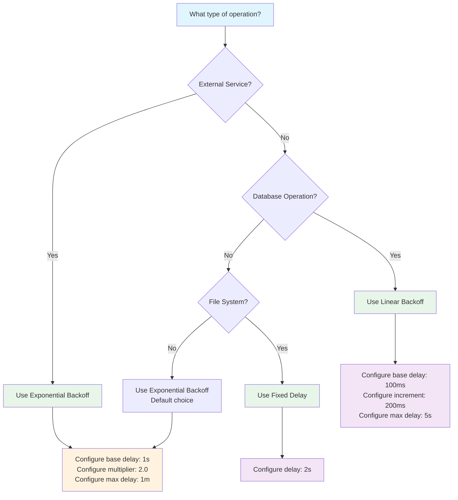

# Retry Delay Quickstart

## Prerequisites

Before using retry delay strategies, you should be familiar with:
- [Retries](retries.md) - Basic retry options and configuration
- [Resilience Overview](index.md) - Understanding resilience concepts in NPipeline
- [Error Handling](error-handling.md) - How error handling integrates with retry strategies

## Overview

This quickstart guide helps you get started with retry delay strategies in NPipeline. Retry delays are essential for building resilient pipelines that can recover from transient failures without overwhelming downstream services.

## 🚀 Quick Start: Common Retry Patterns

### Web API Calls (Most Common)

```csharp
// Recommended for external API calls
context.UseExponentialBackoffDelay(
    baseDelay: TimeSpan.FromSeconds(1),
    multiplier: 2.0,
    maxDelay: TimeSpan.FromMinutes(1));
```

**Why this pattern:**
- Exponential backoff gives services time to recover
- Prevents thundering herd problems
- Balanced for typical API rate limits

### Database Operations

```csharp
// Recommended for database retry scenarios
context.UseLinearBackoffDelay(
    baseDelay: TimeSpan.FromMilliseconds(100),
    increment: TimeSpan.FromMilliseconds(200),
    maxDelay: TimeSpan.FromSeconds(5));
```

**Why this pattern:**
- Linear growth is predictable for database connection pools
- Shorter delays work well for transient lock contention
- Conservative max delay prevents long-running transactions

### File Processing

```csharp
// Recommended for file system operations
context.UseFixedDelay(TimeSpan.FromSeconds(2));
```

**Why this pattern:**
- File system recovery is typically immediate
- Fixed delay provides predictable behavior
- Simple and effective for I/O operations

## Decision Flow for Choosing Retry Strategy



## Implementation Examples

### Basic Pipeline with Retry Delays

```csharp
using NPipeline;
using NPipeline.Pipeline;

public sealed class RetryQuickstartPipeline : IPipelineDefinition
{
    public void Define(PipelineBuilder builder, PipelineContext context)
    {
        // Configure retry delay strategy based on operation type
        context.UseExponentialBackoffDelay(
            baseDelay: TimeSpan.FromSeconds(1),
            multiplier: 2.0,
            maxDelay: TimeSpan.FromMinutes(1));

        var source = builder.AddSource<ApiSource, ApiResponse>("api-source");
        var transform = builder.AddTransform<DataTransform, ApiResponse, ProcessedData>("transform");
        var sink = builder.AddSink<DataSink, ProcessedData>("sink");

        builder.Connect(source, transform);
        builder.Connect(transform, sink);

        // Configure retry options
        builder.WithRetryOptions(new PipelineRetryOptions(
            MaxItemRetries: 3,
            MaxNodeRestartAttempts: 2,
            MaxSequentialNodeAttempts: 5
        ));
    }
}
```

### Per-Node Retry Configuration

```csharp
public void Define(PipelineBuilder builder, PipelineContext context)
{
    var source = builder.AddSource<DataSource, string>("source");
    
    // Fast retries for in-memory operations
    context.UseFixedDelay(TimeSpan.FromMilliseconds(50));
    var memoryTransform = builder.AddTransform<MemoryTransform, string, string>("memory-ops");
    
    // Slower retries for external API calls
    context.UseExponentialBackoffDelay(
        baseDelay: TimeSpan.FromSeconds(1),
        multiplier: 2.0,
        maxDelay: TimeSpan.FromMinutes(1));
    var apiTransform = builder.AddTransform<ApiTransform, string, string>("api-ops");
    
    // Default retries for other operations
    var sink = builder.AddSink<DataSink, string>("sink");

    builder.Connect(source, memoryTransform);
    builder.Connect(memoryTransform, apiTransform);
    builder.Connect(apiTransform, sink);
}
```

## Common Pitfalls to Avoid

> :warning: **Common Mistake**: Not configuring retry delays at all
> 
> Without retry delays, failed operations retry immediately, which can overwhelm recovering services.

> :warning: **Common Mistake**: Using exponential backoff for in-memory operations
> 
> In-memory operations typically recover immediately, so exponential backoff adds unnecessary delays.

> :warning: **Common Mistake**: Setting max delay too high
> 
> Very high max delays can cause long recovery times. Consider your SLA requirements.

> :bulb: **Pro Tip**: Always test retry behavior in development
> 
> Use fixed delays in tests for predictable behavior, then switch to appropriate backoff in production.

## Next Steps

- **[Retries](retries.md)**: Detailed configuration options and advanced patterns
- **[Advanced Retry Delay Strategies](retry-delay-advanced.md)**: Complex scenarios and production patterns
- **[Retry Delay Architecture](../../architecture/retry-delay-architecture.md)**: Deep dive into architectural components
- **[Error Handling](error-handling.md)**: How retry integrates with error handling
- **[Testing Pipelines](../../extensions/testing/advanced-testing.md)**: How to test retry behavior effectively

## See Also

- **[Retries](retries.md)**: Comprehensive retry configuration options and built-in strategies
- **[Resilience Overview](index.md)**: Understanding resilience concepts in NPipeline
- **[Execution with Resilience](execution-with-resilience.md)**: How retry strategies integrate with resilient execution
- **[Circuit Breakers](circuit-breakers.md)**: Combining circuit breakers with retry delays

## Related Topics

- **[Error Handling](error-handling.md)**: Comprehensive error handling strategies that work with retry delays
- **[Materialization & Buffering](materialization.md)**: Buffer requirements for retry functionality
- **[Configuration Guide](configuration-guide.md)**: Step-by-step workflow for configuring resilience
- **[Troubleshooting](troubleshooting.md)**: Common issues and solutions for retry behavior problems