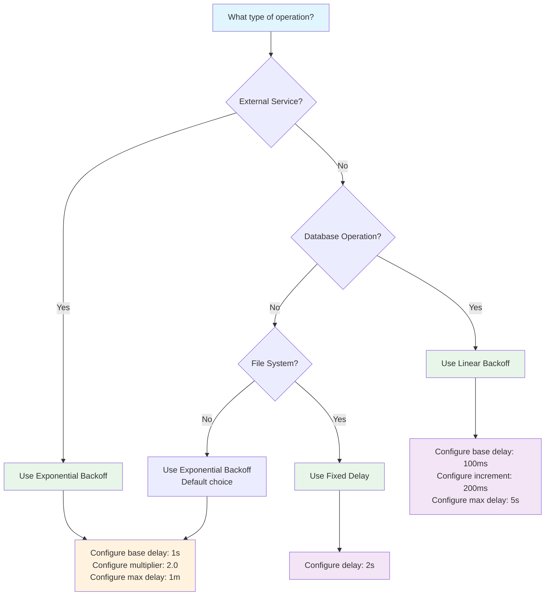

# Retry Delays

Retry delays determine how long to wait between retry attempts. Choosing the right strategy is crucial for balancing quick recovery with preventing service overload.

## Quick Start: Common Retry Patterns

### Web API Calls (Most Common)

```csharp
// Recommended for external API calls
context.UseExponentialBackoffDelay(
    baseDelay: TimeSpan.FromSeconds(1),
    multiplier: 2.0,
    maxDelay: TimeSpan.FromMinutes(1));
```

**Why this pattern:**
- Exponential backoff gives services time to recover
- Prevents thundering herd problems
- Balanced for typical API rate limits

### Database Operations

```csharp
// Recommended for database retry scenarios
context.UseLinearBackoffDelay(
    baseDelay: TimeSpan.FromMilliseconds(100),
    increment: TimeSpan.FromMilliseconds(200),  // Required - adds 200ms per retry
    maxDelay: TimeSpan.FromSeconds(5));
```

**Why this pattern:**
- Linear growth is predictable for database connection pools
- Shorter delays work well for transient lock contention
- Conservative max delay prevents long-running transactions

### File Processing

```csharp
// Recommended for file system operations
context.UseFixedDelay(TimeSpan.FromSeconds(2));
```

**Why this pattern:**
- File system recovery is typically immediate
- Fixed delay provides predictable behavior
- Simple and effective for I/O operations

## Decision Flow for Choosing Retry Strategy



## Basic Implementation

### Basic Pipeline with Retry Delays

```csharp
using NPipeline;
using NPipeline.Pipeline;

public sealed class RetryQuickstartPipeline : IPipelineDefinition
{
    public void Define(PipelineBuilder builder, PipelineContext context)
    {
        // Configure retry delay strategy based on operation type
        context.UseExponentialBackoffDelay(
            baseDelay: TimeSpan.FromSeconds(1),
            multiplier: 2.0,
            maxDelay: TimeSpan.FromMinutes(1));

        var source = builder.AddSource<ApiSource, ApiResponse>("api-source");
        var transform = builder.AddTransform<DataTransform, ApiResponse, ProcessedData>("transform");
        var sink = builder.AddSink<DataSink, ProcessedData>("sink");

        builder.Connect(source, transform);
        builder.Connect(transform, sink);

        // Configure retry options
        builder.WithRetryOptions(new PipelineRetryOptions(
            MaxItemRetries: 3,
            MaxNodeRestartAttempts: 2,
            MaxSequentialNodeAttempts: 5
        ));
    }
}
```

### Per-Node Retry Configuration

```csharp
public void Define(PipelineBuilder builder, PipelineContext context)
{
    var source = builder.AddSource<DataSource, string>("source");
    
    // Fast retries for in-memory operations
    context.UseFixedDelay(TimeSpan.FromMilliseconds(50));
    var memoryTransform = builder.AddTransform<MemoryTransform, string, string>("memory-ops");
    
    // Slower retries for external API calls
    context.UseExponentialBackoffDelay(
        baseDelay: TimeSpan.FromSeconds(1),
        multiplier: 2.0,
        maxDelay: TimeSpan.FromMinutes(1));
    var apiTransform = builder.AddTransform<ApiTransform, string, string>("api-ops");
    
    // Default retries for other operations
    var sink = builder.AddSink<DataSink, string>("sink");

    builder.Connect(source, memoryTransform);
    builder.Connect(memoryTransform, apiTransform);
    builder.Connect(apiTransform, sink);
}
```

## Decision Flow


## Available Strategies

### Basic Strategies

| Strategy | Pattern | Use Case | Link |
|----------|---------|----------|------|
| **Exponential Backoff** | Delays grow exponentially (1s, 2s, 4s, 8s...) | External APIs, distributed systems | [Learn more](retry-delay-exponential.md) |
| **Linear Backoff** | Delays increase linearly (100ms, 300ms, 500ms...) | Database operations, lock contention | [Learn more](retry-delay-linear.md) |
| **Fixed Delay** | Same delay each time (2s, 2s, 2s...) | File system, simple scenarios, testing | [Learn more](retry-delay-fixed.md) |

### Advanced Strategies

- **[Decorrelated Jitter](retry-delay-advanced.md#decorrelated-jitter)** - Adaptive backoff for high concurrency
- **[Custom Strategies](retry-delay-advanced.md#custom-backoff-strategies)** - Fibonacci, polynomial, time-of-day aware
- **[Fallback Strategies](retry-delay-advanced.md#fallback-strategies)** - Cascade through multiple strategies
- **[Circuit Breaker Pattern](retry-delay-advanced.md#circuit-breaker-pattern-with-retries)** - Combine with circuit breaker

## Key Concepts

### Jitter

Add randomization to prevent synchronized retries:

```csharp
context.UseExponentialBackoffDelay(
    baseDelay: TimeSpan.FromSeconds(1),
    multiplier: 2.0,
    maxDelay: TimeSpan.FromMinutes(1),
    jitterStrategy: JitterStrategies.FullJitter()); // Add jitter
```

**Why:** Without jitter, multiple clients retry at the same time, overwhelming the service ("thundering herd").

**Jitter Options:**
- `NoJitter()` - Exact delays (use for testing only)
- `FullJitter()` - Random 0 to calculated delay
- `EqualJitter()` - Random between half and full delay
- `DecorrelatedJitter()` - Adapts to system load

### Retry Cap (maxDelay)

Always set a maximum delay to prevent indefinitely long waits:

```csharp
context.UseExponentialBackoffDelay(
    baseDelay: TimeSpan.FromSeconds(1),
    multiplier: 2.0,
    maxDelay: TimeSpan.FromMinutes(1)); // Don't wait longer than 1 minute
```

## Topics

### Guides
- [Exponential Backoff](retry-delay-exponential.md) - For external APIs and services
- [Linear Backoff](retry-delay-linear.md) - For database operations
- [Fixed Delay](retry-delay-fixed.md) - For file operations and testing

### Advanced
- [Advanced Patterns](retry-delay-advanced.md) - Custom and adaptive strategies
- [Testing Retries](retry-delay-testing.md) - Test retry behavior deterministically
- [Monitoring Metrics](retry-delay-monitoring.md) - Observe retry behavior in production

## Best Practices

1. **Always add jitter** - Prevents thundering herd in distributed systems
2. **Set reasonable caps** - Don't wait longer than 1-5 minutes
3. **Start conservative** - Begin with shorter delays, increase if needed
4. **Use fixed delays in tests** - Ensures deterministic timing
5. **Monitor metrics** - Track actual retry patterns in production
6. **Match strategy to domain** - APIs ≠ Databases ≠ Files
7. **Document decisions** - Explain why you chose specific settings

## Related Documentation

- **[Retry Configuration](retries.md)** - Basic retry options (MaxItemRetries, MaxNodeRestartAttempts)
- **[Resilience Overview](index.md)** - Understanding resilience concepts
- **[Error Handling](error-handling.md)** - How error handling integrates with retries
- **[Circuit Breakers](circuit-breakers.md)** - Combine with circuit breaker patterns
- **[Troubleshooting](troubleshooting.md)** - Common retry issues and solutions
- **[Architecture](../../architecture/retry-delay-architecture.md)** - Deep dive into implementation

## Next Steps

- Choose a strategy based on your use case (API? Database? Files?)
- Read the dedicated guide for your chosen strategy
- Test retry behavior with [Testing Retries](retry-delay-testing.md)
