# Streaming vs. Buffering

In NPipeline, understanding the concepts of streaming and buffering is crucial for designing efficient and performant data pipelines. These concepts dictate how data items are handled as they move between nodes, directly impacting memory consumption, latency, and overall throughput.

## Visual Comparison: Streaming vs Buffering

```mermaid
graph TB
    subgraph "Streaming Approach"
        S1[Source] --> |Item 1| T1[Transform]
        S1 --> |Item 2| T1
        S1 --> |Item 3| T1
        T1 --> |Processed Item 1| SINK1[Sink]
        T1 --> |Processed Item 2| SINK1
        T1 --> |Processed Item 3| SINK1

        style S1 fill:#e1f5fe
        style T1 fill:#e8f5e9
        style SINK1 fill:#fff3e0
    end

    subgraph "Buffering Approach"
        S2[Source] --> |Items 1,2,3| BUFFER[Buffer/Batch Node]
        BUFFER --> |Batch &#91;1,2,3&#93;| T2[Transform]
        T2 --> |Processed Batch| SINK2[Sink]

        style S2 fill:#e1f5fe
        style BUFFER fill:#fce4ec
        style T2 fill:#e8f5e9
        style SINK2 fill:#fff3e0
    end
```



*Figure 1: Side-by-side comparison of streaming and buffering data flow patterns. In streaming, items are processed individually as they arrive, while in buffering, items are collected into batches before processing.*

### Trade-offs Comparison

| Aspect | Streaming | Buffering |
|--------|-----------|-----------|
| **Memory Usage** | Low - only a few items in memory at once | Higher - accumulates items before processing |
| **Latency** | Low - immediate processing of each item | Higher - waits for batch completion |
| **Processing Model** | Continuous, per-item processing | Batch-oriented processing |
| **Overhead** | Higher per-item processing cost | Lower per-item cost due to batching |
| **Use Cases** | Real-time analytics, continuous processing | Batch processing, database writes, file I/O |
| **Error Handling** | Errors isolated to individual items | Errors may affect entire batch |

*Table 1: Trade-offs between streaming and buffering approaches. Each approach has distinct advantages depending on your specific requirements.*

## Streaming

**Streaming** refers to the processing of data items one by one, or in small, continuous batches, as they arrive. In a streaming pipeline, data is not accumulated in memory before being passed to the next stage. Instead, each item (or a small group of items) is processed and immediately forwarded.

### Characteristics of Streaming

* **Low Memory Footprint**: Only a few data items are held in memory at any given time.
* **Low Latency**: Data is processed and moved through the pipeline quickly, reducing delays.
* **Continuous Processing**: Ideal for real-time data processing and long-running pipelines.
* **"Push" Model**: Data is pushed from upstream nodes to downstream nodes as soon as it's ready.

Most NPipeline nodes inherently support streaming behavior, especially `ISourceNode` (which `yield`s items) and `ITransformNode` (which also `yield`s transformed items).

### Example: A Pure Streaming Pipeline

```csharp
using NPipeline;

public sealed record EventData(int Id, string Message);

public sealed class StreamSource : SourceNode<EventData>
{
    public async IAsyncEnumerable<EventData> ExecuteAsync(CancellationToken cancellationToken = default)
    {
        for (int i = 0; i < 5; i++)
        {
            if (cancellationToken.IsCancellationRequested) yield break;
            var data = new EventData(i, $"Event {i}");
            Console.WriteLine($"Source: Producing {data.Id}");
            yield return data;
            await Task.Delay(10, cancellationToken); // Simulate fast stream
        }
    }
}

public sealed class StreamTransform : TransformNode<EventData, string>
{
    public async IAsyncEnumerable<string> ExecuteAsync(IAsyncEnumerable<EventData> input, CancellationToken cancellationToken = default)
    {
        await foreach (var item in input.WithCancellation(cancellationToken))
        {
            if (cancellationToken.IsCancellationRequested) yield break;
            var transformed = $"Processed: {item.Message.ToUpper()}";
            Console.WriteLine($"Transform: {item.Id} -> {transformed}");
            yield return transformed;
        }
    }
}

public sealed class StreamSink : SinkNode<string>
{
    public async Task ExecuteAsync(IAsyncEnumerable<string> input, CancellationToken cancellationToken = default)
    {
        await foreach (var item in input.WithCancellation(cancellationToken))
        {
            if (cancellationToken.IsCancellationRequested) break;
            Console.WriteLine($"Sink: Consumed '{item}'");
        }
    }
}

public static class Program
{
    public static async Task Main(string[] args)
    {
        var context = new PipelineContext();
        var runner = PipelineRunner.Create();

        Console.WriteLine("Starting streaming pipeline...");
        await runner.RunAsync<StreamingPipelineDefinition>(context);
        Console.WriteLine("Streaming pipeline finished.");
    }
}

public sealed class StreamingPipelineDefinition : IPipelineDefinition
{
    public void Define(PipelineBuilder builder, PipelineContext context)
    {
        var sourceHandle = builder.AddSource<StreamSource, EventData>("source");
        var transformHandle = builder.AddTransform<StreamTransform, EventData, string>("transform");
        var sinkHandle = builder.AddSink<StreamSink, string>("sink");

        builder.Connect(sourceHandle, transformHandle);
        builder.Connect(transformHandle, sinkHandle);
    }
}
```

In this example, each `EventData` item is produced by the `StreamSource`, immediately transformed by `StreamTransform`, and then immediately consumed by `StreamSink`. Data flows continuously without significant accumulation.

## Buffering

**Buffering** involves accumulating a certain amount of data in memory before processing or forwarding it to the next stage. This can be done explicitly by specific nodes (e.g., batching nodes) or implicitly by operations that require all data to be present before proceeding (e.g., certain aggregation operations).

### Characteristics of Buffering

* **Higher Memory Footprint**: Data is temporarily stored in memory, potentially increasing memory usage.
* **Increased Latency**: Processing is delayed until a buffer is full or a specific condition is met.
* **Batch Processing**: Suitable for operations that benefit from processing data in chunks (e.g., database inserts, file writes, certain analytical functions).
* **"Pull" or "Batch-and-Push" Model**: Data might be pulled into a buffer and then pushed as a batch.

While buffering can introduce latency and higher memory usage, it can also lead to increased throughput for certain operations by reducing overhead (e.g., fewer database transactions for batch inserts).

### Example: Introducing Buffering with a Batching Node

NPipeline provides specific nodes, like [`BatchingNode<T>`](src/NPipeline/Nodes/Batching/BatchingNode.cs), to introduce explicit buffering.

```csharp
using NPipeline;
using NPipeline.Interfaces;
using NPipeline.Nodes;

public sealed record Message(int Id, string Content);

public sealed class CountingSource : SourceNode<Message>
{
    public async IAsyncEnumerable<Message> ExecuteAsync(CancellationToken cancellationToken = default)
    {
        for (int i = 0; i < 10; i++)
        {
            if (cancellationToken.IsCancellationRequested) yield break;
            var msg = new Message(i, $"Item {i}");
            Console.WriteLine($"Source: Producing {msg.Id}");
            yield return msg;
            await Task.Delay(10, cancellationToken);
        }
    }
}

public sealed class BatchSink : SinkNode<IReadOnlyList<Message>>
{
    public async Task ExecuteAsync(IAsyncEnumerable<IReadOnlyList<Message>> input, CancellationToken cancellationToken = default)
    {
        await foreach (var batch in input.WithCancellation(cancellationToken))
        {
            if (cancellationToken.IsCancellationRequested) break;
            Console.WriteLine($"Sink: Consumed a batch of {batch.Count} items.");
            foreach (var item in batch)
            {
                Console.WriteLine($"  - Processed item {item.Id}: {item.Content}");
            }
            await Task.Delay(50, cancellationToken); // Simulate batch processing time
        }
    }
}

public static class Program
{
    public static async Task Main(string[] args)
    {
        var context = new PipelineContext();
        var runner = PipelineRunner.Create();

        Console.WriteLine("Starting buffering pipeline...");
        await runner.RunAsync<BufferingPipelineDefinition>(context);
        Console.WriteLine("Buffering pipeline finished.");
    }
}

public sealed class BufferingPipelineDefinition : IPipelineDefinition
{
    public void Define(PipelineBuilder builder, PipelineContext context)
    {
        var sourceHandle = builder.AddSource<CountingSource, Message>("source");
        var batchHandle = builder.AddTransform<BatchingNode<Message>, Message, IReadOnlyList<Message>>("batcher");
        var sinkHandle = builder.AddSink<BatchSink, IReadOnlyList<Message>>("sink");

        builder.Connect(sourceHandle, batchHandle);
        builder.Connect(batchHandle, sinkHandle);
    }
}
```

In this example, the `BatchingNode` collects `Message` items until it has 3 items or 1 second passes, then it forwards the entire list (`IReadOnlyList<Message>`) to the `BatchSink`. This demonstrates explicit buffering.

## Choosing Between Streaming and Buffering

The choice between streaming and buffering depends on your specific use case and requirements:

| Feature           | Streaming                                   | Buffering                                        |
| :---------------- | :------------------------------------------ | :----------------------------------------------- |
| **Memory Usage**  | Low                                         | Potentially High                                 |
| **Latency**       | Low                                         | Higher                                           |
| **Throughput**    | High for continuous data, per-item overhead | Can be higher for batch-optimized operations     |
| **Use Cases**     | Real-time analytics, continuous processing  | Batch processing, database writes, file I/O      |
| **Fault Tolerance** | Errors can be handled per item              | Errors might affect an entire batch              |

NPipeline is designed to support both paradigms, allowing you to combine streaming and buffering nodes to optimize your data flows for various scenarios.

## Next Steps

* **[Error Handling](resilience/error-handling.md)**: Learn how to manage errors effectively in both streaming and buffering pipelines.
* **[Node Types (e.g., Aggregation)](nodes/aggregation.md)**: Explore nodes that inherently involve buffering for their operations.

